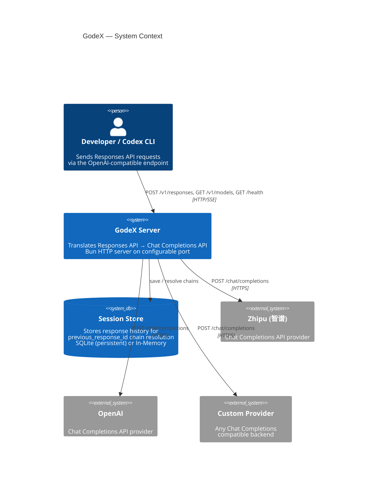
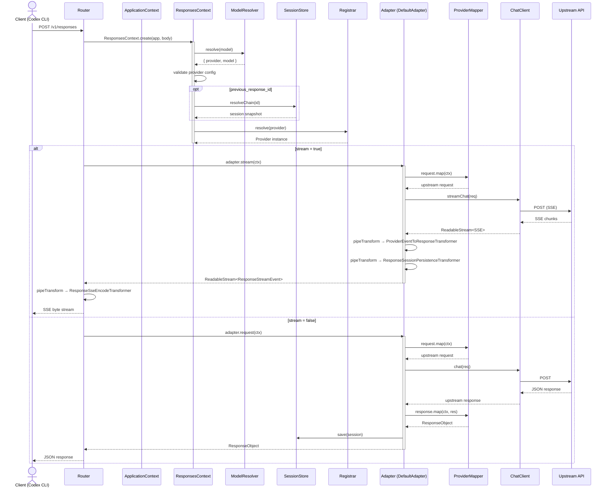
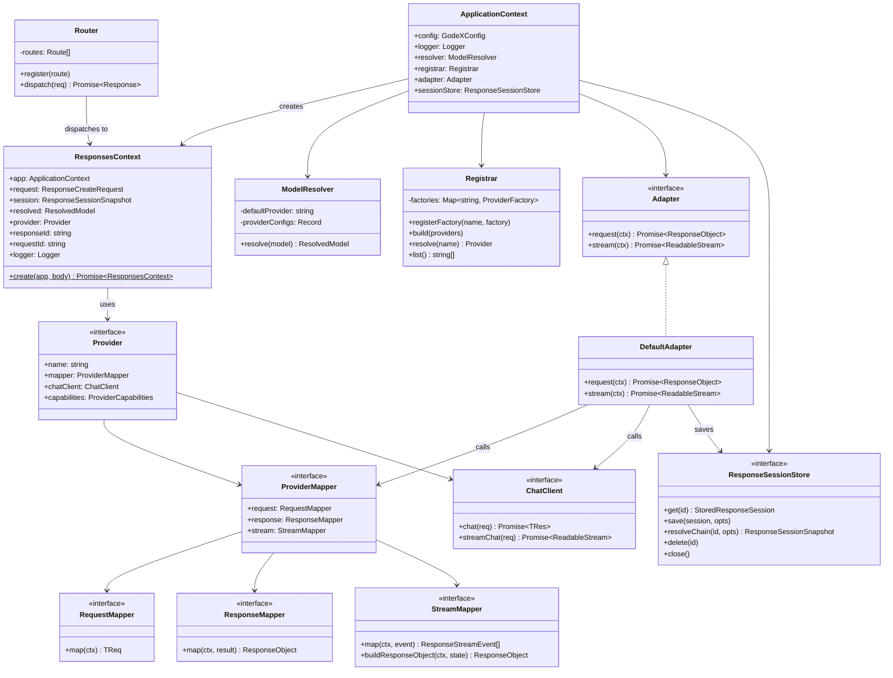
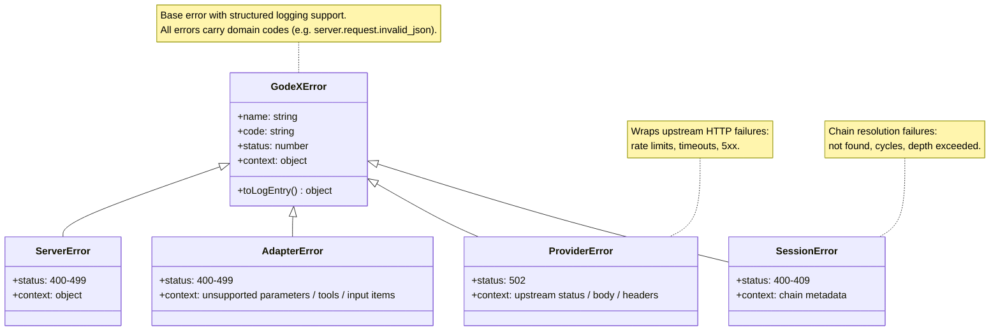

# GodeX

**Make every model a Codex engine.**

OpenAI-compatible Responses API gateway — translates `/v1/responses` into upstream Chat Completions API calls, connecting Codex, CLI, IDE, and automation tools with any model provider.

[](https://codecov.io/gh/Ahoo-Wang/GodeX)
[](https://bun.sh)
[](https://www.typescriptlang.org/)

## Architecture



## Request Flow



## Component Model



## Stream Pipeline

```mermaid
flowchart LR
  subgraph upstream["Upstream Provider"]
    SSE["SSE Chunks<br/>(JsonServerSentEvent)"]
  end

  subgraph godex["GodeX Stream Pipeline"]
    T1["ProviderEventTo<br/>ResponseTransformer"]
    T2["ResponseSession<br/>PersistenceTransformer"]
    T3["ResponseSse<br/>EncodeTransformer"]
  end

  subgraph client["Client"]
    BYTES["SSE Bytes<br/>(text/event-stream)"]
  end

  SSE -->|"pipeThrough(TransformStream)"| T1
  T1 -->|"per-event map()<br/>SSE chunk → ResponseStreamEvent[]"| T2
  T2 -->|"accumulate StreamState<br/>intercept terminal event<br/>buildResponseObject()<br/>save session"| T3
  T3 -->|"serialize to SSE wire format<br/>event: xxx\ndata: {...}\n\n"| BYTES

  style upstream fill:#1a1a2e,stroke:#16213e,color:#e0e0e0
  style godex fill:#0f3460,stroke:#16213e,color:#e0e0e0
  style client fill:#1a1a2e,stroke:#16213e,color:#e0e0e0
```



### Transformer Roles

| Stage | Transformer | Input | Output | Side Effects |
|-------|------------|-------|--------|-------------|
| 1 | `ProviderEventToResponseTransformer` | `JsonServerSentEvent<TChunk>` | `ResponseStreamEvent` | Calls `StreamMapper.map()` per event |
| 2 | `ResponseSessionPersistenceTransformer` | `ResponseStreamEvent` | `ResponseStreamEvent` | Accumulates `StreamState`, on terminal event calls `buildResponseObject()` + saves session (skipped when `store=false`) |
| 3 | `ResponseSseEncodeTransformer` | `ResponseStreamEvent` | `Uint8Array` (SSE wire format) | Serializes to `event:` / `data:` lines |

## Error Hierarchy



## Project Structure

```
src/
├── cli/              Commander CLI (serve, config check, init)
├── config/           godex.yaml schema, env interpolation, defaults
├── context/          ApplicationContext (DI container), ResponsesContext (per-request)
├── adapter/          Adapter interface, DefaultAdapter, stream transformers
│   ├── mapper/       RequestMapper / ResponseMapper / StreamMapper contracts
│   └── transformers/ ProviderEvent → Response → SSE encode pipeline
├── providers/        Provider registry + builtin factories
│   └── zhipu/        Reference provider: mapper, chat-client, tools, messages
├── resolver/         ModelResolver (model selector → provider + model)
├── server/           Bun HTTP server, Router, routes (/v1/responses, /health, /v1/models)
├── session/          ResponseSessionStore (Memory + SQLite), chain resolution
├── error/            GodeXError hierarchy with domain codes
├── protocol/openai/  OpenAI-compatible type definitions
├── logger/           Structured JSON logger
└── e2e/              End-to-end tests with mocked upstream
```

## Quick Start

```bash
# Install dependencies
bun install

# Build standalone binary (current platform)
bun run build

# Create config interactively
bun run start -- init

# Start server (default port 5678)
bun run dev

# Or run the compiled binary directly
./platforms/darwin-arm64/bin/godex serve
```

### godex.yaml

```yaml
server:
  port: 5678

default_provider: zhipu

providers:
  zhipu:
    api_key: ${ZHIPU_API_KEY}
    base_url: https://open.bigmodel.cn/api/coding/paas/v4
    models:
      "gpt-4o": glm-4.7         # model name mapping
      "*": glm-5.1              # catch-all fallback

session:
  backend: sqlite               # or "memory"
  sqlite:
    path: ./data/sessions.db

logging:
  level: info                   # trace | debug | info | warn | error
```

### Adding a Provider

Implement these interfaces in `src/providers/<name>/`:

| Interface | Purpose |
|-----------|---------|
| `Provider<TReq, TRes, TChunk>` | Bundles mapper + chatClient + capabilities |
| `ProviderMapper<TReq, TRes, TChunk>` | request / response / stream mapping functions |
| `ChatClient<TReq, TRes, TChunk>` | `chat()` and `streamChat()` HTTP calls |

Register the factory in `src/providers/builtin.ts`:

```ts
registrar.registerFactory("myprovider", (config) =>
  createMyProvider(config) as Provider<unknown, unknown, unknown>
);
```

## Usage

```bash
# Install — no Bun required at runtime
npm install -g @ahoo-wang/godex

# Create config interactively
godex init

# Start the gateway
godex serve
```

GodeX ships as a **standalone native binary** with zero runtime dependencies. npm's `postinstall` automatically selects the correct binary for your platform. The only prerequisite is Node.js >= 18 (needed only during `npm install`).

GodeX exposes an **OpenAI-compatible Responses API** at `http://localhost:5678` (port is configurable). Point any tool that speaks the OpenAI protocol at this endpoint:

### With Codex CLI

```bash
export OPENAI_BASE_URL=http://localhost:5678/v1
export OPENAI_API_KEY=any-value          # not validated by GodeX, must be set
codex
```

### With OpenAI SDK

```ts
import OpenAI from "openai";

const client = new OpenAI({
  baseURL: "http://localhost:5678/v1",
  apiKey: "any-value",      // passed through, not validated
});

const response = await client.responses.create({
  model: "gpt-4o",          // mapped to glm-4.7 via godex.yaml models table
  input: "Hello!",
});
```

### Model selection

```
model: "gpt-4o"              → resolved via default_provider model mapping
model: "zhipu/glm-4.7"       → explicit provider/model selector
model: "openai/gpt-4o"       → routes to configured openai provider
```

The `models` map in `godex.yaml` lets you translate standard model names into provider-native ones — no code changes needed in the client.

### Health check

```bash
curl http://localhost:5678/health
# {"status":"ok","providers":["zhipu"],"unsupported_providers":[]}
```

## Publishing

The main `@ahoo-wang/godex` npm package is a lightweight shell. Native binaries are shipped as platform-specific optional dependencies:

```
@ahoo-wang/godex (wrapper package, 0 runtime deps)
├── engines: { node: ">=18.0.0" }    ← only for postinstall
├── postinstall: scripts/install.cjs   ← detects platform, links binary
└── optionalDependencies:
    ├── @ahoo-wang/godex-darwin-arm64           ← macOS Apple Silicon
    ├── @ahoo-wang/godex-darwin-x64             ← macOS Intel
    ├── @ahoo-wang/godex-linux-x64              ← Linux x86_64
    ├── @ahoo-wang/godex-linux-arm64            ← Linux ARM64
    ├── @ahoo-wang/godex-win32-x64              ← Windows x86_64
    └── @ahoo-wang/godex-win32-arm64            ← Windows ARM64

# Publishing flow:
# 1. Make the GitHub repository public, configure NPM_TOKEN, then push the release commit.
# 2. Create a GitHub Release tagged vX.Y.Z.
# 3. The Release workflow builds all platform binaries.
# 4. The Release workflow uploads binary archives and SHA256SUMS to Release Assets.
# 5. The Release workflow publishes platform packages first, then @ahoo-wang/godex.
```

## Commands

```bash
bun run dev          # Hot-reload dev server on port 13145
bun run build        # Compile native binary for current platform
bun run compile:all  # Cross-compile all 6 platforms locally
bun run test         # Unit + integration tests
bun run test:e2e     # E2E with mocked upstream
bun run typecheck    # tsc --noEmit
bun run lint         # Biome check
bun run ci           # Full CI pipeline
```
