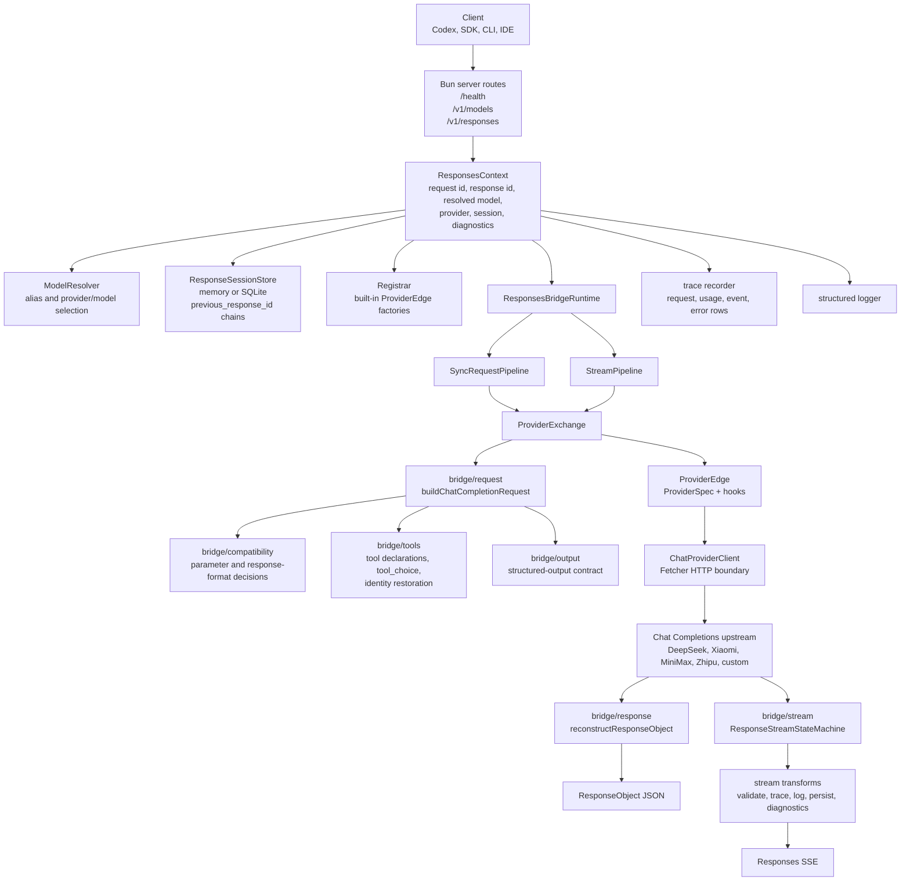
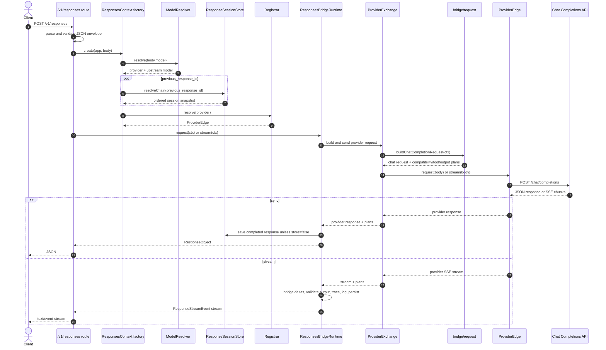

<div align="center">


**Make every model a Codex engine.**

OpenAI-compatible Responses API gateway for Codex, CLI tools and developer agents.

[](https://www.npmjs.com/package/@ahoo-wang/godex)
[](https://codecov.io/gh/Ahoo-Wang/GodeX)
[](https://bun.sh)
[](https://www.typescriptlang.org/)

</div>

GodeX lets clients that speak the OpenAI Responses API use providers such as DeepSeek, Xiaomi, MiniMax, and Zhipu through one local server.

## Highlights

- OpenAI-compatible `POST /v1/responses` endpoint with sync and streaming responses.
- `GET /v1/models` aliases so clients can use stable model names while GodeX routes to provider/model targets.
- Built-in bridge providers for DeepSeek, Xiaomi, MiniMax, and Zhipu.
- Provider capability planning for request parameters, tools, `tool_choice`, structured output formats, reasoning, and stream usage.
- Responses `previous_response_id` session chains backed by memory or SQLite.
- Trace recording for provider requests, provider responses, stream events, usage, and errors.
- Native Bun runtime, TypeScript source, and compiled platform binaries for releases.

## Built-in Providers

| Provider | Reasoning | Tool Choice | Response Format | Cached Tokens | Default Model |
|----------|-----------|-------------|-----------------|---------------|---------------|
| DeepSeek | native | auto, none, required, function | text, json_object | ✅ | `deepseek-v4-pro` |
| Xiaomi   | boolean | auto | text, json_object | ✅ | `mimo-v2.5-pro` |
| MiniMax  | none  | auto, none, required, function | text, json_object | ✅ | `MiniMax-M2.7` |
| Zhipu    | boolean | auto, none | text, json_object | ✅ | `glm-5.1` |

## Architecture



## Component Interaction



## Install

For local development:

```bash
git clone https://github.com/Ahoo-Wang/GodeX.git
cd GodeX
bun install
```

For package use, install the published package and run the `godex` binary:

```bash
npm install -g @ahoo-wang/godex
godex --help
```

### Docker

Pre-built images are published to Docker Hub and GitHub Container Registry:

```bash
docker pull ahoowang/godex:latest
# or
docker pull ghcr.io/ahoo-wang/godex:latest
```

Run with a config file:

```bash
docker run -d \
  --name godex \
  -p 5678:5678 \
  -e ZHIPU_API_KEY=your-key \
  -e DEEPSEEK_API_KEY=your-key \
  -e MINIMAX_API_KEY=your-key \
  -e MIMO_API_KEY=your-key \
  -v ./godex.yaml:/etc/godex/godex.yaml:ro \
  -v godex-data:/data \
  ahoowang/godex:latest
```

The image supports `linux/amd64` and `linux/arm64`.

- Config file: `/etc/godex/godex.yaml`
- Data directory (sessions, trace): `/data`
- Default port: `5678`

## Quick Start

Create a config and start the server:

```bash
godex init
godex serve --config ./godex.yaml
```

The interactive wizard walks you through selecting providers, entering base URLs and API keys, and writes the config file automatically.

Alternatively, create `godex.yaml` manually:

```yaml
server:
  port: 5678
  host: 0.0.0.0

default_provider: deepseek

models:
  aliases:
    # -------------------------------------------------------------------------
    # Codex-compatible model aliases
    #
    # 这些 alias 是 GodeX routing policy，不代表与 OpenAI 原模型能力等价。
    # 依据优先级：公开 benchmark > 官方模型定位 > Provider 产品说明。
    # -------------------------------------------------------------------------

    # Codex 默认主力：复杂编码 / computer use / research workflows
    # 依据：DeepSeek V4-Pro 在 SWE / Terminal / Codeforces / GDPval-AA 上公开成绩强。
    gpt-5.5: "deepseek/deepseek-v4-pro"

    # Codex 旗舰：coding + reasoning + tool use + agentic workflows
    # 依据：DeepSeek V4-Pro 有更完整的公开 coding/agentic benchmark 覆盖。
    gpt-5.4: "deepseek/deepseek-v4-pro"

    # Codex mini：subagents
    gpt-5.4-mini: "zhipu/glm-5.1"

    # Codex 编码专用：复杂软件工程
    # 依据：DeepSeek V4-Pro 的 SWE Verified / SWE Pro / Terminal Bench 表现。
    gpt-5.3-codex: "deepseek/deepseek-v4-pro"

    # Codex spark：近实时编码迭代
    gpt-5.3-codex-spark: "zhipu/glm-5.1"

    # 上一代通用 coding / agentic fallback
    # 严谨起见仍走 DeepSeek；不强行映射到 Zhipu。
    gpt-5.2: "deepseek/deepseek-v4-pro"

    # -------------------------------------------------------------------------
    # Provider native models
    # -------------------------------------------------------------------------

    deepseek-v4-pro: "deepseek/deepseek-v4-pro"
    deepseek-v4-flash: "deepseek/deepseek-v4-flash"

    mimo-v2.5-pro: "xiaomi/mimo-v2.5-pro"
    mimo-v2.5: "xiaomi/mimo-v2.5"

    glm-5.1: "zhipu/glm-5.1"
    glm-5-turbo: "zhipu/glm-5-turbo"
    glm-4.7: "zhipu/glm-4.7"
    glm-4.5-air: "zhipu/glm-4.5-air"

    MiniMax-M2.7: "minimax/MiniMax-M2.7"
    MiniMax-M2.7-highspeed: "minimax/MiniMax-M2.7-highspeed"

    # Fallback for unknown bare model names
    "*": "deepseek/deepseek-v4-pro"

providers:
  deepseek:
    spec: deepseek
    credentials:
      api_key: ${DEEPSEEK_API_KEY}
    endpoint:
      base_url: https://api.deepseek.com
  zhipu:
    spec: zhipu
    credentials:
      api_key: ${ZHIPU_API_KEY}
    endpoint:
      base_url: https://open.bigmodel.cn/api/coding/paas/v4
  minimax:
    spec: minimax
    credentials:
      api_key: ${MINIMAX_API_KEY}
    endpoint:
      base_url: https://api.minimaxi.com/v1
  xiaomi:
    spec: xiaomi
    credentials:
      api_key: ${MIMO_API_KEY}
    endpoint:
      base_url: https://api.xiaomimimo.com/v1

session:
  backend: sqlite

logging:
  level: info

trace:
  enabled: true
  path: ./data/trace.db
  capture_payload: false
```

Start the server:

```bash
godex serve --config ./godex.yaml
```

The dev command starts GodeX on port `13145`; the default runtime config port is `5678`.

## API

### Health

```bash
curl http://localhost:5678/health
```

### Models

```bash
curl http://localhost:5678/v1/models
```

`/v1/models` lists configured aliases, excluding the wildcard alias `*`.

### Responses

```bash
curl http://localhost:5678/v1/responses \
  -H 'content-type: application/json' \
  -d '{
    "model": "gpt-5.5",
    "input": "Write a short TypeScript function that adds two numbers."
  }'
```

Streaming uses standard Responses SSE event names:

```bash
curl -N http://localhost:5678/v1/responses \
  -H 'content-type: application/json' \
  -d '{
    "model": "gpt-5.5",
    "stream": true,
    "input": "Explain Bun streams in two sentences."
  }'
```

## Model Routing

Clients may pass either:

- A provider-qualified selector such as `deepseek/deepseek-v4-pro`
- A configured alias such as `gpt-5.5`
- A bare model name, which resolves through `default_provider` when no alias matches

Aliases must map to `provider/model` values, and the provider must exist in `providers`.


## Codex Integration

Connect the Codex desktop app to GodeX by adding a custom provider in `~/.codex/config.toml`:

```toml
model = "gpt-5.5"
model_provider = "godex"

[model_providers.godex]
name = "GodeX"
base_url = "http://127.0.0.1:5678/v1"
wire_api = "responses"
requires_openai_auth = false
supports_websockets = false
```

Model aliases (`gpt-5.5`, `gpt-5.4`, `gpt-5.4-mini`, etc.) are resolved by GodeX using the `models.aliases` map in `godex.yaml` — Codex itself only needs the alias name.


## Provider Bridge Behavior

GodeX builds a provider request in three steps:

1. Resolve the client model selector to a configured provider and upstream model.
2. Plan compatibility from the provider `ProviderSpec`, including request parameters, tool declarations, `tool_choice`, response format, reasoning, and stream usage.
3. Convert Responses input and session history into Chat Completions messages, call the upstream provider, and reconstruct a Responses object or Responses SSE stream.

Provider-specific differences belong in each provider's `spec.ts`, `hooks.ts`, protocol types, and HTTP client. Shared Responses-to-Chat policy belongs under `src/bridge`.

## Structured Output

When a provider supports `json_object` but not native `json_schema`, GodeX can degrade strict `json_schema` requests to `json_object`.

For strict downgraded schemas:

- The schema instruction is added to the provider prompt preamble for the current request.
- The provider receives `response_format: { "type": "json_object" }`.
- GodeX validates that the final output is valid JSON.
- Invalid sync output fails the response; invalid stream output is rewritten to a terminal `response.failed` event.

The validator checks JSON syntax, not full JSON Schema conformance.

## Sessions

Responses can be stored and replayed with `previous_response_id`.

- `session.backend: memory` keeps history in process memory.
- `session.backend: sqlite` persists history to SQLite.
- Requests with `store: false` are not saved.
- The session chain stores request snapshots and response output items, then rebuilds provider-neutral history on the next turn.

## Trace Database

Tracing is enabled by default and writes SQLite rows to `./data/trace.db` unless configured otherwise.

Trace records include:

- Provider request metadata and final patched request payload summaries
- Provider request lifecycle events without duplicating full request bodies
- Sync provider response bodies as summarized payloads
- Raw and transformed stream events
- Usage details, including cached tokens when provided by the upstream
- Route and provider errors

Set `trace.capture_payload: true` to persist payload JSON up to `trace.payload_max_bytes` for trace rows that carry payloads. Keep it disabled for sensitive environments.

## Development

```bash
bun install                  # Install dependencies
bun run dev                  # Dev server with hot reload on port 13145
bun run start                # Start server from source
bun run build                # Build a binary for the current platform
bun run compile:all          # Cross-compile all supported platform packages
```

Quality gates:

```bash
bun run typecheck            # TypeScript
bun run lint                 # Biome check
bun run lint:fix             # Biome autofix
bun run format               # Biome format
bun run test                 # Unit and integration tests, excluding src/e2e
bun run test:e2e             # Mocked end-to-end tests
bun run test:zhipu           # Live Zhipu tests; requires ZHIPU_API_KEY
bun run test:deepseek        # Live DeepSeek tests; requires DEEPSEEK_API_KEY
bun run test:minimax         # Live MiniMax tests; requires MINIMAX_API_KEY
bun run test:xiaomi         # Live Xiaomi tests; requires MIMO_API_KEY
bun run check                # typecheck + lint + test
bun run ci                   # typecheck + biome ci + test + e2e
```

## Source Map

```text
src/
  cli/          Commander CLI, init wizard, runtime config loading
  config/       godex.yaml schema, defaults, env interpolation
  context/      ApplicationContext and per-request ResponsesContext
  bridge/       Provider-agnostic Responses-to-Chat planning and reconstruction
  providers/    Built-in provider specs, hooks, clients, and registry
  responses/    Sync and stream request pipelines
  server/       Bun routes for /health, /v1/models, /v1/responses
  session/      Memory and SQLite response session stores
  trace/        SQLite trace recorder and usage/error/event mappers
  protocol/     OpenAI protocol type definitions
  error/        GodeXError hierarchy and domain codes
```

## Provider Development

Provider folders follow this shape:

```text
src/providers/<name>/
  spec.ts       ProviderSpec declaration
  client.ts     ProviderEdge construction with ChatProviderClient
  hooks.ts      Provider-specific patching, accessors, usage, stream deltas
  protocol/     Provider DTOs when needed
  index.ts      Public exports
```

Add shared compatibility policy to `src/bridge`; add shared provider transport or protocol helpers to `src/providers/shared`.

## License

Apache-2.0. See [LICENSE](./LICENSE).
