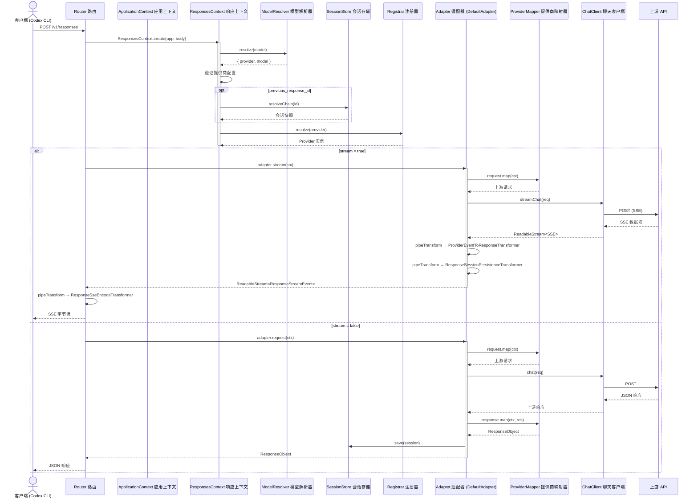
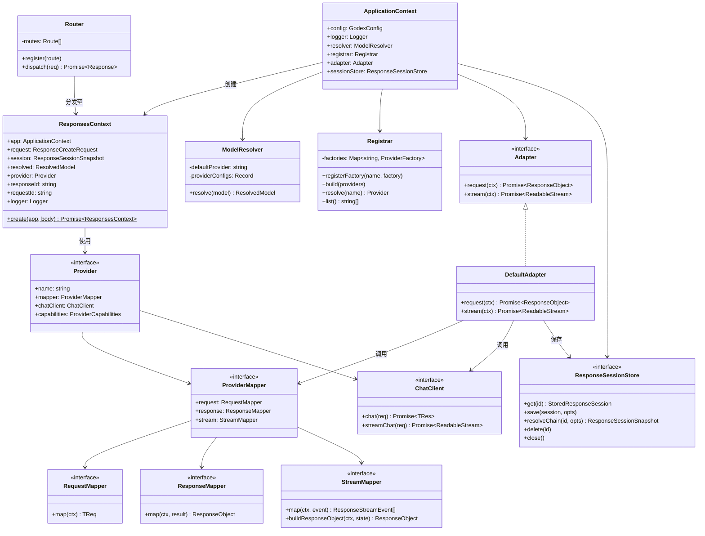
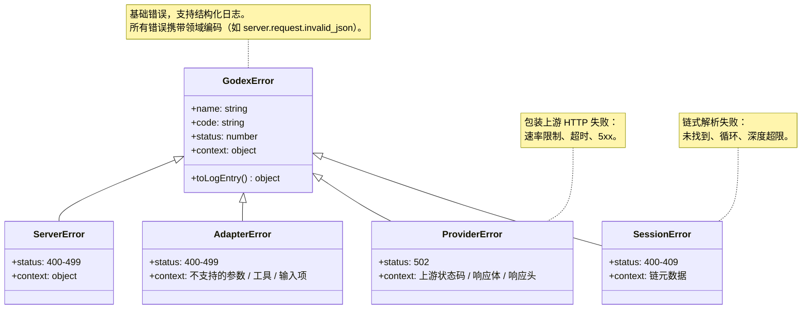

# Godex

OpenAI Responses API 网关 — 将 `/v1/responses` 请求转换为上游 Chat Completions API 调用，让**任何 LLM 提供商都能驱动 Codex**。

[](https://codecov.io/gh/Ahoo-Wang/Godex)
[](https://bun.sh)
[](https://www.typescriptlang.org/)

## 架构


## 请求流程



## 组件模型



## 流式管道

```mermaid
flowchart LR
  subgraph upstream["上游提供商"]
    SSE["SSE 数据块<br/>(JsonServerSentEvent)"]
  end

  subgraph godex["Godex 流式管道"]
    T1["ProviderEventTo<br/>ResponseTransformer"]
    T2["ResponseSession<br/>PersistenceTransformer"]
    T3["ResponseSse<br/>EncodeTransformer"]
  end

  subgraph client["客户端"]
    BYTES["SSE 字节流<br/>(text/event-stream)"]
  end

  SSE -->|"pipeThrough(TransformStream)"| T1
  T1 -->|"逐事件 map()<br/>SSE 数据块 → ResponseStreamEvent[]"| T2
  T2 -->|"累积 StreamState<br/>拦截终止事件<br/>buildResponseObject()<br/>保存会话"| T3
  T3 -->|"序列化为 SSE 传输格式<br/>event: xxx\ndata: {...}\n\n"| BYTES

  style upstream fill:#1a1a2e,stroke:#16213e,color:#e0e0e0
  style godex fill:#0f3460,stroke:#16213e,color:#e0e0e0
  style client fill:#1a1a2e,stroke:#16213e,color:#e0e0e0
```



### Transformer 职责

| 阶段 | Transformer | 输入 | 输出 | 副作用 |
|------|------------|------|------|--------|
| 1 | `ProviderEventToResponseTransformer` | `JsonServerSentEvent<TChunk>` | `ResponseStreamEvent` | 逐事件调用 `StreamMapper.map()` |
| 2 | `ResponseSessionPersistenceTransformer` | `ResponseStreamEvent` | `ResponseStreamEvent` | 累积 `StreamState`，终止事件时调用 `buildResponseObject()` 并保存会话（`store=false` 时跳过） |
| 3 | `ResponseSseEncodeTransformer` | `ResponseStreamEvent` | `Uint8Array`（SSE 传输格式） | 序列化为 `event:` / `data:` 行 |

## 错误体系



## 项目结构

```
src/
├── cli/              Commander CLI（serve、配置检查、初始化）
├── config/           godex.yaml 配置模式、环境变量插值、默认值
├── context/          ApplicationContext（DI 容器）、ResponsesContext（每请求）
├── adapter/          Adapter 接口、DefaultAdapter、流式 Transformer
│   ├── mapper/       RequestMapper / ResponseMapper / StreamMapper 契约
│   └── transformers/ ProviderEvent → Response → SSE 编码管道
├── providers/        Provider 注册表 + 内置工厂
│   └── zhipu/        参考提供商实现：映射器、聊天客户端、工具、消息
├── resolver/         ModelResolver（模型选择器 → 提供商 + 模型）
├── server/           Bun HTTP 服务器、Router、路由（/v1/responses、/health、/v1/models）
├── session/          ResponseSessionStore（内存 + SQLite）、链式解析
├── error/            GodexError 错误体系及领域编码
├── protocol/openai/  OpenAI 兼容类型定义
├── logger/           结构化 JSON 日志
└── e2e/              模拟上游的端到端测试
```

## 快速开始

```bash
# 安装依赖
bun install

# 构建独立二进制文件（当前平台）
bun run build

# 交互式创建配置
bun run start -- init

# 启动服务器（默认端口 5678）
bun run dev

# 或直接运行编译后的二进制文件
./platforms/darwin-arm64/bin/godex serve
```

### godex.yaml

```yaml
server:
  port: 5678

default_provider: zhipu

providers:
  zhipu:
    api_key: ${ZHIPU_API_KEY}
    base_url: https://open.bigmodel.cn/api/paas/v4
    models:
      "gpt-4o": glm-4.7         # 模型名称映射
      "*": glm-5.1              # 兜底映射

session:
  backend: sqlite               # 或 "memory"
  sqlite:
    path: ./data/sessions.db

logging:
  level: info                   # trace | debug | info | warn | error
```

### 添加提供商

在 `src/providers/<name>/` 中实现以下接口：

| 接口 | 用途 |
|------|------|
| `Provider<TReq, TRes, TChunk>` | 组合 mapper + chatClient + capabilities |
| `ProviderMapper<TReq, TRes, TChunk>` | request / response / stream 映射函数 |
| `ChatClient<TReq, TRes, TChunk>` | `chat()` 和 `streamChat()` HTTP 调用 |

在 `src/providers/builtin.ts` 中注册工厂：

```ts
registrar.registerFactory("myprovider", (config) =>
  createMyProvider(config) as Provider<unknown, unknown, unknown>
);
```

## 使用

```bash
# 安装 — 运行时无需 Bun
npm install -g @ahoo-wang/godex

# 交互式创建配置
godex init

# 启动网关
godex serve
```

Godex 以**独立原生二进制文件**发布，零运行时依赖。npm 的 `postinstall` 脚本自动为您的平台选择正确的二进制文件。唯一前置条件是 Node.js >= 18（仅在 `npm install` 期间需要）。

Godex 在 `http://localhost:5678` 暴露**与 OpenAI 兼容的 Responses API**（端口可配置）。将任何使用 OpenAI 协议的工具指向此端点即可：

### 搭配 Codex CLI

```bash
export OPENAI_BASE_URL=http://localhost:5678/v1
export OPENAI_API_KEY=any-value          # Godex 不验证此值，但必须设置
codex
```

### 搭配 OpenAI SDK

```ts
import OpenAI from "openai";

const client = new OpenAI({
  baseURL: "http://localhost:5678/v1",
  apiKey: "any-value",      // 透传，不验证
});

const response = await client.responses.create({
  model: "gpt-4o",          // 通过 godex.yaml 的 models 表映射为 glm-4.7
  input: "Hello!",
});
```

### 模型选择

```
model: "gpt-4o"              → 通过 default_provider 的模型映射解析
model: "zhipu/glm-4.7"       → 显式指定 provider/model 选择器
model: "openai/gpt-4o"       → 路由到已配置的 openai 提供商
```

`godex.yaml` 中的 `models` 映射表可将标准模型名称转换为提供商原生名称 — 客户端无需修改代码。

### 健康检查

```bash
curl http://localhost:5678/health
# {"status":"ok","providers":["zhipu"],"unsupported_providers":[]}
```

## 发布

主包 `@ahoo-wang/godex` 是一个轻量外壳。原生二进制文件以平台特定的可选依赖发布：

```
@ahoo-wang/godex（包装包，0 运行时依赖）
├── engines: { node: ">=18.0.0" }    ← 仅用于 postinstall
├── postinstall: scripts/install.cjs   ← 检测平台，链接二进制文件
└── optionalDependencies:
    ├── @ahoo-wang/godex-darwin-arm64           ← macOS Apple Silicon
    ├── @ahoo-wang/godex-darwin-x64             ← macOS Intel
    ├── @ahoo-wang/godex-linux-x64              ← Linux x86_64
    ├── @ahoo-wang/godex-linux-arm64            ← Linux ARM64
    ├── @ahoo-wang/godex-win32-x64              ← Windows x86_64
    └── @ahoo-wang/godex-win32-arm64            ← Windows ARM64

# 发布流程：
# 1. 将 GitHub 仓库设为公开，配置 NPM_TOKEN，然后推送发布提交。
# 2. 创建标签为 vX.Y.Z 的 GitHub Release。
# 3. Release 工作流构建所有平台二进制文件。
# 4. Release 工作流上传二进制压缩包和 SHA256SUMS 到 Release Assets。
# 5. Release 工作流先发布平台包，再发布 @ahoo-wang/godex。
```

## 命令

```bash
bun run dev          # 热重载开发服务器，端口 13145
bun run build        # 为当前平台编译原生二进制
bun run compile:all  # 本地交叉编译全部 6 个平台
bun run test         # 单元 + 集成测试
bun run test:e2e     # 模拟上游的端到端测试
bun run typecheck    # tsc --noEmit
bun run lint         # Biome 检查
bun run ci           # 完整 CI 流水线
```
