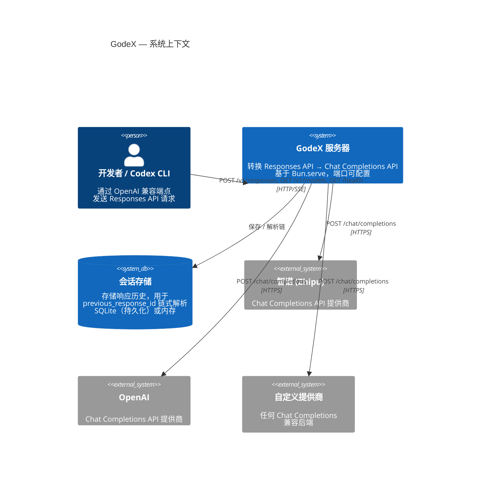
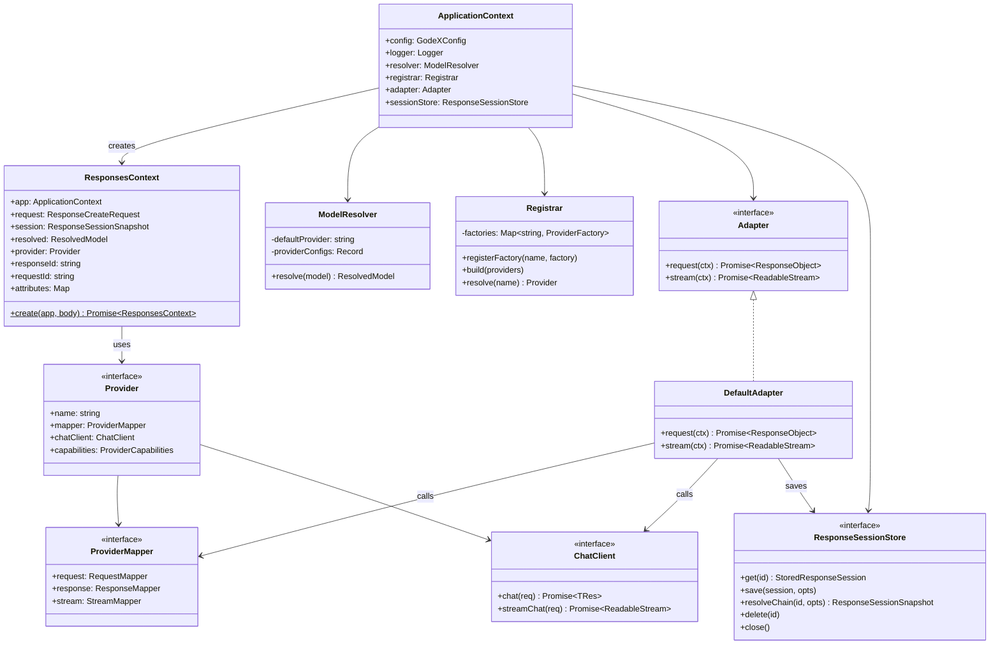
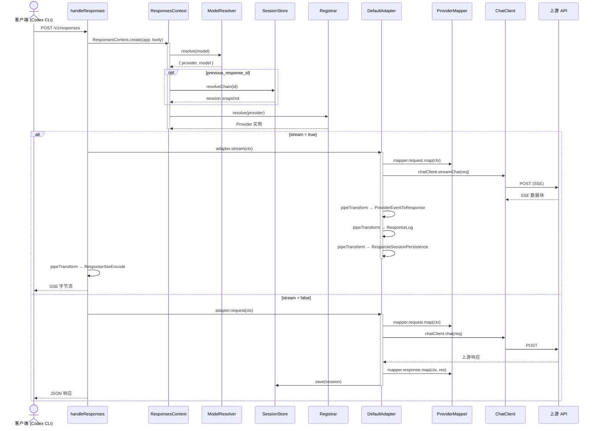
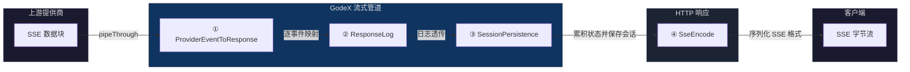

<div align="center">


**让每个模型都成为 Codex 引擎。**

OpenAI 兼容的 Responses API 网关 — 将 `/v1/responses` 请求转换为上游 Chat Completions API 调用，连接 Codex、CLI、IDE 和自动化开发工具与不同模型供应商。

[](https://www.npmjs.com/package/@ahoo-wang/godex)
[](https://codecov.io/gh/Ahoo-Wang/GodeX)
[](https://bun.sh)
[](https://www.typescriptlang.org/)

[快速入门](https://godex.ahoo.me/zh/01-getting-started/overview) · [架构](https://godex.ahoo.me/zh/02-architecture/overview) · [配置](https://godex.ahoo.me/zh/07-configuration/config-schema) · [文档](https://godex.ahoo.me/zh/)

</div>


## 功能特性

| | 特性 | 说明 |
|---|------|------|
| 🔄 | **协议转换** | 弥补 OpenAI Responses API 与提供商 Chat Completions API 之间的差距 |
| 🔌 | **提供商无关** | 基于插件的适配器系统 — 添加提供商只需实现少量接口 |
| ⚡ | **流式优先** | 4 阶段 `TransformStream` 管道，低延迟 SSE 传输 |
| 💾 | **会话历史** | 内置 `previous_response_id` 链式解析（SQLite / 内存） |
| 🛡️ | **结构化错误** | 域特定错误层次结构，带结构化编码和诊断上下文 |
| 🔧 | **内置工具** | `local_shell`、`shell`、`apply_patch` — Codex 兼容函数工具 |
| 📦 | **独立二进制** | 零运行时依赖，通过 GitHub Actions 构建 6 个平台 |

## 快速开始

```bash
# 安装 — 运行时无需 Bun
npm install -g @ahoo-wang/godex

# 交互式创建配置
godex init

# 启动网关
godex serve
```

将 Codex CLI 指向你的 GodeX 实例：

```bash
export OPENAI_BASE_URL=http://localhost:5678/v1
export OPENAI_API_KEY=any-value          # GodeX 不验证此值，但必须设置
codex
```

或使用 OpenAI SDK：

```ts
import OpenAI from "openai";

const client = new OpenAI({
  baseURL: "http://localhost:5678/v1",
  apiKey: "any-value",
});

const response = await client.responses.create({
  model: "gpt-4o",          // 通过 models.aliases 解析为 zhipu/glm-4.7
  input: "Hello!",
});
```

## 工作原理

```
Codex / CLI / IDE
      │
      ▼  POST /v1/responses
┌─────────────────────────────────────────┐
│              GodeX 网关                  │
│                                         │
│  Bun.serve → handleResponses()          │
│       → ResponsesContext.create()       │
│           → ModelResolver.resolve()     │
│           → Registrar.resolve()         │
│       → DefaultAdapter.stream/request() │
│           → ProviderMapper.map()        │
│           → ChatClient.streamChat()     │
│           → 4 阶段 TransformStream      │
│       → Response (JSON 或 SSE)          │
└──────────────┬──────────────────────────┘
               │  提供商适配器
               ▼
┌─────────────────────────────────────────┐
│       Chat Completions 兼容 API          │
│       (智谱、OpenAI 或自定义)             │
└─────────────────────────────────────────┘
```

## 架构



## 组件模型



## 请求流程



## 流式管道



| 阶段 | Transformer | 输入 | 输出 | 职责 |
|------|------------|------|------|------|
| ① | `ProviderEventToResponseTransformer` | `JsonServerSentEvent` | `ResponseStreamEvent` | 通过 `StreamMapper.map()` 映射上游 SSE 数据块 |
| ② | `ResponseLogTransformer` | `ResponseStreamEvent` | `ResponseStreamEvent` | 可观测性日志 |
| ③ | `ResponseSessionPersistenceTransformer` | `ResponseStreamEvent` | `ResponseStreamEvent` | 累积 `StreamState`，终止事件时保存会话 |
| ④ | `ResponseSseEncodeTransformer` | `ResponseStreamEvent` | `Uint8Array` | 序列化为 `event:` / `data:` 传输格式 |

## 项目结构

```
src/
├── cli/              Commander CLI（serve、配置检查、初始化）
├── config/           godex.yaml 配置模式、环境变量插值、默认值
├── context/          ApplicationContext（DI 容器）、ResponsesContext（每请求）
├── adapter/          Adapter 接口、DefaultAdapter、流式 Transformer
│   ├── mapper/       RequestMapper / ResponseMapper / StreamMapper 契约
│   └── transformers/ 4 阶段流式管道（映射 → 日志 → 持久化 → 编码）
├── providers/        Provider 注册表 + 内置工厂
│   └── zhipu/        参考提供商：映射器、聊天客户端、工具、消息
├── resolver/         ModelResolver（模型选择器 → 提供商 + 模型）
├── server/           Bun.serve、路由（/v1/responses、/health、/v1/models）
├── session/          ResponseSessionStore（内存 + SQLite）、链式解析
├── error/            GodeXError 错误体系及领域编码
├── tools/            内置函数工具（local_shell、shell、apply_patch）
├── protocol/openai/  OpenAI 兼容类型定义
├── logger/           结构化 JSON 日志
└── e2e/              模拟上游的端到端测试
```

## 配置

### godex.yaml

```yaml
server:
  port: 5678

default_provider: zhipu

models:
  aliases:
    "gpt-4o": zhipu/glm-4.7   # 模型名称映射
    "*": zhipu/glm-5.1         # 兜底映射

providers:
  zhipu:
    api_key: ${ZHIPU_API_KEY}
    base_url: https://open.bigmodel.cn/api/coding/paas/v4

session:
  backend: sqlite               # 或 "memory"
  sqlite:
    path: ./data/sessions.db

logging:
  level: info                   # trace | debug | info | warn | error
```

### 模型选择

```
model: "gpt-4o"              → 通过 default_provider 的模型映射解析
model: "zhipu/glm-4.7"       → 显式指定 provider/model 选择器
model: "openai/gpt-4o"       → 路由到已配置的 openai 提供商
```

### 健康检查

```bash
curl http://localhost:5678/health
# {"status":"ok","providers":["zhipu"],"unsupported_providers":[]}
```

### 添加提供商

在 `src/providers/<name>/` 中实现三个接口：

| 接口 | 用途 |
|------|------|
| `Provider` | 组合 mapper + chatClient + capabilities |
| `ProviderMapper` | request / response / stream 映射函数 |
| `ChatClient` | `chat()` 和 `streamChat()` HTTP 调用 |

在 `src/providers/builtin.ts` 中注册工厂：

```ts
registrar.registerFactory("myprovider", (config) =>
  createMyProvider(config) as Provider<unknown, unknown, unknown>
);
```

## 开发

```bash
bun install                  # 安装依赖
bun run dev                  # 热重载开发服务器（端口 13145）
bun run test                 # 单元 + 集成测试
bun run test:e2e             # 模拟上游的端到端测试
bun run build                # 为当前平台编译原生二进制
bun run check                # typecheck + lint + test
bun run ci                   # 完整 CI 流水线
```

## 发布

`@ahoo-wang/godex` 是一个轻量 npm 外壳。原生二进制文件以平台特定的可选依赖发布：

```
@ahoo-wang/godex
├── @ahoo-wang/godex-darwin-arm64     ← macOS Apple Silicon
├── @ahoo-wang/godex-darwin-x64       ← macOS Intel
├── @ahoo-wang/godex-linux-x64        ← Linux x86_64
├── @ahoo-wang/godex-linux-arm64      ← Linux ARM64
├── @ahoo-wang/godex-win32-x64        ← Windows x86_64
└── @ahoo-wang/godex-win32-arm64      ← Windows ARM64
```

## 许可证

[Apache License 2.0](LICENSE)
