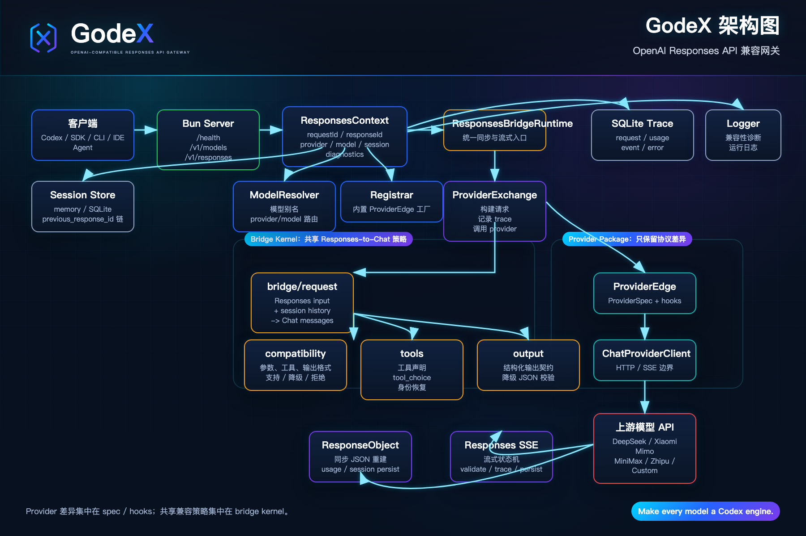
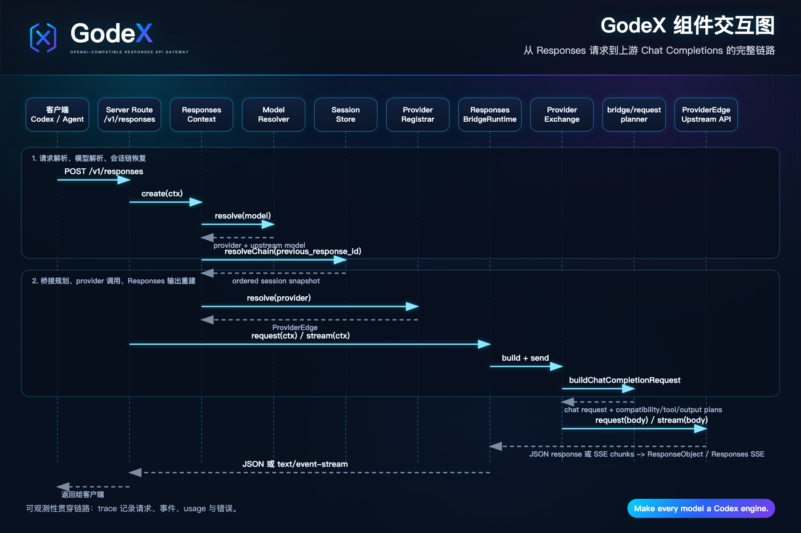

<div align="center">


**让每个模型都成为 Codex 引擎。**

OpenAI 兼容的 Responses API 网关，让 Codex、CLI 工具和开发者 Agent 接入任意模型。

[](https://www.npmjs.com/package/@ahoo-wang/godex)
[](https://codecov.io/gh/Ahoo-Wang/GodeX)
[](https://bun.sh)
[](https://www.typescriptlang.org/)

[**English Documentation**](https://godex.ahoo.me/) · [**中文文档**](https://godex.ahoo.me/zh/)
</div>

GodeX 让使用 OpenAI Responses API 的客户端，可以通过一个本地网关调用 DeepSeek、Xiaomi、MiniMax、智谱等只提供 Chat Completions API 的模型提供商。

## 功能特性

- OpenAI 兼容的 `POST /v1/responses`，支持同步和流式响应。
- `GET /v1/models` 暴露模型别名，让客户端使用稳定模型名，GodeX 负责路由到 provider/model。
- 内置 DeepSeek、Xiaomi、MiniMax、智谱桥接 provider。
- 基于 provider capability 规划请求参数、工具、`tool_choice`、结构化输出、推理和流式 usage。
- 支持 `previous_response_id` 会话链，可使用内存或 SQLite。
- Trace 记录 provider request、provider response、stream event、usage 和 error。
- 基于 Bun 运行时、TypeScript 源码，并通过 release 产出多平台原生二进制。

## 内置提供商

| 提供商 | 推理 | 工具选择 | 响应格式 | 缓存 Token | 默认模型 |
|--------|------|----------|----------|------------|----------|
| DeepSeek | 原生 | auto, none, required, function | text, json_object | ✅ | `deepseek-v4-pro` |
| Xiaomi   | 布尔 | auto | text, json_object | ✅ | `mimo-v2.5-pro` |
| MiniMax  | 无 | auto, none, required, function | text, json_object | ✅ | `MiniMax-M2.7` |
| 智谱     | 布尔 | auto, none | text, json_object | ✅ | `glm-5.1` |

## 架构图



## 组件交互图



## 安装

本地开发：

```bash
git clone https://github.com/Ahoo-Wang/GodeX.git
cd GodeX
bun install
```

包安装：

```bash
npm install -g @ahoo-wang/godex
godex --help
```

### Docker

预构建镜像发布到 Docker Hub 和 GitHub Container Registry：

```bash
docker pull ahoowang/godex:latest
# 或
docker pull ghcr.io/ahoo-wang/godex:latest
```

使用配置文件运行：

```bash
docker run -d \
  --name godex \
  -p 5678:5678 \
  -e ZHIPU_API_KEY=your-key \
  -e DEEPSEEK_API_KEY=your-key \
  -e MINIMAX_API_KEY=your-key \
  -e MIMO_API_KEY=your-key \
  -v ./godex.yaml:/etc/godex/godex.yaml:ro \
  -v godex-data:/data \
  ahoowang/godex:latest
```

镜像支持 `linux/amd64` 和 `linux/arm64`。

- 配置文件路径：`/etc/godex/godex.yaml`
- 数据目录（会话、Trace）：`/data`
- 默认端口：`5678`

## 快速开始

交互式创建配置并启动服务：

```bash
godex init
godex serve --config ./godex.yaml
```

向导会引导你选择 Provider、填写 Base URL 和 API Key，自动生成配置文件。

也可以手写 `godex.yaml`：

```yaml
server:
  port: 5678
  host: 0.0.0.0

default_provider: deepseek

models:
  aliases:
    # -------------------------------------------------------------------------
    # Codex-compatible model aliases
    #
    # 这些 alias 是 GodeX routing policy，不代表与 OpenAI 原模型能力等价。
    # 依据优先级：公开 benchmark > 官方模型定位 > Provider 产品说明。
    # -------------------------------------------------------------------------

    # Codex 默认主力：复杂编码 / computer use / research workflows
    # 依据：DeepSeek V4-Pro 在 SWE / Terminal / Codeforces / GDPval-AA 上公开成绩强。
    gpt-5.5: "deepseek/deepseek-v4-pro"

    # Codex 旗舰：coding + reasoning + tool use + agentic workflows
    # 依据：DeepSeek V4-Pro 有更完整的公开 coding/agentic benchmark 覆盖。
    gpt-5.4: "deepseek/deepseek-v4-pro"

    # Codex mini：subagents
    gpt-5.4-mini: "zhipu/glm-5.1"

    # Codex 编码专用：复杂软件工程
    # 依据：DeepSeek V4-Pro 的 SWE Verified / SWE Pro / Terminal Bench 表现。
    gpt-5.3-codex: "deepseek/deepseek-v4-pro"

    # Codex spark：近实时编码迭代
    gpt-5.3-codex-spark: "zhipu/glm-5.1"

    # 上一代通用 coding / agentic fallback
    # 严谨起见仍走 DeepSeek；不强行映射到 Zhipu。
    gpt-5.2: "deepseek/deepseek-v4-pro"

    # -------------------------------------------------------------------------
    # Provider native models
    # -------------------------------------------------------------------------

    deepseek-v4-pro: "deepseek/deepseek-v4-pro"
    deepseek-v4-flash: "deepseek/deepseek-v4-flash"

    mimo-v2.5-pro: "xiaomi/mimo-v2.5-pro"
    mimo-v2.5: "xiaomi/mimo-v2.5"

    glm-5.1: "zhipu/glm-5.1"
    glm-5-turbo: "zhipu/glm-5-turbo"
    glm-4.7: "zhipu/glm-4.7"
    glm-4.5-air: "zhipu/glm-4.5-air"

    MiniMax-M2.7: "minimax/MiniMax-M2.7"
    MiniMax-M2.7-highspeed: "minimax/MiniMax-M2.7-highspeed"

    # Fallback for unknown bare model names
    "*": "deepseek/deepseek-v4-pro"

providers:
  deepseek:
    spec: deepseek
    credentials:
      api_key: ${DEEPSEEK_API_KEY}
    endpoint:
      base_url: https://api.deepseek.com
  zhipu:
    spec: zhipu
    credentials:
      api_key: ${ZHIPU_API_KEY}
    endpoint:
      base_url: https://open.bigmodel.cn/api/coding/paas/v4
  minimax:
    spec: minimax
    credentials:
      api_key: ${MINIMAX_API_KEY}
    endpoint:
      base_url: https://api.minimaxi.com/v1
  xiaomi:
    spec: xiaomi
    credentials:
      api_key: ${MIMO_API_KEY}
    endpoint:
      base_url: https://api.xiaomimimo.com/v1

session:
  backend: sqlite

logging:
  level: info

trace:
  enabled: true
  path: ./data/trace.db
  capture_payload: false
```

启动服务：

```bash
godex serve --config ./godex.yaml
```

源码开发模式：

```bash
bun run dev
```

`bun run dev` 使用端口 `13145`；运行时配置默认端口是 `5678`。

## API

### 健康检查

```bash
curl http://localhost:5678/health
```

### 模型列表

```bash
curl http://localhost:5678/v1/models
```

`/v1/models` 返回已配置模型别名，不包含通配别名 `*`。

### Responses

```bash
curl http://localhost:5678/v1/responses \
  -H 'content-type: application/json' \
  -d '{
    "model": "gpt-5.5",
    "input": "写一个 TypeScript add 函数。"
  }'
```

流式响应使用标准 Responses SSE 事件名：

```bash
curl -N http://localhost:5678/v1/responses \
  -H 'content-type: application/json' \
  -d '{
    "model": "gpt-5.5",
    "stream": true,
    "input": "用两句话解释 Bun streams。"
  }'
```

## 模型路由

客户端可以传入：

- provider-qualified selector，例如 `deepseek/deepseek-v4-pro`
- 配置别名，例如 `gpt-5.5`
- 普通模型名；未命中别名时通过 `default_provider` 解析

`models.aliases` 的值必须是 `provider/model`，且 provider 必须存在于 `providers`。


## Codex 集成

将 Codex 桌面应用接入 GodeX，在 `~/.codex/config.toml` 中添加自定义 provider：

```toml
model = "gpt-5.5"
model_provider = "godex"

[model_providers.godex]
name = "GodeX"
base_url = "http://127.0.0.1:5678/v1"
wire_api = "responses"
requires_openai_auth = false
supports_websockets = false
```

模型别名（`gpt-5.5`、`gpt-5.4`、`gpt-5.4-mini` 等）由 GodeX 根据 `godex.yaml` 中的 `models.aliases` 解析——Codex 只需知道别名。


## Provider 桥接行为

GodeX 构建 provider request 分三步：

1. 将客户端模型选择器解析为配置里的 provider 和上游模型。
2. 根据 provider `ProviderSpec` 规划参数、工具声明、`tool_choice`、响应格式、推理和 stream usage。
3. 将 Responses input 和 session history 转换为 Chat Completions messages，调用上游，再重建 Responses object 或 Responses SSE stream。

Provider 特有差异放在各 provider 的 `spec.ts`、`hooks.ts`、协议类型和 HTTP client 中。共享 Responses-to-Chat 策略放在 `src/bridge`。

## 结构化输出

当 provider 支持 `json_object` 但不支持原生 `json_schema` 时，GodeX 可以把 strict `json_schema` 请求降级到 `json_object`。

对 strict 降级 schema：

- 当前请求的 provider prompt 前言会加入 schema 格式指令。
- provider 收到 `response_format: { "type": "json_object" }`。
- GodeX 校验最终输出是否是合法 JSON。
- 同步响应输出非法时失败；流式响应输出非法时改写为终止 `response.failed` 事件。

校验器只检查 JSON 语法，不执行完整 JSON Schema 校验。

## 会话

Responses 可以通过 `previous_response_id` 保存并回放上下文。

- `session.backend: memory` 使用进程内存。
- `session.backend: sqlite` 持久化到 SQLite。
- `store: false` 跳过当前轮保存。
- session chain 保存 request snapshot 和 response output item，下一轮再重建 provider-neutral history。

## Trace 数据库

Trace 默认开启，默认写入 `./data/trace.db`。

Trace 记录包括：

- provider request 元数据
- provider request / response body 的摘要 payload
- 原始和转换后的 stream event
- usage 详情，包括上游返回的 cached tokens
- route error 和 provider error

设置 `trace.capture_payload: true` 会保存 payload JSON，最多 `trace.payload_max_bytes` 字节。敏感环境建议保持关闭。

## 开发

```bash
bun install                  # 安装依赖
bun run dev                  # 热重载开发服务器，端口 13145
bun run start                # 从源码启动服务
bun run build                # 为当前平台编译二进制
bun run compile:all          # 交叉编译所有支持平台
```

质量门禁：

```bash
bun run typecheck            # TypeScript
bun run lint                 # Biome check
bun run lint:fix             # Biome 自动修复
bun run format               # Biome 格式化
bun run test                 # 单元和集成测试，不含 src/e2e
bun run test:e2e             # mock 上游端到端测试
bun run test:zhipu           # 智谱 live 测试，需要 ZHIPU_API_KEY
bun run test:deepseek        # DeepSeek live 测试，需要 DEEPSEEK_API_KEY
bun run test:minimax         # MiniMax live 测试，需要 MINIMAX_API_KEY
bun run test:xiaomi         # Xiaomi live 测试，需要 MIMO_API_KEY
bun run check                # typecheck + lint + test
bun run ci                   # typecheck + biome ci + test + e2e
```

## 源码地图

```text
src/
  cli/          Commander CLI, init wizard, runtime config loading
  config/       godex.yaml schema, defaults, env interpolation
  context/      ApplicationContext and per-request ResponsesContext
  bridge/       Provider-agnostic Responses-to-Chat planning and reconstruction
  providers/    Built-in provider specs, hooks, clients, and registry
  responses/    Sync and stream request pipelines
  server/       Bun routes for /health, /v1/models, /v1/responses
  session/      Memory and SQLite response session stores
  trace/        SQLite trace recorder and usage/error/event mappers
  protocol/     OpenAI protocol type definitions
  error/        GodeXError hierarchy and domain codes
```

## Provider 开发

Provider 目录形态：

```text
src/providers/<name>/
  spec.ts       ProviderSpec declaration
  client.ts     ProviderEdge construction with ChatProviderClient
  hooks.ts      Provider-specific patching, accessors, usage, stream deltas
  protocol/     Provider DTOs when needed
  index.ts      Public exports
```

共享兼容性策略放到 `src/bridge`；共享 provider transport 或协议 helper 放到 `src/providers/shared`。

## 许可证

Apache-2.0. See [LICENSE](./LICENSE).
