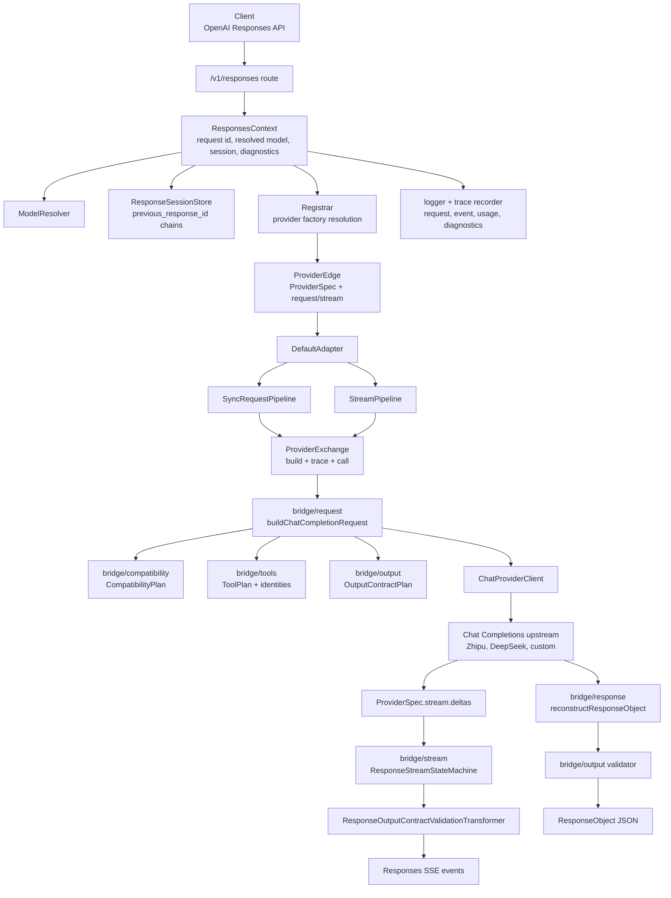
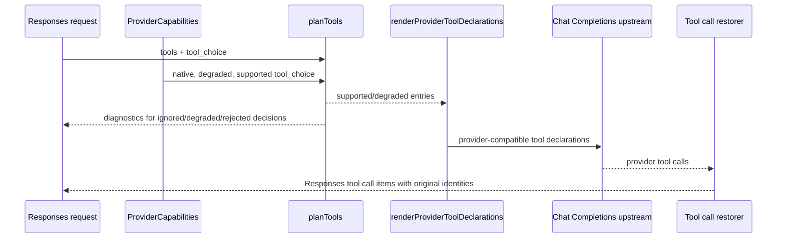
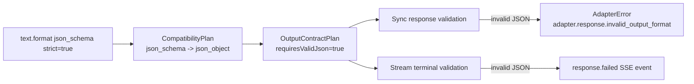

# Responses Bridge Kernel

GodeX is a bridge for upstreams that expose Chat Completions, not for upstreams that already expose the Responses API. Responses-native upstreams should be called directly by the client.

## Component Interaction

## Tool Planning

Tool support is intentionally planned before provider rendering.

Rules:

- `tool_choice: "none"` disables declarations.
- Explicit `tool_choice` for a tool that cannot be declared is rejected.
- Built-in Codex tools, custom tools, and namespace tools may downgrade to function tools when the provider supports that loss.
- OpenAI-native discovery controls such as `tool_search` are not executable functions; providers without native support ignore them and keep any eagerly declared tools.
- Provider hooks expose protocol differences; shared support/degrade/reject policy stays in `bridge/tools`.

## Output Format Contract

`json_schema` is degraded to `json_object` only when the provider declares that mapping. When the original schema request has `strict: true`, GodeX validates that the final model output is valid JSON.

The validator checks JSON syntax, not full JSON Schema conformance. The schema is still provided to the model as an instruction when degraded.

## Provider Onboarding Shape

A new provider should add only provider-specific rendering and transport:

- `spec.ts`, `client.ts`, `hooks.ts`, `index.ts`
- `protocol/` types if the upstream is not OpenAI Chat Completions compatible
- `ProviderSpec.capabilities` for supported/degraded parameters, tools, tool_choice, response formats, reasoning, and streaming usage
- response accessors for first choice, finish reason, output text, and usage
- stream delta extractor that emits bridge `ProviderStreamDelta` values
- optional request/response/chunk hooks for real provider quirks

Shared policy belongs in `src/bridge/`. Shared protocol plumbing belongs in `src/providers/shared/`. Provider folders should not duplicate compatibility policy between providers.

## Verification Surface

- Unit tests protect bridge single-responsibility modules: compatibility planning, tool planning, and output validation.
- Provider conformance tests prove every built-in provider exposes a valid `ProviderSpec` and `ProviderEdge`.
- Mocked E2E tests prove the real route, context, resolver, session, adapter, provider client, stream pipeline, diagnostics, and mock upstream work together.
- Live provider tests remain opt-in through environment gates.
