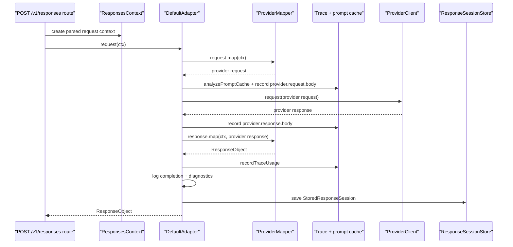
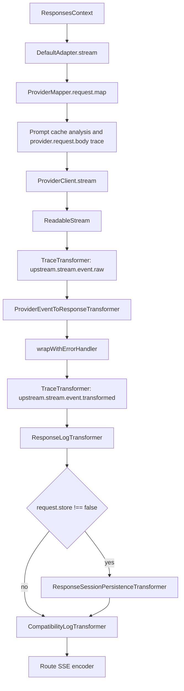
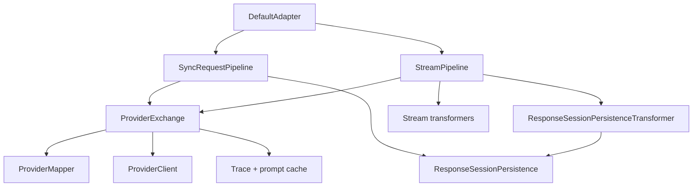
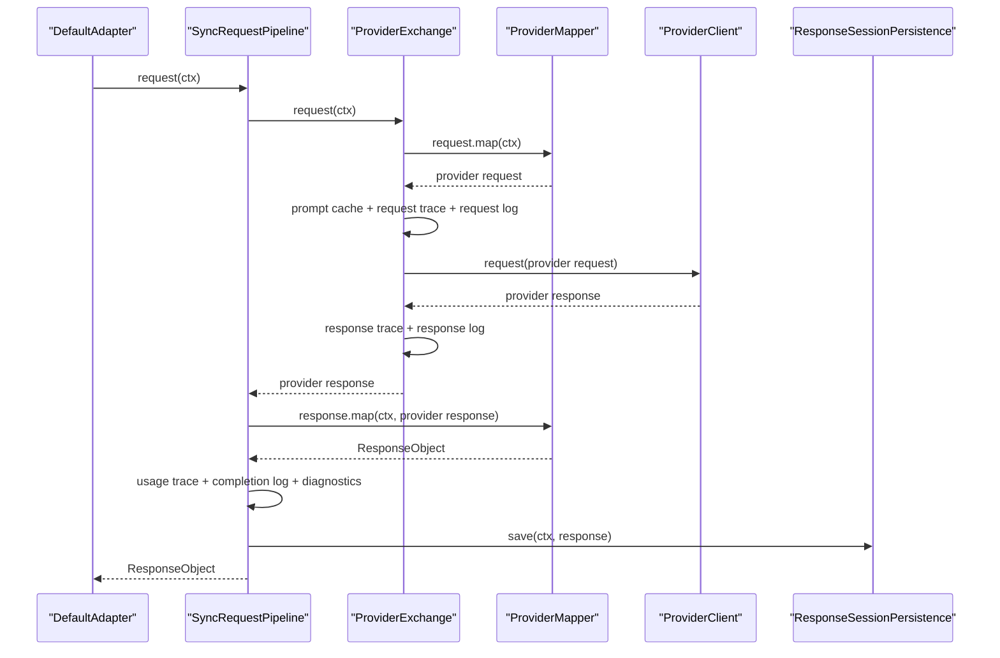
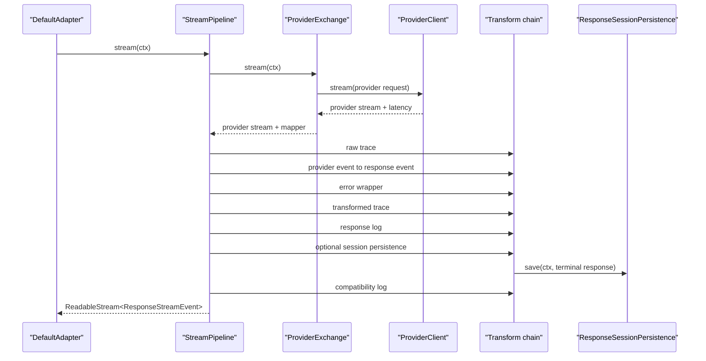

# Adapter Module Refactor Design

## Goal

Refactor `src/adapter` so request orchestration, stream pipeline assembly, provider exchange, and session persistence are explicit responsibilities with focused test boundaries.

This is an internal architecture cleanup. The external `/v1/responses` behavior, `Adapter` public contract, provider contracts, mapper contracts, trace event names, log event names, session payload shape, and SSE event order should stay stable. Internal constructor shapes and helper APIs do not need compatibility shims.

## Current State

`src/adapter` owns the boundary between the request context and the selected upstream provider.

The module currently contains several good focused pieces:

- `adapter.ts` defines the public adapter contract.
- `provider.ts` defines the provider bundle contract.
- `mapper/` owns stable mapper contracts plus shared chat mapper composition.
- `transformers/` owns stream event transformation, persistence, logging, tracing, and SSE encoding helpers.
- `compatibility.ts`, `response-utils.ts`, `stream-error-handler.ts`, and `utils.ts` own smaller support concerns.

The main pressure is concentrated in `default-adapter.ts`. `DefaultAdapter` currently does all of the following:

- map the OpenAI Responses request into a provider request
- analyze prompt cache behavior
- record provider request and response trace events
- log provider request, response, and stream connection milestones
- call the provider HTTP client for sync and streaming requests
- map sync provider responses back into `ResponseObject`
- record usage trace data
- log request completion and compatibility diagnostics
- build and persist `StoredResponseSession`
- assemble the complete stream transformer chain
- attach upstream latency to `ResponsesContext.attributes`
- decide whether stream persistence is installed based on `request.store`

The behavior is still understandable, but too many responsibilities are tested through `DefaultAdapter` as one integration-shaped unit. That makes future adapter changes riskier than they need to be because a small concern, such as session payload construction or stream pipeline ordering, is hidden inside one broad class.

## Current Interaction

### Non-Streaming Request



### Streaming Request



The stream pipeline is order-sensitive. The refactor should make that order more visible, not more abstract.

## Approaches Considered

### 1. Private Helper Extraction

Keep `DefaultAdapter` as the only production entry point and move repeated logic into private methods inside `default-adapter.ts`.

This has low churn, but it does not create useful test seams. The central file would still own provider exchange, persistence, and pipeline assembly.

### 2. Focused Adapter Services

Split `DefaultAdapter` into small adapter-internal services:

- provider exchange
- sync request pipeline
- stream pipeline
- response session persistence

`DefaultAdapter` remains the public `Adapter` implementation and delegates to these services.

This keeps the public surface stable while creating clean test boundaries around the risky parts.

### 3. Generic Middleware Pipeline

Represent sync and stream adapter work as a generic middleware chain.

This could reduce some repeated ordering code, but it would make the module harder to read. The adapter has a small number of known phases, and their ordering matters. A generic middleware abstraction would add flexibility that the project does not need.

## Selected Design

Use approach 2.

The refactored module should look like this:

```text
src/adapter/
+-- adapter.ts
+-- default-adapter.test.ts
+-- default-adapter.ts
+-- provider-exchange.test.ts
+-- provider-exchange.ts
+-- response-session-persistence.test.ts
+-- response-session-persistence.ts
+-- sync-request-pipeline.test.ts
+-- sync-request-pipeline.ts
+-- stream-pipeline.test.ts
+-- stream-pipeline.ts
+-- mapper/
+-- transformers/
```

The exact test distribution can be adjusted during implementation, but the production responsibilities should remain separate.

## Target Interaction

### Module-Level Shape



### Non-Streaming Request



### Streaming Request



## Responsibilities

### `default-adapter.ts`

`DefaultAdapter` remains the only public adapter implementation.

It should:

- implement `Adapter`
- construct default adapter-internal collaborators when none are provided
- delegate `request(ctx)` to `SyncRequestPipeline`
- delegate `stream(ctx)` to `StreamPipeline`

It should not:

- assemble stream transformers directly
- construct session payloads
- know trace event names beyond collaborator construction
- call provider clients directly

### `provider-exchange.ts`

`ProviderExchange` owns the upstream exchange boundary for sync and stream requests.

Suggested shape:

```ts
export interface ProviderRequestExchangeResult {
	providerResponse: unknown;
}

export interface ProviderStreamExchangeResult {
	mapper: ResponsesContext["provider"]["mapper"];
	providerStream: ReadableStream<JsonServerSentEvent<unknown>>;
	upstreamLatencyMillis: number;
}

export class ProviderExchange {
	async request(ctx: ResponsesContext): Promise<ProviderRequestExchangeResult>;

	async stream(ctx: ResponsesContext): Promise<ProviderStreamExchangeResult>;
}
```

It should:

- call `ctx.provider.mapper.request.map(ctx)`
- call `analyzePromptCache(ctx, providerRequest)`
- record `provider.request.body`
- log `provider.request.sending`
- call `ctx.provider.client.request(providerRequest)` or `ctx.provider.client.stream(providerRequest)`
- record `provider.response.body` for sync responses
- log `provider.response.received` for sync responses
- log `provider.stream.connected` for stream responses
- return the provider response or provider stream without mapping it to Responses API output

It should not:

- map sync provider responses into `ResponseObject`
- record usage
- log final request completion
- save sessions
- assemble stream transformers

### `response-session-persistence.ts`

`ResponseSessionPersistence` owns conversion from `ResponseObject` plus `ResponsesContext` into `StoredResponseSession`.

Suggested shape:

```ts
export async function saveResponseSession(
	store: ResponseSessionStore,
	responseObject: ResponseObject,
	ctx: ResponsesContext,
): Promise<void>;
```

It should:

- return immediately when `ctx.request.store === false`
- preserve the existing `StoredResponseSession` payload shape
- call `store.save(session)`
- log `session.saved` after a successful save

It should not:

- catch persistence errors
- decide the warning event name for sync or stream callers
- inspect stream state

The caller keeps ownership of failure handling because sync and stream persistence currently log different warning events.

### `sync-request-pipeline.ts`

`SyncRequestPipeline` owns non-streaming adapter orchestration after provider exchange.

It should:

- call `ProviderExchange.request(ctx)`
- call `ctx.provider.mapper.response.map(ctx, providerResponse)`
- record usage with `recordTraceUsage`
- log `responses.request.completed`
- call `logDiagnostics`
- save the response session through `saveResponseSession`
- catch session save failures and log `session.save.error`
- return the `ResponseObject`

It should not:

- call the provider client directly
- assemble stream transformers
- construct session payloads inline

### `stream-pipeline.ts`

`StreamPipeline` owns stream transformer assembly.

It should:

- call `ProviderExchange.stream(ctx)`
- write `ATTR_UPSTREAM_LATENCY_MILLIS` into `ctx.attributes`
- assemble transformers in the current order:
  1. `TraceTransformer("upstream.stream.event.raw", ctx)`
  2. `ProviderEventToResponseTransformer(mapper.stream, ctx)`
  3. `wrapWithErrorHandler(eventStream, ctx)`
  4. `TraceTransformer("upstream.stream.event.transformed", ctx)`
  5. `ResponseLogTransformer(ctx)`
  6. `ResponseSessionPersistenceTransformer({ ctx, saveSession: saveResponseSession })` when `ctx.request.store !== false`
  7. `CompatibilityLogTransformer(ctx)`
- return `ReadableStream<ResponseStreamEvent>`

It should not:

- map provider requests
- call the provider client directly
- build session payloads
- encode SSE bytes

## Behavior

The refactor must preserve these externally visible behaviors:

- `DefaultAdapter.request(ctx)` still returns the mapped `ResponseObject`.
- `DefaultAdapter.stream(ctx)` still returns a `ReadableStream<ResponseStreamEvent>`.
- `ctx.request.store === false` still skips sync and stream session persistence.
- sync session save failures still return the response and log `session.save.error`.
- stream session save failures still use the current transformer failure behavior.
- provider request tracing still records `provider.request.body`.
- sync provider response tracing still records `provider.response.body`.
- stream tracing still records `upstream.stream.event.raw` before mapping and `upstream.stream.event.transformed` after error wrapping.
- usage tracing still records mapped Responses usage plus upstream usage details.
- request completion logging still uses `responses.request.completed`.
- compatibility diagnostics are still logged after sync response mapping and at the end of stream consumption.
- `ATTR_UPSTREAM_LATENCY_MILLIS` is still attached before downstream stream transformers need it.

The refactor may change only internal test seams and constructor shapes.

## Out of Scope

- changing `Adapter`
- changing `Provider`
- changing `ProviderMapper`, `RequestMapper`, `ResponseMapper`, or `StreamMapper`
- changing provider-specific mapper modules
- changing route-level SSE encoding
- changing session storage schema
- changing trace event payload shape or event names
- changing compatibility diagnostic semantics
- introducing a generic middleware framework

## Testing

Add or redistribute focused tests around the new boundaries.

`response-session-persistence.test.ts` should cover:

- saving the current `StoredResponseSession` shape
- preserving `previous_response_id`
- preserving request fields used for conversation replay
- preserving response fields used for session reads
- skipping persistence when `request.store === false`
- logging `session.saved` after successful persistence
- allowing store errors to propagate

`provider-exchange.test.ts` should cover:

- request mapper invocation before client invocation
- prompt cache analysis and `provider.request.body` trace recording
- sync provider response trace recording
- sync request and response debug logs
- stream connection debug log
- stream latency measurement returned to the caller
- no Responses API response mapping in this layer

`sync-request-pipeline.test.ts` should cover:

- provider exchange result mapped through `mapper.response.map`
- usage trace recording
- request completion log payload
- compatibility diagnostics logging
- successful session persistence through `saveResponseSession`
- `session.save.error` warning when persistence fails
- response still returned when persistence fails

`stream-pipeline.test.ts` should cover:

- returned value is a `ReadableStream<ResponseStreamEvent>`
- transformer order preserves raw trace before mapping
- transformed trace occurs after error handling
- response logging still sees transformed events
- session persistence transformer is installed only when `request.store !== false`
- compatibility logging remains the last adapter transformer
- upstream latency is attached to `ctx.attributes`

`default-adapter.test.ts` should become narrower:

- `request(ctx)` delegates to the sync pipeline
- `stream(ctx)` delegates to the stream pipeline
- default construction wires production collaborators

Existing transformer tests should stay with the transformer files. The broad behavior tests that currently live in `default-adapter.test.ts` should move to the smallest new owner that proves the same behavior.

## Migration Steps

1. Extract `saveResponseSession()` first and move the existing session-payload tests to `response-session-persistence.test.ts`.
2. Extract `ProviderExchange` and keep sync behavior green before moving stream exchange.
3. Add `SyncRequestPipeline` and move sync orchestration assertions out of `DefaultAdapter` tests.
4. Add `StreamPipeline` and move stream pipeline ordering assertions out of `DefaultAdapter` tests.
5. Reduce `DefaultAdapter` to delegation plus default collaborator construction.
6. Run `bun run check` after the full refactor.

Each extraction should preserve existing event names before moving to the next step.
