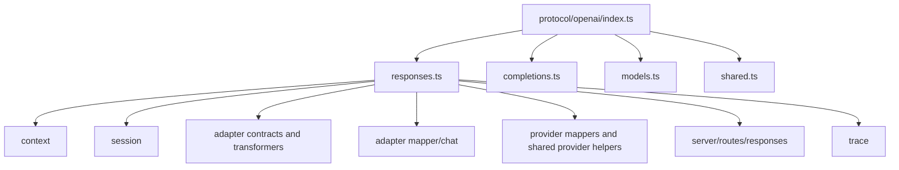
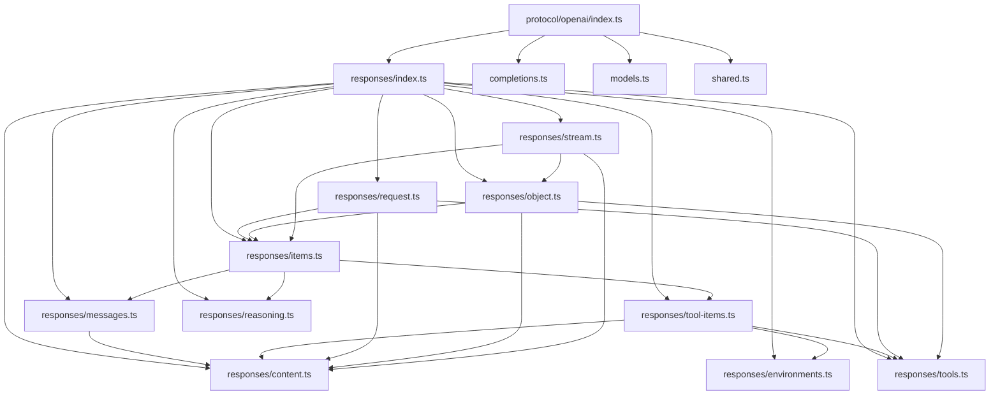

# OpenAI Protocol Refactor Design

## Goal

Refactor `src/protocol/openai` so OpenAI protocol type definitions are organized by API surface and type responsibility rather than by one large Responses file.

This phase is an internal architecture cleanup. Runtime behavior, `/v1/responses` HTTP behavior, provider mapping behavior, session payload shape, trace payload shape, and SSE event names should stay stable. Internal import paths and file layout do not need compatibility shims. The priority is a clean protocol boundary that is easy to navigate, review, and typecheck.

## Current State

`src/protocol/openai` currently has five files:

- `completions.ts` defines Chat Completions request, response, chunk, tool, and usage types.
- `models.ts` defines model identifiers and model list types.
- `shared.ts` defines cross-API primitives such as roles, metadata, errors, token details, reasoning options, and media options.
- `responses.ts` defines the full Responses API surface in one 1208-line file.
- `index.ts` re-exports the four protocol files.

The main pressure is concentrated in `responses.ts`. It currently owns all of these concerns:

- input content and input message types
- output content, annotations, logprobs, and assistant message output
- tool execution items such as function calls, MCP calls, web search calls, shell calls, and apply patch calls
- reasoning and compaction items
- tools parameter definitions
- tool choice definitions
- `ResponseCreateRequest`
- `ResponseObject`, status, usage, incomplete details, and instructions
- `ResponseStreamEvent`

The file is not behaviorally complex, but it is structurally overloaded. Small changes to one protocol concept require scanning unrelated concepts, and consumers import from a file name that no longer describes a single responsibility.

## Current Dependency Shape



The fan-out is expected because `ResponseCreateRequest`, `ResponseObject`, `ResponseItem`, `ResponseTool`, `ResponseToolChoice`, `ResponseUsage`, and `ResponseStreamEvent` are central protocol types. The problem is not the fan-out itself; the problem is that unrelated type families are forced through one physical file.

## Constraints

- Do not add a legacy compatibility file that only re-exports the new layout.
- Keep the OpenAI protocol layer independent from adapter and provider implementation modules.
- Keep `src/protocol/openai/index.ts` as a pure barrel.
- Respect `src/module-boundaries.test.ts`: only `index.ts` files re-export other modules.
- Avoid runtime helpers unless there is an actual runtime concept. This phase should mostly move TypeScript types.
- Do not change protocol names or response shapes unless a type is demonstrably wrong and the fix is explicitly scoped.

## Approaches Considered

### 1. Reorder `responses.ts`

Keep the file and only reorder sections with clearer comments.

This is low churn, but it leaves the core problem intact. The file would still bundle request, response object, stream, item, and tool definitions together.

### 2. Flat Files Under `protocol/openai`

Delete `responses.ts` and add files such as `response-request.ts`, `response-object.ts`, `response-stream.ts`, and `response-tools.ts` directly under `src/protocol/openai`.

This creates clear files, but it crowds the top-level OpenAI protocol directory. The top level would mix API families (`completions`, `models`, `shared`) with many Responses sub-concepts.

### 3. Responses Subdomain Directory

Replace `responses.ts` with a `responses/` directory containing focused type modules plus `responses/index.ts`.

This keeps the root OpenAI protocol layer organized by API family while allowing the Responses API surface to be split by responsibility. Existing application code can depend on the Responses domain entry point, while the domain internals stay focused.

## Selected Design

Use approach 3.

The target shape is:

```text
src/protocol/openai/
+-- completions.ts
+-- index.ts
+-- models.ts
+-- responses/
|   +-- content.ts
|   +-- environments.ts
|   +-- index.ts
|   +-- items.ts
|   +-- messages.ts
|   +-- object.ts
|   +-- reasoning.ts
|   +-- request.ts
|   +-- stream.ts
|   +-- tool-items.ts
|   +-- tools.ts
+-- shared.ts
```

`src/protocol/openai/responses.ts` should be removed. The canonical Responses domain entry point becomes `src/protocol/openai/responses/index.ts`; it is not a compatibility shim, it is the intentional API-family boundary.

`src/protocol/openai/index.ts` should continue to export the API-family modules:

```ts
export * from "./completions";
export * from "./models";
export * from "./responses";
export * from "./shared";
```

## Target Dependency Shape



The important design property is acyclic leaf modules. `items.ts` is allowed to be the union assembly point, but leaf modules should not import from `items.ts`.

## Module Responsibilities

### `responses/content.ts`

Owns low-level content parts and content annotations:

- `ResponseInputText`
- `ResponseInputImage`
- `ResponseInputFile`
- `ResponseInputContent`
- `ResponseOutputText`
- `ResponseOutputRefusal`
- `ResponseOutputContent`
- `ResponseTokenLogprob`
- annotation types

It may import primitive media and logprob types from `shared.ts`.

### `responses/environments.ts`

Owns reusable execution environment shapes shared by tools and tool-call items:

- `ContainerAuto`
- `LocalEnvironment`
- `ContainerReference`
- `ShellCallEnvironment`

This keeps `tools.ts` and `tool-items.ts` from depending on each other just to share shell/container environment types.

### `responses/messages.ts`

Owns request and response message items:

- `EasyInputMessage`
- `ResponseInputMessage`
- `InputItemBase`
- `InputItem`
- `ResponseOutputMessage`

Message content should come from `content.ts`; roles, phases, and item status should come from `shared.ts`.

### `responses/tool-items.ts`

Owns response-history items that represent tool execution and tool outputs:

- file search calls and results
- computer calls and outputs
- web search calls
- function calls and outputs
- tool search calls and outputs
- MCP list, approval, and call items
- custom tool calls and outputs
- image generation calls
- code interpreter calls
- local shell calls and outputs
- shell calls and outputs
- apply patch calls and outputs
- `ItemReference`

This module may import `ToolDefinition` from `tools.ts` for tool-search output payloads. It should not define request-time tool configuration.

### `responses/reasoning.ts`

Owns model-produced non-message reasoning and compaction items:

- `SummaryTextContent`
- `ReasoningTextContent`
- `Reasoning`
- `Compaction`

These types are used by response objects and stream events, so they need their own small module instead of living under tool items.

### `responses/tools.ts`

Owns request-time tool definitions and tool choice:

- `FunctionTool`
- `FileSearchTool`
- `ComputerTool`
- `ComputerUsePreviewTool`
- `WebSearchTool`
- `WebSearchPreviewTool`
- `McpTool`
- `CodeInterpreterTool`
- `ImageGenerationTool`
- `LocalShellTool`
- `ShellTool`
- `CustomTool`
- `NamespaceTool`
- `ToolSearchConfig`
- `ApplyPatchTool`
- `ResponseTool`
- `ResponseToolChoice`

This module describes what a request may offer to the model. It should not define response-history call items.

### `responses/items.ts`

Owns only the top-level `ResponseItem` union and any tiny glue needed to assemble it.

This file should import item families from `messages.ts`, `tool-items.ts`, and `reasoning.ts`. It should not grow new concrete item definitions unless they are truly cross-family glue.

### `responses/request.ts`

Owns request payload types:

- `ResponseIncludable`
- `ResponseCreateRequest`

It may import input, item, tool, and shared option types. It should not define response object or stream event types.

### `responses/object.ts`

Owns persisted and returned response object types:

- `ResponseIncompleteDetails`
- `ResponseStatus`
- `ResponseInputTokensDetails`
- `ResponseOutputTokensDetails`
- `ResponseUsage`
- `ResponseInstructions`
- `ResponseObject`

It may import `ResponseItem`, `ResponseTool`, `ResponseToolChoice`, `ResponseInputContent`, and shared primitives.

### `responses/stream.ts`

Owns streaming event types:

- `ResponseStreamEventType`
- `ResponseStreamEvent`

It may import `ResponseObject`, `ResponseItem`, content types, reasoning content types, token logprobs, and response errors.

## Consumer Import Policy

Application modules should depend on API-family entry points:

- use `../protocol/openai` when a file already depends on multiple OpenAI API families
- use `../protocol/openai/responses` when a file only needs Responses API types

Application modules should not normally import from `../protocol/openai/responses/content` or another leaf module. Leaf imports are primarily for files inside `src/protocol/openai/responses/`. This keeps the protocol file layout from leaking through the rest of the application.

During implementation, direct imports from the old file path should be reviewed intentionally. If the same import specifier resolves to `responses/index.ts`, that is acceptable because it now represents the canonical Responses domain, not a compatibility shim.

## Migration Plan

1. Create `src/protocol/openai/responses/` with the focused modules and `index.ts`.
2. Move type definitions out of `responses.ts` without changing names or shapes.
3. Extract shared shell/container environment types into `environments.ts` to avoid cycles between tools and tool items.
4. Assemble `ResponseItem` in `items.ts` and keep concrete item definitions in family modules.
5. Delete `src/protocol/openai/responses.ts`.
6. Keep `src/protocol/openai/index.ts` exporting `./responses`.
7. Run typecheck and module-boundary tests to catch missing exports, accidental re-export files, and dependency cycles.

## Testing Strategy

Because this is a type-layout refactor, the main regression guard is full compilation plus existing behavior tests:

- `bun run typecheck` verifies all moved type exports and imports.
- `bun run lint` verifies formatting and the module boundary rules.
- `bun run test` verifies adapter, provider, session, server, and mapper behavior still compiles and runs against the moved protocol types.
- `bun run check` remains the required gate before commit.

No artificial runtime tests should be added for erased TypeScript interfaces. If implementation introduces a runtime helper or runtime constant, that helper should get a focused test.

## Risks And Mitigations

- Type cycles between tool definitions and tool-call items.
  Mitigation: put shared execution environment types in `environments.ts`, put `ToolDefinition` in `tools.ts`, and keep `items.ts` as the union assembly point only.

- Accidental legacy shim through a non-index re-export file.
  Mitigation: delete `responses.ts`; rely on `responses/index.ts` as the domain barrel; let `src/module-boundaries.test.ts` enforce re-export placement.

- Import churn hiding behavior changes.
  Mitigation: move types without renaming or reshaping them, and rely on full `bun run check` after the mechanical split.

- Root protocol barrel becoming too broad.
  Mitigation: root `openai/index.ts` should continue to export only API-family modules, while Responses-specific files stay under `responses/`.

## Definition Of Done

- `src/protocol/openai/responses.ts` is gone.
- `src/protocol/openai/responses/` exists with focused modules and a pure local `index.ts` barrel.
- Existing Responses API type names remain available through `src/protocol/openai` and `src/protocol/openai/responses`.
- No adapter, provider, session, server, trace, or mapper behavior changes are introduced.
- `bun run check` passes.
