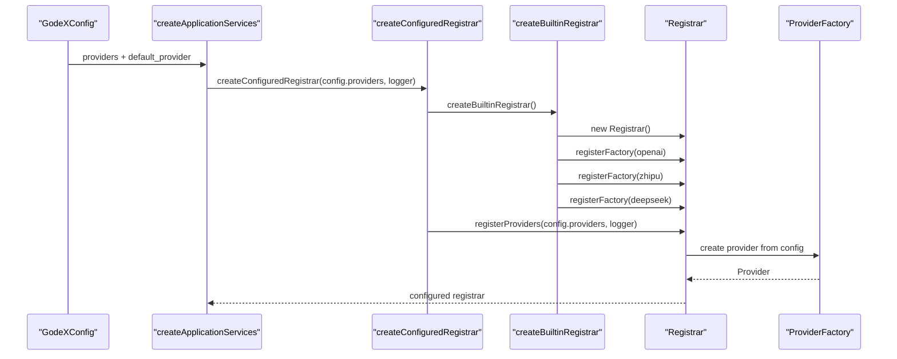
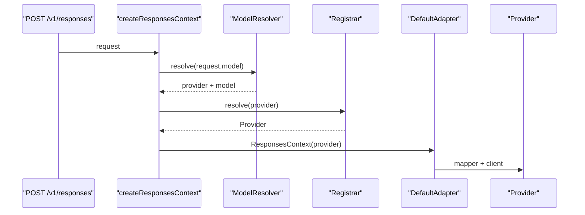
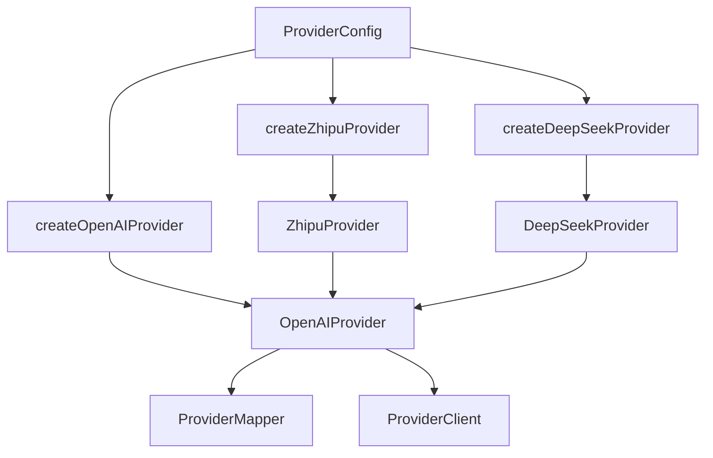
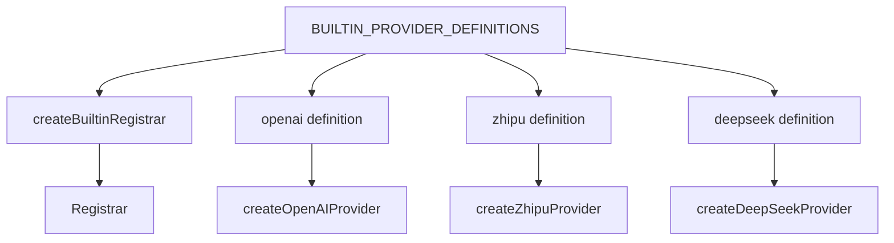
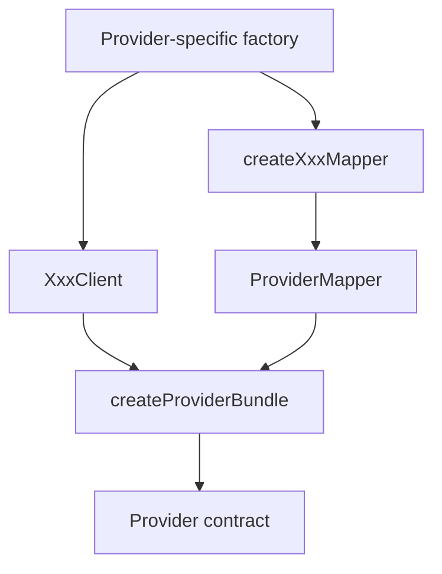
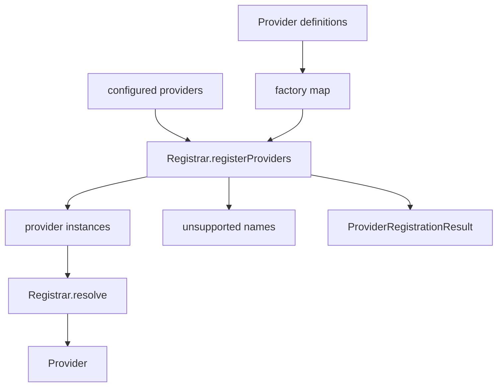

# Providers Runtime Refactor Design

## Goal

Refactor `src/providers` runtime wiring so provider registration, provider construction, and provider bundle composition have explicit responsibilities and focused test boundaries.

The primary constraint is architecture cleanliness: no compatibility burden, clear responsibilities, and clean tests. Other constraints are design choices, not hard rules. If changing a public constructor or provider-specific file makes the runtime boundary cleaner, the implementation should do that and protect behavior with tests.

This phase targets provider runtime and wiring. Provider-specific mapper internals are not the main focus, but they may be touched when needed to remove misleading runtime coupling.

## Current State

Provider runtime currently spans these responsibilities:

- `src/context/provider-bootstrap.ts` creates or reuses a registrar and registers configured providers.
- `src/providers/builtin.ts` manually registers each built-in provider factory.
- `src/providers/registrar.ts` stores factories, instantiates configured providers, tracks unsupported configured provider names, and resolves providers by name.
- each provider-specific `factory.ts` reads `ProviderConfig` and creates a provider instance.
- each provider-specific `provider.ts` packages provider name, mapper, and client into the adapter-facing `Provider` contract.
- `src/providers/shared/chat-provider-client.ts` owns the shared HTTP boundary for Chat Completions-compatible providers.

The runtime works, but some boundaries are misleading:

- `OpenAIProvider` is both the OpenAI provider and the generic "bundle a provider name, mapper, and client" implementation.
- `ZhipuProvider` and `DeepSeekProvider` extend `OpenAIProvider` only to reuse bundle construction, not because they are OpenAI providers.
- `builtin.ts` repeats the same `registerFactory(name, config => createProvider(config) as Provider<unknown, unknown, unknown>)` shape for every built-in provider.
- `Registrar.registerProviders()` both mutates runtime provider instances and reports unsupported configuration. The state is not strongly modeled as a registration result.
- Provider conformance tests currently focus on mapper factories, while runtime wiring tests are spread across `builtin`, provider tests, context bootstrap tests, and e2e fixtures.

The result is a working module with two concepts hidden under names that are too specific:

- provider bundle composition
- built-in provider catalog registration

## Current Interaction

### Application Startup



### Request-Time Resolution



### Current Provider Construction



The inheritance arrows are the main design smell. They model code reuse rather than domain relationship.

## Approaches Considered

### 1. Small Registration Cleanup

Keep provider classes as they are and only extract the repeated built-in registration list in `builtin.ts`.

This is low risk, but it leaves the central naming problem intact: non-OpenAI providers still inherit from `OpenAIProvider` to compose a generic provider object.

### 2. Runtime Kernel Split

Introduce provider-runtime primitives:

- a neutral `createProviderBundle()` helper or `ProviderBundle` class
- a `ProviderDefinition` type for built-in provider catalog entries
- a small built-in provider definition list consumed by `createBuiltinRegistrar()`
- a registration result type that makes registered and unsupported provider names explicit

Then make provider-specific classes and factories compose through the neutral bundle instead of inheriting from `OpenAIProvider`.

This keeps the refactor focused on runtime wiring while removing misleading coupling.

### 3. Full Providers Rewrite

Reorganize provider runtime, provider clients, and provider-specific mapper modules in one pass.

This could produce a very clean final tree, but the blast radius is too wide for this stage. Provider-specific mapper modules already went through a composition refactor, and retouching all of them would mix runtime cleanup with mapping behavior.

## Selected Design

Use approach 2.

The refactored runtime should make these concepts explicit:

- provider bundle composition
- provider definition catalog
- provider registry state
- configured-provider registration result

The target module shape is:

```text
src/providers/
+-- builtin.test.ts
+-- builtin.ts
+-- definition.test.ts
+-- definition.ts
+-- provider-bundle.test.ts
+-- provider-bundle.ts
+-- provider-conformance.test.ts
+-- registrar.test.ts
+-- registrar.ts
+-- shared/
+-- openai/
+-- zhipu/
+-- deepseek/
```

The exact file names can be adjusted during implementation, but the responsibilities should stay separate.

## Target Interaction

### Built-In Catalog



### Provider Bundle Construction



### Registrar Runtime



## Responsibilities

### `provider-bundle.ts`

Owns the neutral provider object composition.

Suggested shape:

```ts
export interface ProviderBundleParts<TReq, TRes, TChunk> {
	name: string;
	mapper: ProviderMapper<TReq, TRes, TChunk>;
	client: ProviderClient<TReq, TRes, TChunk>;
}

export function createProviderBundle<TReq, TRes, TChunk>(
	parts: ProviderBundleParts<TReq, TRes, TChunk>,
): Provider<TReq, TRes, TChunk>;
```

It should:

- return the adapter-facing `Provider` contract
- preserve mapper object identity
- preserve client object identity
- be provider-agnostic

It should not:

- know provider config
- create HTTP clients
- create mappers
- know built-in provider names

This replaces the current use of `OpenAIProvider` as a generic bundle base.

### Provider-Specific Factories

Provider-specific factories should be the main construction boundary for production code.

Each factory should:

- read `ProviderConfig`
- apply provider-specific default base URL rules
- create the provider-specific mapper
- create the provider-specific client
- return `createProviderBundle({ name, mapper, client })`

Provider classes may be removed if they no longer add value. If keeping a class helps live tests or explicit provider construction, the class should compose a neutral bundle internally rather than extend another provider's class.

Provider-specific constants such as `OPENAI_PROVIDER_NAME`, `DEFAULT_OPENAI_BASE_URL`, `ZHIPU_PROVIDER_NAME`, and `DEFAULT_DEEPSEEK_BASE_URL` remain provider-local exports.

### `definition.ts`

Owns built-in provider definition metadata.

Suggested shape:

```ts
export interface ProviderDefinition {
	name: string;
	create(config: ProviderConfig): Provider<unknown, unknown, unknown>;
}
```

It should:

- model the name-to-factory pair once
- keep `builtin.ts` declarative
- be easy for conformance tests to iterate

It should not:

- instantiate configured providers by itself
- own runtime registry state

### `builtin.ts`

Owns the built-in provider catalog.

Suggested shape:

```ts
export const BUILTIN_PROVIDER_DEFINITIONS: readonly ProviderDefinition[] = [
	OPENAI_PROVIDER_DEFINITION,
	ZHIPU_PROVIDER_DEFINITION,
	DEEPSEEK_PROVIDER_DEFINITION,
];

export function createBuiltinRegistrar(): Registrar;
```

It should:

- expose built-in definitions
- register definitions into a registrar
- avoid per-provider repeated `registerFactory` boilerplate

It should not:

- create providers directly outside the definition factory path
- cast each factory inline

### `registrar.ts`

Owns runtime factory and provider instance state.

Suggested additions:

```ts
export interface ProviderRegistrationResult {
	registered: string[];
	unsupported: string[];
}

registerDefinition(definition: ProviderDefinition): void;
registerDefinitions(definitions: Iterable<ProviderDefinition>): void;
registerProviders(
	providers: Record<string, ProviderConfig>,
	logger?: Logger,
): ProviderRegistrationResult;
```

It should:

- register factories or definitions
- instantiate configured providers
- replace runtime provider state when `registerProviders()` is called
- return an explicit registration result
- keep `list()`, `unsupported()`, and `resolve()` behavior clear

It should not:

- know the built-in provider list
- know provider-specific default URLs
- silently retain stale configured provider instances from a previous registration call

The stale instance point is worth making explicit. Today `unsupportedProviders` is reset on each registration, but provider instances are only overwritten or added. A clean runtime boundary should either replace the configured provider map on each call or document additive registration. This design chooses replacement because `registerProviders(config.providers)` describes a fresh configuration snapshot.

### Provider Conformance

Provider conformance should cover both mapper shape and runtime provider shape.

The current `provider-conformance.test.ts` validates mapper factories. After this refactor it should also be able to iterate built-in provider definitions and assert:

- definition names are unique
- factory-created providers report the definition name
- each provider has request, response, and stream mappers
- each provider has request and stream client functions
- repeated factory calls return fresh provider instances

This gives future provider additions one obvious place to fail when wiring is incomplete.

## Behavior

External behavior should remain stable:

- configured built-in providers continue to register from `godex.yaml`
- unknown configured providers are still tracked by `registrar.unsupported()`
- request-time unknown provider errors still use the existing server error code path
- `Registrar.resolve(name)` still returns a `Provider`
- `Registrar.list()` still lists configured provider names
- provider clients still call `chat/completions`
- stream clients still force `stream: true`
- provider-specific default base URL behavior remains provider-specific

Internal behavior may change:

- `ZhipuProvider` and `DeepSeekProvider` do not need to extend `OpenAIProvider`
- `OpenAIProviderResponsibilities` does not need to remain as an OpenAI-named generic bundle type
- `OpenAIProvider` constructor overloads can be removed if factories and tests no longer need them
- `registerProviders()` may replace prior provider instances instead of retaining stale ones

## Out of Scope

- adding a new provider
- changing provider-specific request, response, tool, or stream mapping behavior
- changing config schema
- changing adapter-facing `Provider`, `ProviderClient`, or mapper contracts unless a concrete implementation step proves a cleaner runtime boundary needs it
- changing HTTP route behavior
- changing session or trace behavior

## Testing

Add or redistribute focused tests:

`provider-bundle.test.ts` should cover:

- creates a `Provider`
- preserves name, mapper identity, and client identity
- does not clone or wrap mapper/client objects

`definition.test.ts` should cover:

- provider definitions have unique names
- each definition has a callable `create`
- definitions create providers with matching names

`builtin.test.ts` should cover:

- built-in definitions are registered into a registrar
- all built-in provider names can be configured and resolved
- no repeated per-provider registration behavior leaks into tests

`registrar.test.ts` should cover:

- registering a single definition
- registering multiple definitions
- registering configured providers returns `{ registered, unsupported }`
- repeated `registerProviders()` replaces stale provider instances
- `unsupported()` reflects the most recent registration
- `resolve()` preserves the existing domain error behavior

Provider-specific tests should be updated to stop asserting inheritance from `OpenAIProvider`. They should assert provider contract shape instead.

## Migration Steps

1. Add `createProviderBundle()` and tests.
2. Move OpenAI's generic bundle behavior to `provider-bundle.ts`.
3. Update OpenAI, Zhipu, and DeepSeek factories to compose providers through the neutral bundle.
4. Remove misleading inheritance assertions and replace them with provider contract assertions.
5. Add provider definitions and make built-in registration declarative.
6. Tighten `Registrar.registerProviders()` result and stale-state semantics.
7. Expand provider conformance around runtime definitions.
8. Run `bun run check`.

The implementation should prefer deletion over compatibility facades when an old provider class or OpenAI-named helper stops carrying its own responsibility.
