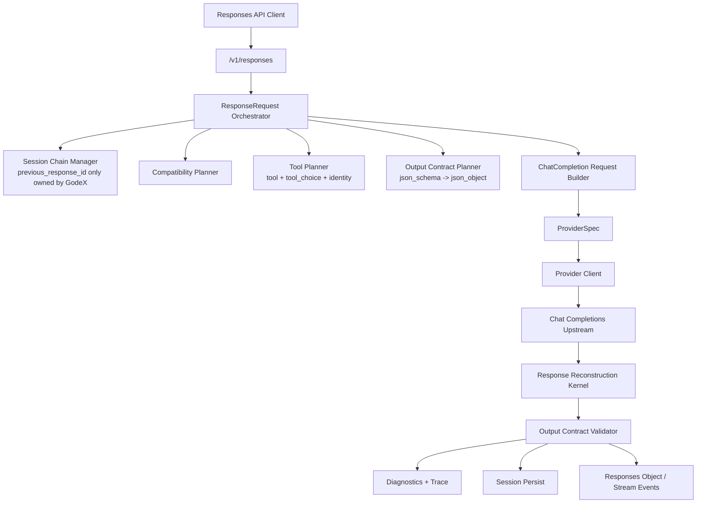
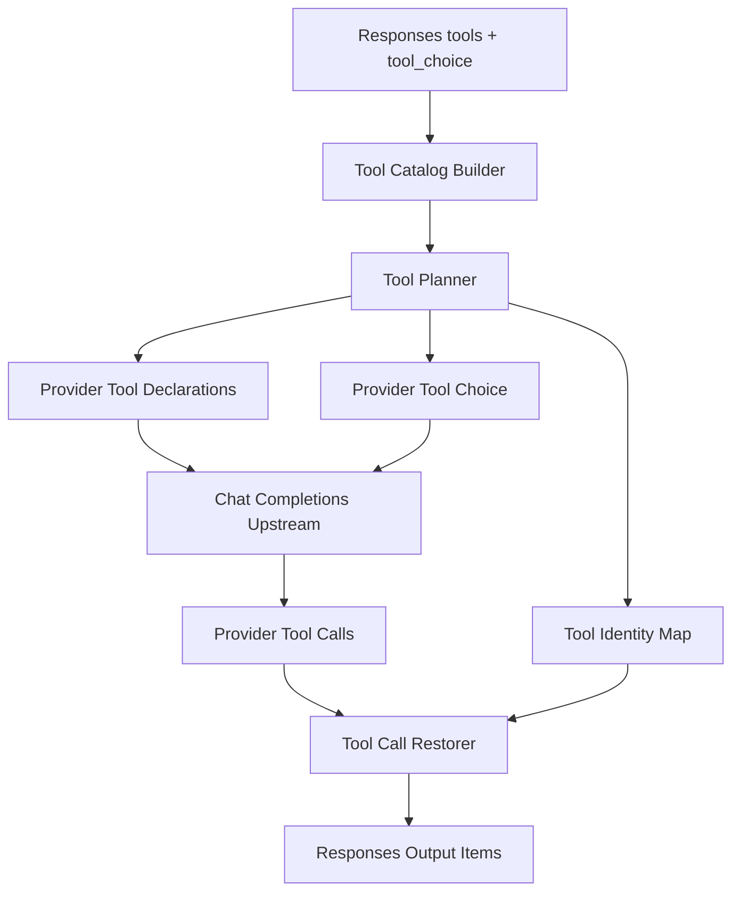
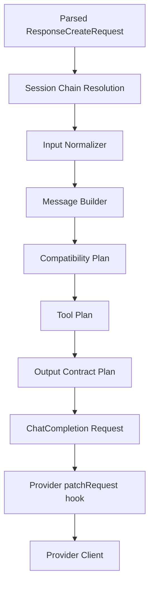
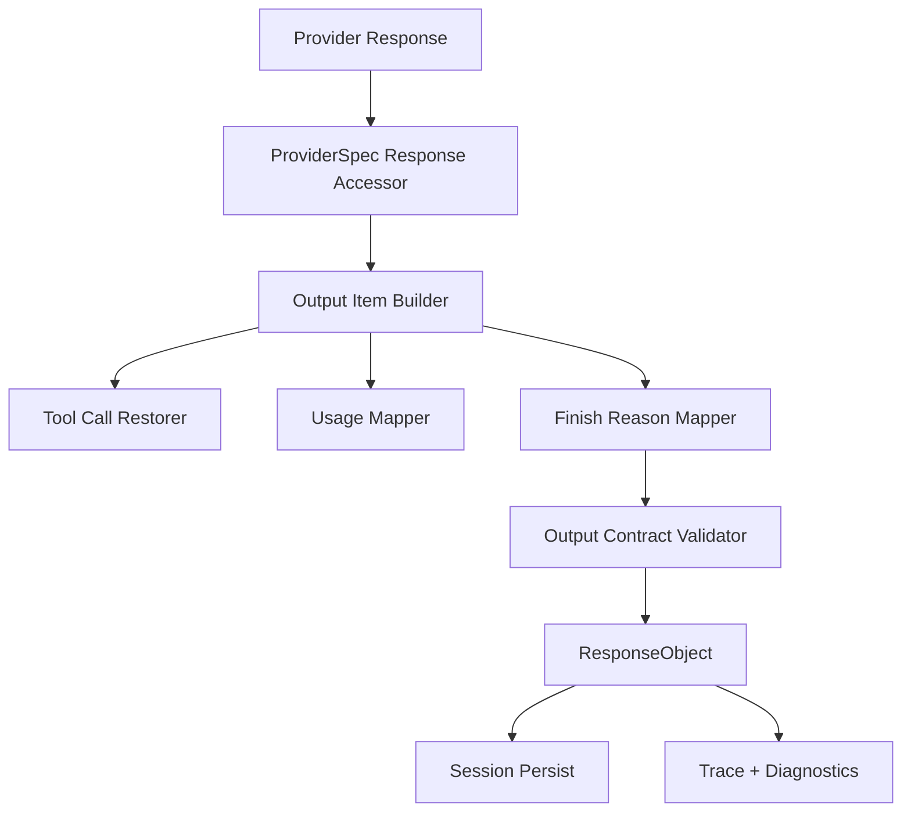

# ProviderSpec Bridge Kernel Design

## Status

Approved design from brainstorming on 2026-05-28.

This design intentionally replaces the current provider mapper architecture. The only stable external compatibility contract is the OpenAI Responses API behavior exposed by GodeX. Internal contracts, provider configuration shape, provider file structure, and existing mapper classes may be removed or rewritten.

## Goals

- Make GodeX a bridge for non-native Chat Completions upstreams only.
- Remove the OpenAI/native Responses provider concept. Responses-native upstreams should be called directly by clients.
- Replace provider mapper forests with a declarative `ProviderSpec` plus a small typed hook surface.
- Centralize compatibility policy, tool planning, output contract handling, session ownership, stream state, diagnostics, and trace in a Bridge Kernel.
- Make tools a first-class subsystem with explicit planning, identity, declaration rendering, choice mapping, and call restoration.
- Drive Responses SSE output from a state machine, not provider-specific event assembly.
- Treat live E2E against real provider APIs as the final compatibility acceptance suite.
- Add hard structure conformance so new providers cannot recreate `mapper/` directories.

## Non-Goals

- No runtime compatibility for the legacy provider config shape.
- No dual runtime path for old provider mappers and new ProviderSpec providers.
- No OpenAI provider or native Responses target inside GodeX.
- No mocked upstream as final E2E acceptance evidence. Mocked tests remain useful only below the final E2E layer.

## Confirmed Decisions

- Refactor boundary: only Responses API behavior remains stable. Code and config can break.
- Legacy provider config: reject at startup with a clear migration error.
- Provider shape: declarative `ProviderSpec` plus small typed hooks.
- Tool policy: downgrade when safe; reject explicit tool or `tool_choice` requirements that cannot be satisfied; ignore non-explicit unsupported tools only with diagnostics.
- Migration rhythm: one-time replacement of the main path, not dual-track migration.
- First provider scope: Zhipu, DeepSeek, and an example provider/spec fixture.
- Provider structure: hard conformance test forbids provider `mapper/` directories.
- E2E acceptance: live provider APIs with real API keys, plus diagnostics and trace assertions.
- SSE: stream output must be governed by an explicit state machine.

## Target Architecture



The Bridge Kernel owns policy. Providers are edge adapters that describe an upstream dialect and transport. Provider code must not decide Responses compatibility policy, session behavior, output validation behavior, or diagnostics semantics.

## ProviderSpec Model

Each provider is reduced to a small edge package:

```text
src/providers/<name>/
├── spec.ts
├── client.ts
├── index.ts
└── hooks.ts        # optional
```

Forbidden provider shape:

```text
src/providers/<name>/mapper/
src/providers/<name>/mapper/compatibility.ts
src/providers/<name>/mapper/request-options.ts
src/providers/<name>/mapper/response-output.ts
src/providers/<name>/mapper/stream-delta.ts
src/providers/<name>/mapper/tool-calls.ts
```

Draft interface:

```ts
interface ProviderSpec<TRequest, TResponse, TChunk> {
	name: string;
	protocol: "chat_completions";
	capabilities: ProviderCapabilities;
	dialect: ChatCompletionsDialect;
	endpoint: ProviderEndpointSpec;
	auth: ProviderAuthSpec;
	codecs: {
		toolName: ToolNameCodec;
		toolCallId?: ToolCallIdCodec;
	};
	accessors: {
		response: ChatCompletionResponseAccessor<TResponse>;
		stream: ChatCompletionStreamAccessor<TChunk>;
		usage: UsageAccessor<TResponse | TChunk>;
	};
	hooks?: {
		patchRequest?: ProviderRequestHook<TRequest>;
		patchMessages?: ProviderMessagesHook;
		normalizeResponse?: ProviderResponseHook<TResponse>;
		normalizeChunk?: ProviderChunkHook<TChunk>;
	};
}
```

`spec.ts` declares provider capabilities and protocol differences. `client.ts` owns HTTP, auth, timeout, and SSE transport. Optional hooks handle provider quirks such as thinking/reasoning fields, stream usage chunks, or small request patches.

Provider hooks are sandboxed. They may normalize provider-specific shapes, but they may not emit Responses objects, Responses SSE events, compatibility diagnostics, or session decisions directly.

## Runtime Provider Configuration

Legacy provider config is replaced by spec-based provider declarations. Runtime config references a provider spec and supplies deployment-specific values such as credentials and endpoint overrides.

Example shape:

```yaml
default_provider: zhipu
providers:
  zhipu:
    spec: builtin:zhipu
    credentials:
      api_key: ${ZHIPU_API_KEY}
    endpoint:
      base_url: https://open.bigmodel.cn/api/paas/v4
  deepseek:
    spec: builtin:deepseek
    credentials:
      api_key: ${DEEPSEEK_API_KEY}
    endpoint:
      base_url: https://api.deepseek.com
```

`ProviderSpec` defines behavior. Runtime config supplies environment-specific wiring. A provider config without `spec` is treated as legacy and fails startup.

## Bridge Kernel Components

```text
src/bridge/
├── compatibility/
├── request/
├── response/
├── stream/
├── tools/
├── output/
├── observation/
└── provider-spec/
```

Primary responsibilities:

- `compatibility/`: plan ignored, degraded, rejected, and provider-patched decisions from Responses request plus provider capabilities.
- `request/`: build Chat Completions messages, options, tools, tool choice, output format, and provider request.
- `response/`: reconstruct Responses output, usage, finish status, incomplete details, and failed responses from provider accessors.
- `stream/`: normalize provider stream deltas through a Responses stream state machine.
- `tools/`: plan tools and tool choice, render declarations, maintain identity maps, restore provider tool calls.
- `output/`: plan `json_schema -> json_object` degradation and validate strict final output.
- `observation/`: emit compatibility observations to diagnostics, trace, and logs.
- `provider-spec/`: validate provider spec shape and construct the runtime provider edge.

## Tool Architecture

Tool support is a first-class subsystem.



Rules:

- `tool_choice: "none"` explicitly disables tools. The provider request must not send `tools` or `tool_choice`.
- `tool_choice: "auto"` maps to the provider-compatible auto behavior.
- `tool_choice: "required"` degrades to the closest provider-compatible behavior only when the provider cannot express required directly, with a degraded diagnostic.
- Explicit tool choice must fail before upstream when the chosen tool cannot be declared.
- Unsupported non-explicit tools may be ignored only with diagnostics.
- Built-in Codex tools, custom tools, and namespace tools may downgrade to function-style declarations when the provider capability allows it.
- Tool name sanitization and namespace flattening must be reversible through `ToolIdentityMap`.
- Provider tool calls are restored to original Responses tool output items when identity exists. Only unresolvable calls fall back to generic function calls.

Proposed modules:

```text
src/bridge/tools/
├── tool-catalog.ts
├── tool-plan.ts
├── tool-choice.ts
├── tool-identity.ts
├── declaration-renderer.ts
└── call-restorer.ts
```

## Request Kernel



Request Kernel owns:

- `instructions`, current input, and session history to chat messages.
- Responses options to provider options.
- Tool plan to provider tool declarations and tool choice.
- Output contract plan to provider `response_format`.
- Diagnostics and trace decisions.
- Final provider request hook application.

`previous_response_id` never leaves the Bridge Kernel as an upstream field. Providers only receive ordinary chat messages.

## Response Kernel



Response Kernel owns:

- Choice and message extraction through provider accessors.
- Output item reconstruction.
- Tool call restoration.
- Usage mapping, including explicit zero values such as cached token counts.
- Finish reason mapping to completed, incomplete, or failed Responses states.
- Output contract validation before success is returned or persisted.

## Stream Kernel and State Machine

Providers do not emit Responses SSE events. Provider stream hooks emit normalized deltas:

```ts
interface ProviderStreamDelta {
	text?: string;
	reasoning?: string;
	refusal?: string;
	toolCall?: ToolCallDelta;
	usage?: ResponseUsage;
	finishReason?: ProviderFinishReason;
	error?: ProviderStreamError;
}
```

The Bridge Kernel owns `ResponseStreamStateMachine`.

Response lifecycle:

```text
IDLE -> CREATED -> IN_PROGRESS -> COMPLETED
                             \-> INCOMPLETE
                             \-> FAILED
```

Output lifecycle:

```text
OUTPUT_IDLE -> ITEM_OPEN -> PART_OPEN -> DELTA* -> PART_DONE -> ITEM_DONE
```

Hard responsibilities:

- Event ordering: guarantee `response.created -> response.in_progress -> output events -> one terminal event`.
- Nested lifecycle: own message, reasoning, refusal, and tool item/part open, delta, done, and close behavior.
- Terminal validation: run strict output contract validation before terminal event emission and session persistence.
- Provider sandbox: provider stream hooks return only normalized deltas and cannot emit raw Responses SSE events.

The state machine must handle provider chunk irregularities such as usage-only chunks, usage chunks after finish, tool arguments before function name, empty deltas, stream errors before first content, and provider errors after partial content.

## Output Contract

`json_schema` is degraded to `json_object` only when the provider declares that degradation. When the original request has strict schema behavior, GodeX validates that the final output text is valid JSON.

For sync responses, invalid strict output is a GodeX compatibility error, not a successful `ResponseObject`. The error code must identify output contract failure, for example `adapter.response.invalid_output_format`.

For stream responses, validation happens before the terminal event. Invalid strict output must emit a failed terminal response instead of `response.completed`.

The first target capability subset is JSON validity, not full JSON Schema validation. The schema still informs synthetic instructions for degraded providers, but strict acceptance is based on parseable JSON unless a later design expands validation.

## Observability

Each request or stream produces a compatibility observation:

```ts
interface CompatibilityObservation {
	requestId: string;
	responseId: string;
	provider: string;
	model: string;
	decisions: CompatibilityDecision[];
	toolPlan?: ToolPlanObservation;
	outputContract?: OutputContractObservation;
	streamState?: StreamStateObservation;
}
```

Observable decisions:

- `ignored`: unsupported Responses parameter safely ignored.
- `degraded`: feature mapped to a lower-fidelity provider capability.
- `rejected`: explicit requirement cannot be satisfied.
- `provider_patch`: provider hook made a provider-specific patch.
- `stream_transition`: stream state machine transition, especially terminal states.

Diagnostics explain compatibility to the request path. Trace records request, provider request, provider response or chunks, decisions, usage, and stream transitions for E2E and debugging. Logs remain operational summaries and are not the only verification source.

## Live E2E Acceptance

Final E2E means:

```text
godexClient -> GodeX /v1/responses -> real provider API -> real provider response
```

Mocked upstream tests are not final E2E. They remain valid for unit and integration layers only.

Live provider matrix:

```text
ZHIPU_API_KEY
DEEPSEEK_API_KEY
```

Acceptance cases run through `godexClient`:

- sync text
- stream lifecycle with state-machine assertions
- `previous_response_id` session chain
- `tool_choice: "none"`
- tool downgrade behavior
- explicit unsupported tool choice rejected before upstream
- `json_schema` strict valid output
- `json_schema` strict invalid output handling
- unsupported Responses parameters diagnostics
- usage preservation, including explicit zero-valued usage fields when providers return them
- trace records compatibility decisions

Cases that should fail before upstream must assert no provider request was sent. Cases that depend on provider behavior must hit the real provider API.

When API keys are missing, live E2E must explicitly skip with a clear message. A skipped live suite is not final acceptance evidence.

## Migration and Deletion Plan

Delete or replace:

```text
src/providers/*/mapper/
ProviderMapper as provider assembly contract
ChatRequestMapper / ChatResponseMapper / ChatStreamMapper as provider entrypoints
provider-specific compatibility negotiators
provider-specific tool mappers
legacy provider config runtime support
```

Move or preserve as Bridge Kernel capabilities:

```text
session chain -> Request Kernel
stream lifecycle -> ResponseStreamStateMachine
output format contract -> Output Contract Kernel
tool identity and restoration -> Tool Kernel
provider HTTP transport -> Provider Client
```

Legacy config startup failure:

```text
Legacy provider config is no longer supported.
GodeX now requires ProviderSpec-based provider declarations.
```

## Conformance Gates

Provider structure conformance:

- Built-in providers may not contain `mapper/`.
- Provider package must expose `spec.ts`, `client.ts`, and `index.ts`.
- Optional provider `hooks.ts` is allowed.
- Example provider/spec fixture proves low provider onboarding cost.

Runtime conformance:

- Main path uses Bridge Kernel plus ProviderSpec only.
- Provider code does not own compatibility strategy.
- SSE output is state-machine driven.
- Tool planning and restoration flow through Tool Kernel.
- Output contract validation gates strict degraded outputs.
- Live E2E matrix passes against real providers.
- `rg` checks confirm old mapper factory names and provider mapper imports are gone.

## Testing Strategy

Unit tests:

- compatibility planner
- tool planner and tool choice planner
- tool identity and call restoration
- output contract planner and validator
- request builder
- response reconstruction
- stream state machine
- provider spec validation

Integration tests:

- provider accessor and hook fixtures
- provider client transport with deterministic HTTP fixtures
- example provider/spec fixture

Live E2E:

- Zhipu with `ZHIPU_API_KEY`
- DeepSeek with `DEEPSEEK_API_KEY`
- diagnostics and trace assertions included
- no mocked upstream for final acceptance

Verification gates:

```bash
bun run check
bun run test:e2e
git diff --check
```

## Definition of Done

- The runtime main path only uses Bridge Kernel plus ProviderSpec.
- Zhipu and DeepSeek are migrated to provider edge packages without `mapper/`.
- OpenAI/native Responses provider is absent.
- Legacy provider config fails clearly.
- `previous_response_id` remains owned by GodeX and is never forwarded upstream.
- Tools are planned, downgraded, rejected, declared, and restored through Tool Kernel.
- Responses SSE is emitted by `ResponseStreamStateMachine`.
- Strict degraded JSON output is validated before success or terminal completion.
- Diagnostics and trace expose compatibility decisions.
- Live E2E passes against real Zhipu and DeepSeek APIs when keys are present.
- Provider structure conformance prevents mapper forest regression.
