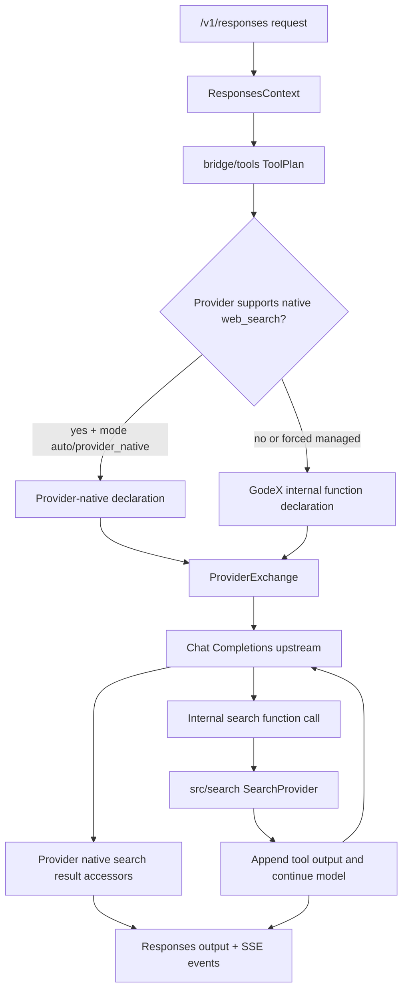

# Web Search Built-In Support Design

## Goal

Add built-in web search support to GodeX in two compatible paths:

1. Provider-native passthrough for providers that support web search directly, starting with Zhipu.
2. GodeX-managed hosted search for providers that only support function tools, using a pluggable `SearchProvider` and an internal model continuation loop.

The default behavior favors compatibility with Codex-style clients: if a request needs GodeX-managed search but no search backend is available, GodeX returns a client-executable tool call by default instead of silently pretending search happened.

## Non-Goals

- Do not add a real third-party search integration in the first implementation.
- Do not add a new runtime dependency for search.
- Do not change `ProviderSpec` or `ProviderEdge` contracts unless implementation proves there is no cleaner accessor-based alternative.
- Do not recreate adapter-era mapper forests or duplicate compatibility policy in provider hooks.
- Do not support arbitrary browser automation, page rendering, or crawling beyond search-result snippets in the first implementation.

## Current Context

The repository already has partial web search shape support:

- `src/protocol/openai/responses/tools.ts` defines `web_search`, `web_search_2025_08_26`, `web_search_preview`, and `web_search_preview_2025_03_11` request tools.
- `src/protocol/openai/responses/tool-items.ts` defines `web_search_call` output items.
- `src/protocol/openai/responses/stream.ts` defines `response.web_search_call.*` SSE event names.
- `src/bridge/tools/declaration-renderer.ts` can render a Zhipu-style native `web_search` declaration.
- `src/providers/zhipu/hooks.ts` maps preview web search tool types to provider `web_search`.
- `src/tools/builtin.ts` intentionally does not expose `web_search` as a built-in function tool today.

The main missing pieces are response reconstruction for provider-native search results and a hosted search loop for non-native providers.

## Configuration

Add a top-level `web_search` config section:

```yaml
web_search:
  enabled: true
  mode: auto
  provider: none
  on_unavailable: client_tool_call
  max_iterations: 2
  timeout_ms: 10000
```

Config fields:

- `enabled`: `true | false`, default `true`.
- `mode`: `auto | provider_native | godex_managed | disabled`, default `auto`.
- `provider`: `none | mock | tavily | brave | serpapi | openai`, default `none`. First implementation accepts only `none` and test-only `mock`; real external providers are reserved names and should fail validation until implemented.
- `on_unavailable`: `client_tool_call | fail | ignore`, default `client_tool_call`.
- `max_iterations`: positive integer, default `2`.
- `timeout_ms`: positive integer, default `10000`.

Semantics:

- `auto` uses provider-native search when the selected provider supports it; otherwise it tries GodeX-managed search.
- `provider_native` never injects GodeX-managed tools. If the provider cannot support native web search, use `on_unavailable`.
- `godex_managed` forces GodeX-managed execution even when a provider has native search, useful for deterministic tests and future provider parity.
- `disabled` treats web search tools as unavailable and applies `on_unavailable`.

## Architecture



Responsibilities:

- `src/bridge/tools` decides whether a web search request is supported natively, mapped to a provider-native declaration, mapped to an internal function declaration, ignored, or rejected.
- `src/search` defines the search execution interface and backend registry.
- `src/responses` owns the hosted tool loop: detecting internal calls, executing search, appending tool outputs, repeating provider calls, and producing final Responses objects or SSE events.
- Provider folders expose protocol-specific search result extraction behind accessors or hooks. The bridge must not inspect provider-private response fields directly.
- `src/config` parses the new top-level configuration and `ApplicationContext` exposes the configured search service.

## Search Provider Boundary

Create `src/search/` with small, provider-neutral contracts:

```ts
export interface SearchProvider {
  readonly name: string;
  search(request: SearchRequest, signal?: AbortSignal): Promise<SearchResponse>;
}

export interface SearchRequest {
  readonly query: string;
  readonly queries?: readonly string[];
  readonly allowedDomains?: readonly string[];
  readonly contextSize: "low" | "medium" | "high";
  readonly contentTypes: readonly ("text" | "image")[];
  readonly userLocation?: unknown;
}

export interface SearchResult {
  readonly title?: string;
  readonly url: string;
  readonly snippet?: string;
  readonly publishedAt?: string;
}

export interface SearchResponse {
  readonly query: string;
  readonly results: readonly SearchResult[];
}
```

First implementation:

- `none`: no executable backend.
- `mock`: test-only deterministic backend, not emitted by `godex init` unless tests need it.

The schema can reserve future provider IDs now, but the parser should reject unsupported real IDs until their implementations exist. That keeps generated examples honest while avoiding another schema migration when real backends are added.

## Tool Planning

Provider-native path:

- Keep current Zhipu mapping from `web_search_preview*` to provider `web_search`.
- Extend response accessors so provider-native search artifacts become standard `web_search_call` items.
- Keep provider-specific knobs such as Zhipu `search_engine` and `content_size` behind provider declaration rendering or hooks.

GodeX-managed path:

- Add an internal provider-visible function tool, for example `godex_web_search`.
- The original requested type remains `web_search` or `web_search_preview` in the tool identity map.
- The function schema should be strict and minimal:

```json
{
  "type": "object",
  "properties": {
    "query": { "type": "string" },
    "queries": { "type": "array", "items": { "type": "string" } }
  },
  "required": ["query"],
  "additionalProperties": false
}
```

Do not add `web_search` to `src/tools/builtin.ts` as a normal Codex function tool. It is a hosted bridge capability, not a user-facing executable tool like `shell` or `apply_patch`.

## Sync Flow

For provider-native search:

1. Build provider request with native search declaration.
2. Send one upstream request.
3. Reconstruct normal assistant output plus any provider-native `web_search_call` output items.
4. Record trace request, usage, diagnostics, and session as today.

For GodeX-managed search:

1. Build provider request with the internal search function declaration.
2. Send upstream request.
3. If response has no internal search call, reconstruct final response normally.
4. If response has an internal search call:
   - Convert the provider function call to a `web_search_call` output item with `status: "searching"`.
   - Execute `SearchProvider.search()`.
   - Convert results into a tool output message for the continuation request and a completed `web_search_call` item for the final Responses output.
   - Append assistant tool-call and tool-output messages to the next upstream request.
   - Repeat until final assistant output or `max_iterations`.
5. If `max_iterations` is exceeded, return an incomplete or failed response using a `BridgeError` domain code, depending on whether a final answer exists.

The loop must create new provider requests inside `src/responses`, not mutate the original `ResponsesContext.request`. The original request echo fields should remain the client's request, while internal continuation state stays local to the pipeline.

## Stream Flow

For provider-native search:

1. Provider stream connects as today.
2. Provider deltas are mapped through the existing state machine.
3. Provider-native web search artifacts are converted to:
   - `response.output_item.added` with a `web_search_call`
   - `response.web_search_call.in_progress`
   - `response.web_search_call.searching`
   - `response.web_search_call.completed` or `response.web_search_call.failed`
   - `response.output_item.done`
4. Final assistant text continues through existing text events.

For GodeX-managed search:

1. Start the response stream and bridge upstream events.
2. If the upstream emits an internal search function call, do not expose it as a public `function_call`.
3. Emit a public `web_search_call` item and `in_progress` / `searching` events.
4. Execute `SearchProvider.search()` with timeout.
5. Emit completed or failed web-search events.
6. Open the continuation upstream stream with tool output messages appended.
7. Pipe continuation deltas into the same client stream and finish once the final model answer completes.

The stream implementation should avoid stacking existing transformers around each continuation stream. Instead, create a hosted-search stream orchestrator that emits final `ResponseStreamEvent` objects, then passes through the existing validation, trace, logging, session persistence, and compatibility transformers once.

## Output Shape

`web_search_call` items should use the existing protocol type:

```json
{
  "id": "ws_<response_id>_<n>",
  "type": "web_search_call",
  "status": "completed",
  "action": {
    "type": "search",
    "query": "latest bun release",
    "queries": ["latest bun release"],
    "sources": [
      { "type": "url", "url": "https://example.com" }
    ]
  }
}
```

Search result snippets are not currently represented on `WebSearchCall`. If `include` asks for `web_search_call.results`, extend local protocol types only after checking the OpenAI-compatible shape used by current client fixtures. Until then, include URLs in `action.sources` and provide search result text to the model through the internal tool output.

## Error Handling

Use the existing `GodeXError` hierarchy.

- Config parse errors use existing config validation style.
- Unsupported web search mode or backend uses `ServerError` during config load.
- Runtime incompatibility uses `BridgeError`.
- Search backend fetch or timeout failures use `ProviderError` only if the failing backend is an external provider; otherwise use `BridgeError` for hosted search execution failure.

`on_unavailable` behavior:

- `client_tool_call`: default. Return a client-executable `function_call` with a stable name such as `web_search` and JSON arguments from the model request when no search backend is configured or executable. Do not emit a completed `web_search_call`, because GodeX did not execute the search.
- `fail`: fail before or during request planning with a structured `BridgeError`.
- `ignore`: skip the search declaration and add compatibility diagnostics. This is for compatibility escape hatches only.

If a configured `SearchProvider` fails during execution, do not fall back to `client_tool_call` mid-loop by default. Emit a failed `web_search_call` and fail the response, because a model continuation may already depend on the hosted result.

## Trace And Diagnostics

Add trace events that do not duplicate payload-heavy request rows:

- `web_search.call.planned`
- `web_search.call.started`
- `web_search.call.completed`
- `web_search.call.failed`
- `web_search.continuation.started`
- `web_search.continuation.completed`

Payload capture should respect existing trace payload settings. Captured search snippets and URLs should be treated as sensitive, like existing request payloads.

Compatibility diagnostics:

- Warn when `web_search` is degraded to GodeX-managed hosted search.
- Warn when unavailable search falls back to `client_tool_call`.
- Warn when `ignore` skips requested web search.
- Error when `fail` rejects unavailable search.

## Sessions

Persist API-shaped output items:

- Provider-native and GodeX-managed completed search calls should be stored as `web_search_call` items.
- Internal function calls and internal tool output messages should not leak into stored Responses output unless `on_unavailable=client_tool_call` intentionally exposes a client-visible `function_call`.
- Continuation history used to call providers can be derived from the response output plus request-local internal messages. If that becomes ambiguous, store internal continuation messages only in request-local pipeline state, not in session snapshots.

## Testing

Unit tests:

- Config parser defaults and validation for `web_search`.
- Tool planning for native, managed, disabled, unavailable, and explicit `tool_choice` cases.
- Internal web search function declaration schema.
- SearchProvider registry selection and timeout behavior.
- Sync hosted loop: no call, one call, max iterations, backend failure, unavailable fallback.
- Stream hosted loop: event order, continuation text, backend failure, max iterations.
- Zhipu provider-native result extraction behind provider accessors.
- Conformance tests proving `tool_search` remains non-callable and `web_search` is not exposed as a normal built-in function.

E2E tests:

- Zhipu mock upstream receives native `web_search` declaration and response includes `web_search_call`.
- DeepSeek or MiniMax mock upstream receives internal search function declaration, then receives continuation messages after mock search.
- Streaming route emits `web_search_call` lifecycle events before final text.
- `on_unavailable=client_tool_call` returns a client-visible `function_call` without executing search.
- `on_unavailable=fail` returns structured error.

Verification:

- `bun run check`
- `bun run test:e2e`
- `git diff --check`

## Rollout

Recommended implementation order:

1. Add `web_search` config schema, parser, defaults, and runtime service injection.
2. Add `src/search` interfaces, registry, `none`, and test `mock` provider.
3. Add tool planning support for managed web search without changing response loops.
4. Add sync hosted loop and tests.
5. Add stream hosted loop and tests.
6. Add provider-native Zhipu result extraction and stream mapping.
7. Update docs, examples, and compatibility notes.

This is one feature area but should be split into small commits. The first mergeable slice can be config plus planning and unavailable fallback; hosted sync and hosted stream can follow as separate slices if needed.
