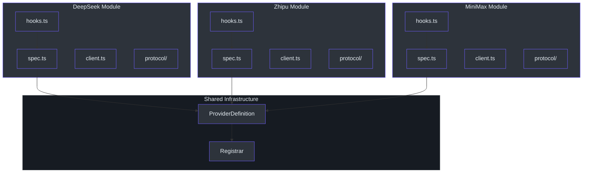
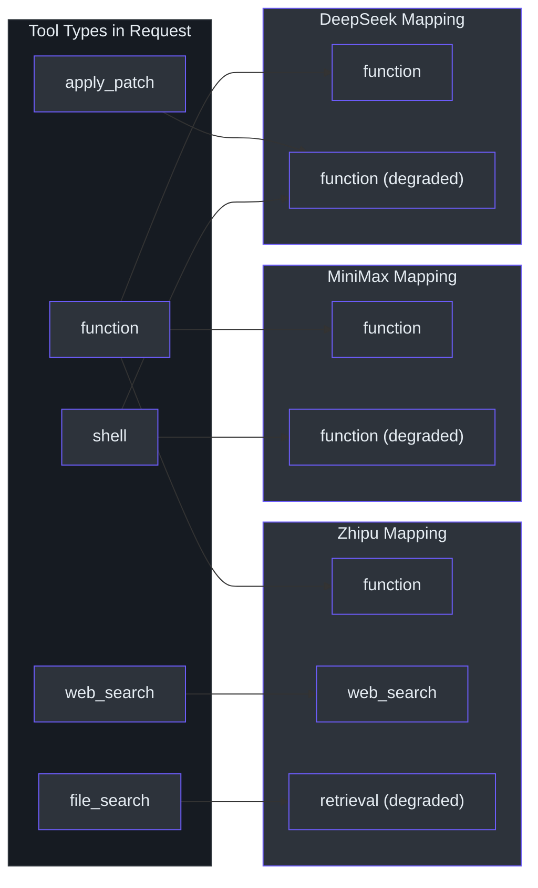
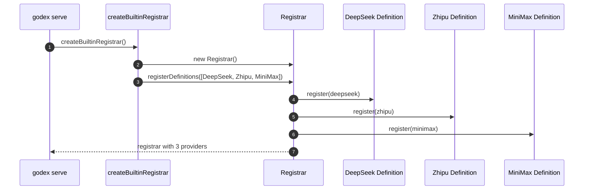

# Built-in Providers

GodeX ships with three built-in providers that cover the most popular non-OpenAI LLM platforms. Each provider is a self-contained module that declares its capabilities, translates requests via hooks, and maps responses back into the standard Chat Completions accessors. Adding a new provider follows the same pattern -- implement a `ProviderSpec`, write hooks for request patching and response normalization, and register it with the `Registrar`.

## At a Glance

| Feature | DeepSeek | Zhipu | MiniMax |
|---|---|---|---|
| **Spec Name** | `deepseek` | `zhipu` | `minimax` |
| **Default Base URL** | `api.deepseek.com` | `open.bigmodel.cn` (coding plan) | `api.minimaxi.com/v1` |
| **Default Model** | `deepseek-v4-pro` | `glm-5.1` | `MiniMax-M2.7` |
| **Reasoning Effort** | `native` | `boolean` | `none` |
| **Max Tools** | 128 | 128 | 128 |
| **Response Formats** | text, json_object | text, json_object | text, json_object |
| **Streaming Usage** | Yes | Yes | Yes |
| **Cached Tokens** | Yes | Yes | Yes |

## Provider Architecture

Every provider follows the same structural pattern: a `spec.ts` declares capabilities and creates the `ProviderSpec`, a `hooks.ts` implements request patching and response/stream accessors, a `client.ts` creates the `ProviderEdge` for making HTTP calls, and a `protocol/` directory contains provider-specific DTO types.

All providers are registered at startup via `createBuiltinRegistrar` ([src/providers/builtin.ts:49-55](https://github.com/Ahoo-Wang/GodeX/blob/main/src/providers/builtin.ts#L49-L55)), which creates a `Registrar` and registers each `ProviderDefinition`.

## Tool Capabilities Comparison

Each provider declares which tool types it supports and which ones must be **degraded** to a simpler form. Degradation means GodeX automatically converts an unsupported tool type into the nearest compatible type before sending it to the provider.

| Tool Type | DeepSeek | Zhipu | MiniMax |
|---|---|---|---|
| `function` | Supported | Supported | Supported |
| `local_shell` | Degraded to `function` | Degraded to `function` | Degraded to `function` |
| `shell` | Degraded to `function` | Degraded to `function` | Degraded to `function` |
| `apply_patch` | Degraded to `function` | Degraded to `function` | Degraded to `function` |
| `custom` | Degraded to `function` | Degraded to `function` | Degraded to `function` |
| `tool_search` | Degraded to `function` | Degraded to `function` | Degraded to `function` |
| `namespace` | Degraded to `function` | Degraded to `function` | Degraded to `function` |
| `web_search` | - | Supported | - |
| `web_search_preview` | - | Degraded to `web_search` | - |
| `file_search` | - | Degraded to `retrieval` | - |
| `mcp` | - | Supported | - |

## Reasoning Support

Each provider handles reasoning (chain-of-thought) differently. The compatibility plan in the bridge kernel maps the incoming `reasoning_effort` to the provider-specific representation.

| Provider | Effort Type | Behavior |
|---|---|---|
| DeepSeek | `native` | Maps `high` -> `high`, `xhigh` -> `max`. Adds `thinking: {type: "enabled"}` to the request. |
| Zhipu | `boolean` | Adds `thinking: {type: "enabled", clear_thinking: false}` when reasoning content is detected. |
| MiniMax | `none` | Strips `reasoning_effort` entirely; reasoning is not supported. |

DeepSeek's `deepSeekPatchRequest` handles this mapping in [src/providers/deepseek/hooks.ts:113-136](https://github.com/Ahoo-Wang/GodeX/blob/main/src/providers/deepseek/hooks.ts#L113-L136), while Zhipu's equivalent is in [src/providers/zhipu/hooks.ts:113-134](https://github.com/Ahoo-Wang/GodeX/blob/main/src/providers/zhipu/hooks.ts#L113-L134).

## Tool Choice Support

| Provider | Supported Tool Choice Values |
|---|---|
| DeepSeek | `auto`, `none`, `required`, `function` |
| Zhipu | `auto`, `none` |
| MiniMax | `auto`, `none`, `required`, `function` |

## Provider Definition Registration

Each provider is wrapped in a `ProviderDefinition` that pairs the provider name with a factory function. The definitions are collected in `BUILTIN_PROVIDER_DEFINITIONS` and registered at startup ([src/providers/builtin.ts:22-41](https://github.com/Ahoo-Wang/GodeX/blob/main/src/providers/builtin.ts#L22-L41)).

The `ProviderDefinition` interface, defined in [src/providers/definition.ts:6-11](https://github.com/Ahoo-Wang/GodeX/blob/main/src/providers/definition.ts#L6-L11), requires a `name` and a `create` factory function that produces a `ProviderEdge` from a `ProviderRuntimeConfig`.

## Provider Specs

### DeepSeek

The DeepSeek spec targets the standard Chat Completions API at `https://api.deepseek.com` ([src/providers/deepseek/spec.ts:24-54](https://github.com/Ahoo-Wang/GodeX/blob/main/src/providers/deepseek/spec.ts#L24-L54)).

| Property | Value |
|---|---|
| Name | `deepseek` |
| Protocol | `chat_completions` |
| Default Base URL | `https://api.deepseek.com` |
| Default Model | `deepseek-v4-pro` |
| Auth | Bearer |
| Reasoning | Native effort levels |

### Zhipu

The Zhipu spec defaults to the coding plan endpoint at `https://open.bigmodel.cn/api/coding/paas/v4` ([src/providers/zhipu/spec.ts:24-57](https://github.com/Ahoo-Wang/GodeX/blob/main/src/providers/zhipu/spec.ts#L24-L57)).

| Property | Value |
|---|---|
| Name | `zhipu` |
| Protocol | `chat_completions` |
| Default Base URL | `https://open.bigmodel.cn/api/coding/paas/v4` |
| Default Model | `glm-5.1` |
| Auth | Bearer |
| Reasoning | Boolean (thinking enabled/disabled) |

### MiniMax

The MiniMax spec targets `https://api.minimaxi.com/v1` ([src/providers/minimax/spec.ts:24-54](https://github.com/Ahoo-Wang/GodeX/blob/main/src/providers/minimax/spec.ts#L24-L54)).

| Property | Value |
|---|---|
| Name | `minimax` |
| Protocol | `chat_completions` |
| Default Base URL | `https://api.minimaxi.com/v1` |
| Default Model | `MiniMax-M2.7` |
| Auth | Bearer |
| Reasoning | None |

## Next Steps

| Topic | Description |
|---|---|
| [Configuration](./configuration.md) | How to configure providers in `godex.yaml` |
| [Quick Start](./quick-start.md) | Install and make your first call |
| [Overview](./overview.md) | Architecture and design concepts |

## References

- [src/providers/builtin.ts:1-55](https://github.com/Ahoo-Wang/GodeX/blob/main/src/providers/builtin.ts#L1-L55) - Provider definitions and registrar
- [src/providers/deepseek/spec.ts:1-57](https://github.com/Ahoo-Wang/GodeX/blob/main/src/providers/deepseek/spec.ts#L1-L57) - DeepSeek spec definition
- [src/providers/deepseek/hooks.ts:18-57](https://github.com/Ahoo-Wang/GodeX/blob/main/src/providers/deepseek/hooks.ts#L18-L57) - DeepSeek capabilities and hooks
- [src/providers/zhipu/spec.ts:1-59](https://github.com/Ahoo-Wang/GodeX/blob/main/src/providers/zhipu/spec.ts#L1-L59) - Zhipu spec definition
- [src/providers/zhipu/hooks.ts:16-69](https://github.com/Ahoo-Wang/GodeX/blob/main/src/providers/zhipu/hooks.ts#L16-L69) - Zhipu capabilities and hooks
- [src/providers/minimax/spec.ts:1-57](https://github.com/Ahoo-Wang/GodeX/blob/main/src/providers/minimax/spec.ts#L1-L57) - MiniMax spec definition
- [src/providers/minimax/hooks.ts:17-54](https://github.com/Ahoo-Wang/GodeX/blob/main/src/providers/minimax/hooks.ts#L17-L54) - MiniMax capabilities and hooks
- [src/providers/definition.ts:6-29](https://github.com/Ahoo-Wang/GodeX/blob/main/src/providers/definition.ts#L6-L29) - ProviderDefinition interface
- [src/bridge/provider-spec/contract.ts:54-74](https://github.com/Ahoo-Wang/GodeX/blob/main/src/bridge/provider-spec/contract.ts#L54-L74) - ProviderSpec contract
