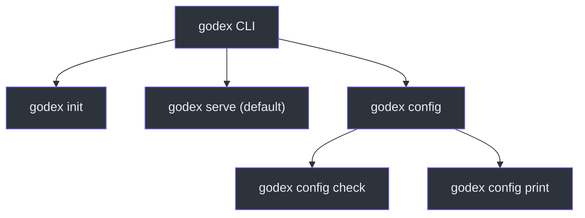
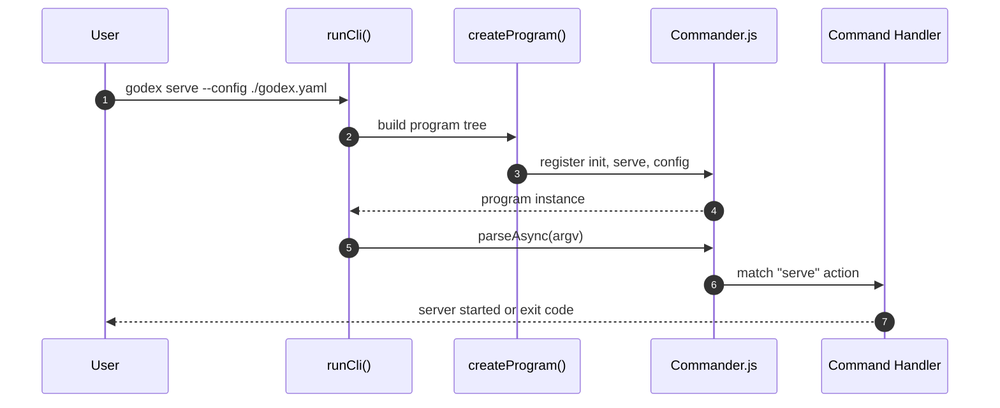
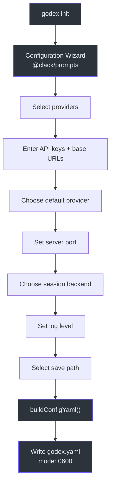
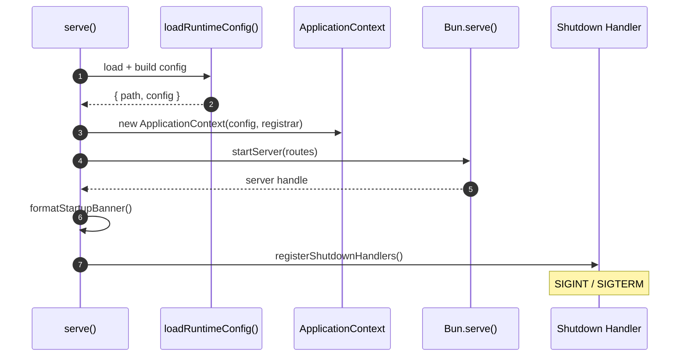

# Command-Line Interface

GodeX ships as a single `godex` binary with a focused set of commands for
bootstrapping configuration, validating settings, and running the API gateway.
The CLI is the primary operational surface for operators and CI pipelines, so
it prioritises clear error messages, sensible defaults, and an interactive
wizard that generates a working `godex.yaml` in under a minute. Understanding
the CLI structure is the first step to deploying and operating GodeX
effectively.

## At a Glance

| Aspect | Detail |
|---|---|
| Framework | Commander.js (`commander` package) |
| Entry point | `runCli()` at [src/cli/cli.ts:5-24](https://github.com/Ahoo-Wang/GodeX/blob/main/src/cli/cli.ts#L5) |
| Interactive prompts | `@clack/prompts` |
| Default command | `serve` |
| Config file | `godex.yaml` (YAML with env interpolation) |

## Command Overview



| Command | Purpose | Source |
|---|---|---|
| `godex init` | Interactive config wizard | [src/cli/commands/init.ts](https://github.com/Ahoo-Wang/GodeX/blob/main/src/cli/commands/init.ts) |
| `godex serve` | Start the API gateway | [src/cli/commands/serve.ts](https://github.com/Ahoo-Wang/GodeX/blob/main/src/cli/commands/serve.ts) |
| `godex config check` | Validate config without starting | [src/cli/commands/config.ts](https://github.com/Ahoo-Wang/GodeX/blob/main/src/cli/commands/config.ts) |
| `godex config print` | Print resolved config (secrets redacted) | [src/cli/commands/config.ts](https://github.com/Ahoo-Wang/GodeX/blob/main/src/cli/commands/config.ts) |

## CLI Execution Flow



`runCli` at
[src/cli/cli.ts:5-24](https://github.com/Ahoo-Wang/GodeX/blob/main/src/cli/cli.ts#L5)
wraps Commander's `parseAsync` with error handling that distinguishes
Commander exit codes (help, version) from unexpected errors. The program is
constructed in `createProgram` at
[src/cli/program.ts:10-30](https://github.com/Ahoo-Wang/GodeX/blob/main/src/cli/program.ts#L10),
which sets the name, description, version, and registers all three command
groups.

## init Command



The init command at
[src/cli/commands/init.ts:4-12](https://github.com/Ahoo-Wang/GodeX/blob/main/src/cli/commands/init.ts#L4)
delegates to `runInit` at
[src/cli/init/run.ts:8-22](https://github.com/Ahoo-Wang/GodeX/blob/main/src/cli/init/run.ts#L8),
which drives the interactive wizard.

### Supported Providers

The wizard offers four built-in providers defined in
[src/cli/init/providers.ts:36-65](https://github.com/Ahoo-Wang/GodeX/blob/main/src/cli/init/providers.ts#L36-L65):

| Provider | Label | Default Model | API Key Placeholder |
|---|---|---|---|
| `deepseek` | DeepSeek | `deepseek-v4-pro` | `${DEEPSEEK_API_KEY}` |
| `zhipu` | Zhipu (智谱) | `glm-5.2` | `${ZHIPU_API_KEY}` |
| `minimax` | MiniMax | `MiniMax-M3` | `${MINIMAX_API_KEY}` |
| `xiaomi` | Xiaomi (小米) | `mimo-v2.5-pro` | `${MIMO_API_KEY}` |

### Prompt Sequence

The wizard at
[src/cli/init/prompts.ts:15-59](https://github.com/Ahoo-Wang/GodeX/blob/main/src/cli/init/prompts.ts#L15)
collects:

1. **Provider selection** -- multi-select from built-in list (required)
2. **Provider configuration** -- API key + base URL per provider
3. **Default provider** -- single select (skipped if only one)
4. **Server port** -- text input, default `5678`
5. **Session backend** -- `sqlite` or `memory`
6. **Log level** -- `debug`, `info`, or `warn`

The resulting config is serialized via `buildConfigYaml` at
[src/cli/init/config-yaml.ts:6-53](https://github.com/Ahoo-Wang/GodeX/blob/main/src/cli/init/config-yaml.ts#L6)
using `js-yaml` and written with permissions `0600`.

## serve Command



The serve command at
[src/cli/serve.ts:12-62](https://github.com/Ahoo-Wang/GodeX/blob/main/src/cli/serve.ts#L12)
executes the following steps:

1. **Load config** via `loadRuntimeConfig` at
   [src/cli/runtime-config/load.ts:17-39](https://github.com/Ahoo-Wang/GodeX/blob/main/src/cli/runtime-config/load.ts#L17)
2. **Validate** provider registrations
3. **Create** `ApplicationContext`
4. **Start** the Bun HTTP server
5. **Print** the startup banner
6. **Register** SIGINT/SIGTERM shutdown handlers

### Startup Banner

`formatStartupBanner` at
[src/cli/banner.ts:14-25](https://github.com/Ahoo-Wang/GodeX/blob/main/src/cli/banner.ts#L14)
outputs:

```
GodeX v0.0.2

  address:   http://0.0.0.0:5678
  env:       prod
  config:    /etc/godex/godex.yaml
  providers: deepseek, zhipu
  session:   sqlite (/data/sessions.db)
```

### Shutdown Handling

`registerShutdownHandlers` at
[src/cli/serve.ts:64-106](https://github.com/Ahoo-Wang/GodeX/blob/main/src/cli/serve.ts#L64)
gracefully stops the server, closes the `ApplicationContext`, and exits
with code 0. A `shuttingDown` guard prevents double-shutdown on rapid
signal repeats.

## config Command

The `config` command group at
[src/cli/commands/config.ts:16-47](https://github.com/Ahoo-Wang/GodeX/blob/main/src/cli/commands/config.ts#L16)
provides two subcommands:

| Subcommand | Description |
|---|---|
| `godex config check` | Validates config + provider registration, exits on failure |
| `godex config print` | Prints fully resolved config as JSON with secrets redacted |

Both accept the same `--config`, `--port`, `--host`, and `--log-level`
options as `serve`.

## Common CLI Options

Defined in `CliOptions` at
[src/cli/runtime-config/options.ts:3-8](https://github.com/Ahoo-Wang/GodeX/blob/main/src/cli/runtime-config/options.ts#L3):

| Option | Applies To | Description |
|---|---|---|
| `--config <path>` | serve, config | Path to `godex.yaml` |
| `--port <number>` | serve, config | Override server port (1-65535) |
| `--host <address>` | serve, config | Override bind address |
| `--log-level <level>` | serve, config | Override log level |

## Cross-References

- [Installation & Setup](./installation-setup.md) -- installing the CLI binary
- [Server Routes](../02-architecture/server-routes.md) -- what `serve` exposes
- [Configuration Schema](../07-configuration/config-schema.md) -- full godex.yaml reference
- [Logging](../07-configuration/logging.md) -- log level configuration
- [Deployment](../09-deployment/deployment.md) -- Docker and native binary distribution

## References

- [src/cli/cli.ts](https://github.com/Ahoo-Wang/GodeX/blob/main/src/cli/cli.ts) -- CLI entry point
- [src/cli/program.ts](https://github.com/Ahoo-Wang/GodeX/blob/main/src/cli/program.ts) -- Commander program setup
- [src/cli/commands/init.ts](https://github.com/Ahoo-Wang/GodeX/blob/main/src/cli/commands/init.ts) -- init command registration
- [src/cli/commands/serve.ts](https://github.com/Ahoo-Wang/GodeX/blob/main/src/cli/commands/serve.ts) -- serve command registration
- [src/cli/commands/config.ts](https://github.com/Ahoo-Wang/GodeX/blob/main/src/cli/commands/config.ts) -- config command group
- [src/cli/serve.ts](https://github.com/Ahoo-Wang/GodeX/blob/main/src/cli/serve.ts) -- serve implementation and shutdown handlers
- [src/cli/banner.ts](https://github.com/Ahoo-Wang/GodeX/blob/main/src/cli/banner.ts) -- startup banner formatting
- [src/cli/init/run.ts](https://github.com/Ahoo-Wang/GodeX/blob/main/src/cli/init/run.ts) -- init wizard runner
- [src/cli/init/prompts.ts](https://github.com/Ahoo-Wang/GodeX/blob/main/src/cli/init/prompts.ts) -- interactive prompt sequence
- [src/cli/init/config-yaml.ts](https://github.com/Ahoo-Wang/GodeX/blob/main/src/cli/init/config-yaml.ts) -- YAML config builder
- [src/cli/init/providers.ts](https://github.com/Ahoo-Wang/GodeX/blob/main/src/cli/init/providers.ts) -- built-in provider definitions
