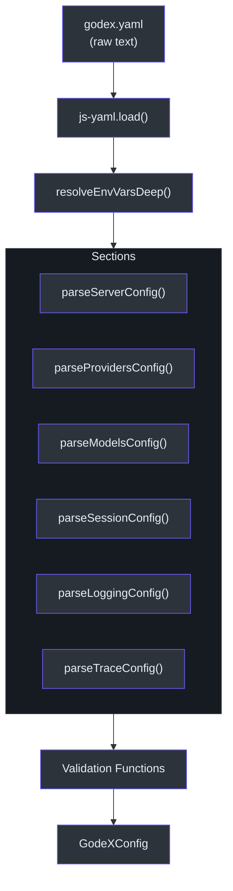
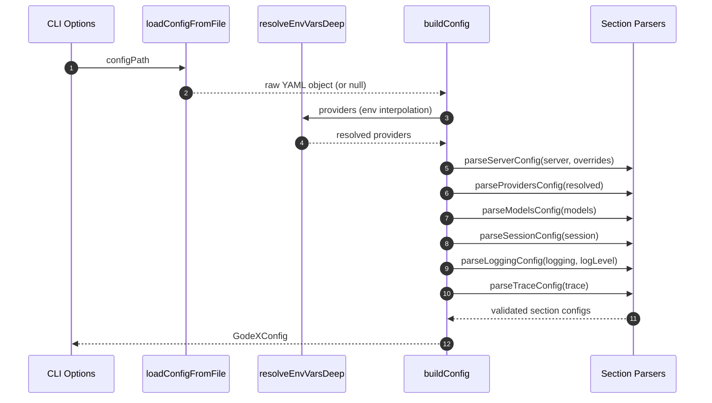
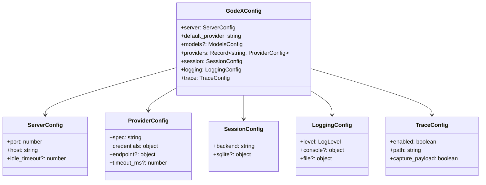

# Configuration

GodeX is configured through a single YAML file, typically named `godex.yaml`. The configuration file controls every aspect of the gateway: which port to listen on, which providers to enable, how sessions are stored, what gets logged, and how traces are recorded. The system reads the file, interpolates environment variables, applies CLI overrides, and validates every field before the server starts.

## At a Glance

| Section | Purpose | Required |
|---|---|---|
| `server` | Listen address, port, idle timeout | Yes (has defaults) |
| `default_provider` | Provider used when model omits prefix | Yes |
| `providers` | Map of provider name to config | Yes |
| `models` | Model aliases and wildcard mapping | No |
| `session` | Conversation history backend | Yes (has defaults) |
| `logging` | Log level, console, and file output | Yes (has defaults) |
| `trace` | Request/response tracing | Yes (has defaults) |

## Config Loading Pipeline

The raw YAML file passes through a multi-stage pipeline before becoming the validated `GodeXConfig` object that the rest of the system consumes ([src/config/builder.ts:17-39](https://github.com/Ahoo-Wang/GodeX/blob/main/src/config/builder.ts#L17-L39)).



The file is read from disk by `loadConfigFromFile` ([src/config/reader.ts:5-35](https://github.com/Ahoo-Wang/GodeX/blob/main/src/config/reader.ts#L5-L35)), then each section is parsed by dedicated functions in `src/config/sections/`.

## Environment Variable Interpolation

Every string value in the YAML file supports `${VAR}` syntax. The interpolation is recursive, so nested objects and arrays are all processed. This lets you keep API keys out of your config file.

```yaml
providers:
  deepseek:
    spec: deepseek
    credentials:
      api_key: ${DEEPSEEK_API_KEY}
```

The `resolveEnvVarsDeep` function handles this by walking the entire parsed object tree ([src/config/env-interpolation.ts:9-20](https://github.com/Ahoo-Wang/GodeX/blob/main/src/config/env-interpolation.ts#L9-L20)):

| Expression | Behavior |
|---|---|
| `${MY_VAR}` | Replaced with `process.env.MY_VAR` |
| `${MISSING_VAR}` | Left as the literal `${MISSING_VAR}` |
| Non-string values | Passed through unchanged |

## Server Section

Controls the HTTP server configuration. Parsed in [src/config/sections/server.ts:10-37](https://github.com/Ahoo-Wang/GodeX/blob/main/src/config/sections/server.ts#L10-L37).

```yaml
server:
  port: 5678
  host: "0.0.0.0"
  idle_timeout: 0
```

| Field | Type | Default | Description |
|---|---|---|---|
| `port` | `number` | `5678` | Listen port. Override: `--port`, `GODEX_PORT` |
| `host` | `string` | `0.0.0.0` | Listen address. Override: `--host`, `GODEX_HOST` |
| `idle_timeout` | `number` | `0` | Idle connection timeout in seconds |

Priority order for `port`: CLI flag > YAML value > `GODEX_PORT` env > default `5678`.

## Provider Section

Each provider entry maps a logical name to a provider spec with credentials. Parsed in [src/config/sections/providers.ts:4-40](https://github.com/Ahoo-Wang/GodeX/blob/main/src/config/sections/providers.ts#L4-L40).

```yaml
providers:
  deepseek:
    spec: deepseek
    credentials:
      api_key: ${DEEPSEEK_API_KEY}
    endpoint:
      base_url: https://api.deepseek.com
    timeout_ms: 30000
```

| Field | Type | Required | Description |
|---|---|---|---|
| `spec` | `string` | Yes | Provider spec name (e.g. `deepseek`, `zhipu`, `minimax`) |
| `credentials.api_key` | `string` | Yes | Bearer token for the provider API |
| `endpoint.base_url` | `string` | No | Override the provider's default base URL |
| `timeout_ms` | `number` | No | Per-request timeout in milliseconds |

The `spec` field is mandatory. Legacy provider configs without `spec` will produce an error at startup ([src/config/sections/providers.ts:17-19](https://github.com/Ahoo-Wang/GodeX/blob/main/src/config/sections/providers.ts#L17-L19)).

## Models Section

Model aliases let you map friendly model names to concrete provider/model pairs. The wildcard `*` acts as a catch-all.

```yaml
models:
  aliases:
    "gpt-5.5": deepseek/deepseek-v4-pro
    "glm": zhipu/glm-5.1
    "*": deepseek/deepseek-v4-flash
```

| Alias | Resolves To | Behavior |
|---|---|---|
| `gpt-5.5` | `deepseek/deepseek-v4-pro` | Exact match |
| `glm` | `zhipu/glm-5.1` | Exact match |
| `*` | `deepseek/deepseek-v4-flash` | Fallback for any unmatched model |

## Session Section

Controls how conversation history is persisted for multi-turn support via `previous_response_id`. Parsed in [src/config/sections/session.ts:5-27](https://github.com/Ahoo-Wang/GodeX/blob/main/src/config/sections/session.ts#L5-L27).

```yaml
session:
  backend: sqlite
  sqlite:
    path: ./data/sessions.db
```

| Field | Type | Default | Description |
|---|---|---|---|
| `backend` | `"memory" \| "sqlite"` | `memory` | Storage backend for response sessions |
| `sqlite.path` | `string` | Auto | Path to the SQLite database file |

## Logging Section

Controls structured logging output via LogTape. Parsed in [src/config/sections/logging.ts:9-67](https://github.com/Ahoo-Wang/GodeX/blob/main/src/config/sections/logging.ts#L9-L67).

```yaml
logging:
  level: info
  console:
    enabled: true
    level: info
  file:
    enabled: true
    level: debug
    dir: ./logs
    filename: godex.log
    max_size: 10485760
    max_files: 5
```

| Field | Type | Default | Description |
|---|---|---|---|
| `level` | `LogLevel` | `info` | Global minimum log level. Override: `--log-level`, `GODEX_LOG_LEVEL` |
| `console.enabled` | `boolean` | - | Enable console output |
| `console.level` | `LogLevel` | inherits `level` | Console-specific log level |
| `file.enabled` | `boolean` | - | Enable file output |
| `file.dir` | `string` | required if enabled | Directory for log files |
| `file.filename` | `string` | required if enabled | Log file name |
| `file.max_size` | `number` | - | Max file size in bytes before rotation |
| `file.max_files` | `number` | - | Max number of rotated files to keep |

Valid log levels: `trace`, `debug`, `info`, `warn`, `error`.

## Trace Section

Controls the request/response tracing subsystem. Parsed in [src/config/sections/trace.ts:6-49](https://github.com/Ahoo-Wang/GodeX/blob/main/src/config/sections/trace.ts#L6-L49).

```yaml
trace:
  enabled: true
  path: ./data/trace.db
  capture_payload: false
  payload_max_bytes: 65536
  max_queue_size: 10000
  flush_interval_ms: 1000
  batch_size: 100
```

| Field | Type | Default | Description |
|---|---|---|---|
| `enabled` | `boolean` | `true` | Enable or disable tracing |
| `path` | `string` | Auto | Path to the trace SQLite database |
| `capture_payload` | `boolean` | `false` | Record full request/response bodies |
| `payload_max_bytes` | `number` | `65536` | Max payload size to capture |
| `max_queue_size` | `number` | `10000` | In-memory trace event queue size |
| `flush_interval_ms` | `number` | `1000` | How often to flush traces to disk |
| `batch_size` | `number` | `100` | Number of traces per flush batch |

## Full Config Builder Flow

The `buildConfig` function in [src/config/builder.ts:17-39](https://github.com/Ahoo-Wang/GodeX/blob/main/src/config/builder.ts#L17-L39) ties everything together.



## CLI Overrides

The CLI layer can override specific config values without editing the YAML file. These overrides are passed to `buildConfig` via the `ConfigOverrides` interface ([src/config/builder.ts:11-15](https://github.com/Ahoo-Wang/GodeX/blob/main/src/config/builder.ts#L11-L15)).

| CLI Flag | Config Path | Type |
|---|---|---|
| `--port` | `server.port` | `number` |
| `--host` | `server.host` | `string` |
| `--config` | (file path) | `string` |
| `--log-level` | `logging.level` | `LogLevel` |

## Complete Example

```yaml
server:
  port: 5678
  host: "0.0.0.0"
  idle_timeout: 0

default_provider: deepseek

models:
  aliases:
    "gpt-5.5": deepseek/deepseek-v4-pro
    "glm": zhipu/glm-5.1
    "*": deepseek/deepseek-v4-flash

providers:
  deepseek:
    spec: deepseek
    credentials:
      api_key: ${DEEPSEEK_API_KEY}
    endpoint:
      base_url: https://api.deepseek.com
    timeout_ms: 30000
  zhipu:
    spec: zhipu
    credentials:
      api_key: ${ZHIPU_API_KEY}
  minimax:
    spec: minimax
    credentials:
      api_key: ${MINIMAX_API_KEY}

session:
  backend: sqlite
  sqlite:
    path: ./data/sessions.db

logging:
  level: info
  console:
    enabled: true
  file:
    enabled: true
    dir: ./logs
    filename: godex.log

trace:
  enabled: true
  capture_payload: false
```

## Configuration Schema

The top-level `GodeXConfig` type is defined in [src/config/schema.ts:62-70](https://github.com/Ahoo-Wang/GodeX/blob/main/src/config/schema.ts#L62-L70):



## Next Steps

| Topic | Description |
|---|---|
| [Quick Start](./quick-start.md) | Install and run GodeX in five minutes |
| [Built-in Providers](./builtin-providers.md) | Compare provider capabilities |
| [Overview](./overview.md) | Architecture and design concepts |

## References

- [src/config/schema.ts:1-71](https://github.com/Ahoo-Wang/GodeX/blob/main/src/config/schema.ts#L1-L71) - All configuration type definitions
- [src/config/reader.ts:5-35](https://github.com/Ahoo-Wang/GodeX/blob/main/src/config/reader.ts#L5-L35) - YAML file loader
- [src/config/env-interpolation.ts:1-20](https://github.com/Ahoo-Wang/GodeX/blob/main/src/config/env-interpolation.ts#L1-L20) - `${VAR}` interpolation
- [src/config/builder.ts:11-39](https://github.com/Ahoo-Wang/GodeX/blob/main/src/config/builder.ts#L11-L39) - Config builder with overrides
- [src/config/sections/server.ts:10-37](https://github.com/Ahoo-Wang/GodeX/blob/main/src/config/sections/server.ts#L10-L37) - Server config parser
- [src/config/sections/providers.ts:4-40](https://github.com/Ahoo-Wang/GodeX/blob/main/src/config/sections/providers.ts#L4-L40) - Provider config parser
- [src/config/sections/session.ts:5-27](https://github.com/Ahoo-Wang/GodeX/blob/main/src/config/sections/session.ts#L5-L27) - Session config parser
- [src/config/sections/logging.ts:9-67](https://github.com/Ahoo-Wang/GodeX/blob/main/src/config/sections/logging.ts#L9-L67) - Logging config parser
- [src/config/sections/trace.ts:6-49](https://github.com/Ahoo-Wang/GodeX/blob/main/src/config/sections/trace.ts#L6-L49) - Trace config parser
