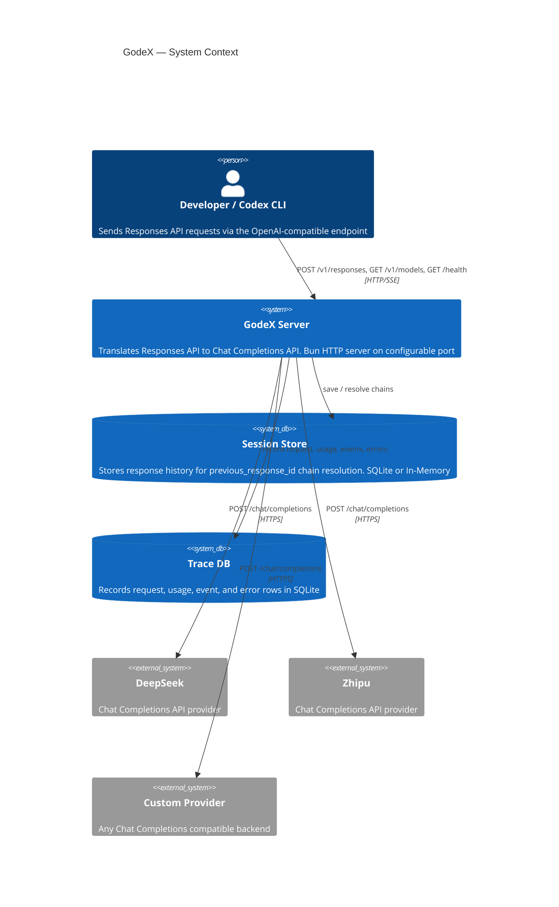

# Overview

GodeX is an **OpenAI Responses API gateway** built with [Bun](https://bun.sh) and **TypeScript**. It translates standard `/v1/responses` requests into upstream Chat Completions API calls, allowing any LLM provider to serve as a backend for tools that speak the OpenAI protocol — including the Codex CLI.

## Why GodeX?

- **Protocol translation**: Tools like Codex expect the OpenAI Responses API, but many providers only offer Chat Completions. GodeX bridges this gap.
- **Provider-agnostic**: A spec-based provider system means adding a new provider requires declaring capabilities and writing small hooks, not rewriting the server.
- **Streaming-first**: The entire pipeline is built around `ReadableStream` and `TransformStream`, ensuring low-latency SSE delivery to clients.
- **Session history**: Built-in `previous_response_id` chain resolution with SQLite or in-memory backends.

## System Context



## Key Design Decisions

| Decision | Rationale |
|----------|-----------|
| Bun runtime | Native `ReadableStream`, fast startup, built-in SQLite |
| Bridge kernel | Clean separation between protocol translation and provider logic |
| Immutable capability sets | Prevent runtime mutation of provider feature flags |
| Session store abstraction | Swap between memory and SQLite without touching business logic |
| Composable stream transformers | Each concern (trace, log, persist, validate) is a separate stage |

## Project Structure

```
src/
├── cli/              Commander CLI (serve, config, init)
├── config/           godex.yaml schema, env interpolation, defaults
├── context/          ApplicationContext (DI), ResponsesContext (per-request)
├── bridge/           Provider-agnostic Responses-to-Chat bridge kernel
│   ├── compatibility/  Parameter and response-format compatibility planning
│   ├── request/        Input normalization and message building
│   ├── tools/          Tool declarations, tool_choice, identity mapping
│   ├── output/         Structured-output contract planning and validation
│   ├── response/       Sync ResponseObject reconstruction
│   ├── stream/         Stream state machine and delta mapping
│   ├── provider-spec/  ProviderSpec, ProviderEdge, factory helpers
│   └── finish-reason/  Provider finish reason mapping
├── providers/        Provider registry, specs, hooks, clients
│   ├── deepseek/      DeepSeek provider
│   ├── zhipu/         Zhipu provider
│   ├── example/       Spec-only example provider
│   └── shared/        Shared provider utilities (ChatProviderClient, etc.)
├── responses/        Sync and stream orchestration pipelines
│   └── stream-transforms/  Composable TransformStream stages
├── server/           Bun routes for /health, /v1/models, /v1/responses
├── resolver/         ModelResolver (model selector to provider + model)
├── session/          Memory and SQLite response session stores
├── trace/            SQLite trace recorder and usage/error/event mappers
├── error/            GodeXError hierarchy with domain codes
├── protocol/         OpenAI protocol type definitions
├── tools/            Built-in tool definitions (shell, apply_patch, etc.)
└── e2e/              End-to-end tests with mocked upstream
```

[Installation & Setup](/01-getting-started/installation-setup)
