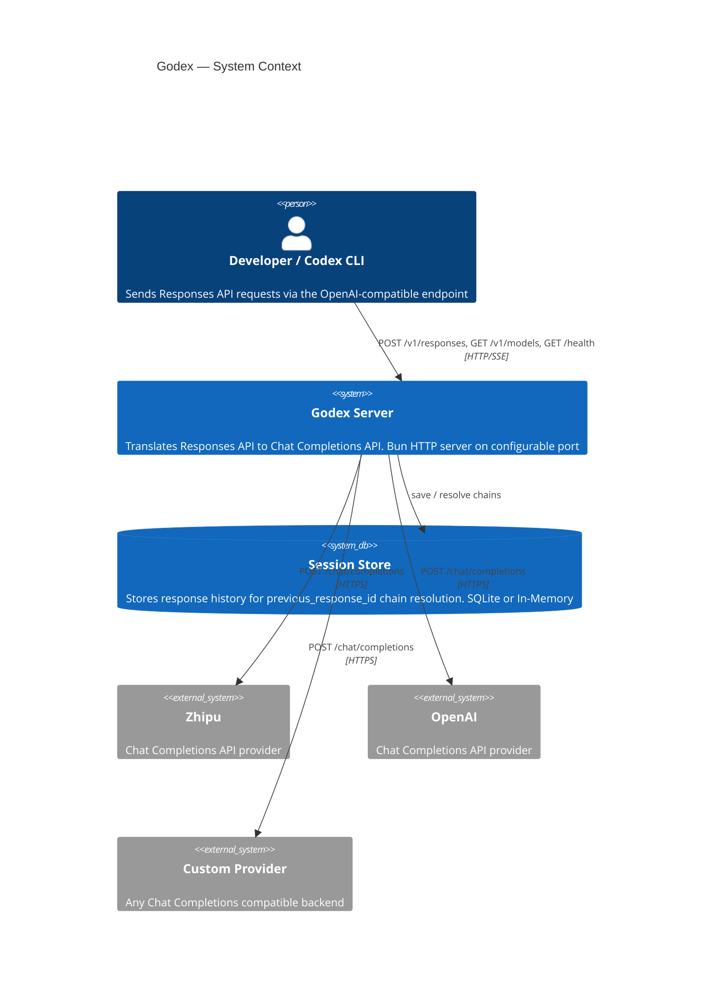

# Overview

Godex is an **OpenAI Responses API gateway** built with [Bun](https://bun.sh) and **TypeScript**. It translates standard `/v1/responses` requests into upstream Chat Completions API calls, allowing any LLM provider to serve as a backend for tools that speak the OpenAI protocol — including the Codex CLI.

## Why Godex?

- **Protocol translation**: Tools like Codex expect the OpenAI Responses API, but many providers only offer Chat Completions. Godex bridges this gap.
- **Provider-agnostic**: A plugin-based adapter system means adding a new provider requires implementing a small set of interfaces, not rewriting the server.
- **Streaming-first**: The entire pipeline is built around `ReadableStream` and `TransformStream`, ensuring low-latency SSE delivery to clients.
- **Session history**: Built-in `previous_response_id` chain resolution with SQLite or in-memory backends.

## System Context



## Key Design Decisions

| Decision | Rationale |
|----------|-----------|
| Bun runtime | Native `ReadableStream`, fast startup, built-in SQLite |
| Adapter pattern | Clean separation between protocol translation and provider logic |
| Immutable capability sets | Prevent runtime mutation of provider feature flags |
| Session store abstraction | Swap between memory and SQLite without touching business logic |

## Project Structure

```
src/
├── cli/              Commander CLI (serve, config check, init)
├── config/           godex.yaml schema, env interpolation, defaults
├── context/          ApplicationContext (DI), ResponsesContext (per-request)
├── adapter/          Adapter interface, DefaultAdapter, stream transformers
│   ├── mapper/       RequestMapper / ResponseMapper / StreamMapper contracts
│   └── transformers/ ProviderEvent to Response to SSE encode pipeline
├── providers/        Provider registry + builtin factories
│   └── zhipu/        Reference provider
├── resolver/         ModelResolver (model selector to provider + model)
├── server/           Bun HTTP server, Router, routes
├── session/          ResponseSessionStore (Memory + SQLite), chain resolution
├── error/            GodexError hierarchy with domain codes
├── protocol/openai/  OpenAI-compatible type definitions
├── logger/           Structured JSON logger
└── e2e/              End-to-end tests with mocked upstream
```

[Installation & Setup](/01-getting-started/installation-setup)
