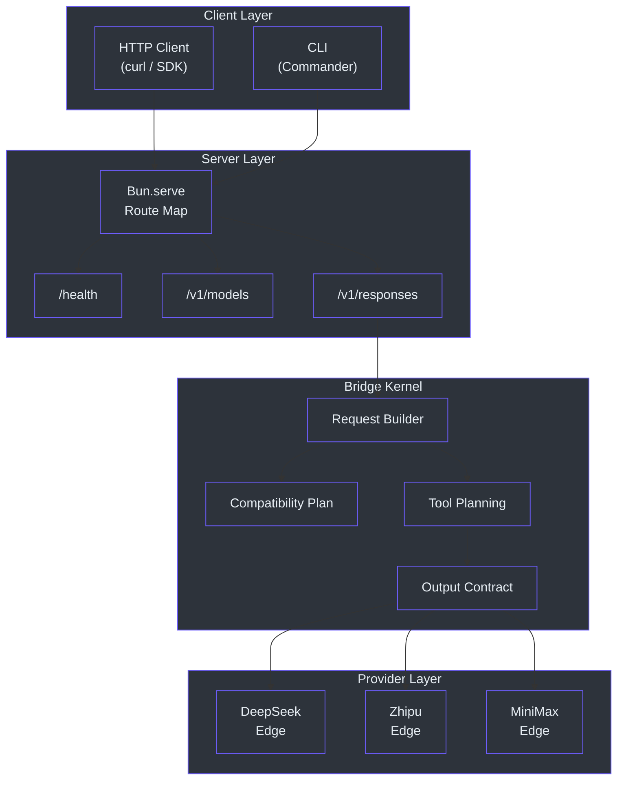
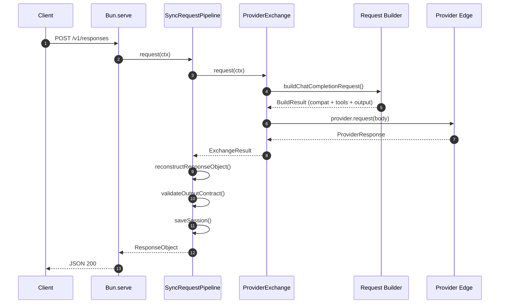
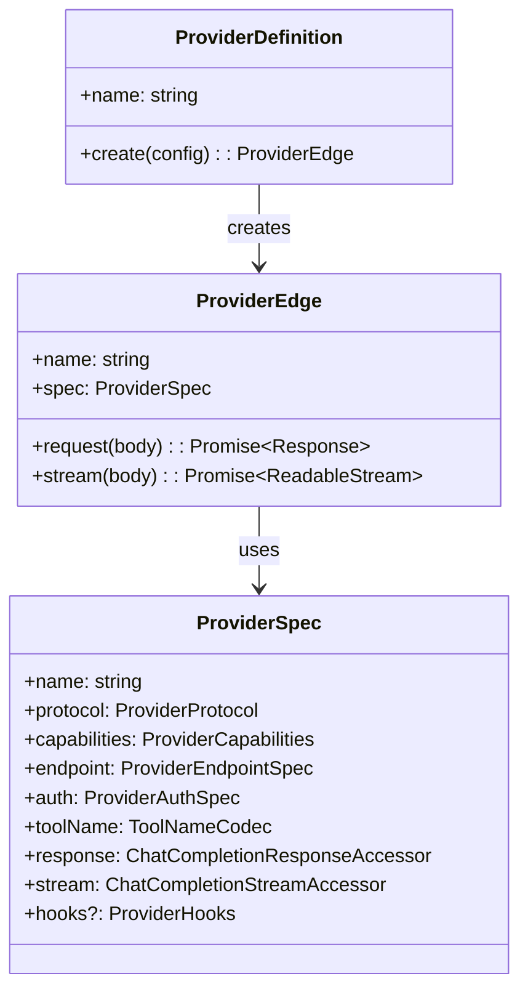
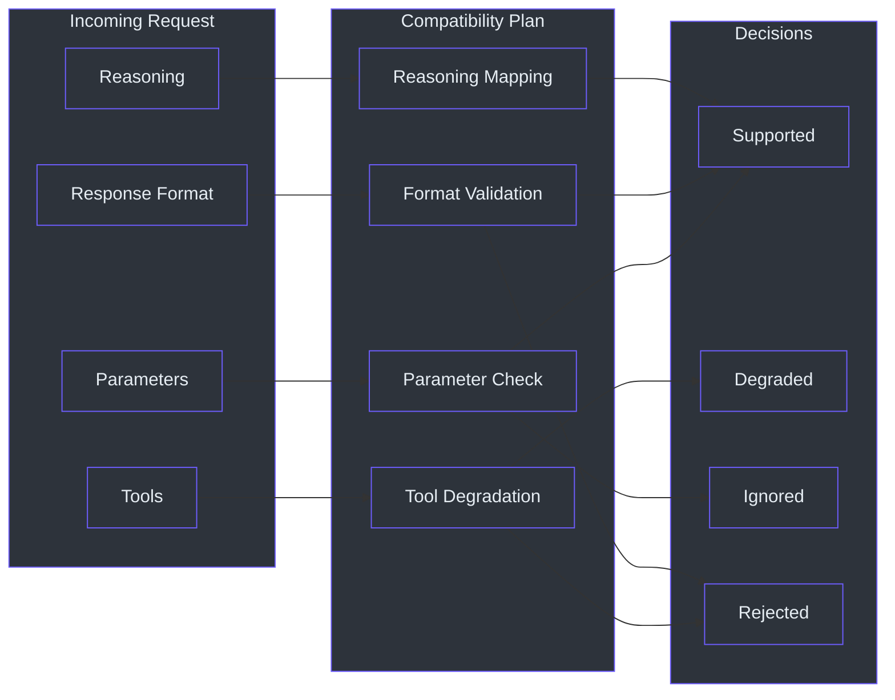

# Overview

GodeX bridges the gap between the OpenAI Responses API and the diverse ecosystem of non-OpenAI large language model providers. Instead of rewriting every client SDK to speak each provider's proprietary protocol, you point your OpenAI-compatible tooling at GodeX and it transparently translates requests and responses behind the scenes. This eliminates vendor lock-in and lets teams switch or combine LLM providers with a single configuration change.

## At a Glance

| Aspect | Detail |
|---|---|
| **What** | OpenAI-compatible Responses API gateway |
| **Protocol** | Accepts OpenAI Responses API; translates to Chat Completions |
| **Runtime** | Built on Bun for high-performance HTTP serving |
| **Built-in Providers** | DeepSeek, Zhipu, MiniMax |
| **Session Backends** | In-memory, SQLite |
| **Configuration** | YAML file with `${VAR}` environment interpolation |
| **CLI** | `godex init` wizard, `godex serve` runtime |
| **Observability** | Built-in trace recorder with payload capture |

## Architecture

GodeX is organized as a layered gateway where each layer has a single responsibility: CLI parsing, configuration building, provider registration, request bridging, and response reconstruction.

## Request Lifecycle

Every incoming request follows a deterministic path through the system. The bridge kernel validates compatibility, plans tool transformations, dispatches to the correct provider edge, and then reconstructs the response into the OpenAI Responses API format.

The `SyncRequestPipeline` orchestrates this flow: it delegates to `ProviderExchange`, which calls `buildChatCompletionRequest` to translate the incoming Responses API payload into a Chat Completions request tailored to the target provider's capabilities ([src/responses/sync-request-pipeline.ts:31-46](https://github.com/Ahoo-Wang/GodeX/blob/main/src/responses/sync-request-pipeline.ts#L31-L46)).

## Provider Spec Contract

Every provider implements the `ProviderSpec` interface, which defines a uniform contract for capabilities, endpoint configuration, authentication, tool name translation, and response/stream accessors ([src/bridge/provider-spec/contract.ts:54-74](https://github.com/Ahoo-Wang/GodeX/blob/main/src/bridge/provider-spec/contract.ts#L54-L74)).

| Contract Field | Purpose |
|---|---|
| `name` | Unique provider identifier (e.g. `deepseek`) |
| `protocol` | Always `chat_completions` |
| `capabilities` | Declares supported parameters, tools, formats |
| `endpoint` | Default base URL |
| `auth` | Authentication scheme (always Bearer) |
| `toolName` | Codec for translating tool names between API and provider |
| `response` | Accessors for extracting text, usage, finish reason |
| `stream` | Accessor for extracting deltas from SSE chunks |
| `hooks` | Optional `patchRequest`, `normalizeResponse`, `normalizeChunk` |

## Session Management

GodeX supports multi-turn conversations by persisting responses and replaying previous messages when a client sends `previous_response_id`. Two backends are available:

| Backend | Description | Default |
|---|---|---|
| `memory` | In-process map; lost on restart | Yes |
| `sqlite` | File-based persistence via SQLite | Opt-in |

Session configuration is parsed in [src/config/sections/session.ts:5-27](https://github.com/Ahoo-Wang/GodeX/blob/main/src/config/sections/session.ts#L5-L27) and the store is created during `ApplicationContext` initialization ([src/context/application-context.ts:20-30](https://github.com/Ahoo-Wang/GodeX/blob/main/src/context/application-context.ts#L20-L30)).

## Compatibility Planning

Before any request reaches a provider, the bridge kernel builds a **compatibility plan** that checks every requested parameter, tool type, and response format against the provider's declared capabilities. Unsupported features are either degraded to a compatible alternative or rejected with a diagnostic ([src/bridge/compatibility/compatibility-plan.ts:38-50](https://github.com/Ahoo-Wang/GodeX/blob/main/src/bridge/compatibility/compatibility-plan.ts#L38-L50)).

## Streaming Pipeline

For streaming requests, the `StreamPipeline` wires together multiple `TransformStream` stages: raw SSE ingestion, event bridging, output contract validation, trace recording, logging, session persistence, and compatibility diagnostics ([src/responses/stream-pipeline.ts:37-85](https://github.com/Ahoo-Wang/GodeX/blob/main/src/responses/stream-pipeline.ts#L37-L85)).

## Next Steps

| Topic | Description |
|---|---|
| [Quick Start](./quick-start.md) | Install GodeX and make your first API call |
| [Configuration](./configuration.md) | Full `godex.yaml` reference |
| [Built-in Providers](./builtin-providers.md) | DeepSeek, Zhipu, and MiniMax comparison |

## References

- [src/index.ts:1-5](https://github.com/Ahoo-Wang/GodeX/blob/main/src/index.ts#L1-L5) - CLI entry point
- [package.json:1-75](https://github.com/Ahoo-Wang/GodeX/blob/main/package.json#L1-L75) - Project metadata and scripts
- [src/bridge/provider-spec/contract.ts:54-74](https://github.com/Ahoo-Wang/GodeX/blob/main/src/bridge/provider-spec/contract.ts#L54-L74) - ProviderSpec interface
- [src/server/server.ts:21-27](https://github.com/Ahoo-Wang/GodeX/blob/main/src/server/server.ts#L21-L27) - Built-in route map
- [src/responses/runtime.ts:19-41](https://github.com/Ahoo-Wang/GodeX/blob/main/src/responses/runtime.ts#L19-L41) - ResponsesBridgeRuntime
- [src/bridge/compatibility/compatibility-plan.ts:38-50](https://github.com/Ahoo-Wang/GodeX/blob/main/src/bridge/compatibility/compatibility-plan.ts#L38-L50) - CompatibilityPlan interface
- [src/responses/sync-request-pipeline.ts:31-46](https://github.com/Ahoo-Wang/GodeX/blob/main/src/responses/sync-request-pipeline.ts#L31-L46) - Sync request pipeline
- [src/responses/stream-pipeline.ts:37-85](https://github.com/Ahoo-Wang/GodeX/blob/main/src/responses/stream-pipeline.ts#L37-L85) - Stream pipeline
- [src/context/application-context.ts:10-40](https://github.com/Ahoo-Wang/GodeX/blob/main/src/context/application-context.ts#L10-L40) - Application context
