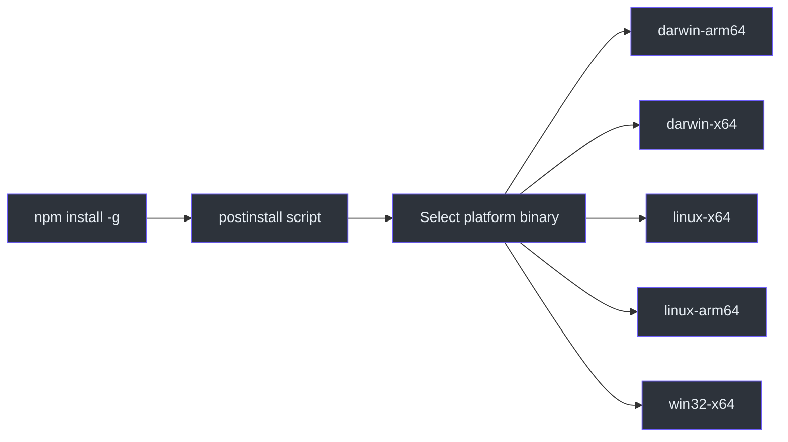
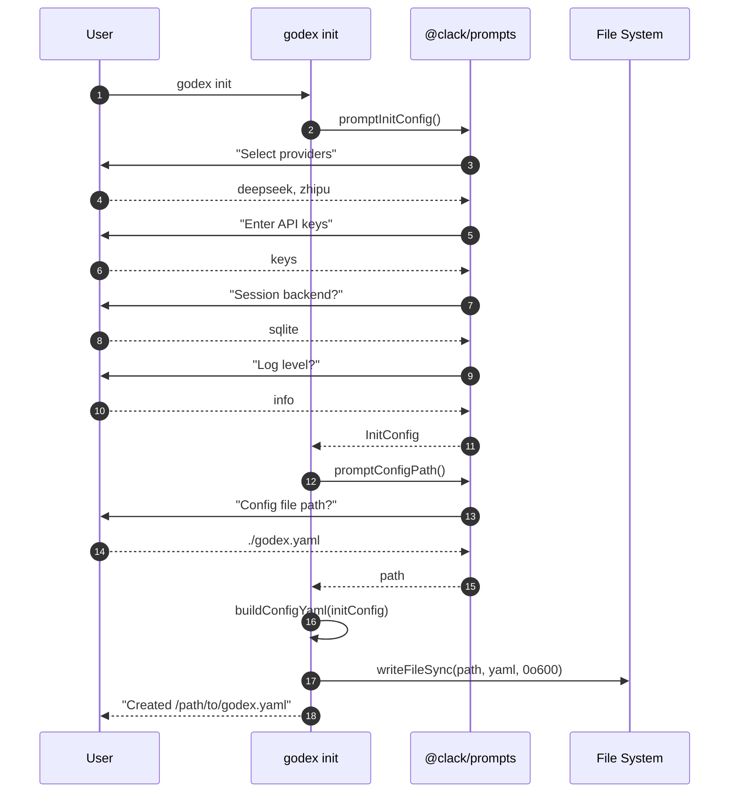
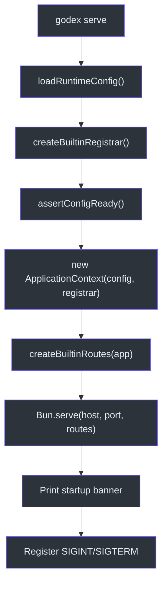
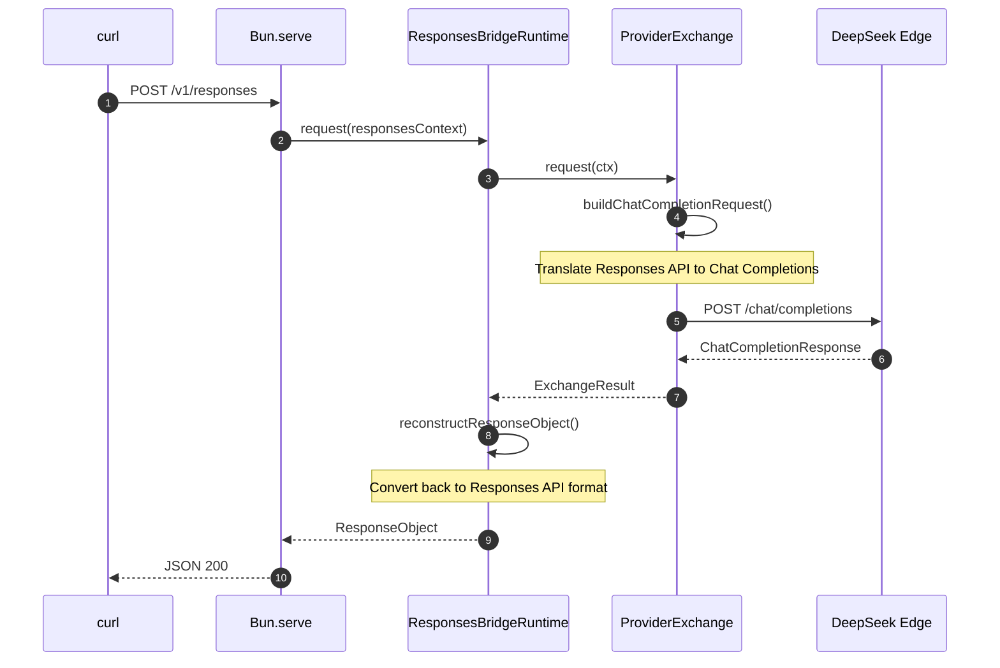

# Quick Start

Getting a working GodeX gateway takes less than five minutes. This guide walks through installation, interactive configuration via the `godex init` wizard, launching the server, and sending your first Responses API request. By the end you will have a running gateway that translates OpenAI Responses API calls into Chat Completions requests for any built-in provider.

## Prerequisites

| Requirement | Minimum Version |
|---|---|
| Bun | >= 1.0 (for development) |
| Node.js | >= 18 (for npm install only) |
| Provider API key | At least one of DeepSeek, Zhipu, or MiniMax |

## At a Glance

| Step | Command | What It Does |
|---|---|---|
| 1. Install | `npm install -g @ahoo-wang/godex` | Installs the native binary |
| 2. Configure | `godex init` | Interactive wizard generates `godex.yaml` |
| 3. Run | `godex serve` | Starts the HTTP gateway |
| 4. Test | `curl localhost:5678/health` | Verifies the server is healthy |
| 5. Call | `curl -X POST localhost:5678/v1/responses` | Sends your first API request |

## Step 1 -- Install GodeX

GodeX ships as a standalone native binary. The npm package's `postinstall` script automatically selects the correct platform binary.

```bash
npm install -g @ahoo-wang/godex
```

Alternatively, install with Homebrew or download the binary directly from [GitHub Releases](https://github.com/Ahoo-Wang/GodeX/releases). See [Installation & Setup](./installation-setup.md) for all installation methods.



## Step 2 -- Create Configuration

Run the interactive init wizard. It prompts for provider selection, API keys, session backend, and logging level, then writes a complete `godex.yaml` ([src/cli/init/run.ts:8-22](https://github.com/Ahoo-Wang/GodeX/blob/main/src/cli/init/run.ts#L8-L22)).

```bash
godex init
```

The wizard uses `@clack/prompts` to collect:

| Prompt | Description | Default |
|---|---|---|
| Default provider | Which provider to use when model is ambiguous | `deepseek` |
| API key | Bearer token for each selected provider | (from env) |
| Base URL | Override endpoint for each provider | Provider default |
| Session backend | `memory` or `sqlite` | `memory` |
| Log level | `trace`, `debug`, `info`, `warn`, `error` | `info` |
| Port | Server listen port | `5678` |
| Config path | Where to write `godex.yaml` | `./godex.yaml` |



The resulting `godex.yaml` will look similar to this (API keys rendered as environment variable references):

```yaml
server:
  port: 5678
default_provider: deepseek
providers:
  deepseek:
    spec: deepseek
    credentials:
      api_key: ${DEEPSEEK_API_KEY}
    endpoint:
      base_url: https://api.deepseek.com
  zhipu:
    spec: zhipu
    credentials:
      api_key: ${ZHIPU_API_KEY}
    endpoint:
      base_url: https://open.bigmodel.cn/api/coding/paas/v4
session:
  backend: sqlite
  sqlite:
    path: ./data/sessions.db
logging:
  level: info
```

The YAML builder assembles this structure in [src/cli/init/config-yaml.ts:6-53](https://github.com/Ahoo-Wang/GodeX/blob/main/src/cli/init/config-yaml.ts#L6-L53), setting file permissions to `0600` to protect API keys.

## Step 3 -- Start the Server

```bash
# Set your API key(s) in the environment
export DEEPSEEK_API_KEY=sk-your-key-here

# Start the gateway
godex serve
```

The `serve` command loads the configuration, registers built-in providers, creates the `ApplicationContext`, and starts Bun's HTTP server ([src/cli/serve.ts:12-47](https://github.com/Ahoo-Wang/GodeX/blob/main/src/cli/serve.ts#L12-L47)).



Common CLI overrides:

| Flag | Example | Effect |
|---|---|---|
| `--port` | `godex serve --port 8080` | Override listen port |
| `--host` | `godex serve --host 127.0.0.1` | Override listen address |
| `--config` | `godex serve --config /etc/godex/godex.yaml` | Use alternate config path |
| `--log-level` | `godex serve --log-level debug` | Override log level |

## Step 4 -- Verify the Server

```bash
curl http://localhost:5678/health
```

Expected response:

```json
{"status":"ok","providers":["deepseek","zhipu","minimax"],"unsupported_providers":[]}
```

The health route is registered in [src/server/server.ts:22-23](https://github.com/Ahoo-Wang/GodeX/blob/main/src/server/server.ts#L22-L23).

## Step 5 -- Make Your First API Call

```bash
curl -X POST http://localhost:5678/v1/responses \
  -H "Content-Type: application/json" \
  -d '{
    "model": "deepseek/deepseek-v4-pro",
    "input": "Explain the bridge pattern in two sentences."
  }'
```

The server routes the request through the full bridge pipeline:



You can also stream the response by adding `"stream": true` to the request body.

## Next Steps

| Topic | Description |
|---|---|
| [Configuration](./configuration.md) | Full `godex.yaml` reference with all sections |
| [Built-in Providers](./builtin-providers.md) | Compare DeepSeek, Zhipu, and MiniMax capabilities |
| [Installation & Setup](./installation-setup.md) | Docker, build from source, and platform binaries |

## References

- [src/cli/cli.ts:1-24](https://github.com/Ahoo-Wang/GodeX/blob/main/src/cli/cli.ts#L1-L24) - CLI entry point and error handling
- [src/cli/init/run.ts:8-22](https://github.com/Ahoo-Wang/GodeX/blob/main/src/cli/init/run.ts#L8-L22) - Init wizard runner
- [src/cli/init/config-yaml.ts:6-53](https://github.com/Ahoo-Wang/GodeX/blob/main/src/cli/init/config-yaml.ts#L6-L53) - YAML builder
- [src/cli/serve.ts:12-62](https://github.com/Ahoo-Wang/GodeX/blob/main/src/cli/serve.ts#L12-L62) - Serve command with shutdown handlers
- [src/server/server.ts:29-51](https://github.com/Ahoo-Wang/GodeX/blob/main/src/server/server.ts#L29-L51) - Bun server startup
- [src/config/schema.ts:1-71](https://github.com/Ahoo-Wang/GodeX/blob/main/src/config/schema.ts#L1-L71) - Configuration type definitions
- [package.json:18-24](https://github.com/Ahoo-Wang/GodeX/blob/main/package.json#L18-L24) - Binary entry point and platform packages
