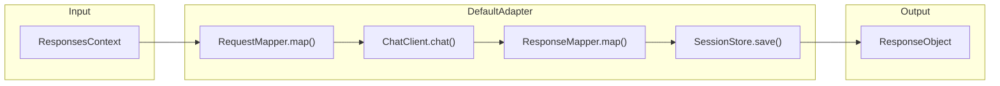
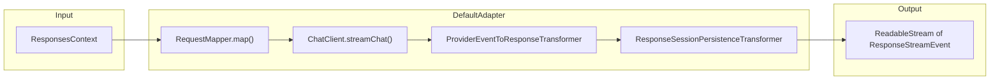
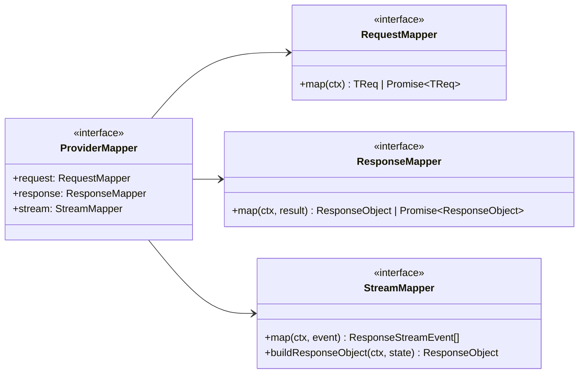

# Adapter Pattern

The adapter layer is the core translation engine. It sits between the server routes and provider implementations, converting between the OpenAI Responses API protocol and provider-specific Chat Completions formats.

## Adapter Interface

```ts
interface Adapter {
  request(ctx: ResponsesContext): Promise<ResponseObject>;
  stream(ctx: ResponsesContext): Promise<ReadableStream<ResponseStreamEvent>>;
}
```

The `DefaultAdapter` implements both methods by delegating to the provider's mapper and chat client.

## Non-Streaming Path



1. Map the `ResponsesContext` to an upstream request via `RequestMapper`
2. Send to upstream via `ChatClient.chat()`
3. Map the upstream response back via `ResponseMapper`
4. Save the session snapshot

## Streaming Path



When `store === false`, the `ResponseSessionPersistenceTransformer` is skipped entirely.

## Provider Mapper Contracts



Each provider implements these three mapper interfaces to handle the translation between Responses API semantics and its native protocol.

[Stream Pipeline](/02-architecture/stream-pipeline)
