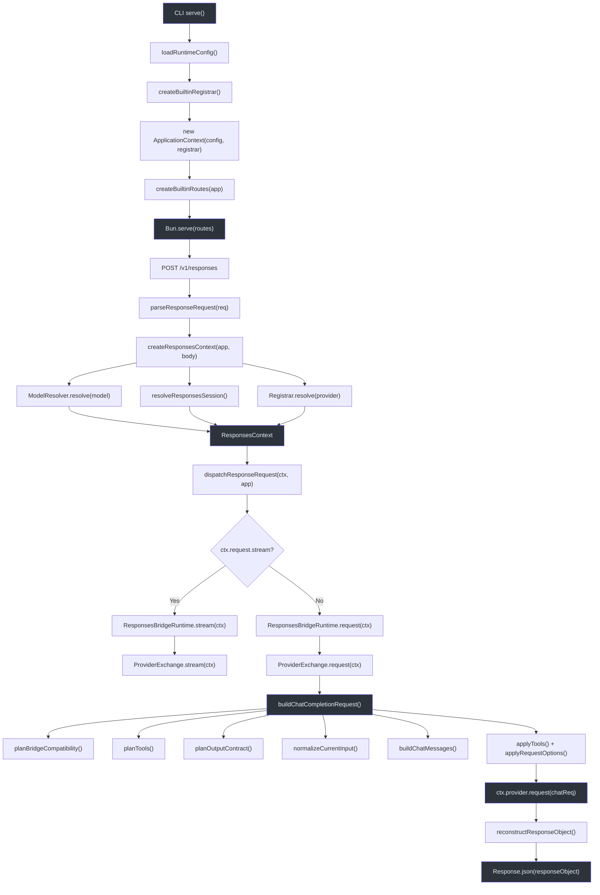
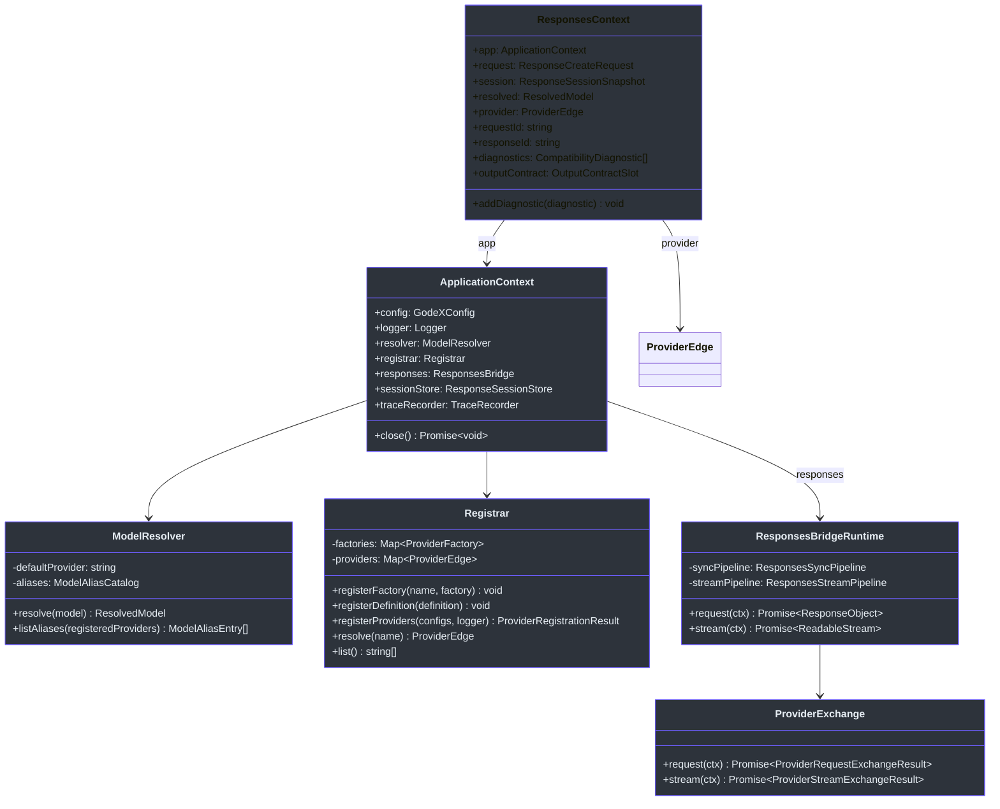
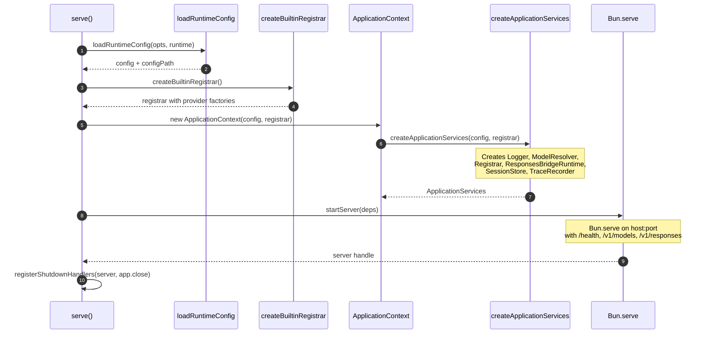
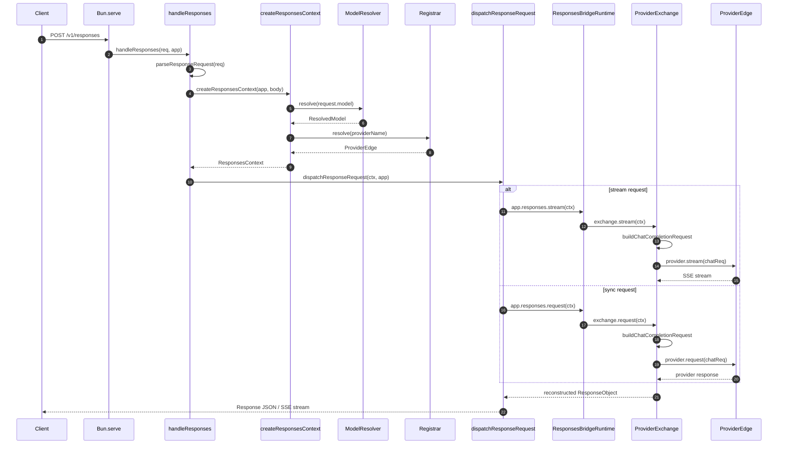

# Architecture Overview

GodeX is a gateway that translates OpenAI **Responses API** requests into **Chat Completions API** calls for any configured upstream provider. Understanding the full request lifecycle is essential for debugging compatibility issues, adding new providers, or extending the bridge. This page traces a single request from the moment the Bun server receives it to the point where the reconstructed response is returned to the caller.

## At a Glance

| Layer | Component | Responsibility |
|-------|-----------|----------------|
| CLI | `serve` | Bootstraps config, registrar, `ApplicationContext`, and Bun server |
| Application | `ApplicationContext` | Holds config, resolver, registrar, session store, trace recorder |
| Application | `ApplicationServices` | Factory that wires logger, `ModelResolver`, `Registrar`, `ResponsesBridgeRuntime` |
| Server | `createBuiltinRoutes` | Maps `/health`, `/v1/models`, `/v1/responses` to handlers |
| Route | `handleResponses` | Parses request, creates `ResponsesContext`, dispatches |
| Context | `ResponsesContext` | Per-request state: resolved model, provider, session, diagnostics |
| Bridge | `ProviderExchange` | Builds Chat Completion request, calls upstream, records traces |
| Bridge | `ResponsesBridgeRuntime` | Selects sync or stream pipeline |
| Provider | `Registrar` | Manages `ProviderEdge` factories and resolved instances |
| Resolver | `ModelResolver` | Maps model selectors to `(provider, model)` pairs |

## Request Lifecycle

## Core Types

## Startup Sequence

## Request Processing Sequence

## Bridge Pipeline Detail

The bridge pipeline inside `ProviderExchange` follows a fixed sequence. Each step contributes decisions and data that downstream steps consume:

| Step | Function | Output |
|------|----------|--------|
| 1 | `planBridgeCompatibility` | Compatibility plan with parameter decisions |
| 2 | `planTools` | Tool declarations, tool_choice, tool decisions |
| 3 | `planOutputContract` | Response format plan (native, degraded, or synthetic) |
| 4 | `normalizeCurrentInput` + `normalizeResponseItems` | Normalized `ChatCompletionMessageParam[]` |
| 5 | `buildChatMessages` | Merged assistant messages with tool calls |
| 6 | `applyTools` | `request.tools` and `request.tool_choice` |
| 7 | `applyRequestOptions` | stream, temperature, top_p, max_tokens, reasoning |

```mermaid
flowchart LR
    subgraph Bridge Pipeline
        direction LR
        A["planBridge<br>Compatibility"] --> B["planTools"]
        B --> C["planOutput<br>Contract"]
        C --> D["normalize<br>Input"]
        D --> E["buildChat<br>Messages"]
        E --> F["applyTools"]
        F --> G["applyRequest<br>Options"]
    end

    G --> H["provider.request()<br>or provider.stream()"]
    H --> I["reconstructResponse<br>Object()"]

    style A fill:#2d333b,stroke:#6d5dfc,color:#e6edf3
    style B fill:#2d333b,stroke:#6d5dfc,color:#e6edf3
    style C fill:#2d333b,stroke:#6d5dfc,color:#e6edf3
    style D fill:#2d333b,stroke:#6d5dfc,color:#e6edf3
    style E fill:#2d333b,stroke:#6d5dfc,color:#e6edf3
    style F fill:#2d333b,stroke:#6d5dfc,color:#e6edf3
    style G fill:#2d333b,stroke:#6d5dfc,color:#e6edf3
    style H fill:#2d333b,stroke:#6d5dfc,color:#e6edf3
    style I fill:#2d333b,stroke:#6d5dfc,color:#e6edf3
```

## Cross-References

- **[Compatibility](./compatibility.md)**: How the bridge plans feature compatibility before building a request
- **[Request Building](./request-building.md)**: Step-by-step conversion from Responses to Chat Completions
- **[Response Reconstruction](./response-reconstruction.md)**: How upstream responses are mapped back to the Responses API shape

## References

- [src/cli/serve.ts:12-62](https://github.com/Ahoo-Wang/GodeX/blob/main/src/cli/serve.ts#L12-L62) -- CLI entry point, server bootstrap, and shutdown handlers
- [src/context/application-context.ts:10-40](https://github.com/Ahoo-Wang/GodeX/blob/main/src/context/application-context.ts#L10-L40) -- `ApplicationContext` class holding all shared services
- [src/context/application-services.ts:1-48](https://github.com/Ahoo-Wang/GodeX/blob/main/src/context/application-services.ts#L1-L48) -- Factory wiring logger, resolver, registrar, bridge runtime
- [src/server/server.ts:21-51](https://github.com/Ahoo-Wang/GodeX/blob/main/src/server/server.ts#L21-L51) -- Route map creation and Bun server startup
- [src/server/routes/responses/handler.ts:1-33](https://github.com/Ahoo-Wang/GodeX/blob/main/src/server/routes/responses/handler.ts#L1-L33) -- Responses route handler with parse, context creation, and dispatch
- [src/responses/runtime.ts:19-41](https://github.com/Ahoo-Wang/GodeX/blob/main/src/responses/runtime.ts#L19-L41) -- `ResponsesBridgeRuntime` delegating to sync and stream pipelines
- [src/responses/provider-exchange.ts:1-123](https://github.com/Ahoo-Wang/GodeX/blob/main/src/responses/provider-exchange.ts#L1-L123) -- `ProviderExchange` orchestrating request building and upstream calls
- [src/providers/registrar.ts:1-95](https://github.com/Ahoo-Wang/GodeX/blob/main/src/providers/registrar.ts#L1-L95) -- Provider factory registration and resolution
- [src/resolver/model-resolver.ts:1-37](https://github.com/Ahoo-Wang/GodeX/blob/main/src/resolver/model-resolver.ts#L1-L37) -- Model selector parsing and alias resolution
