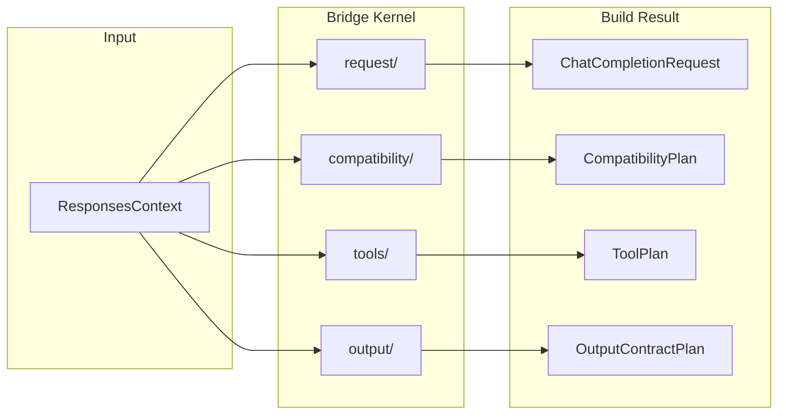
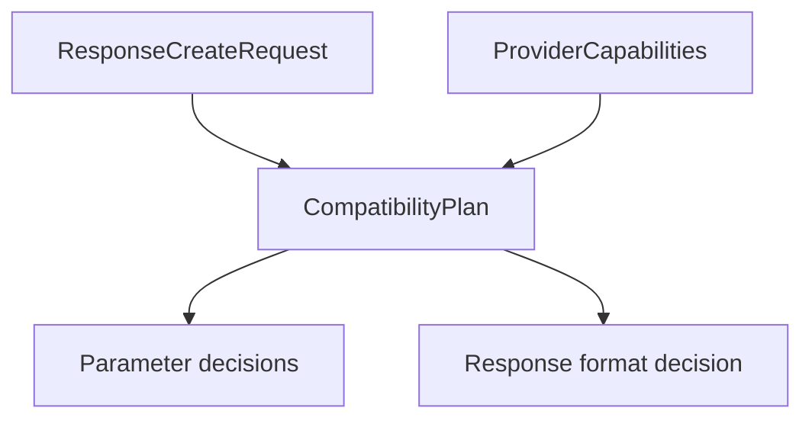

# Bridge Kernel

The bridge kernel (`src/bridge/`) is the core translation engine. It sits between the responses orchestration layer and provider implementations, converting between the OpenAI Responses API protocol and Chat Completions formats in a provider-agnostic way.

## Submodule Responsibilities

| Submodule | Role |
|-----------|------|
| `compatibility/` | Plans supported, degraded, ignored, and rejected request features |
| `request/` | Normalizes Responses input and session history into Chat Completions messages |
| `tools/` | Plans tool declarations, `tool_choice`, degradation, identity mapping, and call restoration |
| `output/` | Plans structured-output contracts and validates strict downgraded JSON output |
| `response/` | Reconstructs sync `ResponseObject` results from provider responses |
| `stream/` | Maps provider deltas into Responses SSE events through a state machine |
| `provider-spec/` | Defines `ProviderSpec`, `ProviderEdge`, provider constants, and package shape checks |
| `finish-reason/` | Maps provider finish reasons to Responses terminal states |

## Request Building

The `buildChatCompletionRequest()` function in `bridge/request/` is the main entry point. It composes four planning steps:

1. **Compatibility planning** — `planBridgeCompatibility()` checks each request parameter against the provider's capabilities and records supported, degraded, ignored, or rejected decisions.
2. **Tool planning** — `planTools()` maps tool definitions to provider tool declarations, handles tool type degradation (e.g., `local_shell` to `function`), and computes the effective `tool_choice`.
3. **Output contract planning** — `planOutputContract()` decides how structured output should be handled, including degrading `json_schema` to `json_object` when the provider does not support native schemas.
4. **Message building** — Normalizes the current input and session history into Chat Completions messages, injecting synthetic preamble instructions for downgraded output formats.

## Compatibility Planning

Each parameter is checked against the provider's capability set and produces a `CompatibilityDecision`:

| Action | Meaning |
|--------|---------|
| `supported` | Parameter is forwarded as-is |
| `degraded` | Parameter is transformed to a lower-fidelity equivalent |
| `ignored` | Parameter is consumed by GodeX and not forwarded |
| `rejected` | Parameter is not supported; the request fails with a `BridgeError` |

Diagnostics are accumulated in `ResponsesContext.diagnostics` and logged after the response completes.

## Provider Edge

The `ProviderEdge` interface is the bridge's contract with providers. Each provider implements a `ProviderSpec` that declares capabilities, accessors for reading responses and stream chunks, and optional hooks for request patching.

Provider-specific differences belong in each provider's `spec.ts`, `hooks.ts`, protocol types, and HTTP client. The bridge kernel itself never contains provider-specific logic.

[Stream Pipeline](/02-architecture/stream-pipeline)
