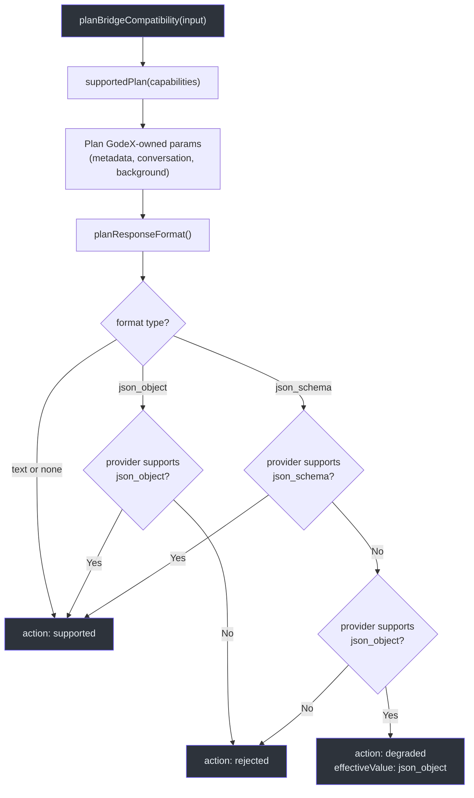
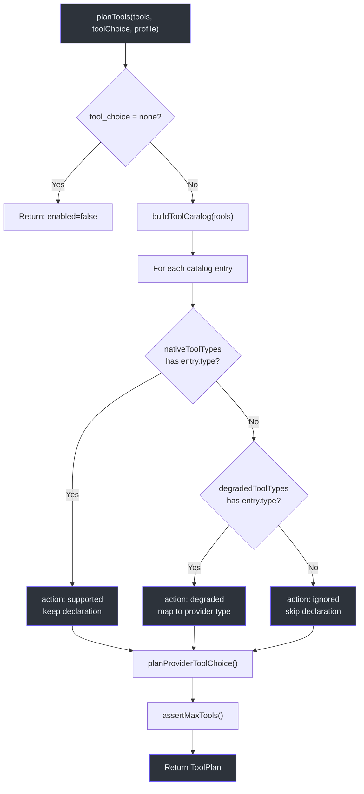
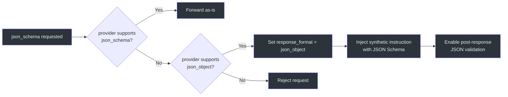
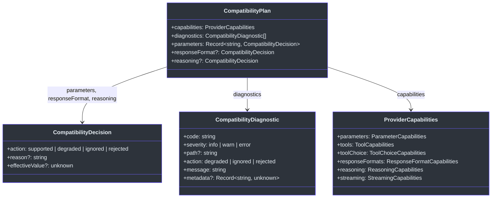

# Bridge Compatibility Planning

Not every upstream provider supports every feature of the OpenAI Responses API. GodeX must decide, before any request is sent, which features are natively supported, which can be degraded to a close alternative, which must be silently ignored, and which are hard blockers. The compatibility subsystem makes these decisions deterministically and records diagnostics for every choice, giving operators full visibility into why a particular request was shaped the way it was.

## At a Glance

| Concept | Type | Purpose |
|---------|------|---------|
| `ProviderCapabilities` | Interface | Declares what a provider supports (parameters, tools, formats, reasoning) |
| `CompatibilityPlan` | Interface | Holds all decisions for a single request |
| `CompatibilityDecision` | Interface | One decision: action, reason, effectiveValue |
| `CompatibilityDiagnostic` | Interface | Observable record: code, severity, path, message, metadata |
| `planBridgeCompatibility` | Function | Entry point; evaluates parameters and response formats |
| `planTools` | Function | Evaluates tool declarations and tool_choice |
| `planOutputContract` | Function | Evaluates JSON schema output constraints |

## Decision Actions

Every compatibility decision resolves to exactly one of four actions:

| Action | Meaning | Diagnostic Severity |
|--------|---------|---------------------|
| `supported` | Feature is natively supported; forwarded as-is | -- (no diagnostic emitted) |
| `degraded` | Feature mapped to a close alternative; behavior may differ | `warn` |
| `ignored` | Feature is silently dropped; request proceeds without it | `warn` |
| `rejected` | Feature is a hard blocker; request is aborted with a `BridgeError` | `error` |

## Capability Domains

A provider declares its capabilities through the [`ProviderCapabilities`](https://github.com/Ahoo-Wang/GodeX/blob/main/src/bridge/compatibility/compatibility-plan.ts#L29-L36) interface:

| Domain | Field | Type | Example |
|--------|-------|------|---------|
| Parameters | `parameters.supported` | `Set<string>` | `stream`, `temperature`, `top_p`, `max_output_tokens`, `reasoning`, `safety_identifier`, `user` |
| Tools | `tools.supported` | `Set<string>` | `function`, `mcp`, `shell`, `apply_patch`, `custom` |
| Tool Degradation | `tools.degraded` | `Map<string, string>` | `mcp -> function` |
| Tool Choice | `toolChoice.supported` | `Set<string>` | `auto`, `required`, `function` |
| Response Formats | `responseFormats.supported` | `Set<string>` | `text`, `json_object`, `json_schema` |
| Reasoning | `reasoning.effort` | `"none" / "boolean" / "native"` | Whether and how reasoning effort is forwarded |
| Streaming | `streaming.usage` | `boolean` | Whether SSE stream includes usage data |

## Compatibility Planning Flow

## Tool Compatibility

The `planTools` function evaluates each tool declaration against the provider's `ToolPlanningProfile`:

### Tool Choice Resolution

| Requested | Provider Supports | Result |
|-----------|-------------------|--------|
| `auto` | `auto` | supported |
| `required` | `required` | supported |
| `required` | `auto` only | degraded to `auto` |
| `required` | neither | rejected (error) |
| Named function/custom | matching declaration + provider type | supported or degraded |
| Named function/custom | no matching declaration | rejected (error) |

## Response Format Degradation

When a provider does not natively support `json_schema` but does support `json_object`, the output contract is degraded. A synthetic instruction is injected into the system messages that includes the original JSON Schema, validation rules, and a note that GodeX will validate the output:

| Degradation | Provider `response_format` | Synthetic Instruction | Post-Validation |
|-------------|---------------------------|----------------------|-----------------|
| `json_schema` to `json_object` | `{ type: "json_object" }` | Schema name, description, and full JSON Schema | `requiresValidJson: true` when `strict` |

## Reasoning Effort Modes

Providers handle reasoning effort differently. The `reasoning.effort` capability determines the mapping:

| Capability Mode | Behavior |
|-----------------|----------|
| `native` | Forward `reasoning_effort` directly (e.g., `low`, `medium`, `high`) |
| `boolean` | Map to `thinking.type`: `"none"` becomes `"disabled"`, all others become `"enabled"` |
| `none` | Reasoning effort is silently ignored; no parameter forwarded |

## Diagnostic Codes

Every non-supported decision produces a diagnostic with a machine-readable code:

| Code | Trigger |
|------|---------|
| `bridge.param.ignored` | GodeX-owned parameter (metadata, conversation, background) or unsupported tool type |
| `bridge.param.degraded` | Feature downgraded (json_schema to json_object, tool_choice required to auto) |
| `bridge.param.unsupported` | Hard rejection of unsupported feature |
| `bridge.tool.compatibility` | Tool declaration not natively supported (action varies per decision) |

## CompatibilityPlan Structure

## Cross-References

- **[Architecture Overview](./architecture-overview.md)**: Where compatibility planning fits in the full request lifecycle
- **[Request Building](./request-building.md)**: How compatibility decisions are consumed during request construction
- **[Response Reconstruction](./response-reconstruction.md)**: How post-response validation uses the output contract

## References

- [src/bridge/compatibility/planner.ts:1-164](https://github.com/Ahoo-Wang/GodeX/blob/main/src/bridge/compatibility/planner.ts#L1-L164) -- `planBridgeCompatibility` entry point and parameter decision recording
- [src/bridge/compatibility/compatibility-plan.ts:1-60](https://github.com/Ahoo-Wang/GodeX/blob/main/src/bridge/compatibility/compatibility-plan.ts#L1-L60) -- `CompatibilityPlan`, `CompatibilityDecision`, and `ProviderCapabilities` types
- [src/bridge/compatibility/diagnostic.ts:1-10](https://github.com/Ahoo-Wang/GodeX/blob/main/src/bridge/compatibility/diagnostic.ts#L1-L10) -- `CompatibilityDiagnostic` interface with severity and action
- [src/bridge/tools/tool-plan.ts:1-319](https://github.com/Ahoo-Wang/GodeX/blob/main/src/bridge/tools/tool-plan.ts#L1-L319) -- `planTools`, tool declaration decisions, and tool_choice resolution
- [src/bridge/output/output-contract.ts:1-75](https://github.com/Ahoo-Wang/GodeX/blob/main/src/bridge/output/output-contract.ts#L1-L75) -- `planOutputContract` and JSON Schema degradation with synthetic instructions
