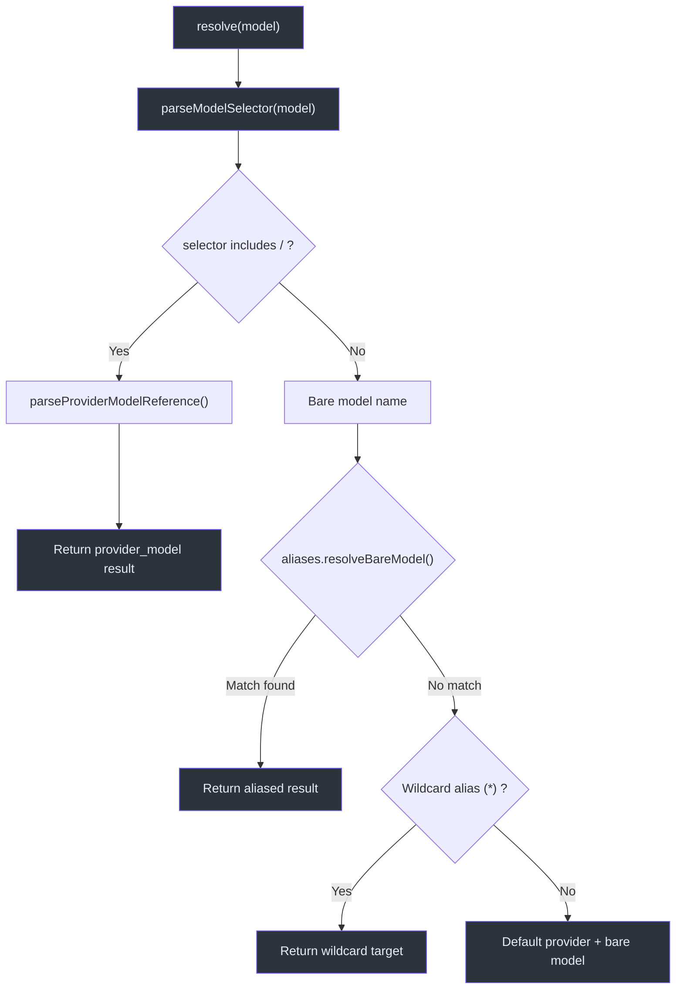
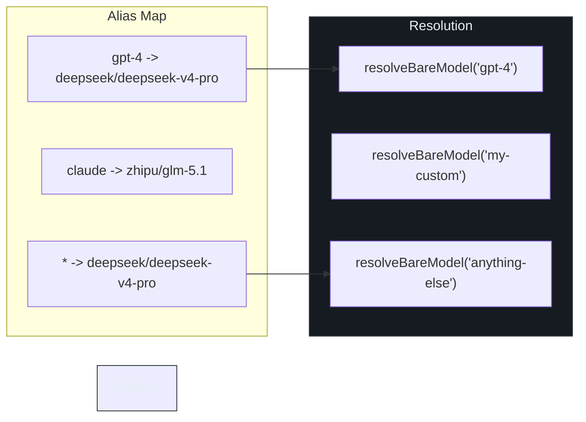
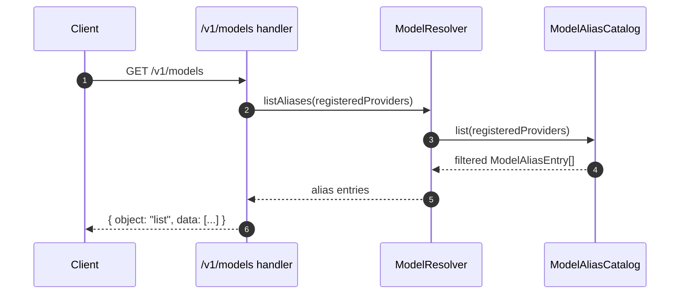

# Model Resolution

When a client sends a request to `/v1/responses` with a `model` field, GodeX
must decide **which provider** handles the call and **which upstream model**
to target. This resolution step is the first branch point in every request
and directly governs routing, billing, and compatibility behaviour. The
`ModelResolver` class encapsulates this logic: it parses the model selector,
consults the alias catalogue, and falls back to the configured default
provider, producing a deterministic `ResolvedModel` in all cases.

## At a Glance

| Aspect | Detail |
|---|---|
| Entry point | `ModelResolver.resolve(model)` |
| Input formats | `"provider/model"` or bare `"model-name"` |
| Alias support | Named aliases + wildcard (`*`) |
| Fallback | Default provider from config |
| Output | `{ provider: string, model: string }` |

## Resolution Pipeline



The resolver is created with a `defaultProvider` string and an optional
aliases map at
[src/resolver/model-resolver.ts:10-17](https://github.com/Ahoo-Wang/GodeX/blob/main/src/resolver/model-resolver.ts#L10).

## Selector Parsing

`parseModelSelector` at
[src/resolver/model-selector.ts:23-63](https://github.com/Ahoo-Wang/GodeX/blob/main/src/resolver/model-selector.ts#L23)
validates and classifies the incoming model value:

| Input | Kind | Result |
|---|---|---|
| `"deepseek/deepseek-v4-pro"` | `provider_model` | Direct resolve |
| `"gpt-4"` | `bare` | Alias lookup then fallback |
| `undefined` / `null` | -- | throws `ServerError(missing_model)` |
| `42` (non-string) | -- | throws `ServerError(invalid_parameter)` |
| `""` (empty) | -- | throws `ServerError(missing_model)` |

The function uses `parseProviderModelReference` from
[src/resolver/model-reference.ts:6-18](https://github.com/Ahoo-Wang/GodeX/blob/main/src/resolver/model-reference.ts#L6)
to split `"provider/model"` on the first slash, ensuring both segments are
non-empty.

## Alias Catalogue

`ModelAliasCatalog` at
[src/resolver/model-aliases.ts:13-52](https://github.com/Ahoo-Wang/GodeX/blob/main/src/resolver/model-aliases.ts#L13)
manages the mapping from short names to `provider/model` targets.



### Resolution Strategy for Bare Models

`resolveBareModel` at
[line 23](https://github.com/Ahoo-Wang/GodeX/blob/main/src/resolver/model-aliases.ts#L23)
applies two passes:

1. **Exact match** -- look up the bare model name in the aliases map.
2. **Wildcard match** -- if no exact match, resolve the `*` alias target.

If neither matches, `resolveBareModel` returns `undefined`, and the resolver
falls back to `{ provider: defaultProvider, model: bareName }` at
[src/resolver/model-resolver.ts:26-31](https://github.com/Ahoo-Wang/GodeX/blob/main/src/resolver/model-resolver.ts#L26).

## Listing Aliases for /v1/models



The `listAliases` method at
[src/resolver/model-resolver.ts:34-36](https://github.com/Ahoo-Wang/GodeX/blob/main/src/resolver/model-resolver.ts#L34)
delegates to `ModelAliasCatalog.list`, which filters aliases whose target
provider is registered and skips the wildcard entry at
[src/resolver/model-aliases.ts:27-41](https://github.com/Ahoo-Wang/GodeX/blob/main/src/resolver/model-aliases.ts#L27).

The `/v1/models` route transforms each entry into the OpenAI-compatible
format at
[src/server/routes/models.ts:9-19](https://github.com/Ahoo-Wang/GodeX/blob/main/src/server/routes/models.ts#L9):

```json
{
  "id": "gpt-4",
  "object": "model",
  "owned_by": "deepseek"
}
```

## ModelSelector Type Union

The discriminated union at
[src/resolver/model-selector.ts:11-21](https://github.com/Ahoo-Wang/GodeX/blob/main/src/resolver/model-selector.ts#L11)
makes branching type-safe:

| Discriminant | Shape |
|---|---|
| `kind: "provider_model"` | `{ selector, resolved: ResolvedModel }` |
| `kind: "bare"` | `{ selector, model: string }` |

## Configuration Example

```yaml
default_provider: deepseek
models:
  aliases:
    gpt-4: "deepseek/deepseek-v4-pro"
    claude: "zhipu/glm-5.1"
    "*": "deepseek/deepseek-v4-pro"
```

With this configuration:

| Client sends | Resolved provider | Resolved model |
|---|---|---|
| `"gpt-4"` | `deepseek` | `deepseek-v4-pro` |
| `"deepseek/deepseek-v4-pro"` | `deepseek` | `deepseek-v4-pro` |
| `"my-custom-model"` | `deepseek` (wildcard) | `deepseek-v4-pro` |
| `"unknown"` | `deepseek` (default) | `unknown` |

## Module Structure

```
src/resolver/
├── model-resolver.ts    # ModelResolver class with resolve() and listAliases()
├── model-aliases.ts     # ModelAliasCatalog with exact, wildcard, and listing logic
├── model-selector.ts    # parseModelSelector() for provider/model string parsing
├── model-reference.ts   # ResolvedModel type definition
└── index.ts             # Barrel exports
```

## Cross-References

- [Request Flow](./request-flow.md) -- where model resolution fits in the full pipeline
- [Bridge Kernel](./bridge-kernel.md) -- how the resolved model reaches the provider
- [Error Handling](../06-error-handling/error-handling.md) -- `missing_model` and `invalid_parameter` errors
- [Configuration Schema](../07-configuration/config-schema.md) -- aliases and default_provider settings
- [Server Routes](./server-routes.md) -- the `/v1/models` endpoint

## References

- [src/resolver/model-resolver.ts](https://github.com/Ahoo-Wang/GodeX/blob/main/src/resolver/model-resolver.ts) -- `ModelResolver` class
- [src/resolver/model-aliases.ts](https://github.com/Ahoo-Wang/GodeX/blob/main/src/resolver/model-aliases.ts) -- `ModelAliasCatalog` class
- [src/resolver/model-selector.ts](https://github.com/Ahoo-Wang/GodeX/blob/main/src/resolver/model-selector.ts) -- `parseModelSelector` function
- [src/resolver/model-reference.ts](https://github.com/Ahoo-Wang/GodeX/blob/main/src/resolver/model-reference.ts) -- `ResolvedModel` type and parser
- [src/server/routes/models.ts](https://github.com/Ahoo-Wang/GodeX/blob/main/src/server/routes/models.ts) -- `/v1/models` route handler
