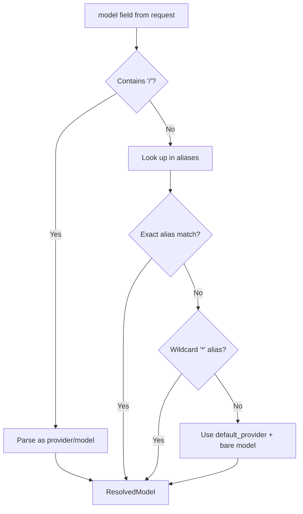

# Model Resolver

The model resolver (`src/resolver/`) translates the `model` field from incoming requests into a concrete `(provider, model)` pair. This determines which provider handles the request and which upstream model name to use.

## Resolution Algorithm



### Resolution Order

1. **Explicit selector** — If `model` contains a `/`, it is parsed as `provider/model` and used directly.
2. **Exact alias match** — The bare model name is looked up in `models.aliases` for an exact key match.
3. **Wildcard fallback** — If no exact match, the `*` alias is used as a catch-all.
4. **Default provider** — If no alias matches, the model name is paired with `default_provider`.

## Configuration

Model aliases are configured in `godex.yaml`:

```yaml
default_provider: deepseek

models:
  aliases:
    "gpt-5.5": deepseek/deepseek-v4-pro
    "glm": zhipu/glm-5.1
    "*": deepseek/deepseek-v4-flash
```

### Resolution Examples

| Input `model` | Resolution | Explanation |
|---------------|------------|-------------|
| `"gpt-5.5"` | `{ provider: "deepseek", model: "deepseek-v4-pro" }` | Exact alias match |
| `"glm"` | `{ provider: "zhipu", model: "glm-5.1" }` | Exact alias match |
| `"claude-4"` | `{ provider: "deepseek", model: "deepseek-v4-flash" }` | No exact match, wildcard `*` alias |
| `"zhipu/glm-5.1"` | `{ provider: "zhipu", model: "glm-5.1" }` | Explicit `provider/model` selector |
| `"unknown-model"` (no `*` alias) | `{ provider: "deepseek", model: "unknown-model" }` | No alias, default provider fallback |

## Module Structure

```
src/resolver/
├── model-resolver.ts    # ModelResolver class with resolve() and listAliases()
├── model-aliases.ts     # ModelAliasCatalog with exact, wildcard, and listing logic
├── model-selector.ts    # parseModelSelector() for provider/model string parsing
├── model-reference.ts   # ResolvedModel type definition
└── index.ts             # Barrel exports
```

## API Endpoints

The `/v1/models` endpoint uses `ModelResolver.listAliases()` to return the configured model list, filtered to only include aliases whose provider is registered.

[Bridge Kernel](/02-architecture/bridge-kernel)
[Request Flow](/02-architecture/request-flow)
