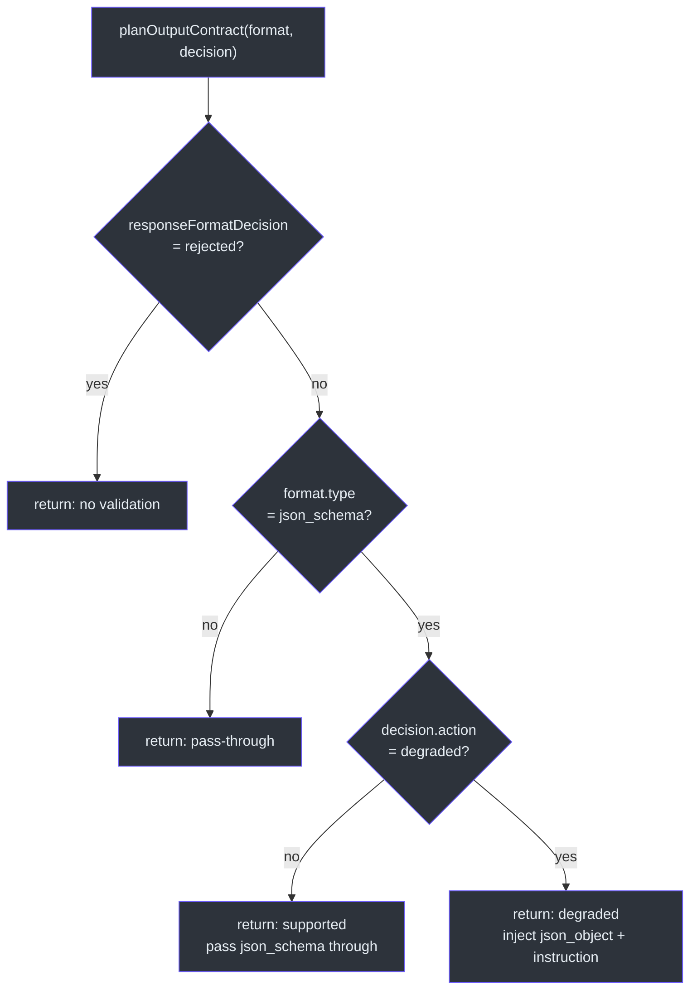
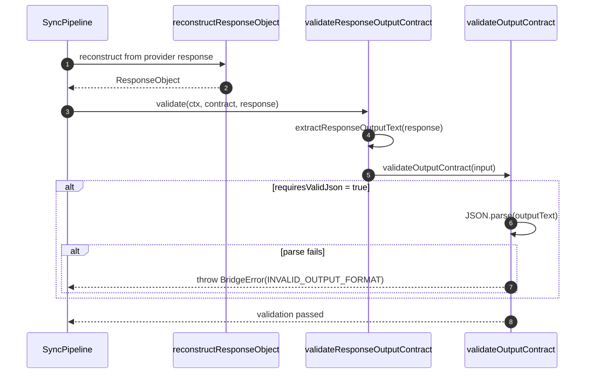
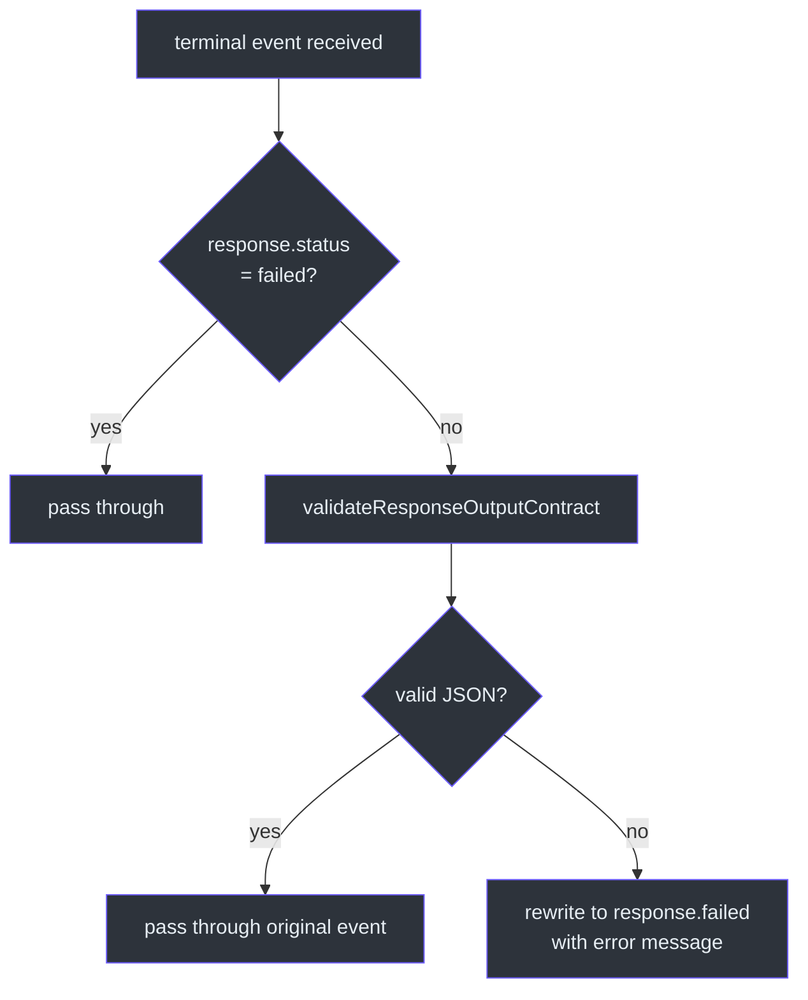

# Output Contracts

Output contracts solve the problem of structured output guarantees across providers with heterogeneous capabilities. Some providers support `json_schema` natively, others only support `json_object`, and some support neither. GodeX's output contract layer plans the best possible format strategy at request time, injects synthetic instructions when degradation is needed, and validates the output at response time to ensure the contract is honored.

## At a Glance

| Concern | Component | Key File |
|---------|-----------|----------|
| Contract planning | `planOutputContract` | [output-contract.ts:19](https://github.com/Ahoo-Wang/GodeX/blob/main/src/bridge/output/output-contract.ts#L19) |
| Output validation | `validateOutputContract` | [output-validator.ts:6](https://github.com/Ahoo-Wang/GodeX/blob/main/src/bridge/output/output-validator.ts#L6) |
| Response-level validation | `validateResponseOutputContract` | [response-output-contract-validation.ts:14](https://github.com/Ahoo-Wang/GodeX/blob/main/src/responses/response-output-contract-validation.ts#L14) |
| Contract slot on context | `OutputContractSlot` | [output-contract-slot.ts:3](https://github.com/Ahoo-Wang/GodeX/blob/main/src/context/output-contract-slot.ts#L3) |

## Planning Decisions

`planOutputContract` ([output-contract.ts:19](https://github.com/Ahoo-Wang/GodeX/blob/main/src/bridge/output/output-contract.ts#L19)) produces an `OutputContractPlan` with four possible outcomes:

| Scenario | Action | `providerResponseFormat` | `syntheticInstruction` | `requiresValidJson` |
|----------|--------|--------------------------|----------------------|-------------------|
| Format rejected by provider | `rejected` | undefined | undefined | false |
| No json_schema requested | pass-through | original format | undefined | false |
| `json_schema` natively supported | `supported` | original `json_schema` | undefined | false |
| `json_schema` degraded to `json_object` | `degraded` | `{ type: "json_object" }` | generated instruction | true (if strict) |

## Synthetic Instruction Generation

When `json_schema` is degraded to `json_object`, GodeX generates a synthetic instruction via `jsonSchemaInstruction` ([output-contract.ts:54](https://github.com/Ahoo-Wang/GodeX/blob/main/src/bridge/output/output-contract.ts#L54)). This instruction includes:

1. Schema name and description (if provided)
2. Explicit JSON output rules
3. The full JSON Schema as formatting guidance

The instruction is injected into the system message so the provider knows to output valid JSON matching the schema, even though it only received a `json_object` format directive.

## Output Contract Slot

`OutputContractSlot` ([output-contract-slot.ts:3](https://github.com/Ahoo-Wang/GodeX/blob/main/src/context/output-contract-slot.ts#L3)) is a mutable slot on the `ResponsesContext` that holds the current `OutputContractPlan`. It is set once during request building (in `buildProviderRequest` at [provider-exchange.ts:98](https://github.com/Ahoo-Wang/GodeX/blob/main/src/responses/provider-exchange.ts#L98)) and read during response validation.

| Method | Purpose |
|--------|---------|
| `set(plan)` | Stores the planned output contract (called during bridge request building) |
| `current()` | Returns the active contract (called during validation) |

## Validation Flow

Validation occurs differently for sync and streaming paths:

### Sync Validation

In the sync pipeline, `validateResponseOutputContract` ([response-output-contract-validation.ts:14](https://github.com/Ahoo-Wang/GodeX/blob/main/src/responses/response-output-contract-validation.ts#L14)) is called directly after `reconstructResponseObject`:

### Stream Validation

In the streaming pipeline, `ResponseOutputContractValidationTransformer` ([response-output-contract-validation-transformer.ts:13](https://github.com/Ahoo-Wang/GodeX/blob/main/src/responses/stream-transforms/response-output-contract-validation-transformer.ts#L13)) intercepts terminal events and validates the output contract. If validation fails, it rewrites the terminal event to `response.failed` with the error details:

The `failedResponse` helper ([response-output-contract-validation-transformer.ts:54](https://github.com/Ahoo-Wang/GodeX/blob/main/src/responses/stream-transforms/response-output-contract-validation-transformer.ts#L54)) constructs a new `ResponseObject` with `status: "failed"` and an appropriate error code.

## Output Text Extraction

`extractResponseOutputText` ([response-output-contract-validation.ts:25](https://github.com/Ahoo-Wang/GodeX/blob/main/src/responses/response-output-contract-validation.ts#L25)) obtains the text to validate by:

1. Using `response.output_text` if available (string)
2. Otherwise, concatenating `output_text` content parts from all `message` output items

This ensures validation works regardless of how the provider structures its response.

## Error Handling

When validation fails, a diagnostic is recorded with code `BRIDGE_RESPONSE_INVALID_OUTPUT_FORMAT`, severity `"error"`, and path `"response.output_text"` ([response-output-contract-validation.ts:36](https://github.com/Ahoo-Wang/GodeX/blob/main/src/responses/response-output-contract-validation.ts#L36)). The error is then propagated to the caller.

## Cross-References

- [Sync Pipeline](./sync-pipeline.md) -- where sync validation occurs
- [Streaming Pipeline](./streaming-pipeline.md) -- where stream validation occurs via the transform chain
- [Stream Reconstruction](./stream-reconstruction.md) -- deferred terminal events enable contract validation before the client sees the terminal event

## References

- [output-contract.ts:19](https://github.com/Ahoo-Wang/GodeX/blob/main/src/bridge/output/output-contract.ts#L19) -- `planOutputContract` function
- [output-contract.ts:54](https://github.com/Ahoo-Wang/GodeX/blob/main/src/bridge/output/output-contract.ts#L54) -- `jsonSchemaInstruction` synthetic instruction generator
- [output-validator.ts:6](https://github.com/Ahoo-Wang/GodeX/blob/main/src/bridge/output/output-validator.ts#L6) -- `validateOutputContract` function
- [output-contract-slot.ts:3](https://github.com/Ahoo-Wang/GodeX/blob/main/src/context/output-contract-slot.ts#L3) -- `OutputContractSlot` class
- [response-output-contract-validation.ts:14](https://github.com/Ahoo-Wang/GodeX/blob/main/src/responses/response-output-contract-validation.ts#L14) -- `validateResponseOutputContract` (response-level)
- [response-output-contract-validation-transformer.ts:13](https://github.com/Ahoo-Wang/GodeX/blob/main/src/responses/stream-transforms/response-output-contract-validation-transformer.ts#L13) -- Stream validation transformer
