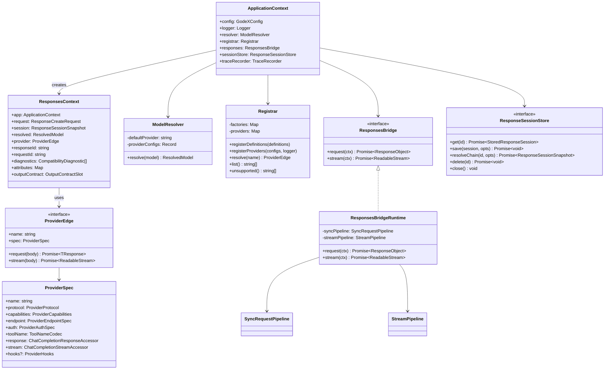
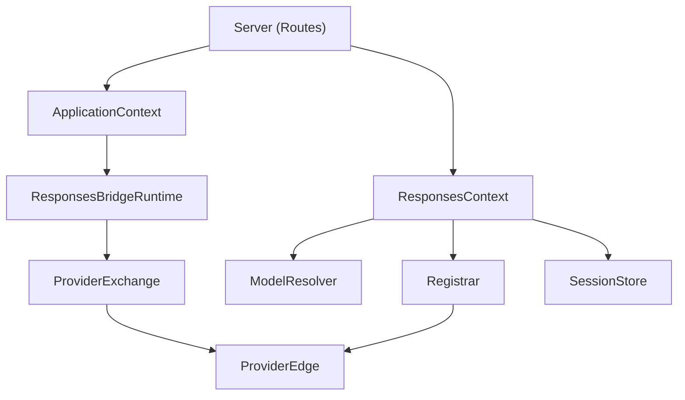

# System Overview

GodeX follows a layered architecture with clear separation of concerns: protocol handling at the boundary, bridge logic in the middle, and provider-specific code isolated in specs and hooks.

## Component Model

## Layer Responsibilities

| Layer | Module | Role |
|-------|--------|------|
| Server | `src/server/` | HTTP routing, request parsing, SSE encoding, error handling |
| Context | `src/context/` | `ApplicationContext` (app-wide services) and `ResponsesContext` (per-request state) |
| Bridge | `src/bridge/` | Provider-agnostic Responses-to-Chat planning and reconstruction |
| Responses | `src/responses/` | Sync and stream orchestration pipelines around the bridge |
| Provider | `src/providers/` | Provider-specific specs, hooks, clients, and registry |
| Session | `src/session/` | History persistence and `previous_response_id` chain resolution |
| Resolver | `src/resolver/` | Model alias and provider/model selector resolution |
| Config | `src/config/` | YAML schema, env interpolation, defaults, validation |
| Error | `src/error/` | Structured error hierarchy with domain codes |

## Dependency Flow

[Request Flow](/02-architecture/request-flow)
