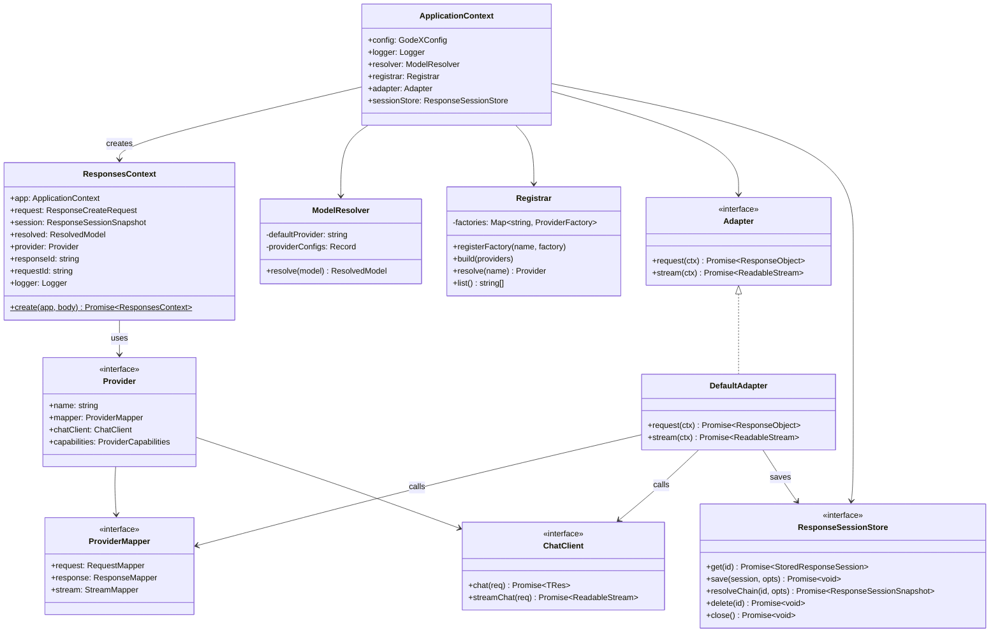
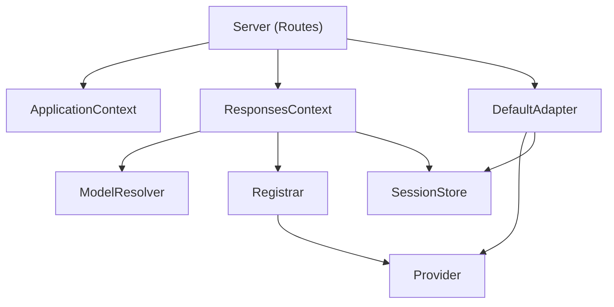

# System Overview

GodeX follows a layered architecture with clear separation of concerns: protocol handling at the boundary, adapter logic in the middle, and provider-specific code isolated in plugins.

## Component Model

## Layer Responsibilities

| Layer | Module | Role |
|-------|--------|------|
| Server | `src/server/` | HTTP routing, SSE encoding, request validation |
| Context | `src/context/` | Per-request orchestration via `ResponsesContext` |
| Adapter | `src/adapter/` | Protocol translation between Responses API and provider |
| Provider | `src/providers/` | Provider-specific request/response/stream mapping |
| Session | `src/session/` | History persistence and `previous_response_id` chain resolution |
| Config | `src/config/` | YAML schema, env interpolation, defaults |
| Error | `src/error/` | Structured error hierarchy with domain codes |

## Dependency Flow

[Request Flow](/02-architecture/request-flow)
