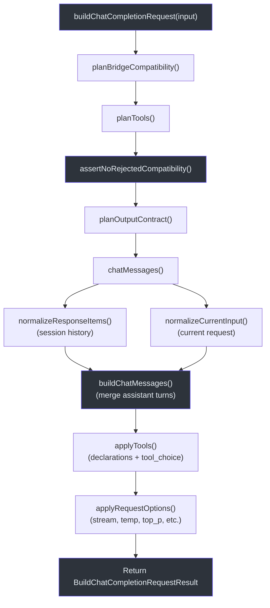
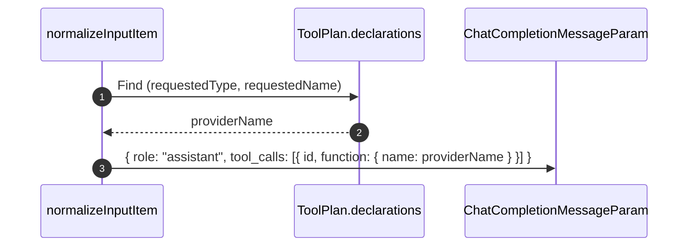
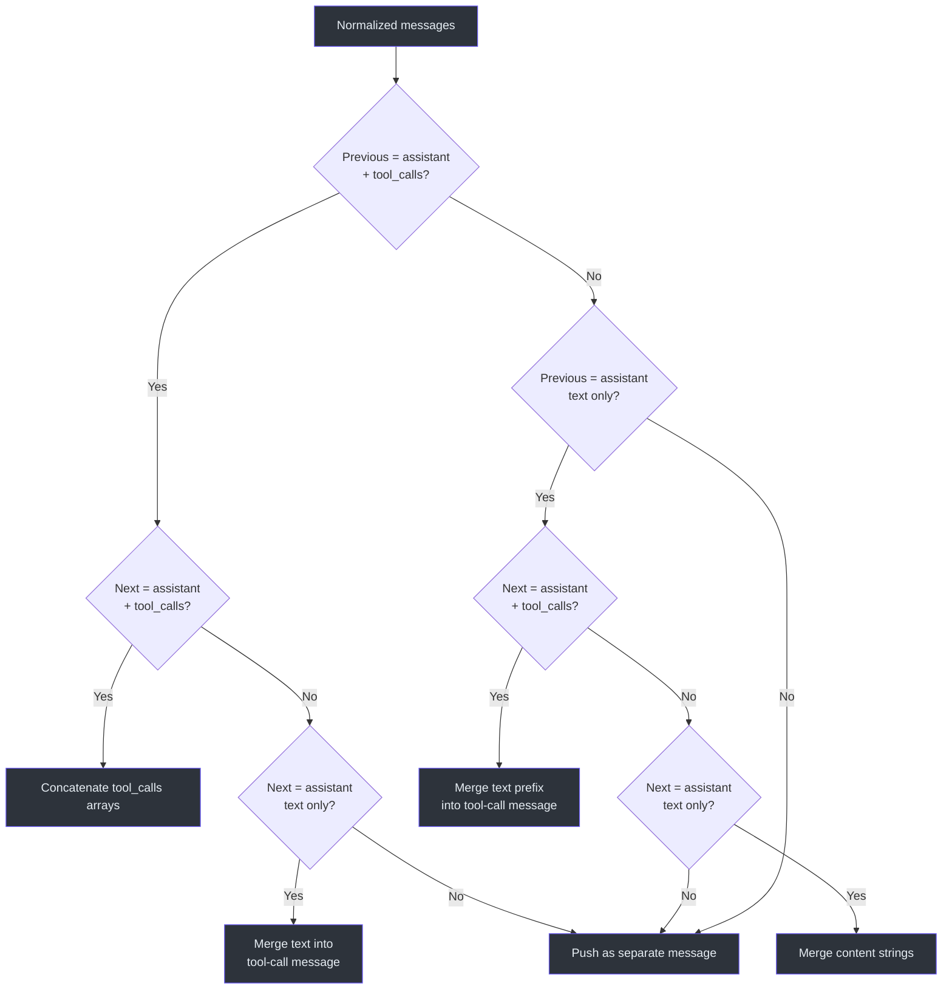
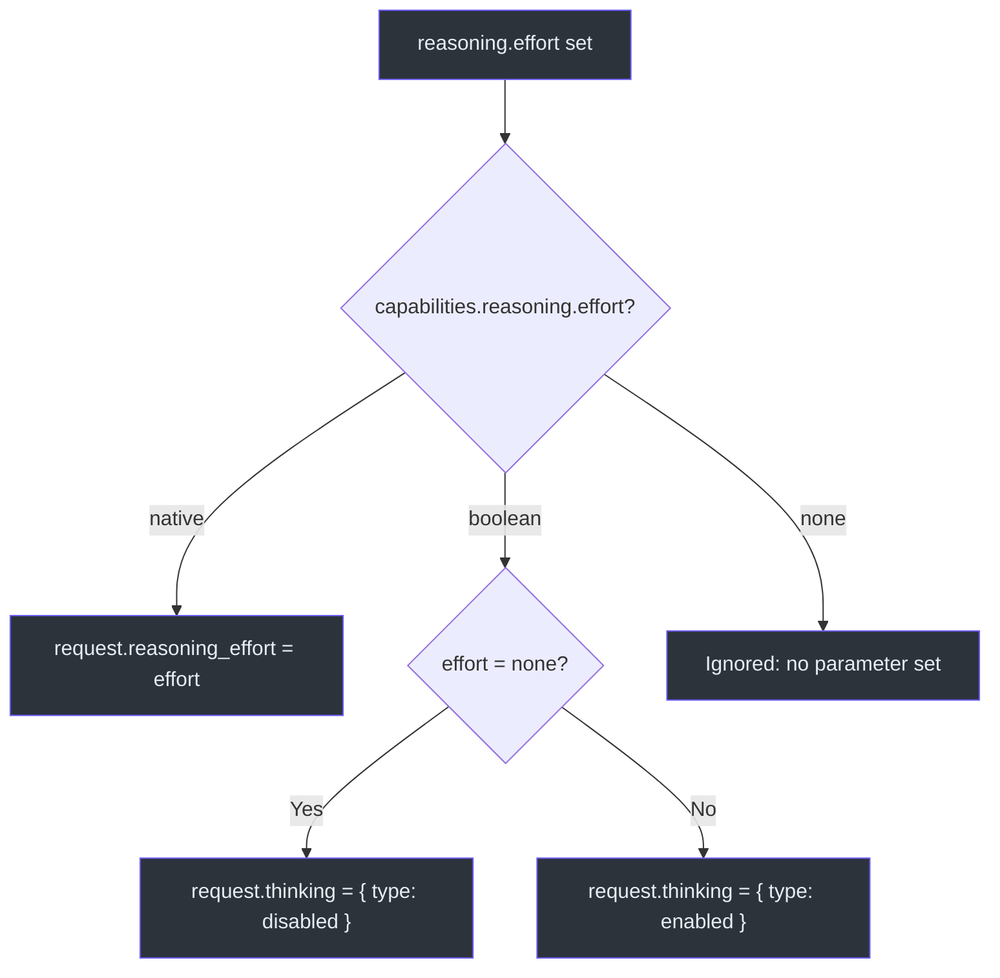

# Request Building

The core purpose of the GodeX bridge is translating an OpenAI **Responses API** `ResponseCreateRequest` into a **Chat Completions API** `ChatCompletionCreateRequest`. This is not a simple field mapping -- it requires compatibility planning, tool declaration translation, output contract negotiation, input normalization across many item types, and message merging to satisfy Chat Completions constraints. The `buildChatCompletionRequest` function orchestrates this entire pipeline in a fixed sequence.

## At a Glance

| Step | Function | Output | Source |
|------|----------|--------|--------|
| 1 | `planBridgeCompatibility` | `CompatibilityPlan` with parameter and format decisions | [planner.ts](https://github.com/Ahoo-Wang/GodeX/blob/main/src/bridge/compatibility/planner.ts#L25-L36) |
| 2 | `planTools` | `ToolPlan` with declarations, tool_choice, and decisions | [tool-plan.ts](https://github.com/Ahoo-Wang/GodeX/blob/main/src/bridge/tools/tool-plan.ts#L66-L106) |
| 3 | `planOutputContract` | `OutputContractPlan` with format and synthetic instruction | [output-contract.ts](https://github.com/Ahoo-Wang/GodeX/blob/main/src/bridge/output/output-contract.ts#L19-L52) |
| 4 | `normalizeCurrentInput` + `normalizeResponseItems` | `NormalizedChatMessage[]` | [input-normalizer.ts](https://github.com/Ahoo-Wang/GodeX/blob/main/src/bridge/request/input-normalizer.ts#L21-L46) |
| 5 | `buildChatMessages` | `ChatCompletionMessageParam[]` with merged assistant turns | [message-builder.ts](https://github.com/Ahoo-Wang/GodeX/blob/main/src/bridge/request/message-builder.ts#L7-L56) |
| 6 | `applyTools` | `request.tools` and `request.tool_choice` | [request-builder.ts](https://github.com/Ahoo-Wang/GodeX/blob/main/src/bridge/request/request-builder.ts#L146-L172) |
| 7 | `applyRequestOptions` | stream, temperature, top_p, max_tokens, reasoning | [request-builder.ts](https://github.com/Ahoo-Wang/GodeX/blob/main/src/bridge/request/request-builder.ts#L174-L224) |

## Pipeline Overview



## Input Normalization

The Responses API supports many input item types that have no direct equivalent in the Chat Completions API. `normalizeCurrentInput` and `normalizeResponseItems` convert each item type into one or more `ChatCompletionMessageParam` entries:

| Responses Item Type | Chat Completions Mapping |
|---------------------|--------------------------|
| `message` (role: system/user/assistant/developer) | `{ role, content }` (developer maps to system) |
| `message` with `instructions` | Prepended as `{ role: "system", content: instructions }` |
| `reasoning` | Appended as `reasoning_content` on next assistant message |
| `function_call` | `{ role: "assistant", tool_calls: [{ id, function }] }` |
| `function_call_output` | `{ role: "tool", tool_call_id, content }` |
| `shell_call` | `{ role: "assistant", tool_calls: [...] }` with JSON-serialized action |
| `shell_call_output` | `{ role: "tool", tool_call_id, content }` with formatted output |
| `local_shell_call` | `{ role: "assistant", tool_calls: [...] }` with JSON-serialized action |
| `local_shell_call_output` | `{ role: "tool", tool_call_id, content }` |
| `apply_patch_call` | `{ role: "assistant", tool_calls: [...] }` with JSON-serialized operation |
| `apply_patch_call_output` | `{ role: "tool", tool_call_id, content }` |
| `custom_tool_call` | `{ role: "assistant", tool_calls: [...] }` with `{ input }` payload |
| `custom_tool_call_output` | `{ role: "tool", tool_call_id, content }` |

### Tool Name Mapping

Each tool call uses the provider-side name from the `ToolPlan.declarations`. The normalizer looks up the requested name and type in the declarations to find the mapped `providerName`:



## Message Merging

The Chat Completions API does not allow consecutive assistant messages with separate tool calls. `buildChatMessages` merges adjacent assistant messages using four rules:

| Previous Message | Next Message | Merge Strategy |
|-----------------|--------------|----------------|
| Assistant + tool_calls | Assistant + tool_calls | Concatenate `tool_calls` arrays |
| Assistant (text only) | Assistant (text only) | Merge `content` strings |
| Assistant (text only) | Assistant + tool_calls | Merge text into tool-call message |
| Assistant + tool_calls | Assistant (text only) | Merge text into tool-call message |
| Any other | Any other | Push as separate message |



## Request Options Mapping

`applyRequestOptions` conditionally maps each Responses API parameter to the Chat Completions equivalent. A parameter is only forwarded if the provider's `capabilities.parameters.supported` set includes it:

| Responses Parameter | Chat Completions Field | Condition |
|---------------------|----------------------|-----------|
| `stream: true` | `request.stream = true` + `stream_options.include_usage` | Provider supports `stream`; usage only if `streaming.usage` |
| `temperature` | `request.temperature` | Provider supports `temperature` |
| `top_p` | `request.top_p` | Provider supports `top_p` |
| `max_output_tokens` | `request.max_tokens` | Provider supports `max_output_tokens` |
| `reasoning.effort` | `request.reasoning_effort` or `request.thinking` | Provider capability mode: `native`, `boolean`, or `none` |
| `safety_identifier` | `request.user_id` | Provider supports `safety_identifier` |
| `user` | `request.user_id` | Provider supports `user` (fallback if no safety_identifier) |

### Reasoning Effort Mapping



## Build Result Structure

`buildChatCompletionRequest` returns a `BuildChatCompletionRequestResult` containing:

| Field | Type | Purpose |
|-------|------|---------|
| `request` | `ChatCompletionCreateRequest` | The final request to send upstream |
| `compatibility` | `CompatibilityPlan` | All parameter and format decisions |
| `tools` | `ToolPlan` | Tool declarations, tool_choice, and tool decisions |
| `output` | `OutputContractPlan` | Response format handling and validation requirements |

## Session History Integration

When a request includes a session (from `previous_response_id`), the session's `input_items` are normalized and prepended before the current input. The system prefix (consecutive system messages) is extracted first, the synthetic instruction (if any) is inserted after it, then history and current messages follow:

```
[system messages from instructions] + [synthetic instruction] + [session history] + [current user/assistant messages]
```

## Cross-References

- **[Compatibility](./compatibility.md)**: How `planBridgeCompatibility` and `planTools` make feature decisions
- **[Architecture Overview](./architecture-overview.md)**: Where request building sits in the full lifecycle
- **[Response Reconstruction](./response-reconstruction.md)**: How the response is mapped back after upstream returns

## References

- [src/bridge/request/request-builder.ts:1-329](https://github.com/Ahoo-Wang/GodeX/blob/main/src/bridge/request/request-builder.ts#L1-L329) -- `buildChatCompletionRequest` orchestrating the full pipeline
- [src/bridge/request/input-normalizer.ts:1-368](https://github.com/Ahoo-Wang/GodeX/blob/main/src/bridge/request/input-normalizer.ts#L1-L368) -- Input item type normalization and tool name mapping
- [src/bridge/request/message-builder.ts:1-163](https://github.com/Ahoo-Wang/GodeX/blob/main/src/bridge/request/message-builder.ts#L1-L163) -- Assistant message merging logic
- [src/bridge/compatibility/planner.ts:25-36](https://github.com/Ahoo-Wang/GodeX/blob/main/src/bridge/compatibility/planner.ts#L25-L36) -- `planBridgeCompatibility` entry point
- [src/bridge/tools/tool-plan.ts:66-106](https://github.com/Ahoo-Wang/GodeX/blob/main/src/bridge/tools/tool-plan.ts#L66-L106) -- `planTools` with declaration and tool_choice planning
- [src/bridge/output/output-contract.ts:19-52](https://github.com/Ahoo-Wang/GodeX/blob/main/src/bridge/output/output-contract.ts#L19-L52) -- `planOutputContract` with JSON Schema degradation
