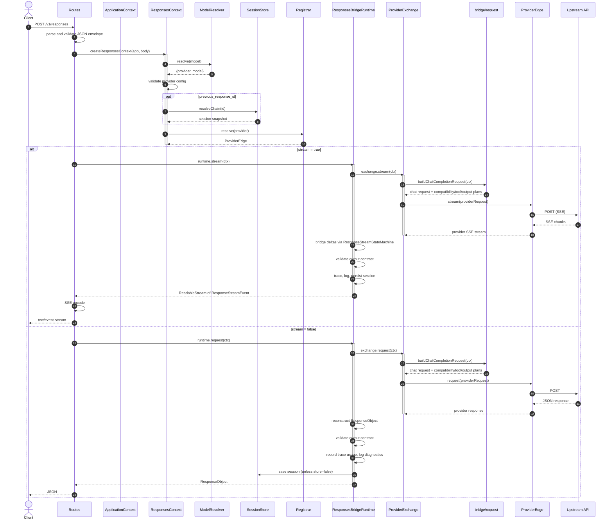

# Request Flow

This page traces the complete lifecycle of a request, from HTTP entry to SSE-encoded response.

## Full Request Lifecycle

## Key Steps

1. **Request parsing**: `parseResponseRequest()` validates the JSON envelope and returns a structured body or an error response.

2. **Context creation**: `createResponsesContext()` resolves the model, validates the provider config, optionally resolves the session chain, and resolves the `ProviderEdge` from the registrar.

3. **Model resolution**: `ModelResolver.resolve()` parses the model string. If it contains a `/`, it is treated as an explicit `provider/model` selector. Otherwise, the bare name is looked up in the `models.aliases` map (exact match, then `*` wildcard, then `default_provider` fallback).

4. **Session chain resolution**: When `previous_response_id` is present, `SessionStore.resolveChain()` walks the parent pointer chain, collecting turns in chronological order.

5. **Provider lookup**: `Registrar.resolve()` returns the built `ProviderEdge` for the resolved provider name.

6. **Request building**: `buildChatCompletionRequest()` in the bridge kernel plans compatibility, tools, and output contracts, then normalizes messages.

7. **Response reconstruction**: The sync pipeline reconstructs a `ResponseObject` via `reconstructResponseObject()`. The stream pipeline maps deltas through `ResponseStreamStateMachine`.

[Bridge Kernel](/02-architecture/bridge-kernel)
