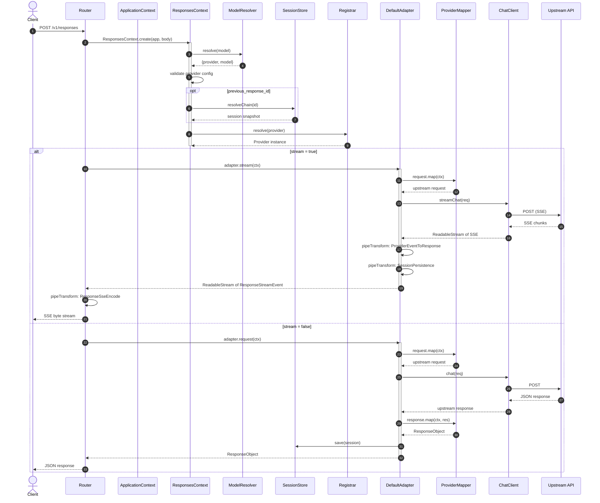

# Request Flow

This page traces the complete lifecycle of a request, from HTTP entry to SSE-encoded response.

## Full Request Lifecycle

## Key Steps

1. **Model resolution**: `ModelResolver.resolve()` parses the model string. If it contains a `/`, it is treated as an explicit `provider/model` selector and passed through directly. Otherwise, the bare name is looked up in the root-level `models.aliases` map (exact match, then `*` wildcard, then `default_provider` fallback).

2. **Session chain resolution**: When `previous_response_id` is present, `SessionStore.resolveChain()` walks the parent pointer chain, collecting turns in chronological order.

3. **Provider lookup**: `Registrar.resolve()` returns the built `Provider` instance for the resolved provider name.

4. **Request mapping**: `RequestMapper.map()` converts the Responses API request into the provider's native format.

5. **Response mapping**: Either a single `ResponseMapper.map()` call (non-streaming) or a `StreamMapper.map()` pipeline (streaming).

[Adapter Pattern](/02-architecture/adapter-pattern)
