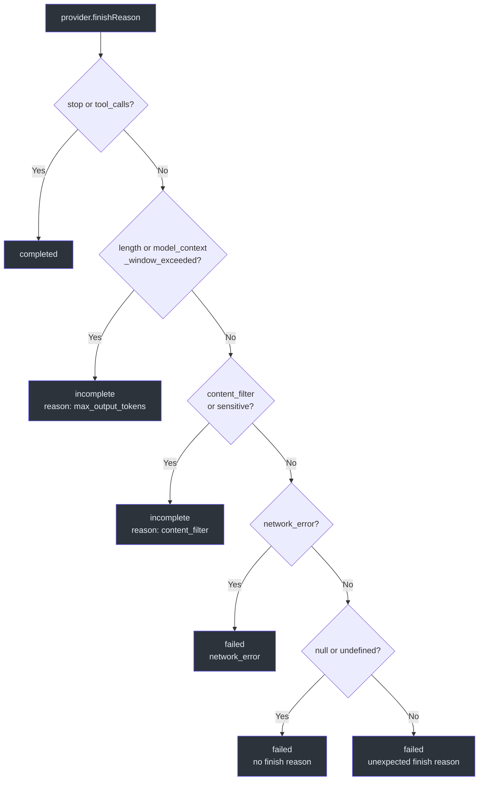
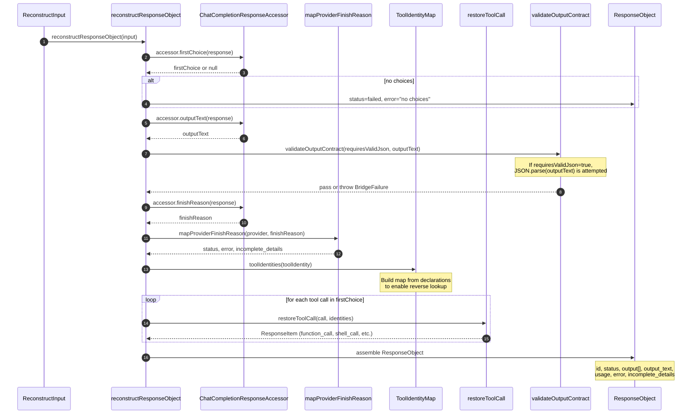
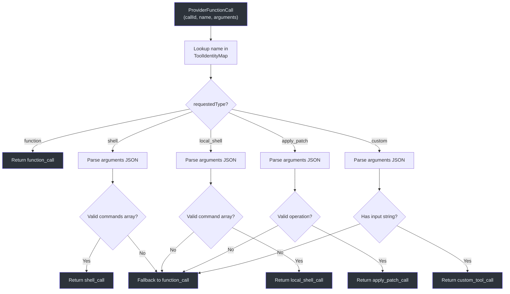
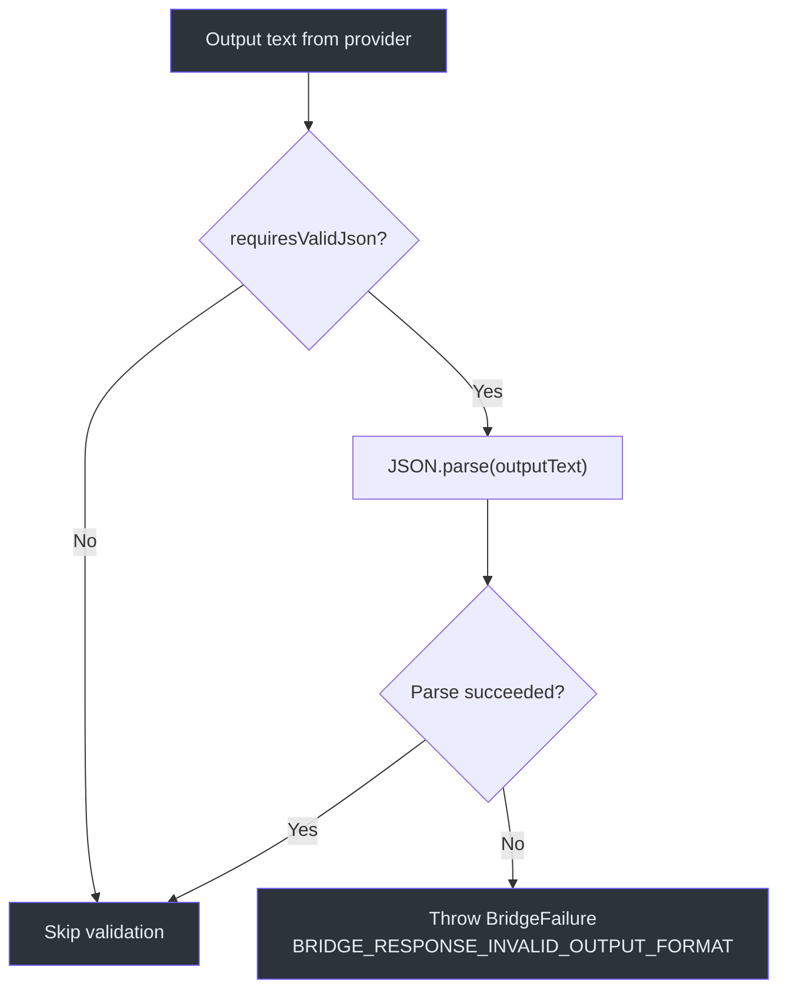

# Response Reconstruction

After an upstream provider returns a Chat Completions response, GodeX must reconstruct it into the shape of an OpenAI Responses API `ResponseObject`. This is the inverse of [Request Building](./request-building.md) -- tool calls must be restored to their original types, finish reasons must be mapped to the Responses status model, reasoning text must be extracted, and output contracts must be validated. The `reconstructResponseObject` function handles this entire transformation.

## At a Glance

| Step | Function | Purpose |
|------|----------|---------|
| 1 | `firstChoice` extraction | Get the first choice from the provider response |
| 2 | `outputText` extraction | Read the text content from the choice message |
| 3 | `validateOutputContract` | If `requiresValidJson`, parse and validate the output |
| 4 | `mapProviderFinishReason` | Map provider finish reason to Responses status |
| 5 | `restoreToolCall` (per call) | Restore each tool call to its original Responses type |
| 6 | Reasoning text extraction | Extract `reasoning_content` from the choice message |
| 7 | Assemble `ResponseObject` | Combine all parts into the final response |

## Finish Reason Mapping

Providers use various `finish_reason` strings. The `mapProviderFinishReason` function maps these to the Responses API's terminal states (`completed`, `incomplete`, `failed`):

| Provider `finish_reason` | Responses `status` | `incomplete_details.reason` | `error` |
|--------------------------|--------------------|----------------------------|---------|
| `stop` | `completed` | null | null |
| `tool_calls` | `completed` | null | null |
| `length` | `incomplete` | `"max_output_tokens"` | null |
| `model_context_window_exceeded` | `incomplete` | `"max_output_tokens"` | null |
| `content_filter` | `incomplete` | `"content_filter"` | null |
| `sensitive` | `incomplete` | `"content_filter"` | null |
| `network_error` | `failed` | null | `{ code: SERVER_ERROR, message }` |
| `null` / `undefined` | `failed` | null | `"Provider returned no finish reason"` |
| Any other value | `failed` | null | `"Unexpected finish reason"` |

## Reconstruction Sequence

## Tool Call Restoration

The `restoreToolCall` function uses the `ToolIdentityMap` to reverse the provider-side tool name back to the original Responses type. Each provider function call carries `(callId, name, arguments)`. The identity map provides the `requestedType` which determines the reconstruction path:

| `requestedType` | Reconstruction | Fallback |
|-----------------|---------------|----------|
| `function` | `{ type: "function_call", call_id, name, arguments }` | Always succeeds |
| `shell` | Parse `arguments` as JSON; extract `commands` array | Fallback to `function_call` |
| `local_shell` | Parse `arguments` as JSON; extract `command` array + env | Fallback to `function_call` |
| `apply_patch` | Parse `arguments` as JSON; extract `operation` object | Fallback to `function_call` |
| `custom` | Parse `arguments` as JSON; extract `input` string | Fallback to `function_call` |

When parsing fails (malformed JSON, missing fields), `restoreToolCall` falls back to a generic `function_call` ResponseItem using the `requestedName` from the identity map. This ensures the response is always valid even when the provider's output is unexpected.

## Tool Identity Map

The `ToolIdentityMap` is built during request building and carries the bidirectional mapping between requested tool names/types and provider tool names/types. During reconstruction it is used in reverse:

| Request-Building Direction | Reconstruction Direction |
|---------------------------|-------------------------|
| requestedName -> providerName | providerName -> requestedName |
| requestedType -> providerType | providerName -> requestedType |

The map enforces uniqueness: if two different tools map to the same provider name, a `BridgeError` is thrown during request building.

## Output Contract Validation

When the output contract was degraded (e.g., `json_schema` to `json_object` with `strict: true`), `requiresValidJson` is set. After reconstruction, `validateOutputContract` parses the output text as JSON:

- **Pass**: The response is valid JSON; the `ResponseObject` is returned normally.
- **Fail**: A `BridgeFailure` is thrown with code `BRIDGE_RESPONSE_INVALID_OUTPUT_FORMAT`, including the provider, model, and response ID in the metadata.

## ResponseObject Assembly

The final `ResponseObject` is assembled from all collected parts:

| Field | Source |
|-------|--------|
| `id` | Generated `responseId` from request identity |
| `object` | Always `"response"` |
| `created_at` | Timestamp from context creation |
| `completed_at` | Current timestamp at reconstruction |
| `status` | From `mapProviderFinishReason` |
| `model` | Resolved model name |
| `output` | Array of `ResponseItem`s: reasoning, tool calls, assistant message |
| `output_text` | Extracted text content |
| `usage` | From `accessor.usage()` |
| `error` | From finish reason mapping (null if completed) |
| `incomplete_details` | From finish reason mapping (null if completed) |

The `output` array is ordered: reasoning items first, then restored tool calls, then the assistant message (if there is text or no tool calls were present).

## Cross-References

- **[Architecture Overview](./architecture-overview.md)**: Where reconstruction fits in the full request lifecycle
- **[Compatibility](./compatibility.md)**: How the output contract is planned (including `requiresValidJson`)
- **[Request Building](./request-building.md)**: How tool identities and output contracts are established

## References

- [src/bridge/response/response-reconstructor.ts:1-196](https://github.com/Ahoo-Wang/GodeX/blob/main/src/bridge/response/response-reconstructor.ts#L1-L196) -- `reconstructResponseObject` and output assembly
- [src/bridge/finish-reason/finish-reason.ts:1-75](https://github.com/Ahoo-Wang/GodeX/blob/main/src/bridge/finish-reason/finish-reason.ts#L1-L75) -- `mapProviderFinishReason` with full provider-to-Responses mapping
- [src/bridge/tools/call-restorer.ts:1-178](https://github.com/Ahoo-Wang/GodeX/blob/main/src/bridge/tools/call-restorer.ts#L1-L178) -- `restoreToolCall` with type-specific parsing and fallbacks
- [src/bridge/tools/tool-identity.ts:1-72](https://github.com/Ahoo-Wang/GodeX/blob/main/src/bridge/tools/tool-identity.ts#L1-L72) -- `ToolIdentityMap` for bidirectional name/type lookup
- [src/bridge/output/output-validator.ts:1-30](https://github.com/Ahoo-Wang/GodeX/blob/main/src/bridge/output/output-validator.ts#L1-L30) -- `validateOutputContract` for degraded JSON Schema validation
- [src/bridge/output/validator.ts:1-47](https://github.com/Ahoo-Wang/GodeX/blob/main/src/bridge/output/validator.ts#L1-L47) -- `validateResponseOutputContract` extracting text from `ResponseObject`
