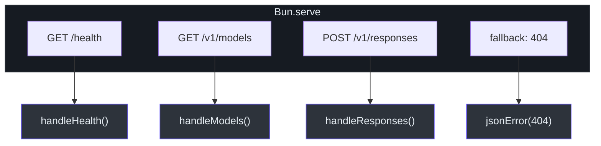
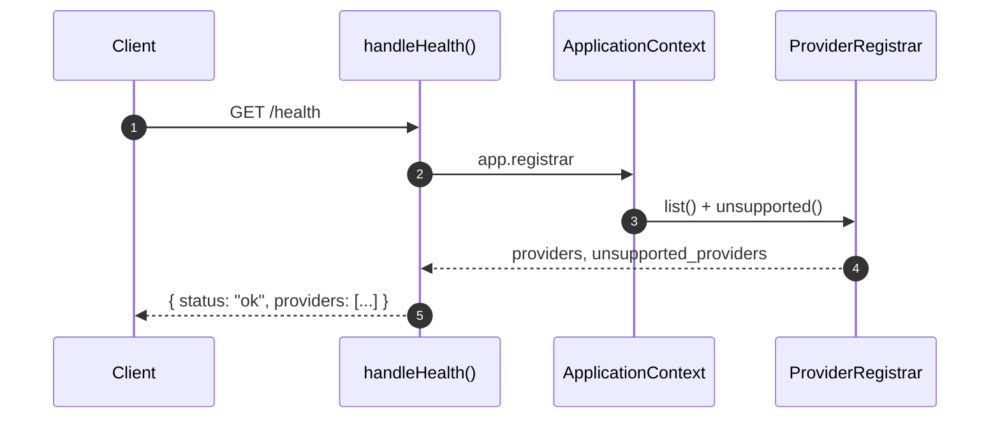
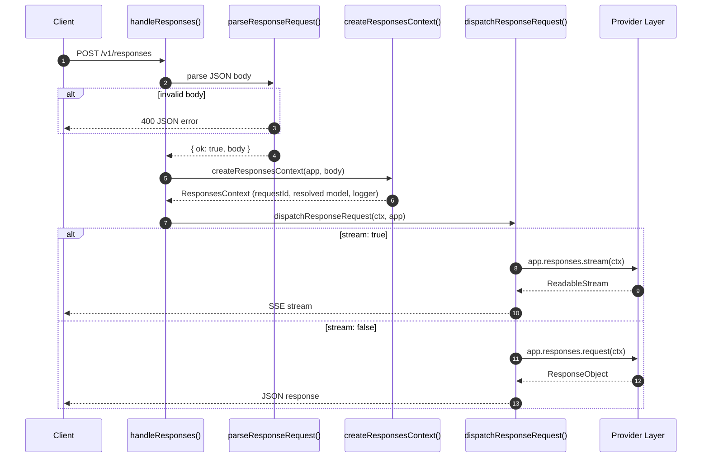
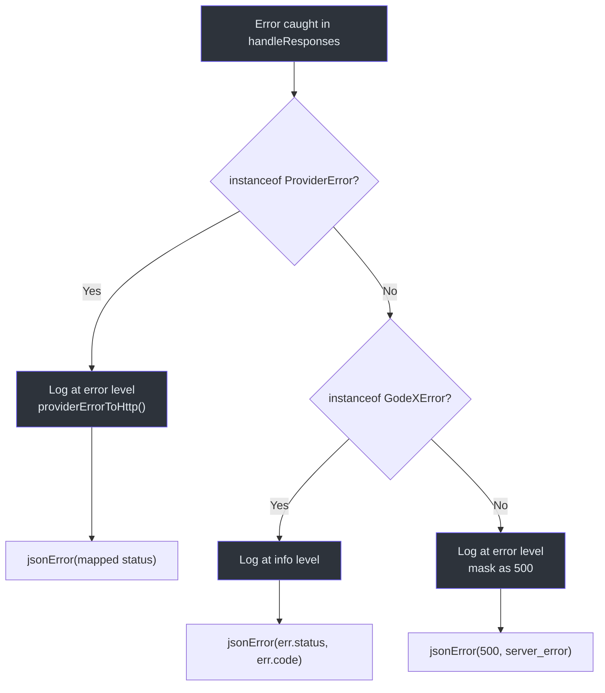

# Server Routes

GodeX runs on Bun's built-in HTTP server and exposes a small, purposeful set
of routes. Three endpoints cover the full operational surface: a health check
for load balancers, a model listing for client discovery, and the primary
`/v1/responses` endpoint that accepts OpenAI-compatible requests and either
returns a synchronous JSON response or streams Server-Sent Events. Every route
is wired through `ApplicationContext`, giving handlers access to the resolver,
logger, provider registrar, and session store without global singletons.

## At a Glance

| Aspect | Detail |
|---|---|
| HTTP server | `Bun.serve` with static route map |
| Routes | `/health`, `/v1/models`, `/v1/responses` |
| Streaming | SSE via `ResponseSseEncoder` |
| Error handling | `responseRouteErrorToResponse` with structured logging |
| Request tracing | `TraceRecordingContext` per request |

## Route Map



Routes are registered in `createBuiltinRoutes` at
[src/server/server.ts:21-27](https://github.com/Ahoo-Wang/GodeX/blob/main/src/server/server.ts#L21).
The server is started via `startServer` at
[line 29](https://github.com/Ahoo-Wang/GodeX/blob/main/src/server/server.ts#L29),
which passes the route map to `Bun.serve` along with hostname, port, and an
idle timeout. Unmatched paths fall through to a default `fetch` handler that
returns a 404 JSON error.

## /health



`handleHealth` at
[src/server/routes/health.ts:3-13](https://github.com/Ahoo-Wang/GodeX/blob/main/src/server/routes/health.ts#L3)
returns a JSON object with:

| Field | Type | Description |
|---|---|---|
| `status` | `string` | Always `"ok"` |
| `timestamp` | `number` | `Date.now()` at request time |
| `providers` | `string[]` | Registered provider IDs |
| `unsupported_providers` | `string[]` | Providers in config but not registered |

## /v1/models

`handleModels` at
[src/server/routes/models.ts:9-19](https://github.com/Ahoo-Wang/GodeX/blob/main/src/server/routes/models.ts#L9)
uses the `ModelResolver` to list configured aliases filtered to registered
providers.

Response format (OpenAI-compatible):

```json
{
  "object": "list",
  "data": [
    { "id": "gpt-4", "object": "model", "owned_by": "deepseek" }
  ]
}
```

## /v1/responses Request Lifecycle



### Step 1: Request Parsing

`parseResponseRequest` at
[src/server/routes/responses/request-parser.ts:13-70](https://github.com/Ahoo-Wang/GodeX/blob/main/src/server/routes/responses/request-parser.ts#L13)
validates:

| Check | Error Code | Status |
|---|---|---|
| Valid JSON body | `server.request.invalid_json` | 400 |
| Body is an object | `server.request.invalid_parameter` | 400 |
| No `previous_response_id` + `conversation` conflict | `server.request.invalid_parameter` | 400 |

### Step 2: Context Creation

`createResponsesContext` resolves the model, loads any session chain
referenced by `previous_response_id`, and creates a request-scoped logger
with a unique `requestId`.

### Step 3: Dispatch

`dispatchResponseRequest` at
[src/server/routes/responses/response-dispatcher.ts:7-21](https://github.com/Ahoo-Wang/GodeX/blob/main/src/server/routes/responses/response-dispatcher.ts#L7)
branches on `ctx.request.stream`:

- **Sync** -- calls `app.responses.request(ctx)` and returns `Response.json()`.
- **Stream** -- calls `app.responses.stream(ctx)`, pipes through
  `ResponseSseEncoder`, and returns with SSE headers.

### SSE Headers

`sseHeaders` at
[src/server/routes/responses/sse.ts:1-7](https://github.com/Ahoo-Wang/GodeX/blob/main/src/server/routes/responses/sse.ts#L1)
sets:

```
Content-Type: text/event-stream
Cache-Control: no-cache
Connection: keep-alive
```

## Error Handling



`responseRouteErrorToResponse` at
[src/server/routes/responses/error-handler.ts:12-50](https://github.com/Ahoo-Wang/GodeX/blob/main/src/server/routes/responses/error-handler.ts#L12)
handles errors in priority order, records trace errors, and attaches the
`x-request-id` header when available.

## Request Logging

Each request is logged via `responseRequestLogEntry` at
[src/server/routes/responses/request-log.ts:4-25](https://github.com/Ahoo-Wang/GodeX/blob/main/src/server/routes/responses/request-log.ts#L4),
which captures:

| Field | Description |
|---|---|
| `model` | Client-specified model selector |
| `resolved` | Provider + model after resolution |
| `stream` | Whether streaming was requested |
| `previous_response_id` | Session chain reference |
| `store` | Whether response should be persisted |
| `input_count` | Number of input items |
| `tools_count` | Number of tool definitions |

## Cross-References

- [Request Flow](./request-flow.md) -- full end-to-end pipeline
- [Model Resolution](./model-resolution.md) -- how the model field is resolved
- [Streaming Pipeline](../05-streaming-pipeline/overview.md) -- SSE encoding details
- [Error Handling](../06-error-handling/error-handling.md) -- error hierarchy and codes
- [Configuration Schema](../07-configuration/config-schema.md) -- server.host, server.port, idle_timeout
- [CLI](../01-getting-started/cli.md) -- `godex serve` command

## References

- [src/server/server.ts](https://github.com/Ahoo-Wang/GodeX/blob/main/src/server/server.ts) -- Bun.serve setup and route registration
- [src/server/routes/health.ts](https://github.com/Ahoo-Wang/GodeX/blob/main/src/server/routes/health.ts) -- health check handler
- [src/server/routes/models.ts](https://github.com/Ahoo-Wang/GodeX/blob/main/src/server/routes/models.ts) -- model listing handler
- [src/server/routes/responses/handler.ts](https://github.com/Ahoo-Wang/GodeX/blob/main/src/server/routes/responses/handler.ts) -- main responses handler
- [src/server/routes/responses/request-parser.ts](https://github.com/Ahoo-Wang/GodeX/blob/main/src/server/routes/responses/request-parser.ts) -- request validation
- [src/server/routes/responses/response-dispatcher.ts](https://github.com/Ahoo-Wang/GodeX/blob/main/src/server/routes/responses/response-dispatcher.ts) -- sync/stream dispatch
- [src/server/routes/responses/error-handler.ts](https://github.com/Ahoo-Wang/GodeX/blob/main/src/server/routes/responses/error-handler.ts) -- route error handler
- [src/server/routes/responses/sse.ts](https://github.com/Ahoo-Wang/GodeX/blob/main/src/server/routes/responses/sse.ts) -- SSE header utilities
- [src/server/routes/responses/request-log.ts](https://github.com/Ahoo-Wang/GodeX/blob/main/src/server/routes/responses/request-log.ts) -- request log entry builder
- [src/server/errors.ts](https://github.com/Ahoo-Wang/GodeX/blob/main/src/server/errors.ts) -- HTTP error mapping helpers
