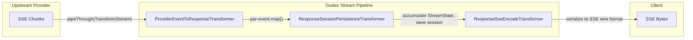

# Stream Pipeline

The streaming pipeline is the heart of Godex's real-time delivery. It chains three `TransformStream` stages to convert provider-specific SSE chunks into OpenAI Responses API events, while persisting session state along the way.

## Pipeline Overview

## Transformer Roles

| Stage | Transformer | Input | Output | Side Effects |
|-------|------------|-------|--------|-------------|
| 1 | `ProviderEventToResponseTransformer` | `JsonServerSentEvent` | `ResponseStreamEvent` | Calls `StreamMapper.map()` per event |
| 2 | `ResponseSessionPersistenceTransformer` | `ResponseStreamEvent` | `ResponseStreamEvent` | Accumulates `StreamState`, saves session on terminal event |
| 3 | `ResponseSseEncodeTransformer` | `ResponseStreamEvent` | `Uint8Array` | Serializes to `event:` / `data:` lines |

## Stream State Accumulation

The `ResponseSessionPersistenceTransformer` maintains a `StreamState` object throughout the stream:

- Collects output items (content, tool calls, etc.)
- Tracks token usage
- On the terminal event (`response.completed` or similar), calls `StreamMapper.buildResponseObject()` to construct the full `ResponseObject`
- Saves the resulting session via `SessionStore.save()`

When `store === false` on the request, this transformer is bypassed entirely.

[Provider Interface](/03-provider-development/provider-interface)
