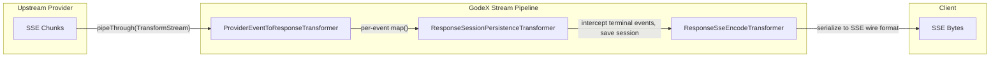

# Stream Pipeline

The streaming pipeline is the heart of GodeX's real-time delivery. It chains three `TransformStream` stages to convert provider-specific SSE chunks into OpenAI Responses API events, while persisting session state along the way.

## Pipeline Overview



## Transformer Roles

| Stage | Transformer | Input | Output | Side Effects |
|-------|------------|-------|--------|-------------|
| 1 | `ProviderEventToResponseTransformer` | `JsonServerSentEvent` | `ResponseStreamEvent` | Calls `StreamMapper.map()` per event |
| 2 | `ResponseSessionPersistenceTransformer` | `ResponseStreamEvent` | `ResponseStreamEvent` | Passes events through; on terminal events, saves the response via session store |
| 3 | `ResponseSseEncodeTransformer` | `ResponseStreamEvent` | `Uint8Array` | Serializes to `event:` / `data:` lines |

## Stream State Management

The `StreamResponseState` (from `src/adapter/mapper/stream-response-state.ts`) is a state machine that produces `ResponseStreamEvent` arrays from each method call. It is created by the provider's `StreamMapper` at the start of streaming and stored in `ResponsesContext.attributes` under the key `"stream-response-state"`.

The state tracks:
- Active output blocks (text, reasoning, refusal) currently accumulating deltas
- Tool call accumulators per call index
- Completed output items via `OutputCollectionState`
- A live `snapshot: ResponseObject` property that is always current

### Session Persistence

The `ResponseSessionPersistenceTransformer`:

- Passes all events through transparently
- On terminal events (`response.completed`, `response.incomplete`, `response.failed`), extracts the complete `ResponseObject` from the event and saves it via `SessionStore.save()`
- In `flush()`, if no terminal event was seen but the state has reached a terminal phase, saves the `StreamResponseState.snapshot`

When `store === false` on the request, this transformer is bypassed entirely.

## Phase Lifecycle

```
IDLE --> start() --> IN_PROGRESS --> onFinish() --> COMPLETED/INCOMPLETE
                              \--> onError()  --> FAILED
```

Each phase transition is validated; calls from an unexpected phase throw an `AdapterError` with appropriate error codes (`ADAPTER_STREAM_INVALID_TRANSITION`, `ADAPTER_STREAM_DELTA_AFTER_TERMINAL`, etc.).

[Provider Interface](/03-provider-development/provider-interface)
