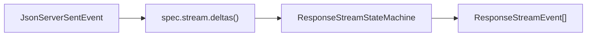

# Stream Pipeline

The streaming pipeline is the heart of GodeX's real-time delivery. It chains composable `TransformStream` stages to convert provider-specific SSE chunks into OpenAI Responses API events, while validating output contracts, recording traces, logging diagnostics, and persisting sessions.

## Pipeline Overview

```mermaid
flowchart LR
  subgraph upstream["Upstream Provider"]
    SSE["SSE Chunks"]
  end

  subgraph godex["GodeX Stream Pipeline"]
    T0["TraceTransformer (raw)"]
    T1["ProviderStreamEventBridge"]
    ERR["StreamErrorHandler"]
    T2["ResponseOutputContractValidationTransformer"]
    T3["TraceTransformer (transformed)"]
    T4["ResponseLogTransformer"]
    T5["ResponseSessionPersistenceTransformer"]
    T6["CompatibilityLogTransformer"]
  end

  subgraph server["Server Route"]
    SSE_ENC["ResponseSseEncoder"]
  end

  subgraph client["Client"]
    BYTES["SSE Bytes"]
  end

  SSE --> T0 --> T1 --> ERR --> T2 --> T3 --> T4 --> T5 --> T6 --> SSE_ENC --> BYTES
```

## Transformer Roles

| Stage | Transformer | Input | Output | Side Effects |
|-------|------------|-------|--------|-------------|
| 1 | `TraceTransformer (raw)` | `JsonServerSentEvent` | `JsonServerSentEvent` | Records raw upstream events to trace |
| 2 | `ProviderStreamEventBridge` | `JsonServerSentEvent` | `ResponseStreamEvent` | Maps provider deltas through `ResponseStreamStateMachine` |
| 3 | `StreamErrorHandler` | `ResponseStreamEvent` | `ResponseStreamEvent` | Catches stream errors, emits `response.failed` |
| 4 | `ResponseOutputContractValidationTransformer` | `ResponseStreamEvent` | `ResponseStreamEvent` | Validates structured output on terminal events |
| 5 | `TraceTransformer (transformed)` | `ResponseStreamEvent` | `ResponseStreamEvent` | Records transformed events to trace |
| 6 | `ResponseLogTransformer` | `ResponseStreamEvent` | `ResponseStreamEvent` | Logs completion/incomplete/failed events |
| 7 | `ResponseSessionPersistenceTransformer` | `ResponseStreamEvent` | `ResponseStreamEvent` | Saves session on terminal events |
| 8 | `CompatibilityLogTransformer` | `ResponseStreamEvent` | `ResponseStreamEvent` | Logs compatibility diagnostics at stream end |
| - | `ResponseSseEncoder` (in server route) | `ResponseStreamEvent` | `Uint8Array` | Serializes to SSE wire format |

## ProviderStreamEventBridge

This is the core bridging transformer. For each incoming SSE chunk from the provider:

1. Calls `ctx.provider.spec.stream.deltas(event.data)` to extract typed deltas from the raw chunk.
2. Feeds deltas into `ResponseStreamStateMachine` which produces `ResponseStreamEvent` arrays.

### Session Persistence

The `ResponseSessionPersistenceTransformer` passes all events through transparently. On terminal events (`response.completed`, `response.incomplete`, `response.failed`), it extracts the complete `ResponseObject` from the event and saves it via `SessionStore.save()`.

When `store === false` on the request, this transformer is bypassed entirely.

[Provider Interface](/03-provider-development/provider-interface)
