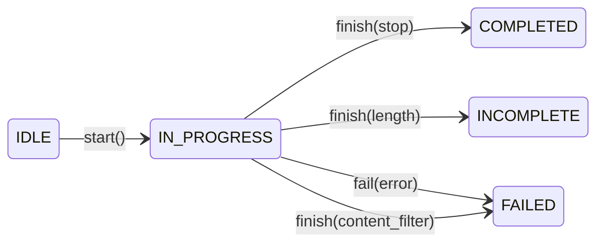
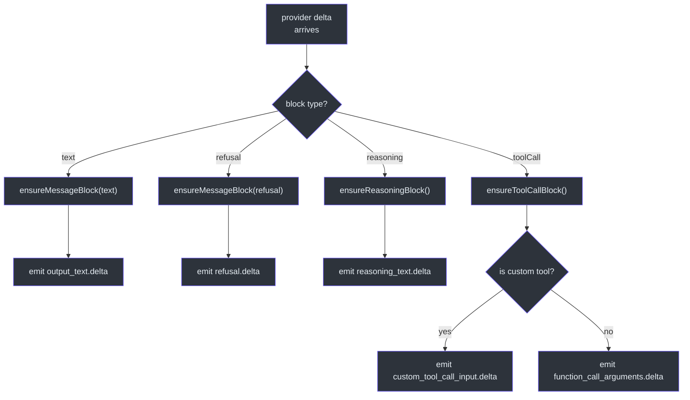
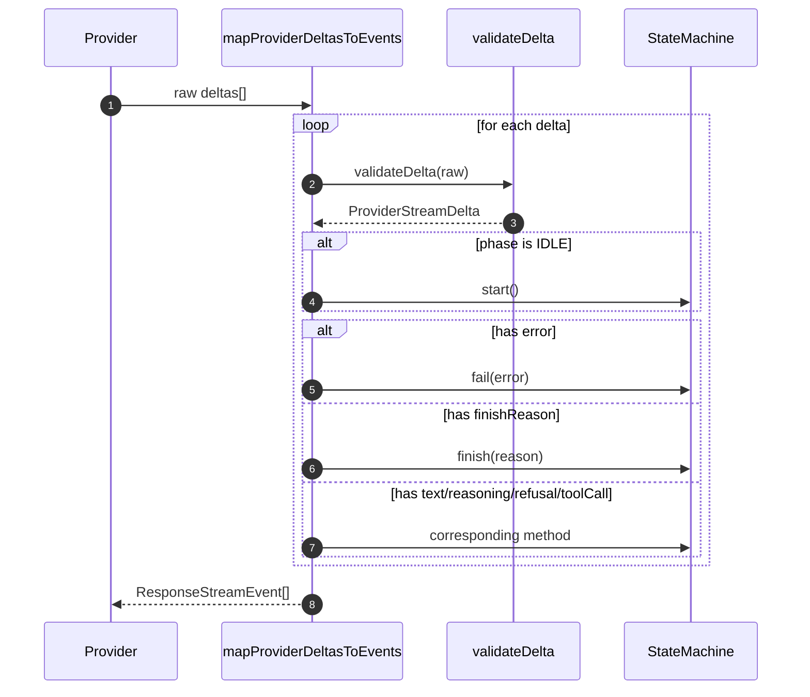
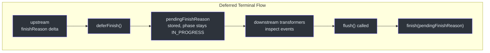

# Stream Reconstruction

Stream reconstruction is the bridge layer that translates heterogeneous provider stream deltas into a uniform sequence of OpenAI-compatible `ResponseStreamEvent` objects. Without it, every upstream provider would emit chunks in its own shape, and downstream consumers (SSE encoders, trace loggers, session persistence) would need provider-specific logic. The reconstruction layer gives GodeX a single, predictable event model regardless of which LLM provider is handling the request.

## At a Glance

| Concern | Component | Key File |
|---------|-----------|----------|
| State machine phases | `ResponseStreamStateMachine` | [response-stream-state-machine.ts:37](https://github.com/Ahoo-Wang/GodeX/blob/main/src/bridge/stream/response-stream-state-machine.ts#L37) |
| Delta-to-event mapping | `mapProviderDeltasToEvents` | [stream-reconstructor.ts:17](https://github.com/Ahoo-Wang/GodeX/blob/main/src/bridge/stream/stream-reconstructor.ts#L17) |
| Delta validation | `validateDelta` + helpers | [stream-reconstructor.ts:69](https://github.com/Ahoo-Wang/GodeX/blob/main/src/bridge/stream/stream-reconstructor.ts#L69) |
| Delta type contract | `ProviderStreamDelta` | [stream-delta.ts:28](https://github.com/Ahoo-Wang/GodeX/blob/main/src/bridge/stream/stream-delta.ts#L28) |
| Deferred terminal events | `deferFinish` / `deferTerminal` | [response-stream-state-machine.ts:263](https://github.com/Ahoo-Wang/GodeX/blob/main/src/bridge/stream/response-stream-state-machine.ts#L263) |

## Stream State Machine Phases

The `ResponseStreamPhase` enum defines five phases that every stream passes through:

| Phase | Description |
|-------|-------------|
| `IDLE` | Initial state; no events emitted yet |
| `IN_PROGRESS` | Stream is actively receiving deltas |
| `COMPLETED` | Stream finished normally |
| `INCOMPLETE` | Stream hit a length or context-window limit |
| `FAILED` | Stream terminated due to an error |

The transition logic lives in [response-stream-state-machine.ts:787](https://github.com/Ahoo-Wang/GodeX/blob/main/src/bridge/stream/response-stream-state-machine.ts#L787), which maps the provider finish reason to the correct terminal phase.

## Block Management

While in the `IN_PROGRESS` phase, the state machine manages four categories of output blocks:

| Block Type | Fields | Tracked By |
|------------|--------|------------|
| Text | `itemId`, `outputIndex`, `contentIndex`, `text` | `activeText` |
| Refusal | same shape as Text | `activeRefusal` |
| Reasoning | `itemId`, `outputIndex`, `contentIndex`, `text` | `activeReasoning` |
| Tool Call | `callId`, `providerName`, `arguments`, `customInput` | `activeToolCalls` Map |

Each block is lazily created on its first delta and closed when the stream reaches a terminal phase via `closeActiveBlocks` ([response-stream-state-machine.ts:428](https://github.com/Ahoo-Wang/GodeX/blob/main/src/bridge/stream/response-stream-state-machine.ts#L428)).

## Delta Validation Pipeline

`mapProviderDeltasToEvents` ([stream-reconstructor.ts:17](https://github.com/Ahoo-Wang/GodeX/blob/main/src/bridge/stream/stream-reconstructor.ts#L17)) is the core loop. Before any state machine transition, every raw delta passes through `validateDelta` which enforces the `ProviderStreamDelta` contract ([stream-delta.ts:28](https://github.com/Ahoo-Wang/GodeX/blob/main/src/bridge/stream/stream-delta.ts#L28)).

| Validated Field | Rules |
|----------------|-------|
| `text` | Optional string |
| `reasoning` | Optional string |
| `refusal` | Optional string |
| `toolCall` | Optional object; `index` must be non-negative integer; `id`/`type`/`name`/`arguments` must be strings |
| `usage` | Object with required `input_tokens`, `output_tokens`, `total_tokens` (finite numbers) |
| `finishReason` | String, null, or undefined |
| `error` | Object with required `message` string and optional `code` string |

Unrecognized fields cause a `BridgeError` with code `BRIDGE_STREAM_INVALID_TRANSITION` ([stream-reconstructor.ts:120](https://github.com/Ahoo-Wang/GodeX/blob/main/src/bridge/stream/stream-reconstructor.ts#L120)).

## Deferred Terminal Events

When `deferTerminal` is true (as it is in the streaming pipeline), the state machine's `deferFinish` method stores the finish reason without transitioning to a terminal phase ([response-stream-state-machine.ts:263](https://github.com/Ahoo-Wang/GodeX/blob/main/src/bridge/stream/response-stream-state-machine.ts#L263)). This allows downstream transformers -- notably the output contract validation transformer -- to inspect and potentially rewrite the terminal event before it reaches the client.

The `ProviderStreamEventBridge.flush` method ([stream-pipeline.ts:123](https://github.com/Ahoo-Wang/GodeX/blob/main/src/responses/stream-pipeline.ts#L123)) calls `machine.finish(machine.deferredFinishReason)` when the upstream stream closes, ensuring the terminal event is always emitted.

## Tool Call Reconstruction

Tool call blocks are tracked by `streamIndex` in a `Map<number, ToolCallBlock>` ([response-stream-state-machine.ts:94](https://github.com/Ahoo-Wang/GodeX/blob/main/src/bridge/stream/response-stream-state-machine.ts#L94)). When a tool call block is closed, the state machine:

1. Verifies both `callId` and `providerName` are present (otherwise throws `BRIDGE_STREAM_INCOMPLETE_TOOL_CALL`)
2. Checks the `ToolIdentityMap` to determine if the tool is a custom tool
3. Calls `restoreToolCall` from [call-restorer.ts:16](https://github.com/Ahoo-Wang/GodeX/blob/main/src/bridge/tools/call-restorer.ts#L16) to map the provider function call back to the correct Responses API type (`function_call`, `local_shell_call`, `shell_call`, `apply_patch_call`, or `custom_tool_call`)

## Error Normalization

Provider errors are normalized through `normalizeError` ([response-stream-state-machine.ts:753](https://github.com/Ahoo-Wang/GodeX/blob/main/src/bridge/stream/response-stream-state-machine.ts#L753)), which maps the provider error code against a known set of `ResponseErrorCode` values. Unknown codes fall back to `server_error`.

## Cross-References

- [Streaming Pipeline](./streaming-pipeline.md) -- orchestrates the transform chain that feeds into this state machine
- [Output Contracts](./output-contracts.md) -- uses deferred terminal events for JSON validation
- [Tool Planning](./tool-planning.md) -- produces the `ToolIdentityMap` consumed during tool call reconstruction
- [Sync Pipeline](./sync-pipeline.md) -- non-streaming counterpart that reconstructs a complete `ResponseObject`

## References

- [response-stream-state-machine.ts:37](https://github.com/Ahoo-Wang/GodeX/blob/main/src/bridge/stream/response-stream-state-machine.ts#L37) -- `ResponseStreamPhase` enum definition
- [response-stream-state-machine.ts:86](https://github.com/Ahoo-Wang/GodeX/blob/main/src/bridge/stream/response-stream-state-machine.ts#L86) -- `ResponseStreamStateMachine` class
- [stream-reconstructor.ts:17](https://github.com/Ahoo-Wang/GodeX/blob/main/src/bridge/stream/stream-reconstructor.ts#L17) -- `mapProviderDeltasToEvents` function
- [stream-reconstructor.ts:69](https://github.com/Ahoo-Wang/GodeX/blob/main/src/bridge/stream/stream-reconstructor.ts#L69) -- `validateDelta` function
- [stream-delta.ts:28](https://github.com/Ahoo-Wang/GodeX/blob/main/src/bridge/stream/stream-delta.ts#L28) -- `ProviderStreamDelta` interface
- [response-stream-state-machine.ts:263](https://github.com/Ahoo-Wang/GodeX/blob/main/src/bridge/stream/response-stream-state-machine.ts#L263) -- `deferFinish` method
- [response-stream-state-machine.ts:428](https://github.com/Ahoo-Wang/GodeX/blob/main/src/bridge/stream/response-stream-state-machine.ts#L428) -- `closeActiveBlocks` method
