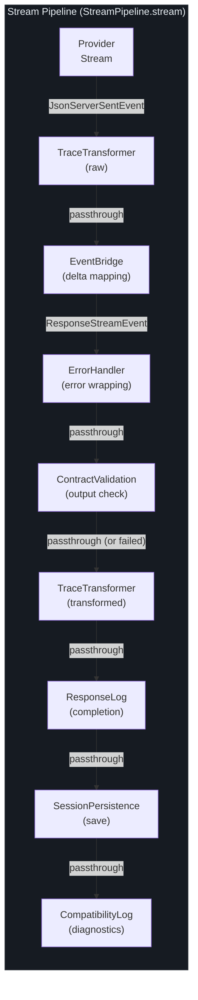
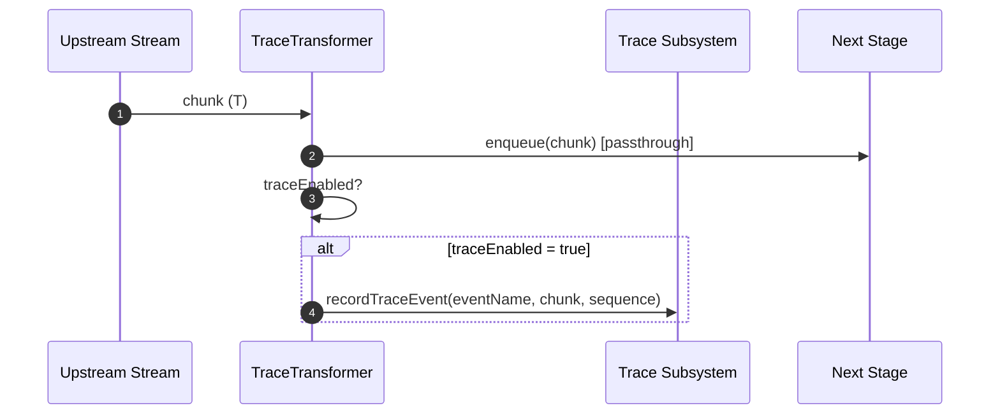
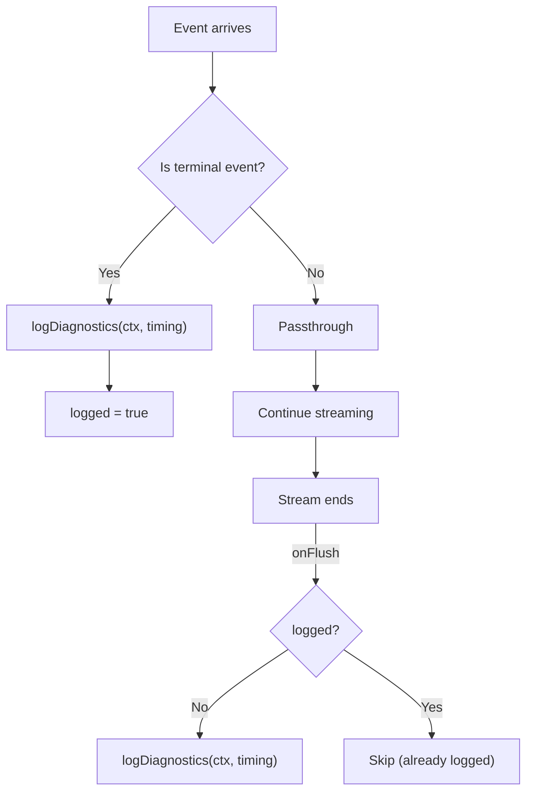
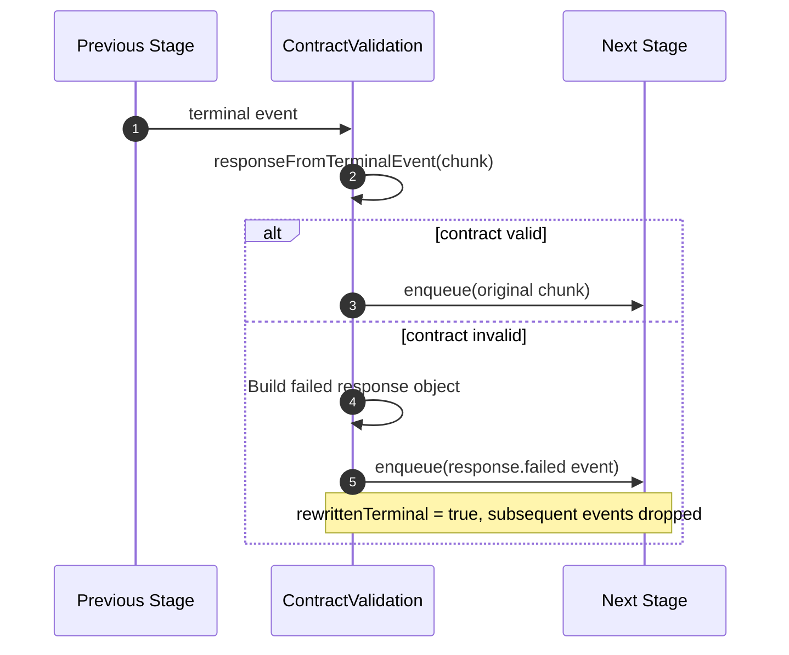
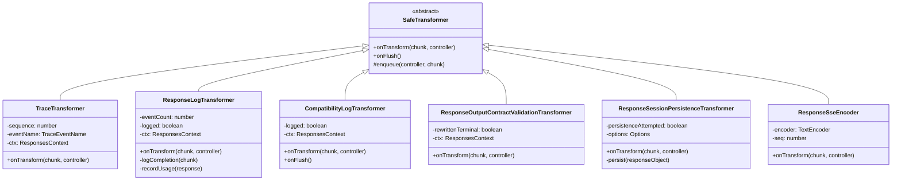

# Stream Transforms

When GodeX proxies a streaming response from an upstream LLM provider, the raw SSE byte stream must pass through several processing stages before it reaches the client. Each stage is implemented as a composable `TransformStream` transformer in `src/responses/stream-transforms/`. This design keeps every concern isolated and testable -- tracing records events without touching logging, contract validation can fail the response without affecting persistence, and SSE encoding happens at the edge without any upstream awareness. Understanding the transform chain is essential for debugging streaming behavior, adding new cross-cutting concerns, or extending the response pipeline.

## At a Glance

| Transformer | Input Type | Output Type | Purpose |
|---|---|---|---|
| `TraceTransformer` | `T` | `T` | Records raw/transformed events to the trace subsystem |
| `ProviderStreamEventBridge` | `JsonServerSentEvent` | `ResponseStreamEvent` | Maps provider deltas to OpenAI-compatible events |
| `wrapWithErrorHandler` | `ResponseStreamEvent` | `ResponseStreamEvent` | Converts stream errors into `response.failed` events |
| `ResponseOutputContractValidationTransformer` | `ResponseStreamEvent` | `ResponseStreamEvent` | Validates output contract on terminal events |
| `ResponseLogTransformer` | `ResponseStreamEvent` | `ResponseStreamEvent` | Logs stream completion with timing and usage |
| `ResponseSessionPersistenceTransformer` | `ResponseStreamEvent` | `ResponseStreamEvent` | Persists session on stream completion |
| `CompatibilityLogTransformer` | `ResponseStreamEvent` | `ResponseStreamEvent` | Logs compatibility diagnostics at stream end |
| `ResponseSseEncoder` | `ResponseStreamEvent` | `Uint8Array` | Encodes events to SSE text lines |

## Transform Chain Order

The `StreamPipeline.stream()` method in [src/responses/stream-pipeline.ts](https://github.com/Ahoo-Wang/GodeX/blob/main/src/responses/stream-pipeline.ts) assembles the full chain. Every stage is connected via the `pipeTransform` helper from [src/responses/stream-transforms/stream-utils.ts:6](https://github.com/Ahoo-Wang/GodeX/blob/main/src/responses/stream-transforms/stream-utils.ts#L6), which wraps each transformer in a standard `TransformStream`.



The pipeline is assembled at [src/responses/stream-pipeline.ts:37](https://github.com/Ahoo-Wang/GodeX/blob/main/src/responses/stream-pipeline.ts#L37) and each `pipeTransform` call chains the previous `ReadableStream` into the next transformer.

## The pipeTransform Helper

All chaining uses a single utility function:

```typescript
export function pipeTransform<I, O>(
  stream: ReadableStream<I>,
  transformer: Transformer<I, O>,
): ReadableStream<O>
```

Defined at [src/responses/stream-transforms/stream-utils.ts:6](https://github.com/Ahoo-Wang/GodeX/blob/main/src/responses/stream-transforms/stream-utils.ts#L6), it creates a new `TransformStream` from any `Transformer` and pipes the input stream through it. This keeps the pipeline composable -- each stage is an independent transformer that can be tested in isolation.

The module also exports `ATTR_UPSTREAM_LATENCY_MILLIS` ([stream-utils.ts:13](https://github.com/Ahoo-Wang/GodeX/blob/main/src/responses/stream-transforms/stream-utils.ts#L13)) and `responseFromTerminalEvent` ([stream-utils.ts:15](https://github.com/Ahoo-Wang/GodeX/blob/main/src/responses/stream-transforms/stream-utils.ts#L15)), both of which are used by multiple downstream transformers.

## TraceTransformer

The `TraceTransformer` is a passthrough transformer that records every stream event to the trace subsystem. It appears **twice** in the pipeline -- once before the event bridge (recording raw upstream events) and once after validation (recording transformed events).



Key implementation details:

- Extends `SafeTransformer<T, T>` from `@ahoo-wang/fetcher-eventstream`, which provides error-safe passthrough semantics
- Maintains an auto-incrementing `sequence` counter for ordered trace records
- Short-circuits if `ctx.app.traceEnabled` is false -- no allocation overhead when tracing is off
- Source: [src/responses/stream-transforms/trace-transformer.ts:8](https://github.com/Ahoo-Wang/GodeX/blob/main/src/responses/stream-transforms/trace-transformer.ts#L8)

## ResponseLogTransformer

The `ResponseLogTransformer` watches for terminal events and logs a structured completion record with timing, usage, and latency data.

| Logged Field | Source |
|---|---|
| `status` | `response.status` from terminal event |
| `model` | `response.model` |
| `outputCount` | `response.output.length` |
| `durationMillis` | `Date.now() - ctx.createdAt * 1000` |
| `usage` | `response.usage` |
| `cacheHitRatio` | Computed from usage via `cacheHitRatioFromResponseUsage` |
| `upstreamLatencyMillis` | Read from `ctx.attributes` (set during provider exchange) |
| `streamEventCount` | Events seen so far |

It also records usage to the trace subsystem via `recordTraceUsage` ([src/responses/stream-transforms/response-log-transformer.ts:13](https://github.com/Ahoo-Wang/GodeX/blob/main/src/responses/stream-transforms/response-log-transformer.ts#L13)). The transformer fires exactly once -- subsequent terminal events are ignored via the `logged` guard.

## CompatibilityLogTransformer

The `CompatibilityLogTransformer` emits compatibility diagnostics at stream end. It checks for terminal events (`response.completed`, `response.failed`, `response.incomplete`, `response.cancelled`) and calls `logDiagnostics` with timing data.



The `onFlush` fallback at [src/responses/stream-transforms/compatibility-log-transformer.ts:24](https://github.com/Ahoo-Wang/GodeX/blob/main/src/responses/stream-transforms/compatibility-log-transformer.ts#L24) ensures diagnostics are logged even if the stream closes without a terminal event. The severity of the log entry matches the worst diagnostic -- errors at `error` level, warnings at `warn` level, and informational diagnostics at `info` level.

## ResponseOutputContractValidationTransformer

This transformer validates the output contract when a terminal event arrives. If the response output does not satisfy the contract (for example, `json_schema` format was requested but the output is not valid JSON), the transformer **rewrites** the terminal event into a `response.failed` event.



Once a terminal event is rewritten, all subsequent events are silently dropped (`if (this.rewrittenTerminal) return` at [src/responses/stream-transforms/response-output-contract-validation-transformer.ts:22](https://github.com/Ahoo-Wang/GodeX/blob/main/src/responses/stream-transforms/response-output-contract-validation-transformer.ts#L22)). This prevents partial output from leaking to the client after a contract failure.

## ResponseSessionPersistenceTransformer

The `ResponseSessionPersistenceTransformer` saves the completed response to the session store when the stream finishes. It delegates to a pluggable `saveSession` callback (defaulting to `saveResponseSession` from the persistence module).

Key behaviors:

- Passes every event through immediately via `enqueue` before attempting persistence
- Guards against duplicate persistence with the `persistenceAttempted` flag
- Skipped entirely when `ctx.request.store === false` (the `StreamPipeline` checks this before adding the transformer at [src/responses/stream-pipeline.ts:74](https://github.com/Ahoo-Wang/GodeX/blob/main/src/responses/stream-pipeline.ts#L74))
- Catches and logs session save errors at `warn` level without failing the stream

Source: [src/responses/stream-transforms/response-session-persistence-transformer.ts:19](https://github.com/Ahoo-Wang/GodeX/blob/main/src/responses/stream-transforms/response-session-persistence-transformer.ts#L19)

## ResponseSseEncoder

The `ResponseSseEncoder` is the final stage that converts `ResponseStreamEvent` objects into SSE wire format. Unlike the other transformers, it changes the output type from `ResponseStreamEvent` to `Uint8Array`.

Each event is encoded as:

```
event: <event.type>
data: <JSON payload with sequence_number>

```

The encoder tracks sequence numbers, using the event's own `sequence_number` if present, or auto-incrementing otherwise ([src/responses/stream-transforms/response-sse-encoder.ts:4](https://github.com/Ahoo-Wang/GodeX/blob/main/src/responses/stream-transforms/response-sse-encoder.ts#L4)).

This transformer is applied at the HTTP dispatch layer, not inside `StreamPipeline`. The [response dispatcher](https://github.com/Ahoo-Wang/GodeX/blob/main/src/server/routes/responses/response-dispatcher.ts) adds it as the final step:

```typescript
const sseBody = pipeTransform(eventStream, new ResponseSseEncoder());
```

## Shared Patterns

All transformers follow a consistent design pattern:

| Pattern | Implementation |
|---|---|
| Base class | `SafeTransformer<I, O>` from `@ahoo-wang/fetcher-eventstream` |
| Passthrough | Call `this.enqueue(controller, chunk)` before doing work |
| Once-only actions | Boolean guards (`logged`, `logged`, `persistenceAttempted`, `rewrittenTerminal`) |
| Context access | All transformers receive `ResponsesContext` via constructor |
| Error safety | `SafeTransformer` base class ensures errors in `onTransform` do not crash the stream |



## Adding a New Transform Stage

To add a new concern to the pipeline:

1. Create a new file in `src/responses/stream-transforms/` extending `SafeTransformer`
2. Implement `onTransform(chunk, controller)` -- always call `this.enqueue(controller, chunk)` to pass data through
3. Add an `export *` to [src/responses/stream-transforms/index.ts](https://github.com/Ahoo-Wang/GodeX/blob/main/src/responses/stream-transforms/index.ts)
4. Insert a `pipeTransform` call at the correct position in `StreamPipeline.stream()` at [src/responses/stream-pipeline.ts](https://github.com/Ahoo-Wang/GodeX/blob/main/src/responses/stream-pipeline.ts)
5. Add a co-located `.test.ts` file following the existing test patterns

## Cross-References

- [Stream Pipeline](./streaming-pipeline.md) -- how transforms assemble into the full streaming pipeline
- [Architecture Overview](./overview.md) -- system-level context for where stream transforms fit
- [Error Handling](../06-error-handling/error-handling.md) -- the `wrapWithErrorHandler` stage and error propagation
- [Session Management](../04-session-management/session-stores.md) -- how the persistence transformer saves sessions
- [Testing](../08-testing/testing.md) -- co-located unit tests for each transformer
- [Trace System](../10-trace/trace-system.md) -- how `TraceTransformer` feeds the trace subsystem

## References

1. [src/responses/stream-transforms/trace-transformer.ts](https://github.com/Ahoo-Wang/GodeX/blob/main/src/responses/stream-transforms/trace-transformer.ts) -- Raw and transformed event tracing
2. [src/responses/stream-transforms/response-log-transformer.ts](https://github.com/Ahoo-Wang/GodeX/blob/main/src/responses/stream-transforms/response-log-transformer.ts) -- Completion logging with usage
3. [src/responses/stream-transforms/compatibility-log-transformer.ts](https://github.com/Ahoo-Wang/GodeX/blob/main/src/responses/stream-transforms/compatibility-log-transformer.ts) -- Compatibility diagnostics logging
4. [src/responses/stream-transforms/response-output-contract-validation-transformer.ts](https://github.com/Ahoo-Wang/GodeX/blob/main/src/responses/stream-transforms/response-output-contract-validation-transformer.ts) -- Output contract validation and rewriting
5. [src/responses/stream-transforms/response-session-persistence-transformer.ts](https://github.com/Ahoo-Wang/GodeX/blob/main/src/responses/stream-transforms/response-session-persistence-transformer.ts) -- Session persistence on completion
6. [src/responses/stream-transforms/response-sse-encoder.ts](https://github.com/Ahoo-Wang/GodeX/blob/main/src/responses/stream-transforms/response-sse-encoder.ts) -- SSE wire format encoding
7. [src/responses/stream-transforms/stream-utils.ts](https://github.com/Ahoo-Wang/GodeX/blob/main/src/responses/stream-transforms/stream-utils.ts) -- `pipeTransform` helper and shared utilities
8. [src/responses/stream-transforms/index.ts](https://github.com/Ahoo-Wang/GodeX/blob/main/src/responses/stream-transforms/index.ts) -- Barrel re-exports
9. [src/responses/stream-pipeline.ts:37-85](https://github.com/Ahoo-Wang/GodeX/blob/main/src/responses/stream-pipeline.ts#L37) -- Pipeline assembly
10. [src/server/routes/responses/response-dispatcher.ts](https://github.com/Ahoo-Wang/GodeX/blob/main/src/server/routes/responses/response-dispatcher.ts) -- Where SSE encoding is applied
