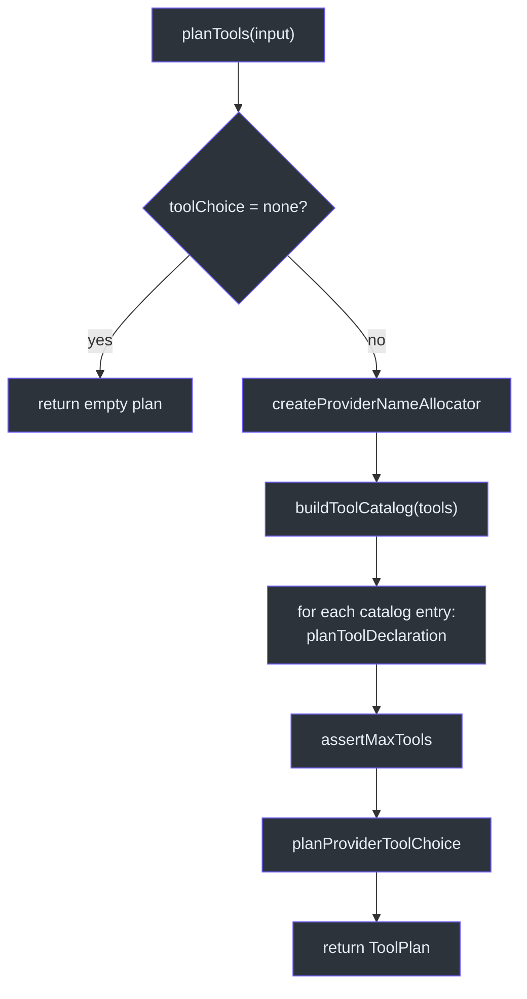
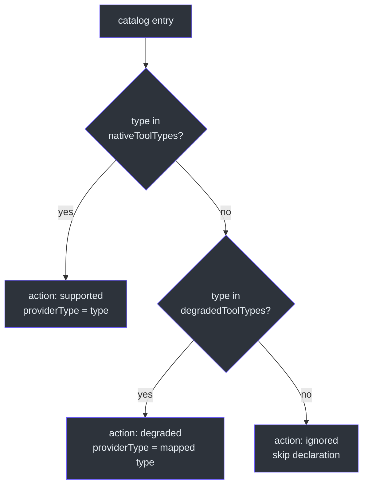
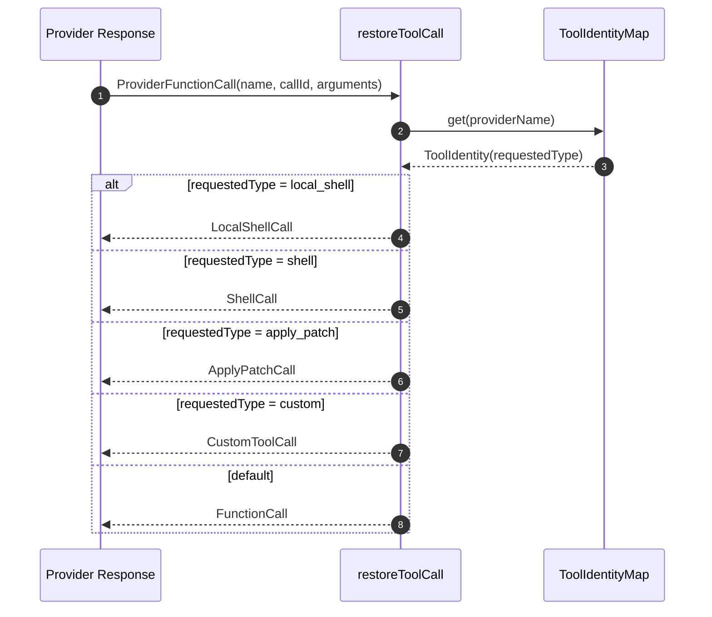

# Tool Planning

Tool planning is the process by which GodeX takes a unified set of Responses API tool declarations and produces a provider-specific tool configuration. Because providers support different tool types, have varying limits on tool counts, and use different naming conventions, GodeX must decide for each tool whether it can be passed through natively, degraded to a compatible type, or ignored entirely. This planning happens once per request and its results are consumed by both the request builder and the response reconstructor.

## At a Glance

| Concern | Component | Key File |
|---------|-----------|----------|
| Tool plan orchestration | `planTools` | [tool-plan.ts:66](https://github.com/Ahoo-Wang/GodeX/blob/main/src/bridge/tools/tool-plan.ts#L66) |
| Catalog builder | `buildToolCatalog` | [tool-catalog.ts:9](https://github.com/Ahoo-Wang/GodeX/blob/main/src/bridge/tools/tool-catalog.ts#L9) |
| Per-tool declaration | `planToolDeclaration` | [tool-plan.ts:108](https://github.com/Ahoo-Wang/GodeX/blob/main/src/bridge/tools/tool-plan.ts#L108) |
| Name allocation | `createProviderNameAllocator` | [tool-plan.ts:157](https://github.com/Ahoo-Wang/GodeX/blob/main/src/bridge/tools/tool-plan.ts#L157) |
| Identity mapping | `ToolIdentityMap` | [tool-identity.ts:18](https://github.com/Ahoo-Wang/GodeX/blob/main/src/bridge/tools/tool-identity.ts#L18) |
| Call restoration | `restoreToolCall` | [call-restorer.ts:16](https://github.com/Ahoo-Wang/GodeX/blob/main/src/bridge/tools/call-restorer.ts#L16) |
| Declaration rendering | `renderProviderToolDeclarations` | [declaration-renderer.ts:29](https://github.com/Ahoo-Wang/GodeX/blob/main/src/bridge/tools/declaration-renderer.ts#L29) |
| Tool choice planning | `planProviderToolChoice` | [tool-plan.ts:198](https://github.com/Ahoo-Wang/GodeX/blob/main/src/bridge/tools/tool-plan.ts#L198) |

## Planning Flow

The `planTools` function ([tool-plan.ts:66](https://github.com/Ahoo-Wang/GodeX/blob/main/src/bridge/tools/tool-plan.ts#L66)) orchestrates the full planning process:

## Per-Tool Decision Logic

For each tool in the catalog, `planToolDeclaration` ([tool-plan.ts:108](https://github.com/Ahoo-Wang/GodeX/blob/main/src/bridge/tools/tool-plan.ts#L108)) makes one of three decisions:

| Decision | Condition | Outcome |
|----------|-----------|---------|
| **supported** | Tool type in `nativeToolTypes` | Pass through with same type |
| **degraded** | Tool type in `degradedToolTypes` | Map to provider-compatible type |
| **ignored** | Tool type not supported at all | Skip declaration entirely |

## Provider Name Allocation

Provider naming constraints require sanitized, unique tool names. The `createProviderNameAllocator` ([tool-plan.ts:157](https://github.com/Ahoo-Wang/GodeX/blob/main/src/bridge/tools/tool-plan.ts#L157)) returns a closure that:

1. Applies the `toProviderName` codec (defaults to `defaultToolNameCodec` from [tool-identity.ts:54](https://github.com/Ahoo-Wang/GodeX/blob/main/src/bridge/tools/tool-identity.ts#L54))
2. Sanitizes names to alphanumeric, underscore, and hyphen characters (max 64 chars)
3. Deduplicates via suffix appending (`_2`, `_3`, etc.)

## Tool Identity Map

`ToolIdentityMap` ([tool-identity.ts:18](https://github.com/Ahoo-Wang/GodeX/blob/main/src/bridge/tools/tool-identity.ts#L18)) maintains the bidirectional mapping between requested tool names and provider-assigned names. It is populated during planning and consumed during response reconstruction to map provider tool calls back to the original requested types.

| Field | Description |
|-------|-------------|
| `requestedName` | Name from the original Responses API request |
| `providerName` | Sanitized name sent to the provider |
| `requestedType` | Original tool type (e.g., `custom`, `local_shell`) |
| `providerType` | Provider-side tool type (e.g., `function`) |

The map enforces uniqueness: if two different tools map to the same provider name, it throws a `BRIDGE_REQUEST_UNSUPPORTED_PARAMETER` error ([tool-identity.ts:23](https://github.com/Ahoo-Wang/GodeX/blob/main/src/bridge/tools/tool-identity.ts#L23)).

## Tool Choice Planning

Tool choice is planned in `planProviderToolChoice` ([tool-plan.ts:198](https://github.com/Ahoo-Wang/GodeX/blob/main/src/bridge/tools/tool-plan.ts#L198)):

| Requested Choice | Resolution Logic |
|-----------------|-----------------|
| `none` | Returns `undefined` (no tool choice sent) |
| `"auto"` / `"required"` | Supported if provider supports it; otherwise degraded to `"auto"` if available, or rejected |
| Explicit (e.g., `{type: "function", name: "x"}`) | Matched against declarations; degraded if provider cannot force the specific type |

The `renderProviderToolChoice` function ([tool-choice.ts:19](https://github.com/Ahoo-Wang/GodeX/blob/main/src/bridge/tools/tool-choice.ts#L19)) converts the planned choice into the provider-specific format.

## Declaration Rendering

`renderProviderToolDeclarations` ([declaration-renderer.ts:29](https://github.com/Ahoo-Wang/GodeX/blob/main/src/bridge/tools/declaration-renderer.ts#L29)) converts each `ToolDeclarationPlan` into the format expected by the provider:

| Provider Type | Rendering Logic |
|--------------|----------------|
| `function` | Standard `ChatFunctionToolDeclaration` with name, description, parameters |
| `web_search` | Provider-specific web search configuration |
| `retrieval` | File search with `knowledge_id` from `vector_store_ids` |
| `mcp` | MCP server configuration with `server_label`, `headers`, etc. |

Custom tools are degraded via `degradedCustomToolDescription` and `degradedCustomToolParameters` from [custom-tool-degradation.ts:14](https://github.com/Ahoo-Wang/GodeX/blob/main/src/bridge/tools/custom-tool-degradation.ts#L14), wrapping the custom tool's `input` field as a single string parameter.

Builtin tool types (`local_shell`, `shell`, `apply_patch`) use definitions from [builtin.ts:9](https://github.com/Ahoo-Wang/GodeX/blob/main/src/tools/builtin.ts#L9).

## Call Restoration

When the provider returns a tool call in its response, `restoreToolCall` ([call-restorer.ts:16](https://github.com/Ahoo-Wang/GodeX/blob/main/src/bridge/tools/call-restorer.ts#L16)) uses the identity map to reconstruct the correct Responses API item type:

Each specialized type (e.g., `LocalShellCall`, `ShellCall`) attempts to parse the raw JSON arguments into a structured action. If parsing fails, it falls back to a generic `FunctionCall` with the requested name ([call-restorer.ts:45](https://github.com/Ahoo-Wang/GodeX/blob/main/src/bridge/tools/call-restorer.ts#L45)).

## Max Tools Enforcement

`assertMaxTools` ([tool-plan.ts:175](https://github.com/Ahoo-Wang/GodeX/blob/main/src/bridge/tools/tool-plan.ts#L175)) throws a `BridgeError` if the number of planned declarations exceeds the provider's `maxTools` limit. This prevents sending more tools than the provider can handle.

## Cross-References

- [Stream Reconstruction](./stream-reconstruction.md) -- uses `ToolIdentityMap` during tool call block reconstruction
- [Output Contracts](./output-contracts.md) -- runs alongside tool planning in the bridge layer
- [Sync Pipeline](./sync-pipeline.md) -- consumes tool plans during request building
- [Streaming Pipeline](./streaming-pipeline.md) -- populates `ToolIdentityMap` from planned declarations

## References

- [tool-plan.ts:66](https://github.com/Ahoo-Wang/GodeX/blob/main/src/bridge/tools/tool-plan.ts#L66) -- `planTools` orchestration
- [tool-plan.ts:108](https://github.com/Ahoo-Wang/GodeX/blob/main/src/bridge/tools/tool-plan.ts#L108) -- `planToolDeclaration` decision logic
- [tool-plan.ts:157](https://github.com/Ahoo-Wang/GodeX/blob/main/src/bridge/tools/tool-plan.ts#L157) -- `createProviderNameAllocator`
- [tool-catalog.ts:9](https://github.com/Ahoo-Wang/GodeX/blob/main/src/bridge/tools/tool-catalog.ts#L9) -- `buildToolCatalog`
- [tool-identity.ts:18](https://github.com/Ahoo-Wang/GodeX/blob/main/src/bridge/tools/tool-identity.ts#L18) -- `ToolIdentityMap`
- [call-restorer.ts:16](https://github.com/Ahoo-Wang/GodeX/blob/main/src/bridge/tools/call-restorer.ts#L16) -- `restoreToolCall`
- [declaration-renderer.ts:29](https://github.com/Ahoo-Wang/GodeX/blob/main/src/bridge/tools/declaration-renderer.ts#L29) -- `renderProviderToolDeclarations`
- [custom-tool-degradation.ts:14](https://github.com/Ahoo-Wang/GodeX/blob/main/src/bridge/tools/custom-tool-degradation.ts#L14) -- Custom tool degradation helpers
