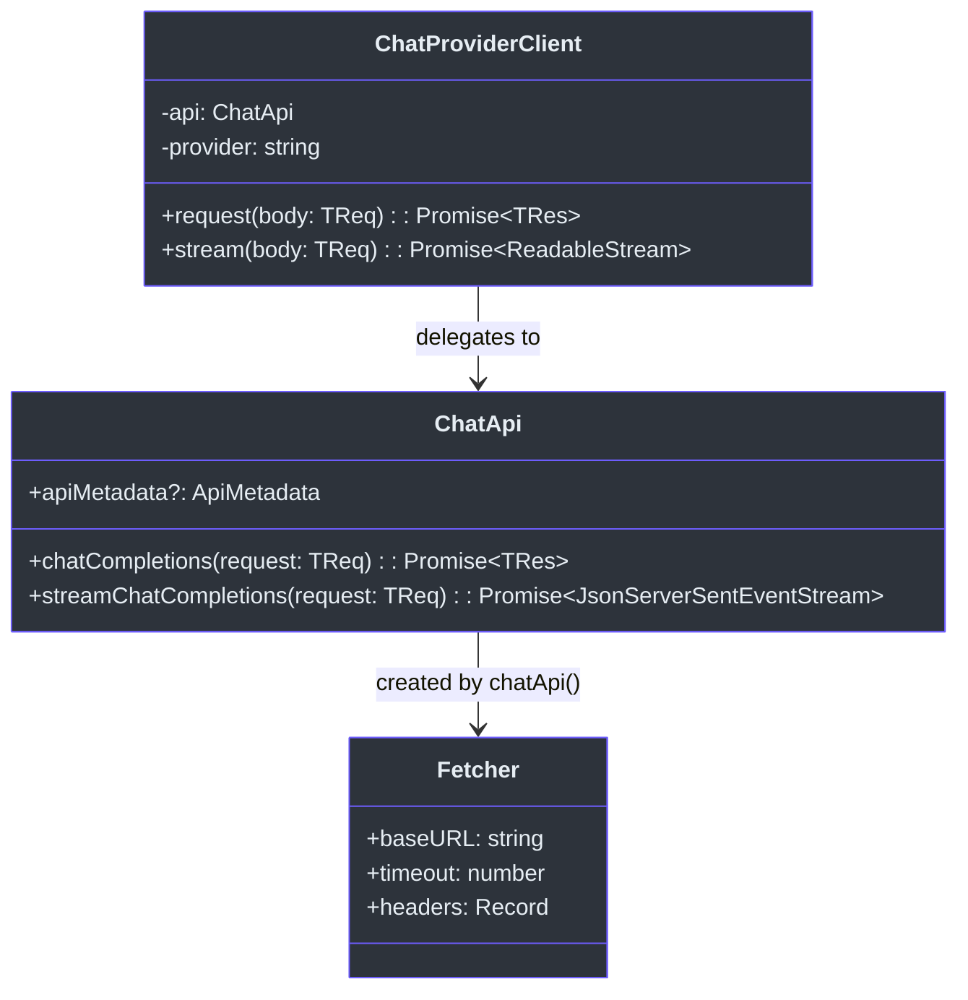
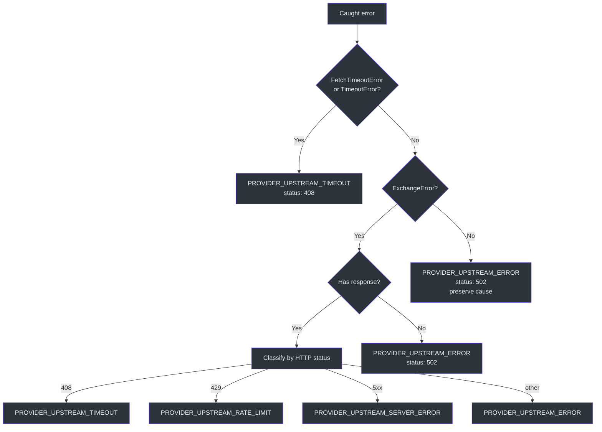
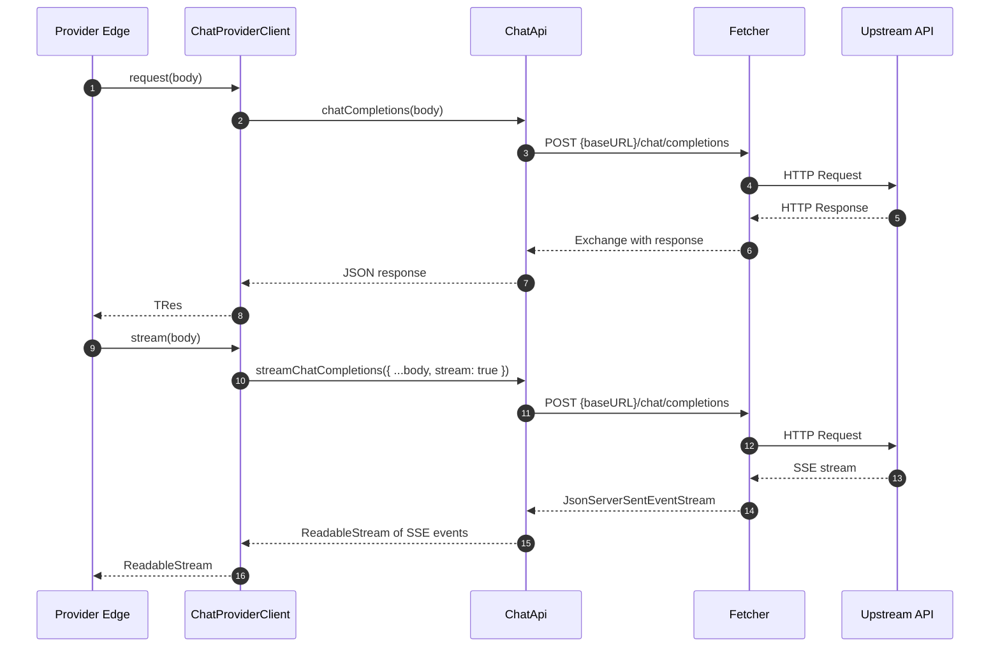

# Chat Provider Client

GodeX needs a clean boundary between provider-specific logic (specs, hooks, capability declarations) and the raw HTTP transport that actually talks to upstream APIs. `ChatProviderClient` occupies exactly this boundary. It takes a provider name, a base URL, an API key, and an optional timeout, and exposes two methods -- `request()` and `stream()` -- that delegate to the generated `ChatApi` class and wrap every error into a `ProviderError` with an appropriate domain code.

This layer is why provider implementations never deal with raw fetch errors or SSE parsing. The client absorbs the complexity of timeout detection, response body extraction, and status-code classification, so each provider spec only needs to declare what it supports, not how HTTP works.

## At a Glance

| Component | File | Purpose |
|---|---|---|
| `ChatProviderClient` | [chat-provider-client.ts](https://github.com/Ahoo-Wang/GodeX/blob/main/src/providers/shared/chat-provider-client.ts) | Typed HTTP client with error wrapping |
| `ChatApi` | [chat-api.ts](https://github.com/Ahoo-Wang/GodeX/blob/main/src/providers/shared/chat-api.ts) | Decorator-generated API class (`@post` methods) |
| `chatApi` factory | [chat-api.ts:42-53](https://github.com/Ahoo-Wang/GodeX/blob/main/src/providers/shared/chat-api.ts#L42) | Creates a `ChatApi` instance with Bearer auth and timeout |
| `wrapProviderError` | [chat-provider-client.ts:47-96](https://github.com/Ahoo-Wang/GodeX/blob/main/src/providers/shared/chat-provider-client.ts#L47) | Converts unknown errors to `ProviderError` |
| `assertProviderChatRequest` | [chat-request-guard.ts](https://github.com/Ahoo-Wang/GodeX/blob/main/src/providers/shared/chat-request-guard.ts) | Validates patched request shape before sending |
| Example client | [example/client.ts](https://github.com/Ahoo-Wang/GodeX/blob/main/src/providers/example/client.ts) | Reference implementation |

## Class Diagram

## ChatProviderClient

The constructor ([chat-provider-client.ts:22-25](https://github.com/Ahoo-Wang/GodeX/blob/main/src/providers/shared/chat-provider-client.ts#L22)) creates a `ChatApi` instance via the `chatApi` factory, passing through `baseURL`, `apiKey`, and `timeout`. The provider name is stored for error context.

### request(body)

Sends a non-streaming Chat Completions request ([chat-provider-client.ts:27-33](https://github.com/Ahoo-Wang/GodeX/blob/main/src/providers/shared/chat-provider-client.ts#L27)):

1. Calls `this.api.chatCompletions(body)`.
2. On failure, calls `wrapProviderError(err, this.provider)` and throws the result.

### stream(body)

Sends a streaming Chat Completions request ([chat-provider-client.ts:35-44](https://github.com/Ahoo-Wang/GodeX/blob/main/src/providers/shared/chat-provider-client.ts#L35)):

1. Forces `stream: true` on the body.
2. Calls `this.api.streamChatCompletions(body)`.
3. On failure, wraps the error the same way as `request()`.

## ChatApi and the chatApi Factory

`ChatApi` is a decorator-generated class ([chat-api.ts:23-40](https://github.com/Ahoo-Wang/GodeX/blob/main/src/providers/shared/chat-api.ts#L23)) with two methods:

| Method | Endpoint | Result Handling |
|---|---|---|
| `chatCompletions` | `POST chat/completions` | Default JSON extraction |
| `streamChatCompletions` | `POST chat/completions` | `JsonStreamResultExtractor` for SSE parsing |

The `chatApi` factory ([chat-api.ts:42-53](https://github.com/Ahoo-Wang/GodeX/blob/main/src/providers/shared/chat-api.ts#L42)) constructs a `Fetcher` with:
- `baseURL` from options
- `timeout` from options
- `Authorization: Bearer {apiKey}` header

The `JsonStreamResultExtractor` ([stream-result-extractor.ts:13-17](https://github.com/Ahoo-Wang/GodeX/blob/main/src/providers/shared/stream-result-extractor.ts#L13)) uses a `DoneDetector` that checks for the `[DONE]` SSE sentinel to know when the stream has terminated.

## Error Wrapping

The `wrapProviderError` function ([chat-provider-client.ts:47-96](https://github.com/Ahoo-Wang/GodeX/blob/main/src/providers/shared/chat-provider-client.ts#L47)) classifies errors into domain codes:

### Error Code Classification

| HTTP Status | Domain Code | Meaning |
|---|---|---|
| 408 | `PROVIDER_UPSTREAM_TIMEOUT` | Request timed out (fetch-level or upstream) |
| 429 | `PROVIDER_UPSTREAM_RATE_LIMIT` | Upstream rate limit hit |
| 500-599 | `PROVIDER_UPSTREAM_SERVER_ERROR` | Upstream server error |
| Other | `PROVIDER_UPSTREAM_ERROR` | Generic upstream failure |
| No response | `PROVIDER_UPSTREAM_ERROR` | Network-level failure (DNS, connection refused, etc.) |

For `ExchangeError` instances, the wrapper also attempts to extract the response body as JSON and reads the `error.message` field for a human-readable message ([chat-provider-client.ts:62-83](https://github.com/Ahoo-Wang/GodeX/blob/main/src/providers/shared/chat-provider-client.ts#L62)). If parsing fails, `safeResponseJson` returns `null` gracefully ([chat-provider-client.ts:113-122](https://github.com/Ahoo-Wang/GodeX/blob/main/src/providers/shared/chat-provider-client.ts#L113)).

## Request Lifecycle

## Example Provider

The example provider at [src/providers/example/client.ts](https://github.com/Ahoo-Wang/GodeX/blob/main/src/providers/example/client.ts) shows the minimal usage pattern. `createExampleProviderEdge` ([client.ts:11-26](https://github.com/Ahoo-Wang/GodeX/blob/main/src/providers/example/client.ts#L11)) calls `createProviderEdge` with the `EXAMPLE_PROVIDER_SPEC` and optional transport overrides. In a real provider, the transport functions would be methods on a `ChatProviderClient` instance rather than injected directly.

## ChatRequestGuard

Before sending, `assertProviderChatRequest` ([chat-request-guard.ts:5-27](https://github.com/Ahoo-Wang/GodeX/blob/main/src/providers/shared/chat-request-guard.ts#L5)) validates that the request object has a non-empty `model` string and a `messages` array. This guard is called by every provider's `patchRequest` hook to catch malformed requests early, before they reach the network layer.

## Cross-references

- [ProviderSpec Contract](./provider-spec.md) -- the spec that declares the endpoint and auth configuration consumed by `chatApi`
- [Provider Hooks](./provider-hooks.md) -- the `patchRequest` hooks that run before `ChatProviderClient` receives the body

## References

- [src/providers/shared/chat-provider-client.ts](https://github.com/Ahoo-Wang/GodeX/blob/main/src/providers/shared/chat-provider-client.ts) -- `ChatProviderClient`, `wrapProviderError`
- [src/providers/shared/chat-api.ts](https://github.com/Ahoo-Wang/GodeX/blob/main/src/providers/shared/chat-api.ts) -- `ChatApi`, `chatApi` factory
- [src/providers/shared/stream-result-extractor.ts](https://github.com/Ahoo-Wang/GodeX/blob/main/src/providers/shared/stream-result-extractor.ts) -- `JsonStreamResultExtractor`, `DoneDetector`
- [src/providers/shared/chat-request-guard.ts](https://github.com/Ahoo-Wang/GodeX/blob/main/src/providers/shared/chat-request-guard.ts) -- `assertProviderChatRequest`
- [src/providers/example/client.ts](https://github.com/Ahoo-Wang/GodeX/blob/main/src/providers/example/client.ts) -- example provider edge factory
- [src/providers/example/spec.ts](https://github.com/Ahoo-Wang/GodeX/blob/main/src/providers/example/spec.ts) -- example provider spec
- [src/error/codes.ts](https://github.com/Ahoo-Wang/GodeX/blob/main/src/error/codes.ts) -- provider error domain codes

