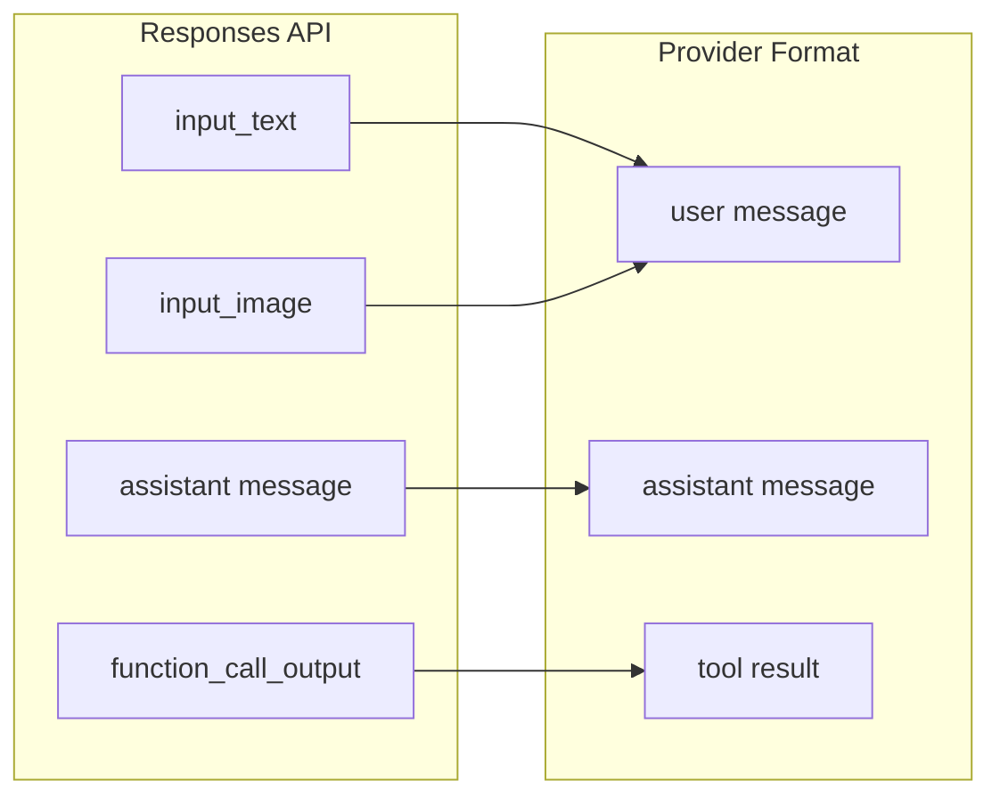

# Message & Tool Mapping

The mapper layer handles the most nuanced part of protocol translation: converting between the OpenAI Responses API's message and tool model and the provider's native format.

## Message Translation

Responses API input items come in several types. Each must be mapped to the provider's message format:

| Responses API Input Type | Direction | Notes |
|--------------------------|-----------|-------|
| `input_text` | User message | Plain text content |
| `input_image` | User message | Image URL or base64 |
| `message` (role=assistant) | Assistant message | Previous assistant output from chain |
| `function_call_output` | Tool result | Maps to provider's tool result format |

## Tool Mapping

The Responses API defines tools with `type: "function"` and a `function` object containing `name`, `description`, and `parameters`. Providers may use a different schema:

| Responses API Field | Provider Equivalent |
|---------------------|-------------------|
| `type: "function"` | Mapped or filtered via `supportedToolTypes` |
| `function.name` | May be sanitized for provider restrictions |
| `function.parameters` | JSON Schema, usually passed through |

Unsupported tool types (e.g., `web_search_preview` when the provider doesn't support web search) are either skipped or produce an `AdapterError`.

## Tool Call Extraction

When the provider returns tool calls in its response, the stream mapper extracts:
- Tool call ID
- Function name (reverse-mapped if sanitized)
- Function arguments (JSON string)

These are wrapped as `function_call` output items in the Responses API response.

[Session Store](/04-session-management/session-store)
