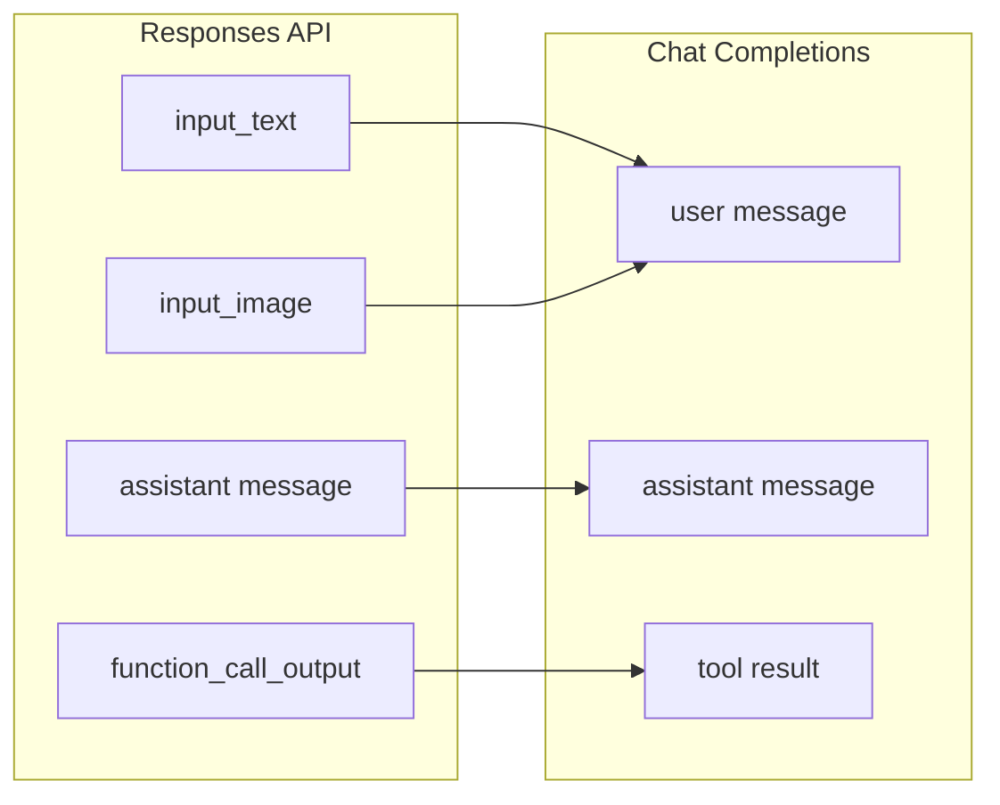
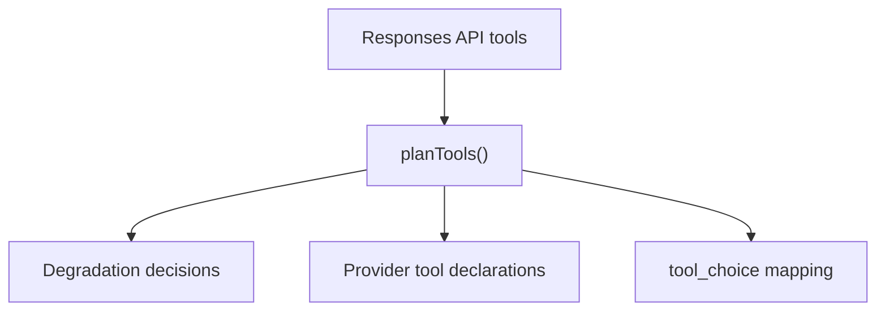

# Message & Tool Mapping

The bridge kernel (`src/bridge/`) handles the most nuanced part of protocol translation: converting between the OpenAI Responses API's message and tool model and the provider's Chat Completions format.

## Message Translation

Responses API input items come in several types. Each must be mapped to Chat Completions messages:

| Responses API Input Type | Direction | Notes |
|--------------------------|-----------|-------|
| `input_text` | User message | Plain text content |
| `input_image` | User message | Image URL or base64 |
| `message` (role=assistant) | Assistant message | Previous assistant output from chain |
| `function_call_output` | Tool result | Maps to Chat Completions tool result format |

The `InputNormalizer` in `bridge/request/input-normalizer.ts` handles the conversion, including restoring tool identity names when mapping function call outputs back to the provider's namespace.

## Tool Mapping

The bridge kernel plans tools in three steps:

1. **Declaration planning** — Each Responses API tool is mapped to a provider tool declaration. Tool types in the provider's `degraded` map are downgraded (e.g., `local_shell` becomes `function`).
2. **Tool choice mapping** — The Responses `tool_choice` is mapped to the Chat Completions `tool_choice` based on provider capabilities.
3. **Identity mapping** — The `ToolNameCodec` handles name translation between Responses API tool names and provider tool names.

Unsupported tool types produce a `BridgeError` with code `bridge.request.unsupported_tool`.

## Tool Call Restoration

When the provider returns tool calls in its response, the bridge restores them:

- `call-restorer.ts` maps provider function call names back to the original tool names using the `ToolIdentityMap`.
- Custom tool calls (shell, apply_patch, local_shell) are recognized and reconstructed with their proper types.

## Compatibility Diagnostics

Every compatibility decision — degraded tools, ignored parameters, rejected formats — produces a `CompatibilityDiagnostic` that is accumulated in `ResponsesContext.diagnostics` and logged after the response completes.

[Session Store](/04-session-management/session-store)
