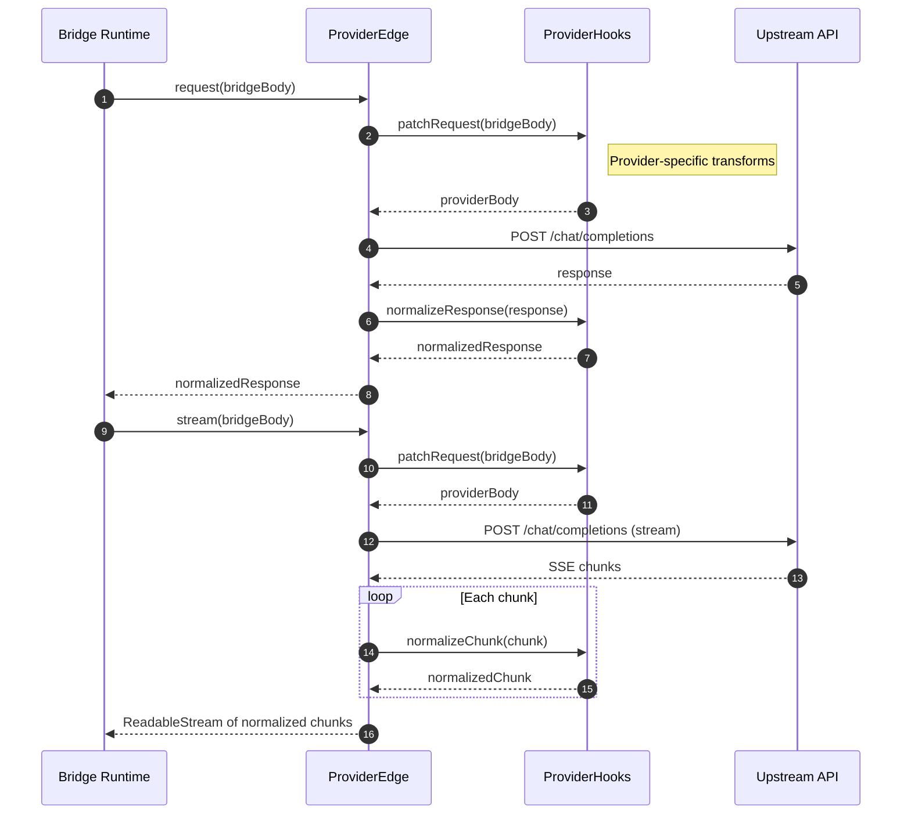
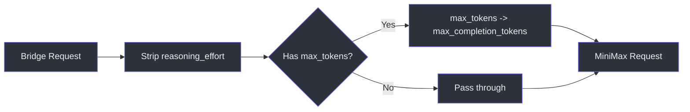

# Provider Hooks

GodeX's bridge runtime speaks one internal protocol, but every upstream provider has quirks -- DeepSeek uses a native `reasoning_effort` parameter and `thinking` object, Zhipu supports `web_search` and `file_search` tool types, and MiniMax remaps `max_tokens` to `max_completion_tokens`. `ProviderHooks` is the extension point where each provider injects its own normalisation logic. By keeping hooks optional and co-located with the provider spec, GodeX avoids a monolithic adapter layer and lets each provider own its transformations.

The hooks interface defines three optional methods ([contract.ts:43-52](https://github.com/Ahoo-Wang/GodeX/blob/main/src/bridge/provider-spec/contract.ts#L43)): `patchRequest`, `normalizeResponse`, and `normalizeChunk`. These are invoked inside `createProviderEdge` at the boundary between the bridge runtime and the upstream HTTP call.

## At a Glance

| Hook | Signature | When Called | Purpose |
|---|---|---|---|
| `patchRequest` | `(bridgeReq) => providerReq` | Before every HTTP call | Transform bridge-shaped request into provider-shaped request |
| `normalizeResponse` | `(response) => response` | After non-streaming response | Fix provider response before bridge reads it |
| `normalizeChunk` | `(chunk) => chunk` | On each SSE chunk in streaming mode | Fix provider chunk before bridge reads it |

## Hook Invocation Flow



## DeepSeek Hooks

The DeepSeek provider hooks in [hooks.ts:113-136](https://github.com/Ahoo-Wang/GodeX/blob/main/src/providers/deepseek/hooks.ts#L113) handle reasoning effort mapping and thinking mode activation:

| Scenario | Patch Behaviour |
|---|---|
| `reasoning_effort` is `"high"` or `"xhigh"` | Sets `thinking: { type: "enabled" }` and maps effort to native values (`"high"` -> `"high"`, `"xhigh"` -> `"max"`) |
| Messages contain historical `reasoning_content` | Sets `thinking: { type: "enabled" }` to maintain continuity |
| Default (no reasoning) | Sets `thinking: { type: "disabled" }` explicitly |

The `deepSeekStreamDeltas` function ([hooks.ts:149-164](https://github.com/Ahoo-Wang/GodeX/blob/main/src/providers/deepseek/hooks.ts#L149)) maps each SSE chunk into an array of `ProviderStreamDelta` by extracting usage data, content text, tool calls, reasoning content, and finish reasons.

```mermaid
flowchart TD
    req["Incoming Bridge Request"] --> effort{"Has reasoning_effort?"}
    effort -->|"high" / "xhigh"| native["Add thinking.enabled<br>Map effort to native value"]
    effort -->|No| history{"Messages have<br>reasoning_content?"}
    history -->|Yes| think_on["Add thinking.enabled"]
    history -->|No| think_off["Add thinking.disabled"]
    native --> out["Provider Request"]
    think_on --> out
    think_off --> out

    style req fill:#2d333b,stroke:#6d5dfc,color:#e6edf3
    style effort fill:#2d333b,stroke:#6d5dfc,color:#e6edf3
    style history fill:#2d333b,stroke:#6d5dfc,color:#e6edf3
    style native fill:#2d333b,stroke:#6d5dfc,color:#e6edf3
    style think_on fill:#2d333b,stroke:#6d5dfc,color:#e6edf3
    style think_off fill:#2d333b,stroke:#6d5dfc,color:#e6edf3
    style out fill:#2d333b,stroke:#6d5dfc,color:#e6edf3
```

## Zhipu Hooks

Zhipu's `zhipuPatchRequest` ([hooks.ts:113-134](https://github.com/Ahoo-Wang/GodeX/blob/main/src/providers/zhipu/hooks.ts#L113)) follows a similar pattern but with Zhipu-specific differences:

| Scenario | Patch Behaviour |
|---|---|
| Request has `thinking` set | Preserves it but forces `clear_thinking: false` |
| Messages contain historical `reasoning_content` | Injects `thinking: { type: "enabled", clear_thinking: false }` |
| Default | Strips `reasoning_effort` and passes through unchanged |

Zhipu also supports a wider set of tool types ([hooks.ts:16-30](https://github.com/Ahoo-Wang/GodeX/blob/main/src/providers/zhipu/hooks.ts#L16)) including `web_search`, `file_search`, `mcp`, and `shell`, with a degradation map that converts provider-specific tool types into standard Chat Completions equivalents:

| Upstream Type | Degraded To |
|---|---|
| `web_search_2025_08_26` | `web_search` |
| `web_search_preview` | `web_search` |
| `file_search` | `retrieval` |
| `local_shell` / `shell` | `function` |
| `custom` / `tool_search` / `namespace` | `function` |

## MiniMax Hooks

MiniMax's `minimaxPatchRequest` ([hooks.ts:112-121](https://github.com/Ahoo-Wang/GodeX/blob/main/src/providers/minimax/hooks.ts#L112)) is simpler:

1. Strips `reasoning_effort` (MiniMax does not support reasoning parameters).
2. Remaps `max_tokens` to `max_completion_tokens` when present.



## Shared Stream Delta Mapper

All three built-in providers delegate tool-call and reasoning-content extraction to `mapCommonChatStreamDelta` in [stream-delta-mapper.ts:18-42](https://github.com/Ahoo-Wang/GodeX/blob/main/src/providers/shared/stream-delta-mapper.ts#L18). This shared utility handles:

| Delta Field | Mapping |
|---|---|
| `reasoning_content` | `{ reasoning: content }` delta |
| `tool_calls[i].id` | Copied to `toolCall.id` |
| `tool_calls[i].function.name` | Copied to `toolCall.name` |
| `tool_calls[i].function.arguments` | Copied to `toolCall.arguments` |
| `tool_calls[i].index` | Copied to `toolCall.index` |
| `tool_calls[i].type` | Copied to `toolCall.type` |

Each provider's stream delta function calls `mapCommonChatStreamDelta` after extracting provider-specific content deltas. For example, DeepSeek's `mapDeepSeekChoiceDelta` ([hooks.ts:166-175](https://github.com/Ahoo-Wang/GodeX/blob/main/src/providers/deepseek/hooks.ts#L166)) pushes a `{ text }` delta for `delta.content`, then spreads the common deltas on top.

## Custom Tool Degradation

[custom-tool-degradation.ts](https://github.com/Ahoo-Wang/GodeX/blob/main/src/providers/shared/custom-tool-degradation.ts) provides helpers to convert Responses API custom tools into Chat Completions function tools when a provider does not support them natively:

- `degradedCustomToolDescription` ([custom-tool-degradation.ts:14-20](https://github.com/Ahoo-Wang/GodeX/blob/main/src/providers/shared/custom-tool-degradation.ts#L14)) appends a note that the tool has been degraded and describes the input format.
- `degradedCustomToolParameters` ([custom-tool-degradation.ts:24-38](https://github.com/Ahoo-Wang/GodeX/blob/main/src/providers/shared/custom-tool-degradation.ts#L24)) generates a schema with a single required `input` string parameter.

## Input Compatibility

`warnUnsupportedCurrentInputContent` in [input-compatibility.ts:9-34](https://github.com/Ahoo-Wang/GodeX/blob/main/src/providers/shared/input-compatibility.ts#L9) emits diagnostics when a Responses request contains content types that Chat Completions cannot represent (anything other than `input_text` / `output_text`). This is called during bridging to give users visibility into silently ignored fields.

## Request Guard

`assertProviderChatRequest` ([chat-request-guard.ts:5-27](https://github.com/Ahoo-Wang/GodeX/blob/main/src/providers/shared/chat-request-guard.ts#L5)) validates that the patched request has a `model` string and a `messages` array before it is sent to the upstream provider. Every `patchRequest` hook calls this guard as its first step.

## Capability Comparison

| Capability | DeepSeek | Zhipu | MiniMax |
|---|---|---|---|
| Reasoning effort | `native` (high/max) | `boolean` (enabled/disabled) | `none` |
| Max tools | 128 | 128 | 128 |
| Tool choice modes | auto, none, required, function | auto, none | auto, none, required, function |
| Response formats | text, json_object | text, json_object | text, json_object |
| Streaming usage | Yes | Yes | Yes |
| Web search tools | No | Yes | No |

## Cross-references

- [ProviderSpec Contract](./provider-spec.md) -- the spec interface that declares hooks
- [Chat Provider Client](./chat-provider-client.md) -- the HTTP transport that calls `patchRequest` and `normalizeResponse`

## References

- [src/providers/deepseek/hooks.ts](https://github.com/Ahoo-Wang/GodeX/blob/main/src/providers/deepseek/hooks.ts) -- DeepSeek patchRequest, streamDeltas, usage mapping
- [src/providers/zhipu/hooks.ts](https://github.com/Ahoo-Wang/GodeX/blob/main/src/providers/zhipu/hooks.ts) -- Zhipu patchRequest, web_search degradation, streamDeltas
- [src/providers/minimax/hooks.ts](https://github.com/Ahoo-Wang/GodeX/blob/main/src/providers/minimax/hooks.ts) -- MiniMax patchRequest, max_tokens remapping
- [src/providers/shared/stream-delta-mapper.ts](https://github.com/Ahoo-Wang/GodeX/blob/main/src/providers/shared/stream-delta-mapper.ts) -- `mapCommonChatStreamDelta`
- [src/providers/shared/custom-tool-degradation.ts](https://github.com/Ahoo-Wang/GodeX/blob/main/src/providers/shared/custom-tool-degradation.ts) -- custom tool to function tool degradation
- [src/providers/shared/input-compatibility.ts](https://github.com/Ahoo-Wang/GodeX/blob/main/src/providers/shared/input-compatibility.ts) -- unsupported content type warnings
- [src/providers/shared/chat-request-guard.ts](https://github.com/Ahoo-Wang/GodeX/blob/main/src/providers/shared/chat-request-guard.ts) -- `assertProviderChatRequest`
- [src/bridge/provider-spec/contract.ts](https://github.com/Ahoo-Wang/GodeX/blob/main/src/bridge/provider-spec/contract.ts) -- `ProviderHooks` interface definition

