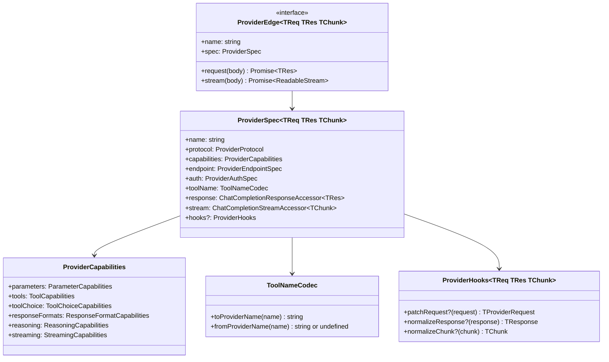

# Provider Interface

Adding a new LLM provider to GodeX means declaring a `ProviderSpec` with capabilities, response/stream accessors, optional hooks, and wiring up an HTTP client. The bridge kernel handles routing, session management, compatibility planning, and SSE encoding — providers only deal with protocol differences and HTTP calls.

## Core Interfaces



## ProviderCapabilities

Capabilities are declared as immutable sets and flags. They tell the bridge kernel what the provider supports so it can plan compatibility decisions.

```ts
const capabilities: ProviderCapabilities = {
  parameters: {
    supported: new Set([
      "stream", "temperature", "top_p", "max_output_tokens",
      "reasoning", "safety_identifier", "user",
    ]),
  },
  tools: {
    supported: new Set(["function"]),
    degraded: new Map([["local_shell", "function"]]),
    maxTools: 128,
  },
  toolChoice: {
    supported: new Set(["auto", "none", "required", "function"]),
  },
  responseFormats: {
    supported: new Set(["text", "json_object"]),
  },
  reasoning: { effort: "native" },
  streaming: { usage: true },
};
```

### Capability Fields

| Field | Type | Description |
|-------|------|-------------|
| `parameters.supported` | `Set<string>` | Request parameters the provider accepts |
| `tools.supported` | `Set<string>` | Tool types the provider can handle |
| `tools.degraded` | `Map<string, string>` | Tool types that degrade to another type |
| `tools.maxTools` | `number` | Maximum number of tools per request |
| `toolChoice.supported` | `Set<string>` | `tool_choice` modes the provider supports |
| `responseFormats.supported` | `Set<string>` | Response format types (`text`, `json_object`, `json_schema`) |
| `reasoning.effort` | `"none" \| "boolean" \| "native"` | How the provider handles reasoning effort |
| `streaming.usage` | `boolean` | Whether the provider returns usage in stream chunks |

## Response Accessors

The spec declares typed accessors so the bridge can read provider responses without knowing the concrete type:

```ts
interface ChatCompletionResponseAccessor<TResponse> {
  firstChoice(response: TResponse): unknown | undefined;
  finishReason(response: TResponse): string | undefined;
  outputText(response: TResponse): string;
  usage(response: TResponse): ResponseUsage | null;
}
```

## Stream Accessors

```ts
interface ChatCompletionStreamAccessor<TChunk> {
  deltas(chunk: TChunk): ProviderSpecStreamDelta[];
}
```

Each stream chunk may produce zero or more typed deltas (text, reasoning, tool calls, usage, finish reason).

## Provider Hooks

Hooks allow provider-specific behavior without polluting the bridge kernel:

| Hook | When Called | Purpose |
|------|-----------|---------|
| `patchRequest` | After bridge builds the Chat Completions request | Transform the request for provider-specific quirks |
| `normalizeResponse` | After receiving a sync response | Normalize provider response shape |
| `normalizeChunk` | After receiving a stream chunk | Normalize provider chunk shape |

## Registration

Register a provider definition in `src/providers/builtin.ts`:

```ts
const MY_PROVIDER_DEFINITION = createProviderDefinition(
  "myprovider",
  createMyProviderEdge,
);

export const BUILTIN_PROVIDER_DEFINITIONS = [
  DEEPSEEK_PROVIDER_DEFINITION,
  ZHIPU_PROVIDER_DEFINITION,
  MY_PROVIDER_DEFINITION,
] as const satisfies readonly ProviderDefinition[];
```

The `Registrar` iterates all configured providers in `godex.yaml`, matches by the `spec` field to the factory, and builds `ProviderEdge` instances. Providers without a matching factory are listed as unsupported.

[DeepSeek Reference](/03-provider-development/deepseek-reference)
