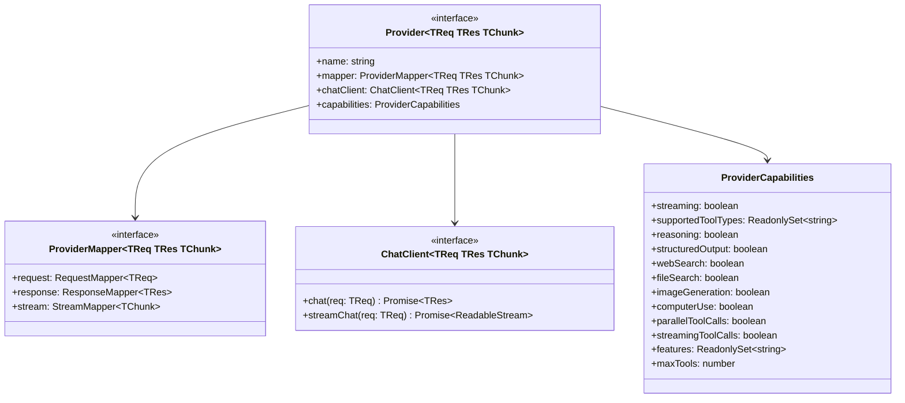

# Provider Interface

Adding a new LLM provider to GodeX means implementing four interfaces. The system handles routing, session management, and SSE encoding — providers only deal with protocol translation and HTTP calls.

## Core Interfaces



## ProviderCapabilities

Capabilities are **immutable** — once constructed, the sets and flags cannot be mutated. Use `mergeCapabilities()` to create a capabilities object:

```ts
import { mergeCapabilities } from "../adapter/capabilities";

const caps = mergeCapabilities({
  streaming: true,
  supportedToolTypes: new Set(["function"]),
  reasoning: false,
  structuredOutput: false,
  maxTools: 128,
});
```

## Registration

Register a provider factory in `src/providers/builtin.ts`:

```ts
registrar.registerFactory("myprovider", (config) =>
  createMyProvider(config) as Provider<unknown, unknown, unknown>
);
```

The `Registrar.build()` method iterates all configured providers in `godex.yaml`, calls the matching factory, and stores the result. If no factory is found for a provider name, it is added to the `unsupported` list.

## Capability Checking

The adapter layer checks capabilities before forwarding requests:

- `checkToolSupport()` validates tool types against `supportedToolTypes`
- `checkCapability()` validates boolean feature flags
- Unsupported parameters produce `AdapterError` responses

[Zhipu Reference](/03-provider-development/zhipu-reference)
