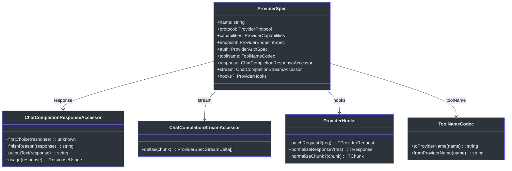
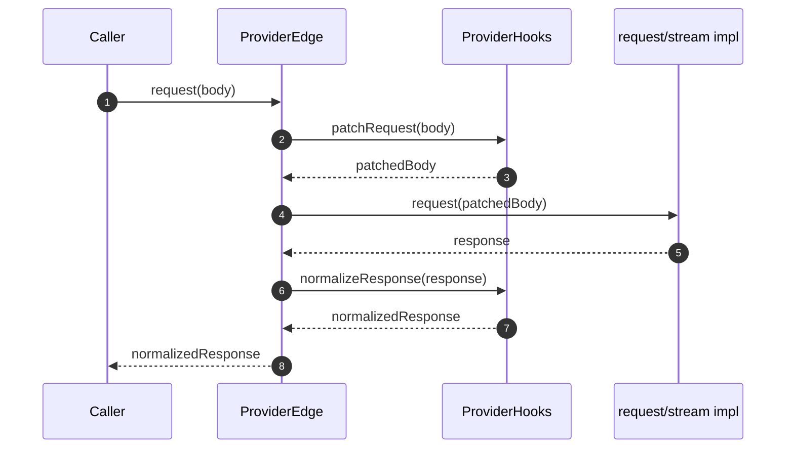
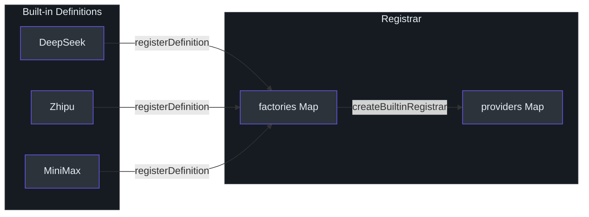
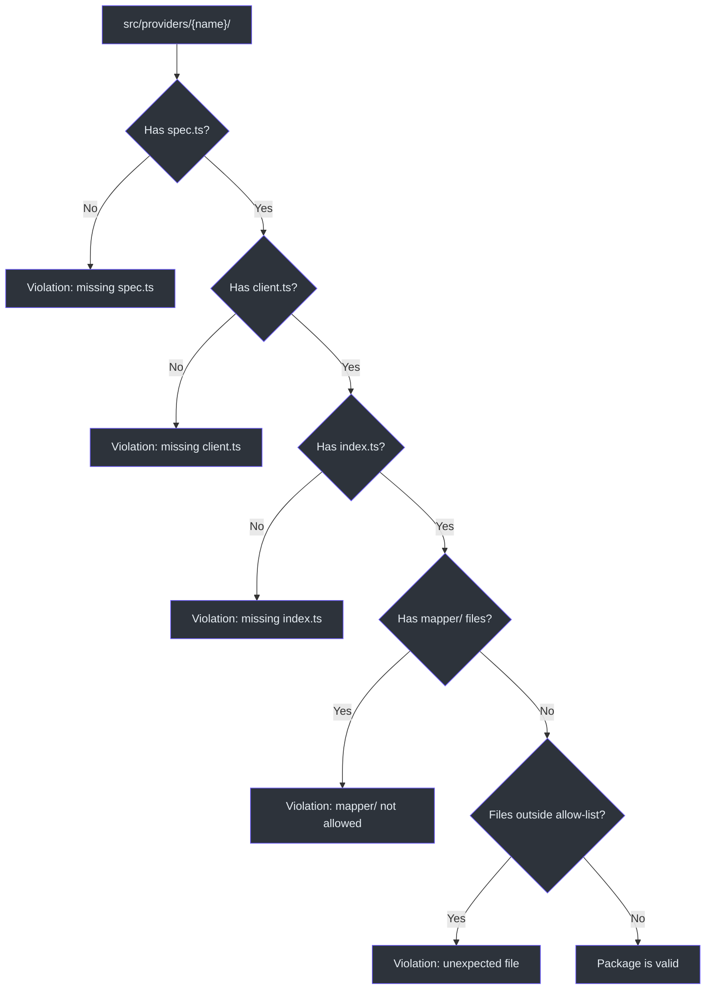

# ProviderSpec Contract

Every LLM provider in GodeX is described by a single `ProviderSpec` object that declares the provider's identity, protocol, capabilities, endpoint, authentication scheme, tool-name codec, and response/stream accessors. The spec is intentionally declarative -- it contains no HTTP logic. A separate `ProviderEdge` composes the spec with transport (request/stream) to form a runnable provider. This separation means the same spec can power validation, documentation generation, and runtime request handling without coupling to fetch internals.

The spec-driven design is why adding a new provider is largely a matter of filling in a typed object and writing optional hooks. The bridge runtime reads the spec to know what parameters are supported, which tools to degrade, and how to extract output text from a response.

## At a Glance

| Concept | Type / Constant | Purpose |
|---|---|---|
| `ProviderSpec<TReq, TRes, TChunk>` | Interface | Declarative contract for one provider |
| `ProviderEdge<TReq, TRes, TChunk>` | Interface | Spec + `request()` + `stream()` |
| `ProviderRuntimeConfig` | Interface | Runtime credentials and endpoint |
| `ProviderDefinition` | Interface | Named factory (`create(config) -> ProviderEdge`) |
| `BEARER_AUTH_SCHEME` | Constant | `"bearer"` |
| `CHAT_COMPLETIONS_PROTOCOL` | Constant | `"chat_completions"` |
| `createProviderEdge` | Factory function | Wires spec + config + transport into an edge |
| `createProviderDefinition` | Factory function | Wraps an edge factory into a definition |

## Spec Anatomy

The `ProviderSpec` interface contains four categories of fields: identity, protocol/capabilities, accessors, and hooks.

### Identity and Protocol

| Field | Type | Description |
|---|---|---|
| `name` | `string` | Unique provider identifier (e.g. `"deepseek"`, `"zhipu"`, `"minimax"`) |
| `protocol` | `ProviderProtocol` | Currently always `CHAT_COMPLETIONS_PROTOCOL` (`"chat_completions"`) |
| `capabilities` | `ProviderCapabilities` | Declares supported parameters, tools, tool choice modes, response formats, and reasoning effort style |
| `endpoint` | `ProviderEndpointSpec` | Holds `defaultBaseURL` |
| `auth` | `ProviderAuthSpec` | Currently always `BEARER_AUTH` (`{ scheme: "bearer" }`) |

### Response Accessor

The `ChatCompletionResponseAccessor<TResponse>` tells the bridge how to extract standardised data from an upstream response ([contract.ts:32-37](https://github.com/Ahoo-Wang/GodeX/blob/main/src/bridge/provider-spec/contract.ts#L32)):

| Method | Returns |
|---|---|
| `firstChoice(response)` | The first choice object or `undefined` |
| `finishReason(response)` | Stop reason string (e.g. `"stop"`, `"tool_calls"`) |
| `outputText(response)` | Concatenated text content |
| `usage(response)` | `ResponseUsage` with `input_tokens`, `output_tokens`, `total_tokens` |

### Stream Accessor

`ChatCompletionStreamAccessor<TChunk>` has a single method `deltas(chunk)` that returns an array of `ProviderSpecStreamDelta` -- the bridge-internal streaming delta representation ([contract.ts:39-41](https://github.com/Ahoo-Wang/GodeX/blob/main/src/bridge/provider-spec/contract.ts#L39)).

## ProviderEdge and the Factory

`ProviderEdge` extends `ProviderSpec` with two executable methods:

- **`request(body)`** -- sends a non-streaming request and returns a typed response.
- **`stream(body)`** -- sends a streaming request and returns a `ReadableStream<JsonServerSentEvent<TChunk>>`.

The `createProviderEdge` factory ([factory.ts:34-88](https://github.com/Ahoo-Wang/GodeX/blob/main/src/bridge/provider-spec/factory.ts#L34)) wires everything together:

1. Resolves `base_url` from `config.endpoint.base_url` or falls back to `spec.endpoint.defaultBaseURL`.
2. Applies `hooks.patchRequest` to transform the bridge request into a provider request.
3. Delegates to the supplied `request` or `stream` implementation.
4. Applies `hooks.normalizeResponse` (for non-streaming) or pipes through `normalizeChunk` via a `TransformStream` (for streaming).

## ProviderRuntimeConfig

`ProviderRuntimeConfig` ([contract.ts:10-15](https://github.com/Ahoo-Wang/GodeX/blob/main/src/bridge/provider-spec/contract.ts#L10)) is the shape each provider receives from the GodeX configuration layer:

| Field | Type | Description |
|---|---|---|
| `spec` | `string` | Provider spec name to look up |
| `credentials.api_key` | `string` | Bearer token for the upstream |
| `endpoint.base_url` | `string?` | Override the default base URL |
| `timeout_ms` | `number?` | Request timeout in milliseconds |

## ProviderDefinition and Registration

`ProviderDefinition` ([definition.ts:6-11](https://github.com/Ahoo-Wang/GodeX/blob/main/src/providers/definition.ts#L6)) pairs a provider name with a factory function `(config) => ProviderEdge`. The `createProviderDefinition` helper ([definition.ts:13-29](https://github.com/Ahoo-Wang/GodeX/blob/main/src/providers/definition.ts#L13)) casts the typed factory to the erased signature used by the `Registrar`.

Built-in definitions are declared in [builtin.ts:22-41](https://github.com/Ahoo-Wang/GodeX/blob/main/src/providers/builtin.ts#L22) and registered automatically via `createBuiltinRegistrar()` ([builtin.ts:49-55](https://github.com/Ahoo-Wang/GodeX/blob/main/src/providers/builtin.ts#L49)).

## Package Validation

The `validateProviderPackageShape` function ([validation.ts:13-51](https://github.com/Ahoo-Wang/GodeX/blob/main/src/bridge/provider-spec/validation.ts#L13)) enforces that every provider directory contains the required files (`spec.ts`, `client.ts`, `index.ts`) and nothing outside the allow-list (`hooks.ts`, tests, `protocol/` DTOs). This keeps provider packages consistent.

## Example Provider

The example provider at [src/providers/example/spec.ts](https://github.com/Ahoo-Wang/GodeX/blob/main/src/providers/example/spec.ts) demonstrates the minimal spec surface. It defines inline DTOs (`ExampleChatRequest`, `ExampleChatResponse`, `ExampleChatChunk`) and an `EXAMPLE_PROVIDER_SPEC` with pass-through `toolName` codec and a simple `response` accessor ([spec.ts:80-126](https://github.com/Ahoo-Wang/GodeX/blob/main/src/providers/example/spec.ts#L80)). The corresponding client ([client.ts:11-26](https://github.com/Ahoo-Wang/GodeX/blob/main/src/providers/example/client.ts#L11)) calls `createProviderEdge` with the spec and optional transport overrides.

## Cross-references

- [Provider Hooks](./provider-hooks.md) -- how `patchRequest`, `normalizeResponse`, and `normalizeChunk` are implemented for each built-in provider
- [Chat Provider Client](./chat-provider-client.md) -- the HTTP transport layer that implements the `request` and `stream` functions passed to `createProviderEdge`

## References

- [src/bridge/provider-spec/contract.ts](https://github.com/Ahoo-Wang/GodeX/blob/main/src/bridge/provider-spec/contract.ts) -- `ProviderSpec`, `ProviderEdge`, `ProviderRuntimeConfig`, `BEARER_AUTH`, `CHAT_COMPLETIONS_PROTOCOL`
- [src/bridge/provider-spec/factory.ts](https://github.com/Ahoo-Wang/GodeX/blob/main/src/bridge/provider-spec/factory.ts) -- `createProviderEdge`, `normalizeChunkStream`
- [src/bridge/provider-spec/validation.ts](https://github.com/Ahoo-Wang/GodeX/blob/main/src/bridge/provider-spec/validation.ts) -- `validateProviderPackageShape`
- [src/providers/definition.ts](https://github.com/Ahoo-Wang/GodeX/blob/main/src/providers/definition.ts) -- `ProviderDefinition`, `createProviderDefinition`
- [src/providers/builtin.ts](https://github.com/Ahoo-Wang/GodeX/blob/main/src/providers/builtin.ts) -- built-in definitions and `createBuiltinRegistrar`
- [src/providers/example/spec.ts](https://github.com/Ahoo-Wang/GodeX/blob/main/src/providers/example/spec.ts) -- example provider spec with inline DTOs
- [src/providers/registrar.ts](https://github.com/Ahoo-Wang/GodeX/blob/main/src/providers/registrar.ts) -- `Registrar` that resolves providers by name

