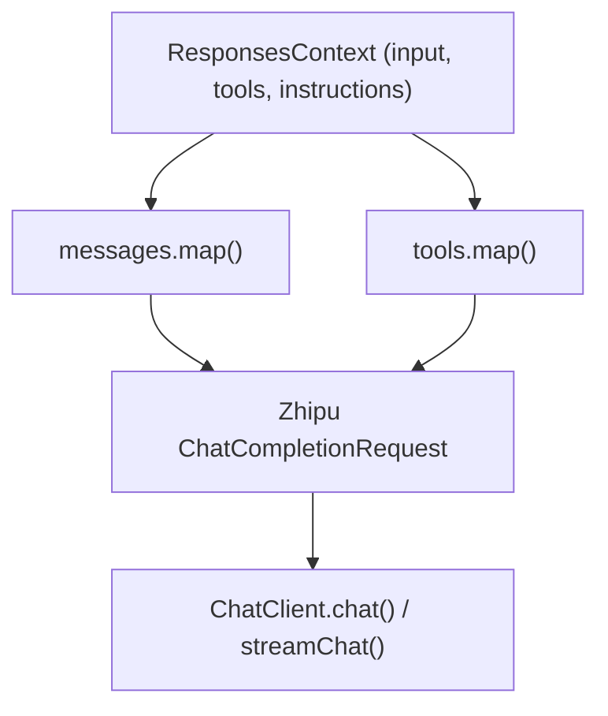

# Zhipu Reference Implementation

The Zhipu (智谱) provider is the bundled reference implementation in GodeX. It demonstrates how to build a complete provider that maps between the OpenAI Responses API and Zhipu's Chat Completions API.

## Module Structure

```
src/providers/zhipu/
├── provider.ts         # createZhipuProvider() factory
├── factory.ts          # Provider construction with mapper + chatClient
├── capabilities.ts     # Capability flags
├── request.ts          # RequestMapper implementation
├── response.ts         # ResponseMapper implementation
├── response-common.ts  # Shared response mapping utilities
├── stream.ts           # StreamMapper implementation
├── messages.ts         # Responses API input → Zhipu messages
├── tools.ts            # Tool mapping (Responses API tools → Zhipu tools)
├── tool-calls.ts       # Tool call result extraction
├── chat-client.ts      # ChatClient with HTTP streaming
├── function-names.ts   # Function name sanitization
├── protocol/           # Zhipu-specific type definitions
│   ├── completions.ts  # Request/response shapes
│   └── models.ts       # Model list types
└── api/                # Low-level API client
    ├── api.ts          # fetch-based HTTP calls
    └── stream-result-extractor.ts
```

## Request Mapping Flow



## Key Translation Details

- **Messages**: `messages.ts` converts Responses API `input` items (messages, tool results, etc.) into Zhipu's `messages` array
- **Tools**: `tools.ts` maps Responses API tool definitions to Zhipu's function-calling format
- **Function names**: Zhipu has restrictions on function name characters; `function-names.ts` sanitizes them
- **Streaming**: The stream mapper handles incremental content, tool call deltas, and usage accumulation

[Message & Tool Mapping](/03-provider-development/message-tool-mapping)
