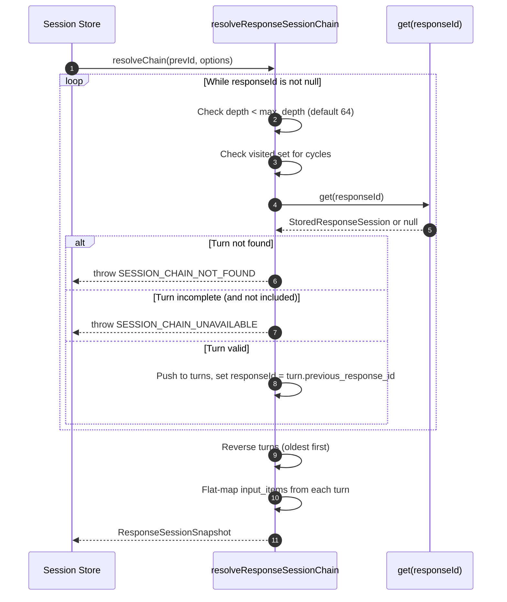
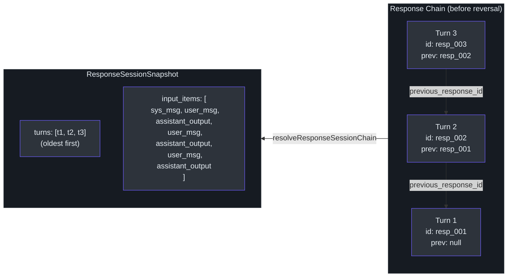
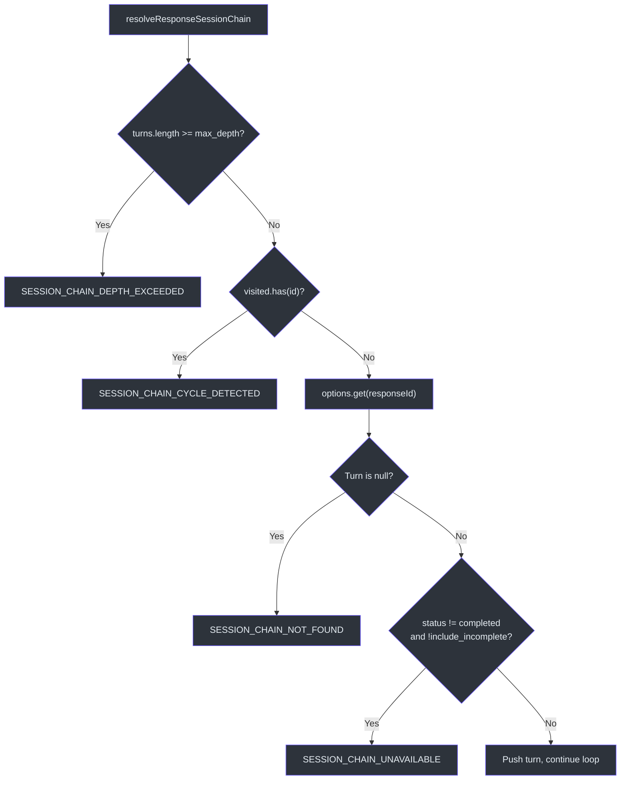

# Chain Resolution

When a caller sends a Responses API request with `previous_response_id`, GodeX must reconstruct the entire conversation history by following parent pointers through the session store. This is the chain resolution step. The `resolveResponseSessionChain` function traverses the linked list of `StoredResponseSession` records from newest to oldest, validates structural integrity, reverses the collected turns into chronological order, and flattens each turn's request instructions, input, and response output into a single `input_items` array that the bridge runtime can feed into a provider's chat completions request.

Chain resolution is the foundation of GodeX's multi-turn conversation support. Without it, every request would be stateless and callers would need to replay full message history themselves.

## At a Glance

| Component | File | Purpose |
|---|---|---|
| `resolveResponseSessionChain` | [chain.ts:26-98](https://github.com/Ahoo-Wang/GodeX/blob/main/src/session/chain.ts#L26) | Main traversal function |
| `requestHistoryItems` | [chain.ts:100-107](https://github.com/Ahoo-Wang/GodeX/blob/main/src/session/chain.ts#L100) | Converts request snapshot to `ResponseItem[]` |
| `instructionInputItems` | [chain.ts:109-120](https://github.com/Ahoo-Wang/GodeX/blob/main/src/session/chain.ts#L109) | Wraps instructions as a system message |
| `requestInputItems` | [chain.ts:122-140](https://github.com/Ahoo-Wang/GodeX/blob/main/src/session/chain.ts#L122) | Wraps input as user message(s) |
| `ResponseSessionSnapshot` | [types.ts:69-76](https://github.com/Ahoo-Wang/GodeX/blob/main/src/session/types.ts#L69) | Resolved chain result type |
| `ResolveResponseSessionOptions` | [types.ts:78-83](https://github.com/Ahoo-Wang/GodeX/blob/main/src/session/types.ts#L78) | Configurable depth and incomplete handling |
| `SessionError` | [session-error.ts](https://github.com/Ahoo-Wang/GodeX/blob/main/src/error/session-error.ts) | Domain error with chain-specific codes |

## Traversal Algorithm

`resolveResponseSessionChain` ([chain.ts:26-98](https://github.com/Ahoo-Wang/GodeX/blob/main/src/session/chain.ts#L26)) follows the `previous_response_id` linked list:



### Step-by-step

1. **Initialise**: Create a `visited` Set and empty `turns` array.
2. **Loop**: While `responseId` is truthy:
   - **Depth guard**: If `turns.length >= maxDepth` (default 64), throw `SESSION_CHAIN_DEPTH_EXCEEDED`.
   - **Cycle guard**: If `visited.has(responseId)`, throw `SESSION_CHAIN_CYCLE_DETECTED`.
   - **Fetch**: Call `options.get(responseId)` to retrieve the stored turn.
   - **Missing guard**: If the turn is `null`, throw `SESSION_CHAIN_NOT_FOUND`.
   - **Status guard**: If `!includeIncomplete && turn.status !== "completed"`, throw `SESSION_CHAIN_UNAVAILABLE`.
   - **Collect**: Push the turn and set `responseId = turn.previous_response_id`.
3. **Reverse**: `turns.reverse()` puts turns in chronological (oldest-first) order.
4. **Flatten**: For each turn, concatenate `requestHistoryItems(turn.request)` + `turn.response.output` into `input_items`.

## Integrity Guards

| Guard | Error Code | Default Threshold | Trigger |
|---|---|---|---|
| Max depth | `SESSION_CHAIN_DEPTH_EXCEEDED` | 64 | Chain longer than `max_depth` |
| Cycle detection | `SESSION_CHAIN_CYCLE_DETECTED` | N/A | Same `responseId` visited twice |
| Missing parent | `SESSION_CHAIN_NOT_FOUND` | N/A | `get(responseId)` returns null |
| Incomplete status | `SESSION_CHAIN_UNAVAILABLE` | N/A | Turn `status !== "completed"` and `include_incomplete` is false |

All errors are `SessionError` instances ([session-error.ts:11-28](https://github.com/Ahoo-Wang/GodeX/blob/main/src/error/session-error.ts#L11)) with the `"session"` domain and context including `responseId` and `previousResponseId`.

## Chain Structure Diagram



## Input Items Flattening

Each turn contributes two sets of items to the final `input_items` array.

### requestHistoryItems

`requestHistoryItems` ([chain.ts:100-107](https://github.com/Ahoo-Wang/GodeX/blob/main/src/session/chain.ts#L100)) combines:

| Source | Function | Result |
|---|---|---|
| `instructions` | `instructionInputItems` | `{ type: "message", role: "system", content: [{ type: "input_text", text }] }` |
| `input` (string) | `requestInputItems` | `{ type: "message", role: "user", content: [{ type: "input_text", text }] }` |
| `input` (array) | `requestInputItems` | Passed through as-is (already `ResponseItem[]`) |
| `input` (undefined) | `requestInputItems` | Empty array |

The instructions-to-system-message conversion ([chain.ts:109-120](https://github.com/Ahoo-Wang/GodeX/blob/main/src/session/chain.ts#L109)) only fires when `instructions` is present and non-empty. String inputs are wrapped in a user message ([chain.ts:127-135](https://github.com/Ahoo-Wang/GodeX/blob/main/src/session/chain.ts#L127)).

### Final Flattening

The `input_items` array is built by flat-mapping each turn ([chain.ts:93-96](https://github.com/Ahoo-Wang/GodeX/blob/main/src/session/chain.ts#L93)):

```
input_items = turns.flatMap(turn => [
    ...requestHistoryItems(turn.request),   // system + user items
    ...turn.response.output,                // assistant items
])
```

This produces a single chronological array suitable for the bridge runtime to convert into provider-specific chat messages.

## Options

| Option | Type | Default | Description |
|---|---|---|---|
| `max_depth` | `number?` | `64` | Maximum parent hops before depth-exceeded error |
| `include_incomplete` | `boolean?` | `false` | Allow non-completed responses in the chain |

The `ResolveResponseSessionChainOptions` interface ([chain.ts:19-24](https://github.com/Ahoo-Wang/GodeX/blob/main/src/session/chain.ts#L19)) extends `ResolveResponseSessionOptions` with a required `get()` function that the caller (session store) injects.

## Error Scenarios



## Cross-references

- [Session Stores](./session-stores.md) -- the `ResponseSessionStore` implementations that provide the `get()` function injected into `resolveResponseSessionChain`

## References

- [src/session/chain.ts](https://github.com/Ahoo-Wang/GodeX/blob/main/src/session/chain.ts) -- `resolveResponseSessionChain`, `requestHistoryItems`, `requestInputItems`
- [src/session/types.ts](https://github.com/Ahoo-Wang/GodeX/blob/main/src/session/types.ts) -- `ResponseSessionSnapshot`, `ResolveResponseSessionOptions`, `StoredResponseSession`
- [src/error/session-error.ts](https://github.com/Ahoo-Wang/GodeX/blob/main/src/error/session-error.ts) -- `SessionError` class
- [src/error/codes.ts](https://github.com/Ahoo-Wang/GodeX/blob/main/src/error/codes.ts) -- `SESSION_CHAIN_NOT_FOUND`, `SESSION_CHAIN_CYCLE_DETECTED`, `SESSION_CHAIN_DEPTH_EXCEEDED`, `SESSION_CHAIN_UNAVAILABLE`

