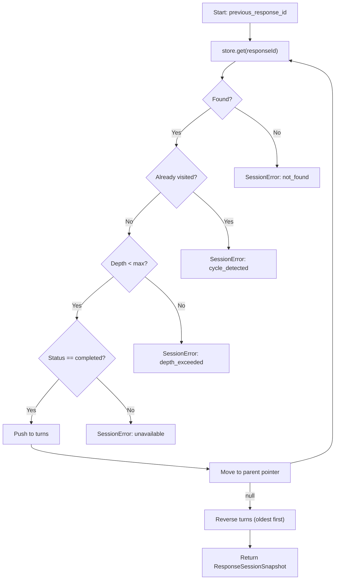

# Chain Resolution

When a request includes `previous_response_id`, GodeX must reconstruct the full conversation history by walking the parent pointer chain. This is handled by `resolveResponseSessionChain()`.

## Chain Traversal Algorithm

## Safety Checks

| Check | Error Code | Default Threshold |
|-------|-----------|-------------------|
| Chain not found | `session.chain.not_found` | N/A |
| Cycle detection | `session.chain.cycle_detected` | N/A |
| Depth exceeded | `session.chain.depth_exceeded` | 64 hops |
| Incomplete status | `session.chain.unavailable` | Only completed turns |

## Result Structure

`ResponseSessionSnapshot` contains:
- `previous_response_id`: The originally requested ID
- `turns`: Array of `StoredResponseSession` ordered oldest to newest
- `input_items`: Flattened array of all input and output items across turns, ready for provider message construction

[Transformers](/05-streaming-pipeline/transformers)
