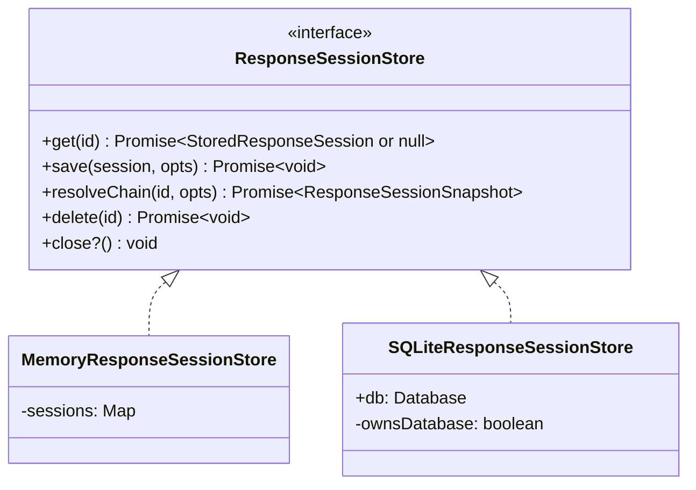

# Session Store

The session store persists response snapshots to support the `previous_response_id` chain resolution pattern. Each completed response is saved with enough data to reconstruct the conversation history later.

## Interface



## Stored Data

Each `StoredResponseSession` contains:

| Field | Description |
|-------|-------------|
| `id` | Response ID (e.g., `resp_abc123`) |
| `previous_response_id` | Parent pointer for chain traversal |
| `conversation_id` | Reserved for future Conversation API compatibility |
| `created_at` / `completed_at` | Unix timestamps |
| `status` | Response status (`completed`, etc.) |
| `request` | Snapshot of input, instructions, model, tools |
| `response` | Snapshot of output, usage, error |
| `metadata` | Optional arbitrary key-value metadata |

## Backend Selection

```yaml
session:
  backend: sqlite          # or "memory"
  sqlite:
    path: ./data/sessions.db
```

| Backend | Use Case |
|---------|----------|
| `memory` | Tests, demos, single-process ephemeral deployments |
| `sqlite` | Production, persistent history across restarts |

## Implementation Details

**Memory store**: Uses a `Map` with `structuredClone()` on read/write to prevent reference mutation. No resource cleanup needed.

**SQLite store**: Auto-creates the database file and schema on construction. Uses `bun:sqlite` for synchronous reads within the async chain resolution algorithm. Creates indexes on `previous_response_id` and `conversation_id` for chain traversal performance.

## Save Policy

Before persisting a session, the `assertCanSaveSession()` policy in `src/session/save-policy.ts` validates:

| Check | Error Code | When |
|-------|-----------|------|
| Parent pointer mismatch | `session.store.conflict` | `expected_previous_response_id` does not match the session's actual `previous_response_id` |
| Duplicate ID | `session.store.conflict` | A session with the same ID already exists and `overwrite` is not set |

### Save Options

```ts
interface SaveResponseSessionOptions {
  overwrite?: boolean;                        // Allow replacing an existing stored response
  expected_previous_response_id?: string | null; // Guard against saving under an unexpected parent
}
```

[Chain Resolution](/04-session-management/chain-resolution)
