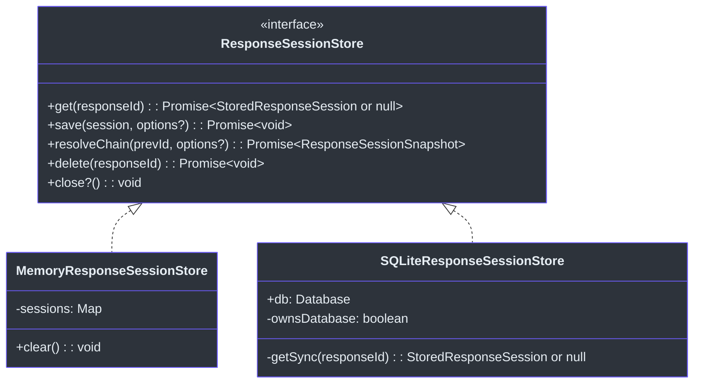
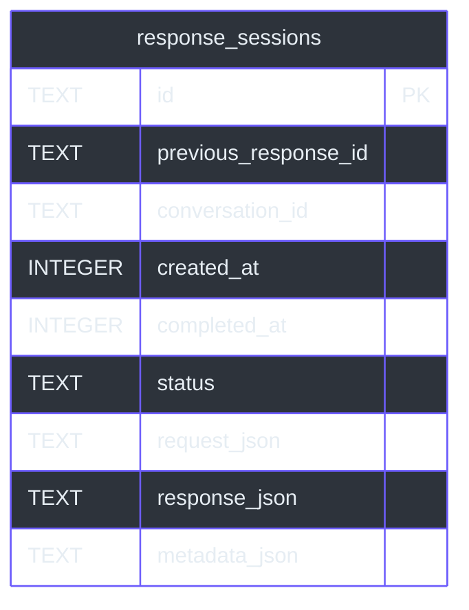
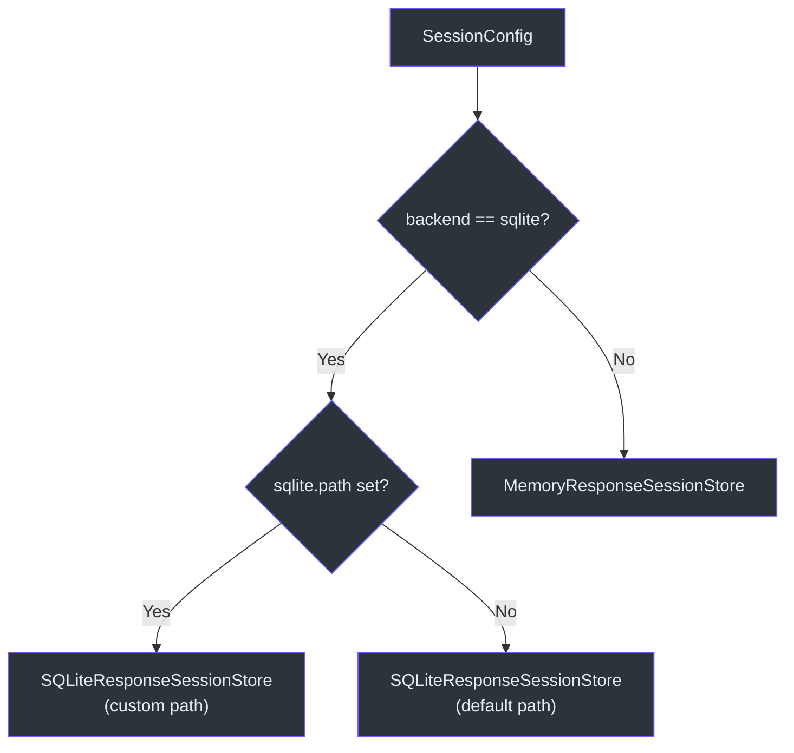

# Session Stores

GodeX implements the OpenAI Responses API's `previous_response_id` mechanism, which lets callers chain multiple requests into a conversation without manually replaying message history. To make this work, every generated response must be persisted with its request snapshot so that subsequent requests can walk the chain of parent pointers and reconstruct the full conversation context. `ResponseSessionStore` is the storage interface that makes this possible, with two implementations: an in-memory store for tests and single-process deployments, and a SQLite-backed store for production persistence.

The store boundary is deliberately narrow -- it persists API-shaped snapshots (not provider-specific chat messages) and delegates chain traversal to a shared `resolveResponseSessionChain` function. This keeps the store unaware of provider-specific protocol details.

## At a Glance

| Component | File | Purpose |
|---|---|---|
| `ResponseSessionStore` | [types.ts:99-120](https://github.com/Ahoo-Wang/GodeX/blob/main/src/session/types.ts#L99) | Storage interface |
| `MemoryResponseSessionStore` | [memory.ts:19-66](https://github.com/Ahoo-Wang/GodeX/blob/main/src/session/memory.ts#L19) | In-memory `Map`-backed store |
| `SQLiteResponseSessionStore` | [sqlite.ts:36-149](https://github.com/Ahoo-Wang/GodeX/blob/main/src/session/sqlite.ts#L36) | SQLite-backed store with WAL mode |
| `assertCanSaveSession` | [save-policy.ts:13-40](https://github.com/Ahoo-Wang/GodeX/blob/main/src/session/save-policy.ts#L13) | Prevents accidental overwrites |
| `StoredResponseSession` | [types.ts:23-38](https://github.com/Ahoo-Wang/GodeX/blob/main/src/session/types.ts#L23) | Persisted turn shape |
| `createResponseSessionStore` | [session-store-factory.ts:8-16](https://github.com/Ahoo-Wang/GodeX/blob/main/src/context/session-store-factory.ts#L8) | Factory from config |

## Stored Types

### StoredResponseSession

The core persisted type ([types.ts:23-38](https://github.com/Ahoo-Wang/GodeX/blob/main/src/session/types.ts#L23)):

| Field | Type | Description |
|---|---|---|
| `id` | `ResponseId` | Response ID, used as `previous_response_id` by future requests |
| `previous_response_id` | `ResponseId?` | Parent pointer, forming a linked list of turns |
| `conversation_id` | `ConversationId?` | Reserved for future Conversation API compatibility |
| `created_at` | `number` | Unix timestamp |
| `completed_at` | `number?` | Timestamp when generation finished |
| `status` | `ResponseStatus` | `"completed"`, `"incomplete"`, etc. |
| `request` | `StoredResponseRequestSnapshot` | Snapshot of the original request |
| `response` | `StoredResponseSnapshot` | Snapshot of the generated response |
| `metadata` | `Record<string, unknown>?` | Optional user-provided metadata |

### StoredResponseRequestSnapshot

A minimal subset of the original request ([types.ts:46-56](https://github.com/Ahoo-Wang/GodeX/blob/main/src/session/types.ts#L46)) needed for history reconstruction: `input`, `instructions`, `model`, `tools`, `tool_choice`, `parallel_tool_calls`, `reasoning`, `text`, `truncation`.

### StoredResponseSnapshot

The response data needed for history and diagnostics ([types.ts:59-66](https://github.com/Ahoo-Wang/GodeX/blob/main/src/session/types.ts#L59)): `id`, `output`, `output_text`, `usage`, `error`, `incomplete_details`.

## ResponseSessionStore Interface

| Method | Description |
|---|---|
| `get(responseId)` | Return one stored response by ID, or `null` |
| `save(session, options?)` | Persist a response snapshot; checks save policy |
| `resolveChain(prevId, options?)` | Walk parent pointers to build a `ResponseSessionSnapshot` |
| `delete(responseId)` | Remove one response by ID |
| `close()` | Release resources (database connection, etc.) |

## MemoryResponseSessionStore

The in-memory implementation ([memory.ts:19-66](https://github.com/Ahoo-Wang/GodeX/blob/main/src/session/memory.ts#L19)) uses a `Map<ResponseId, StoredResponseSession>`:

- **Cloning on read/write**: Every `get()` and `save()` call passes through `cloneStoredResponseSession` ([snapshot-clone.ts:4-7](https://github.com/Ahoo-Wang/GodeX/blob/main/src/session/snapshot-clone.ts#L4)), which uses `structuredClone` to prevent callers from mutating persisted state through held references.
- **Constructor seeding**: Accepts an optional array of initial sessions for test setup ([memory.ts:22-25](https://github.com/Ahoo-Wang/GodeX/blob/main/src/session/memory.ts#L22)).
- **Clear method**: Exposes `clear()` for test teardown ([memory.ts:63-65](https://github.com/Ahoo-Wang/GodeX/blob/main/src/session/memory.ts#L63)).

## SQLiteResponseSessionStore

The SQLite implementation ([sqlite.ts:36-149](https://github.com/Ahoo-Wang/GodeX/blob/main/src/session/sqlite.ts#L36)) uses `bun:sqlite` for persistence:

### Schema

The schema is auto-migrated via `migrateResponseSessionSchema` ([sqlite-schema.ts:3-23](https://github.com/Ahoo-Wang/GodeX/blob/main/src/session/sqlite-schema.ts#L3)) with indexes on `previous_response_id` and `conversation_id` for fast chain lookups.

### Row Mapping

The `sqlite-row-mapper.ts` module handles bidirectional conversion:

| Function | Direction |
|---|---|
| `sessionToSQLiteParams` | `StoredResponseSession` -> `SQLiteResponseSessionParams` (JSON-encodes snapshots) |
| `sqliteRowToSession` | `SQLiteResponseSessionRow` -> `StoredResponseSession` (JSON-parses snapshots) |

JSON columns store `request_json`, `response_json`, and `metadata_json` as serialised strings ([sqlite-row-mapper.ts:32-34](https://github.com/Ahoo-Wang/GodeX/blob/main/src/session/sqlite-row-mapper.ts#L32)).

### Save Operation

The `save` method ([sqlite.ts:64-105](https://github.com/Ahoo-Wang/GodeX/blob/main/src/session/sqlite.ts#L64)) uses `INSERT ... ON CONFLICT(id) DO UPDATE` (upsert), but only after the save policy passes. It checks for an existing record and calls `assertCanSaveSession`.

### Sync Reads

All reads are synchronous (`getSync`) because `bun:sqlite` is synchronous. The `get` and `resolveChain` methods wrap sync calls in `async` to satisfy the `ResponseSessionStore` interface ([sqlite.ts:60-62](https://github.com/Ahoo-Wang/GodeX/blob/main/src/session/sqlite.ts#L60)).

## Save Policy

`assertCanSaveSession` ([save-policy.ts:13-40](https://github.com/Ahoo-Wang/GodeX/blob/main/src/session/save-policy.ts#L13)) enforces two guards:

| Guard | Condition | Error Code |
|---|---|---|
| Parent mismatch | `expected_previous_response_id` does not match the session's `previous_response_id` | `SESSION_CONFLICT` |
| Overwrite prevention | An existing record exists and `overwrite` is not `true` | `SESSION_CONFLICT` |

Both throw `SessionError` with the `SESSION_CONFLICT` code ([codes.ts:43](https://github.com/Ahoo-Wang/GodeX/blob/main/src/error/codes.ts#L43)).

## Store Factory

`createResponseSessionStore` ([session-store-factory.ts:8-16](https://github.com/Ahoo-Wang/GodeX/blob/main/src/context/session-store-factory.ts#L8)) reads the `SessionConfig` to choose the backend:

| `config.backend` | Store Created |
|---|---|
| `"sqlite"` | `SQLiteResponseSessionStore` with `config.sqlite.path` or default path |
| Any other value | `MemoryResponseSessionStore` |

## Store Selection Flow

## Cross-references

- [Chain Resolution](./chain-resolution.md) -- how `resolveChain` walks parent pointers and builds `input_items`

## References

- [src/session/types.ts](https://github.com/Ahoo-Wang/GodeX/blob/main/src/session/types.ts) -- `ResponseSessionStore`, `StoredResponseSession`, snapshot types
- [src/session/memory.ts](https://github.com/Ahoo-Wang/GodeX/blob/main/src/session/memory.ts) -- `MemoryResponseSessionStore`
- [src/session/sqlite.ts](https://github.com/Ahoo-Wang/GodeX/blob/main/src/session/sqlite.ts) -- `SQLiteResponseSessionStore`
- [src/session/save-policy.ts](https://github.com/Ahoo-Wang/GodeX/blob/main/src/session/save-policy.ts) -- `assertCanSaveSession`
- [src/session/sqlite-schema.ts](https://github.com/Ahoo-Wang/GodeX/blob/main/src/session/sqlite-schema.ts) -- `migrateResponseSessionSchema`
- [src/session/sqlite-row-mapper.ts](https://github.com/Ahoo-Wang/GodeX/blob/main/src/session/sqlite-row-mapper.ts) -- row <-> session conversion
- [src/session/snapshot-clone.ts](https://github.com/Ahoo-Wang/GodeX/blob/main/src/session/snapshot-clone.ts) -- `cloneStoredResponseSession`
- [src/context/session-store-factory.ts](https://github.com/Ahoo-Wang/GodeX/blob/main/src/context/session-store-factory.ts) -- `createResponseSessionStore`
- [src/error/session-error.ts](https://github.com/Ahoo-Wang/GodeX/blob/main/src/error/session-error.ts) -- `SessionError`

